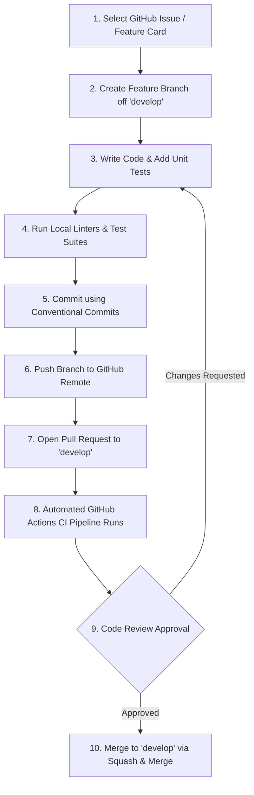
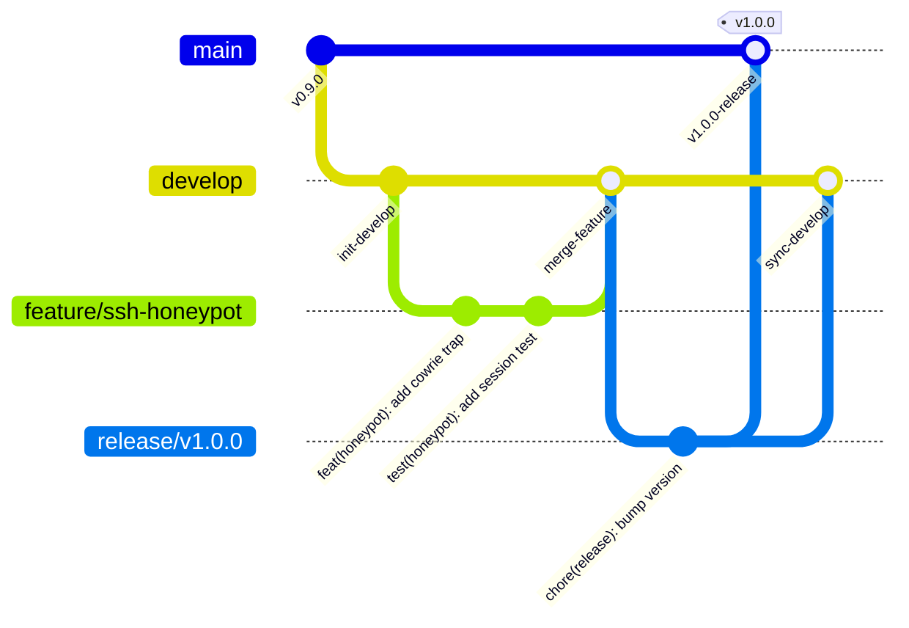
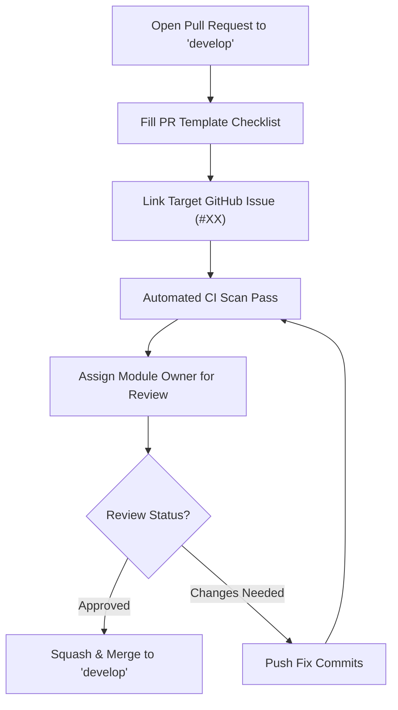
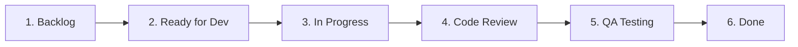

# Contributing to RakshaSphere

> **AI-Powered Autonomous Cyber Defense & Self-Healing Network Platform**  
> **Official Open-Source Contribution & Engineering Collaboration Guidelines**  
> **Target Audience**: Core Development Team, Open-Source Contributors, Code Reviewers

---

## 📑 Table of Contents

1. [Welcome & Contribution Philosophy](#1-welcome--contribution-philosophy)
2. [Code of Conduct](#2-code-of-conduct)
3. [Engineering Team & Ownership Matrix](#3-engineering-team--ownership-matrix)
4. [Development Workflow](#4-development-workflow)
5. [GitFlow Branching Strategy](#5-gitflow-branching-strategy)
6. [Conventional Commit Message Standards](#6-conventional-commit-message-standards)
7. [Pull Request (PR) Submission Guidelines](#7-pull-request-pr-submission-guidelines)
8. [Code Review Guidelines & Checklist](#8-code-review-guidelines--checklist)
9. [Language & Framework Coding Standards](#9-language--framework-coding-standards)
   - [Java 21 / Spring Boot 3 Standards](#91-java-21--spring-boot-3-standards)
   - [Python 3.11 / FastAPI Standards](#92-python-311--fastapi-standards)
   - [TypeScript / React 19 / Next.js Standards](#93-typescript--react-19--nextjs-standards)
10. [Documentation Standards](#10-documentation-standards)
11. [Testing & Quality Assurance Requirements](#11-testing--quality-assurance-requirements)
12. [GitHub Workflow, Labels & Milestones](#12-github-workflow-labels--milestones)
13. [Issue Templates](#13-issue-templates)
14. [GitHub Project Board Kanban Workflow](#14-github-project-board-kanban-workflow)
15. [Security Controls During Development](#15-security-controls-during-development)
16. [Communication Protocols](#16-communication-protocols)
17. [Definition of Done (DoD)](#17-definition-of-done-dod)
18. [MVP Development Priorities](#18-mvp-development-priorities)
19. [Contributor Recognition & Governance](#19-contributor-recognition--governance)

---

## 1. 👋 Welcome & Contribution Philosophy

Welcome to **RakshaSphere**! We are building an enterprise-ready, AI-powered autonomous cyber defense and self-healing network platform. Whether you are a core engineering team member or an open-source contributor, your contributions help advance proactive network defense capabilities.

### Contribution Philosophy
- **High Quality Baseline**: Code must be readable, maintainable, strictly typed, test-backed, and secure by design.
- **Zero Broken Builds**: The `main` and `develop` branches are protected. All commits pass CI/CD pipeline automated tests.
- **Documentation First**: Architectural decisions, API contracts, schema updates, and feature changes must be documented in tandem with code changes.

---

## 2. 📜 Code of Conduct

All contributors are expected to uphold the highest standards of professional conduct:

- **Respect & Inclusivity**: Foster a welcoming, empathetic environment regardless of background, identity, or experience level.
- **Constructive Communication**: Focus code reviews on technical merit, architecture adherence, and security rather than personal style preferences.
- **Conflict Resolution**: Differences in technical approach will be resolved via technical trade-off evaluation led by the **Project Lead (Fardeen Akmal)**.

---

## 3. 👥 Engineering Team & Ownership Matrix

RakshaSphere is developed as a Capstone Final Year Project by a four-member engineering team. Module ownership is assigned as follows:

| Engineering Role | Team Member | Component & Subsystem Ownership Scope |
| :--- | :--- | :--- |
| **Project Lead & Backend Architect** | **Fardeen Akmal** | Core Orchestrator (Spring Boot 3 / Java 21), Self-Healing Engine (eBPF/iptables), Database Schemas (MySQL 8.0), Master Documentation & System Integration. |
| **Frontend Lead & UI/UX Architect** | **Jigisha Naidu** | Next.js 14 Web Application, React 19 Components, Tailwind CSS Styling, shadcn/ui Design System, STOMP WebSockets, and SOC Radar Widgets. |
| **AI & Cybersecurity Lead** | **Sushil Nirmal** | Python FastAPI AI Engine, ML Ensemble Models (Random Forest + XGBoost), Deep Autoencoders (Zero-Day Anomaly Detection), and Adaptive Honeypot Traps. |
| **IoT & Infrastructure Lead** | **Suvajit Ghosh** | IoT Edge Daemon (Python simulation), MQTT Mosquitto Transport Layer, DevOps CI/CD (GitHub Actions), Nginx Reverse Proxy, and Docker Compose Orchestration. |

---

## 4. 🔄 Development Workflow



---

## 5. 🌿 GitFlow Branching Strategy

RakshaSphere enforces a structured **GitFlow** branching model:



### Branch Responsibilities
- **`main`**: Production-ready release branch. Strictly protected. Only updated via approved release or hotfix PRs.
- **`develop`**: Primary integration branch for active development. Feature PRs target this branch.
- **`feature/*`**: Dedicated feature branches (`feature/ebpf-packet-drop`, `feature/soc-radar-widget`).
- **`bugfix/*`**: Non-critical bug fix branches (`bugfix/jwt-expiration-handling`).
- **`hotfix/*`**: Urgent production patches created off `main` (`hotfix/security-patch-cve`).
- **`release/*`**: Stabilization branches preparing new release versions (`release/v1.0.0`).

---

## 6. 📝 Conventional Commit Message Standards

All commit messages **MUST** adhere to the [Conventional Commits](https://www.conventionalcommits.org/) specification:

$$\text{Format}: \quad \text{<type>}(\text{<scope>}): \quad \text{<short summary>}$$

### Conventional Commit Types

| Commit Type | Purpose | Example Message |
| :--- | :--- | :--- |
| **`feat`** | A new feature implementation. | `feat(backend): implement dynamic risk score calculation formula` |
| **`fix`** | A bug fix. | `fix(ai-engine): resolve feature scaling NaN error during inference` |
| **`docs`** | Documentation changes only. | `docs(api): update OpenAPI spec for self-healing override endpoints` |
| **`style`** | Code formatting (spaces, semicolons). | `style(frontend): format alert table components with Prettier` |
| **`refactor`** | Code change without new features or bug fixes.| `refactor(database): optimize SQL query for SOC dashboard alert feed` |
| **`test`** | Adding or correcting test suites. | `test(honeypot): add JUnit 5 test for SSH decoy payload capture` |
| **`build`** | Changes to build files or dependencies. | `build(maven): upgrade Spring Boot to version 3.2.4` |
| **`ci`** | Changes to GitHub Actions workflows. | `ci(github): add Trivy container vulnerability scan step` |
| **`chore`** | Routine tasks or repository maintenance. | `chore(docker): update environment variable template file` |
| **`revert`** | Reverting a previous commit. | `revert: "feat(iot): add experimental MQTT broker auto-scaling"` |

---

## 7. 📥 Pull Request (PR) Submission Guidelines



### Pre-PR Checklist
- [ ] Code compiles cleanly locally without warnings or errors.
- [ ] Unit and integration tests pass ($100\%$ pass rate).
- [ ] Code formatted according to language guidelines (`spotless:apply`, `black`, `prettier`).
- [ ] Related documentation updated (`docs/` files updated if architecture/APIs changed).
- [ ] PR description filled out using the repository PR template.
- [ ] Linked to corresponding GitHub Issue (`Closes #42`).

---

## 8. 🔍 Code Review Guidelines & Checklist

All PRs require approval from the designated **Module Owner** prior to merging.

### Code Review Evaluation Focus
1. **Security**: Zero hardcoded credentials, unvalidated inputs, or OWASP vulnerabilities.
2. **Performance**: No blocking I/O on main threads, unindexed SQL queries, or N+1 JPA fetch issues.
3. **Architecture Adherence**: Code follows the layer isolation rules declared in system design docs.
4. **Test Quality**: Tests assert actual behavior (no empty assertions or disabled test annotations).

---

## 9. 📏 Language & Framework Coding Standards

### 9.1 Java 21 / Spring Boot 3 Standards
- Use Java 21 **Virtual Threads** for concurrent tasks (`spring.threads.virtual.enabled=true`).
- Implement Data Transfer Objects (DTOs) as immutable Java **Records**.
- Use JSR-380 annotations (`@NotNull`, `@Size`, `@ValidIP`) for request payload validation.
- Execute Google Java Style formatting via Maven: `./mvnw spotless:apply`.

### 9.2 Python 3.11 / FastAPI Standards
- Mandatory type hints on all function signatures (`def predict(features: list[float]) -> dict:`).
- Input request bodies defined using **Pydantic** `BaseModel` schemas.
- Code formatted with `black` and linted with `flake8`.

### 9.3 TypeScript / React 19 / Next.js Standards
- Strict type-checking enabled in `tsconfig.json` (`"strict": true`). No `any` types allowed.
- Component props typed via explicit TypeScript interfaces.
- Formatted via Prettier (`npm run format`) and linted via Next.js ESLint (`npm run lint`).

---

## 10. 📚 Documentation Standards

- All documentation must be written in **GitHub Flavored Markdown**.
- Visual diagrams must be authored using **Mermaid** blocks (`mermaid`).
- File paths and code symbols must be formatted as clickable links (`[filename](file:///path/to/file)`).
- When modifying backend APIs, database schemas, or AI models, the corresponding documents under [`docs/`](file:///home/fardeen/RakshaSphere/docs) MUST be updated in the same PR.

---

## 11. 🧪 Testing & Quality Assurance Requirements

Every Pull Request must satisfy minimum testing thresholds:

- **Backend**: Minimum $80\%$ line and branch code coverage measured via JaCoCo.
- **Frontend**: Vitest unit test pass for modified React components.
- **AI Engine**: Model accuracy and precision verified via `pytest` suites.
- **Security**: Zero Critical/High severity vulnerabilities identified by Trivy or OWASP ZAP.

---

## 12. 🏷️ GitHub Workflow, Labels & Milestones

### Label Matrix

| Label Name | Category | Color | Description |
| :--- | :--- | :--- | :--- |
| `bug` | Type | `#d73a4a` | Confirmed software defect or failure. |
| `enhancement` | Type | `#a2eeef` | New feature or improvement request. |
| `documentation` | Type | `#0075ca` | Documentation updates or spec fixes. |
| `frontend` | Module | `#7057ff` | Next.js, React, or UI/UX related tasks. |
| `backend` | Module | `#008672` | Java 21, Spring Boot, or database tasks. |
| `AI` | Module | `#d4c5f9` | Python, Machine Learning, or FastAPI tasks. |
| `IoT` | Module | `#fbca04` | MQTT, Mosquitto, or edge daemon tasks. |
| `security` | Security | `#b60205` | Security vulnerability or RBAC fix. |
| `priority-high` | Priority | `#b60205` | Urgent blocker requiring immediate resolution. |
| `good first issue`| Onboarding| `#7057ff` | Suitable for new contributors. |

---

## 13. 📋 Issue Templates

### 13.1 Bug Report Template
```markdown
---
name: Bug Report
about: Create a report to help us fix a defect
title: '[BUG] '
labels: 'bug'
assignees: ''
---

## Description
A clear and concise description of the bug.

## Steps to Reproduce
1. Go to '...'
2. Click on '....'
3. Scroll down to '....'
4. See error

## Expected Behavior
A clear description of what you expected to happen.

## Environment Details
- OS: [e.g. Ubuntu 22.04]
- Browser: [e.g. Chrome 120]
- Component: [e.g. Frontend / Backend / AI Engine]

## Logs / Screenshots
Attach un-truncated error logs or screenshots.
```

---

### 13.2 Feature Request Template
```markdown
---
name: Feature Request
about: Suggest an idea or capability for RakshaSphere
title: '[FEAT] '
labels: 'enhancement'
assignees: ''
---

## Feature Summary
A clear description of the proposed feature.

## Problem Statement / Motivation
Why is this feature needed? What use case does it address?

## Proposed Implementation Details
Describe technical approach, affected modules, and architecture changes.
```

---

## 14. 📊 GitHub Project Board Kanban Workflow

Tasks are tracked on the GitHub Project Board across six columns:



---

## 15. 🔒 Security Controls During Development

> [!CAUTION]
> NEVER commit credentials, private API keys, database passwords, or RSA private keys to Git.

1. **Pre-Commit Secrets Scanning**: Pre-commit hooks (`gitleaks`) run locally to detect accidental secret commits.
2. **Environment Variables**: Configure all secrets in local `.env` files (which are listed in `.gitignore`).
3. **Container Privileges**: Test Docker containers using non-root users (`USER nobody`).

---

## 16. 💬 Communication Protocols

- **Weekly Standup**: Every Monday at 10:00 AM (Project progress, blockers, milestone planning).
- **Daily Status Updates**: Brief updates posted to team chat (Tasks completed, today's goals, blockers).
- **Technical Discussions**: Conducted asynchronously on GitHub Issues or GitHub Discussions.

---

## 17. ✅ Definition of Done (DoD)

A task or feature card is considered **DONE** only when:
- [ ] Code is fully implemented and formatted according to guidelines.
- [ ] Unit and integration tests pass with $\ge 80\%$ line coverage.
- [ ] Architecture/API/Database documentation updated in [`docs/`](file:///home/fardeen/RakshaSphere/docs).
- [ ] Code reviewed and approved by the Module Owner.
- [ ] Pull Request merged into `develop` via Squash & Merge.
- [ ] CI/CD pipeline build passes cleanly.

---

## 18. 🎯 MVP Development Priorities

| Priority Tier | Component Scope | Engineering Target |
| :--- | :--- | :--- |
| **Must Complete (MVP)** | Core Backend, Next.js Dashboard, AI Inference Engine, Adaptive Honeypot, Self-Healing eBPF/iptables, CTI Enrichment, IoT Virtual Simulation. | Full integration and Capstone demonstration readiness. |
| **Nice to Have** | Dark/Light theme toggle, PDF report export, live terminal keystroke playback. | Enhanced user experience during SOC monitoring. |
| **Future Scope** | Kubernetes Helm deployment, physical ESP32 hardware, STIX 2.1 TAXII server integration. | Post-graduation enterprise commercialization. |

---

## 19. 🏅 Contributor Recognition & Governance

RakshaSphere is maintained by its core project team. Project governance and final merge authority are held by **Fardeen Akmal (Project Lead)**. All contributors who submit merged PRs will be acknowledged in the project repository release notes!
