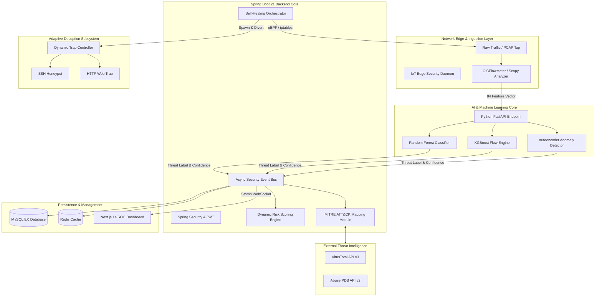
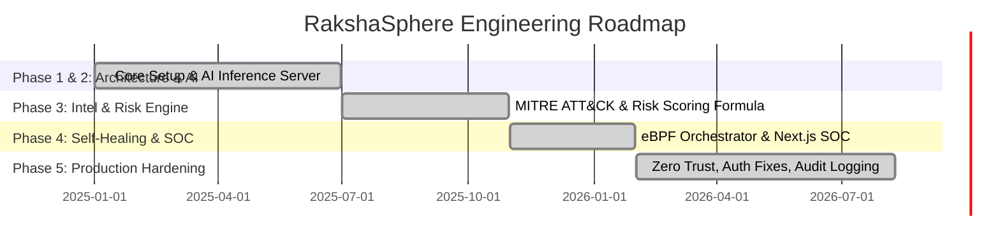

# RakshaSphere

> **AI-Powered Autonomous Cyber Defense & Self-Healing Network Platform**

[](https://github.com/fardeenakmal/RakshaSphere-V1)
[](LICENSE)
[](https://www.oracle.com/java/)
[](https://spring.io/projects/spring-boot)
[](https://nextjs.org/)
[](https://www.python.org/)
[](https://www.docker.com/)

---

## 📑 Table of Contents

- [Overview](#-overview)
- [System Architecture](#-system-architecture)
- [Core Features & Modules](#-core-features--modules)
- [Technology Stack](#-technology-stack)
- [Repository Structure](#-repository-structure)
- [End-to-End System Workflow](#-end-to-end-system-workflow)
- [Installation & Setup Guide](#-installation--setup-guide)
- [Project Status & Roadmap](#-project-status--roadmap)
- [License](#-license)

---

## 🛡️ Overview

**RakshaSphere** is an enterprise-ready, AI-driven autonomous cyber defense platform engineered by a solo developer. It unifies real-time threat detection, dynamic adversary deception, automated risk quantification, and self-healing network orchestration into a single resilient security ecosystem.

Traditional Security Operations Center (SOC) infrastructure suffers from high false positive rates, delayed manual remediation, and static rules that fail against zero-day exploits. RakshaSphere addresses this through a **Closed-Loop Cyber Defense Architecture**. When a malicious payload or reconnaissance pattern is classified, the platform automatically triggers network containment via eBPF/iptables, diverts attackers into isolated deception honeypots, and presents actionable telemetry on a unified Next.js SOC dashboard.

### Key Value Proposition
- **Zero-Day Anomaly Detection**: Deep Autoencoders flag uncatalogued exploits in sub-10ms.
- **Attacker Redirection**: Dynamically routes attacker traffic into ephemeral Docker deception containers.
- **Automated Network Self-Healing**: Enforces network containment within milliseconds of threat validation, eliminating the MTTR (Mean Time to Respond) human bottleneck.

---

## 🏗️ System Architecture

RakshaSphere follows a decoupled microservices pattern comprising five core subsystems: Network Ingestion Layer, AI Classification Core, Threat Intelligence Engine, Self-Healing Orchestrator, and the Next.js SOC Dashboard.

### Enterprise Data Flow & Architecture



---

## 📦 Core Features & Modules

### 1. Intelligent Intrusion Detection System (IIDS)
Captures raw packet streams via Scapy and passes network flow windows to CICFlowMeter to generate 84 distinct statistical features. The Python AI Core evaluates these using an ensemble of Random Forest, XGBoost, and Deep Autoencoders.

### 2. Automated Self-Healing Network Engine
Provides automated containment upon validation of critical threats:
- **eBPF / XDP Packet Drop**: Injects low-level network packet filter rules to drop attacker traffic at the NIC driver layer.
- **Dynamic iptables & Socket Termination**: Kills active TCP sessions associated with compromised credentials instantly.

### 3. Adaptive Honeypot Subsystem
Dynamically spins up isolated, low/medium-interaction Docker containers mimicking SSH daemons or IoT Telnet interfaces, diverting suspicious IPs to capture forensic telemetry and keystrokes.

### 4. MITRE ATT&CK & Threat Intelligence Engine
- Maps behaviors to specific Tactics, Techniques, and Procedures (TTPs) using the official MITRE ATT&CK Matrix.
- Queries AbuseIPDB and VirusTotal via async workers to enrich logs with IP reputation and geographic data.

---

## 🛠️ Technology Stack

| Domain | Technology | Role & Purpose |
| :--- | :--- | :--- |
| **Frontend UI** | **Next.js 14, React, Tailwind CSS** | High-performance React App Router for SOC dashboard. |
| **Backend Core** | **Java 21, Spring Boot 3.2** | Enterprise microservices, OOP components, and business logic. |
| **Security** | **Spring Security, Nimbus JOSE JWT** | Role-based access control (RBAC), API rate-limiting, authentication. |
| **Database** | **MySQL 8.0, Redis 7.2** | Relational storage for audit logs and high-speed caching. |
| **AI / Machine Learning** | **Python 3.11, FastAPI, Scikit-Learn** | Threat inference server and multi-model ensemble classifiers. |
| **DevOps** | **Docker, Docker Compose, Nginx** | Fully containerized environment orchestration and reverse proxy. |

---

## 💻 Installation & Setup Guide

### Prerequisites
- Docker Engine `v25.0+` & Docker Compose
- Java Development Kit `OpenJDK 21 LTS`
- Node.js `v20.x`
- Python `v3.11+`

### Quickstart via Docker Compose (Production Ready)

```bash
# 1. Clone repository
git clone https://github.com/fardeenakmal/RakshaSphere-V1.git
cd RakshaSphere-V1

# 2. Configure Environment Variables
cp docker/.env.example docker/.env

# 3. Build and launch all services
docker compose -f docker/docker-compose.yml up --build -d
```

Once launched, access the system:
- **SOC Dashboard**: `http://localhost:3000` (Login: `admin` / `Admin@Raksha2026!`)
- **Backend API**: `http://localhost:8080/api/v1`
- **AI Inference Engine**: `http://localhost:5000/docs`

---

## 🗺️ Project Status & Roadmap

The project is currently in a **Production-Ready** state.



---

## 📄 License

This project is licensed under the **MIT License** - see the [LICENSE](LICENSE) file for complete terms. Developed and maintained by Fardeen Akmal.
