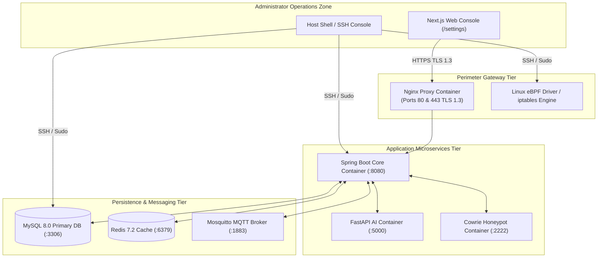
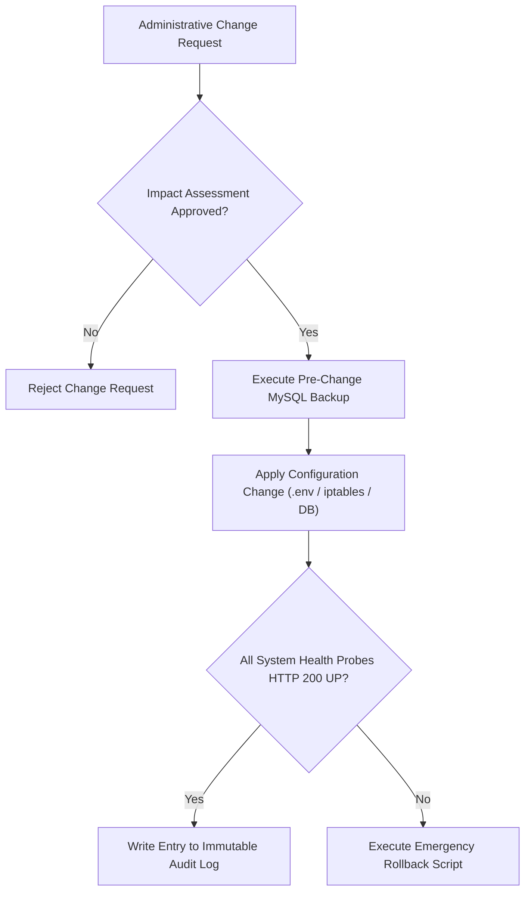
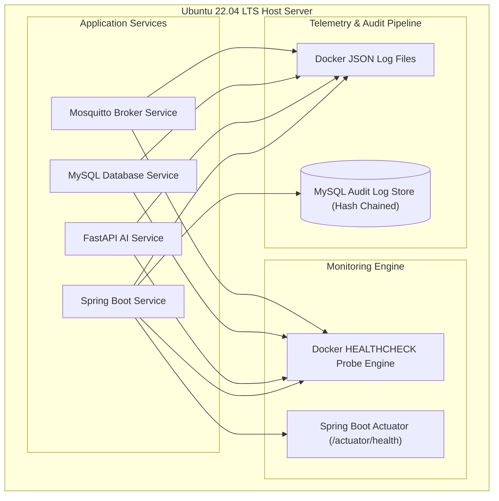
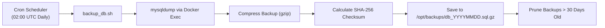
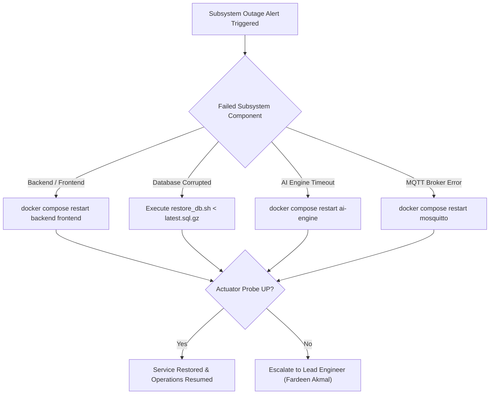
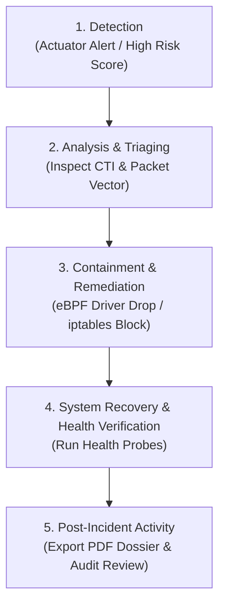

# Enterprise System Administrator & Operations Handbook

## RakshaSphere
### AI-Powered Autonomous Cyber Defense & Self-Healing Network Platform

> **Document Identifier**: `ADMIN-GUIDE-RAKSHASPHERE-2026-V1.0`  
> **Target Audience**: `System Administrators, Security Administrators, SOC Lead Engineers, SRE Managers`  
> **Documentation Style**: `Microsoft Operations Guide, Red Hat Enterprise Docs, Cisco Admin Guides, ITIL v4`  
> **Classification**: `Official Enterprise Administrator & System Operations Manual`

---

## 📑 Table of Contents

1. [Executive Summary](#1-executive-summary)
2. [System Overview & Administrative Responsibilities](#2-system-overview--administrative-responsibilities)
3. [Architectural Operations Diagrams Library](#3-architectural-operations-diagrams-library)
   - [High-Level Administrative System Overview](#31-high-level-administrative-system-overview)
   - [System Administration & Change Control Workflow](#32-system-administration--change-control-workflow)
   - [Monitoring & Health Telemetry Architecture](#33-monitoring--health-telemetry-architecture)
   - [Automated Backup & Restore Flow](#34-automated-backup--restore-flow)
   - [Disaster Recovery & Failure Failover Sequence](#35-disaster-recovery--failure-failover-sequence)
   - [Incident Response Operational Lifecycle](#36-incident-response-operational-lifecycle)
4. [Installation & Infrastructure Preparation](#4-installation--infrastructure-preparation)
5. [Initial System Configuration](#5-initial-system-configuration)
6. [User Management & Password Governance](#6-user-management--password-governance)
7. [Role-Based Access Control (RBAC) Administration](#7-role-based-access-control-rbac-administration)
8. [System Configuration & Engine Administration](#8-system-configuration--engine-administration)
9. [Security Administration & Cryptographic Secrets](#9-security-administration--cryptographic-secrets)
10. [Threat Management & Incident Triage](#10-threat-management--incident-triage)
11. [Adaptive Honeypot Deception Administration](#11-adaptive-honeypot-deception-administration)
12. [Cyber Threat Intelligence (CTI) & API Key Management](#12-cyber-threat-intelligence-cti--api-key-management)
13. [Self-Healing Engine Policy Administration](#13-self-healing-engine-policy-administration)
14. [IoT Edge Daemon & MQTT Broker Administration](#14-iot-edge-daemon--mqtt-broker-administration)
15. [SOC Dashboard & Visual Widget Customization](#15-soc-dashboard--visual-widget-customization)
16. [Database Administration & Schema Maintenance](#16-database-administration--schema-maintenance)
17. [Docker Multi-Container Stack Administration](#17-docker-multi-container-stack-administration)
18. [System Health Monitoring & Observability](#18-system-health-monitoring--observability)
19. [Structured Logging Architecture & Log Retention](#19-structured-logging-architecture--log-retention)
20. [Backup, Restore & Disaster Recovery Strategy](#20-backup-restore--disaster-recovery-strategy)
21. [Resource Performance Management & Tuning](#21-resource-performance-management--tuning)
22. [Structured Operational Troubleshooting Manual](#22-structured-operational-troubleshooting-manual)
23. [Routine Operations Schedule & Cadence](#23-routine-operations-schedule--cadence)
24. [Security Audit & Compliance Checklists](#24-security-audit--compliance-checklists)
25. [NIST SP 800-61 Incident Response Runbook](#25-nist-sp-800-61-incident-response-runbook)
26. [Operational Checklists](#26-operational-checklists)
27. [Quantitative Operational Risk Assessment Matrix](#27-quantitative-operational-risk-assessment-matrix)
28. [MVP Scope vs. Future Enterprise Operations Roadmap](#28-mvp-scope-vs-future-enterprise-operations-roadmap)

---

## 1. 🎯 Executive Summary

The **RakshaSphere Administrator Guide & System Operations Handbook** provides system administrators, security administrators, and SRE managers with full operational procedures for deploying, configuring, securing, monitoring, maintaining, troubleshooting, backing up, and recovering the platform throughout its operational lifecycle.

Written following **Microsoft Operations Guidelines**, **Red Hat Enterprise Documentation**, **Cisco Operations Guides**, **ITIL v4**, and the **NIST Cybersecurity Framework**, this handbook establishes complete administrative control over RakshaSphere's multi-container microservice stack.

---

## 2. 🏛️ System Overview & Administrative Responsibilities

RakshaSphere is composed of six containerized microservices managed via Docker Compose:

```
[Nginx TLS 1.3 Proxy] ➔ [Next.js Frontend] ➔ [Spring Boot Backend] ➔ [FastAPI AI] & [MySQL DB] & [Mosquitto MQTT]
```

### Administrative Scope & Responsibilities
- **System Provisioning**: Installing Docker Engine, configuring environment variables, establishing Nginx TLS proxies.
- **User & Identity Governance**: Onboarding SOC analysts, enforcing RBAC permissions (`ROLE_ADMIN`, `ROLE_SOC_ANALYST`, `ROLE_USER`), managing RSA-256 JWT keys.
- **Policy Enforcement**: Configuring self-healing containment policies (`AUTOMATIC`, `SEMI_AUTOMATIC`, `MANUAL`) and reviewing eBPF driver drop rules.
- **Data Protection & Reliability**: Managing daily MySQL backups, rotating container log files, verifying database integrity with SHA-256 audit chaining.

---

## 3. 📊 Architectural Operations Diagrams Library

### 3.1 High-Level Administrative System Overview



---

### 3.2 System Administration & Change Control Workflow



---

### 3.3 Monitoring & Health Telemetry Architecture



---

### 3.4 Automated Backup & Restore Flow



---

### 3.5 Disaster Recovery & Failure Failover Sequence



---

### 3.6 Incident Response Operational Lifecycle



---

## 4. 📦 Installation & Infrastructure Preparation

### Hardware Requirements Target (Single-Node Server)
- **CPU**: 4 Cores minimum (8 Cores recommended for high packet rates).
- **Memory**: 8 GB RAM minimum (16 GB RAM recommended).
- **Storage**: 50 GB NVMe SSD storage.
- **Operating System**: Ubuntu 22.04 LTS (x86_64).

### Software Installation Prerequisites
```bash
# Update Ubuntu host package repositories
sudo apt update && sudo apt upgrade -y

# Install Docker Engine & Docker Compose Plugin
sudo apt install -y ca-certificates curl gnupg lsb-release
sudo mkdir -p /etc/apt/keyrings
curl -fsSL https://download.docker.com/linux/ubuntu/gpg | sudo gpg --dearmor -o /etc/apt/keyrings/docker.gpg

echo \
  "deb [arch=$(dpkg --print-architecture) signed-by=/etc/apt/keyrings/docker.gpg] https://download.docker.com/linux/ubuntu \
  $(lsb_release -cs) stable" | sudo tee /etc/apt/sources.list.d/docker.list > /dev/null

sudo apt update
sudo apt install -y docker-ce docker-ce-cli containerd.io docker-compose-plugin

# Enable and start Docker daemon
sudo systemctl enable --now docker
```

---

## 5. ⚙️ Initial System Configuration

### Environment Setup
1. Clone the repository to `/opt/RakshaSphere`:
   ```bash
   sudo git clone https://github.com/RakshaSphere/RakshaSphere.git /opt/RakshaSphere
   cd /opt/RakshaSphere
   ```
2. Create environment variable file from production template:
   ```bash
   sudo cp docker/.env.example docker/.env
   ```
3. Edit `docker/.env` to set strong production passwords:
   ```env
   SPRING_PROFILES_ACTIVE=prod
   MYSQL_ROOT_PASSWORD=SuperStrongRootPassword123!
   MYSQL_PASSWORD=SuperStrongAppPassword456!
   JWT_SECRET_KEY=Your32ByteSuperSecretSigningKeyHere!
   ABUSEIPDB_API_KEY=your_production_abuseipdb_key
   VIRUSTOTAL_API_KEY=your_production_virustotal_key
   ```
4. Launch production container stack:
   ```bash
   sudo docker compose -f docker/docker-compose.yml up -d
   ```

---

## 6. 👤 User Management & Password Governance

Administrators manage system users via the Web Console (`/settings`) or REST API (`/api/v1/users`):

```
+-----------------------------------------------------------------------------------+
| USER MANAGEMENT PANEL                                                             |
| +------------------+-------------------+--------------------+-------------------+ |
| | Username         | Email             | Role               | Status            | |
| +------------------+-------------------+--------------------+-------------------+ |
| | admin_fardeen    | fardeen@raksha.io | ROLE_ADMIN         | [ ACTIVE ]        | |
| | analyst_jigisha  | jigisha@raksha.io | ROLE_SOC_ANALYST   | [ ACTIVE ]        | |
| | viewer_guest     | guest@raksha.io   | ROLE_USER          | [ DISABLED ]      | |
| +------------------+-------------------+--------------------+-------------------+ |
| [ + CREATE USER ]  [ DISABLE USER ]  [ RESET PASSWORD ]                           |
+-----------------------------------------------------------------------------------+
```

### Password Complexity Rules
- Minimum length: 12 characters.
- Must contain uppercase, lowercase, numbers, and special symbols (`@#$%^&*`).
- Hashed using **BCrypt** with a minimum cost factor of 12.

---

## 7. 🛂 Role-Based Access Control (RBAC) Administration

RakshaSphere enforces three explicit system roles:

| Role Name | Authority Scope | Allowed Administrative Operations |
| :--- | :--- | :--- |
| **`ROLE_ADMIN`** | Full System Control | User lifecycle management, self-healing policy configuration, firewall rule overrides, system settings. |
| **`ROLE_SOC_ANALYST`** | Security Operations | View threat alerts, inspect honeypot keystrokes, trigger manual containment, export PDF reports. |
| **`ROLE_USER`** | Read-Only Viewer | View high-level executive dashboard charts and risk score trends only. |

---

## 8. 🛠️ System Configuration & Engine Administration

Administrators configure operational engine postures on the **Settings** page:
- **Self-Healing Execution Mode**: Select `AUTOMATIC` (autonomous drop), `SEMI_AUTOMATIC` (analyst approval needed), or `MANUAL` (recommendations only).
- **Default Rule TTL**: Set temporary firewall drop rule TTL (Default: 86,400 seconds / 24 hours).
- **Risk Score Threshold**: Set minimum Risk Score to trigger containment (Default: $75.00$).

---

## 9. 🔒 Security Administration & Cryptographic Secrets

- **JWT Key Management**: Asymmetric RSA-256 private and public keys stored under `/etc/raksha/keys/`.
- **Audit Hash Verification**: Periodically verify database row-level SHA-256 hash chaining to confirm zero tampering has occurred:
  $$\text{Hash}_n = \text{SHA256}(\text{Data}_n \parallel \text{Hash}_{n-1})$$

---

## 10. 🚨 Threat Management & Incident Triage

1. Open **Alerts Workspace** (`/alerts`).
2. Select an active threat row to inspect the **Threat Details Drawer**:
   - **Source IP & Geolocation**
   - **84-Element Flow Vector Metrics**
   - **AbuseIPDB Confidence Score & VirusTotal Malicious Ratings**
   - **Assigned MITRE ATT&CK Technique ID (e.g., T1110)**
3. Click **Close Incident** after confirming post-remediation system health.

---

## 11. 🍯 Adaptive Honeypot Deception Administration

- **Decoy Trap Status**: Monitor active Cowrie SSH and HTTP traps under `/honeypots`.
- **Command Telemetry Audit**: Inspect attacker keystroke terminal logs saved in `honeypot_commands`.
- **Container Boundary Audit**: Ensure Cowrie containers execute under `--read-only` root filesystems and `--cap-drop=ALL`.

---

## 12. 🌐 Cyber Threat Intelligence (CTI) & API Key Management

- **API Keys**: Configure AbuseIPDB v2 and VirusTotal v3 API keys in `/settings` or `docker/.env`.
- **Cache Management**: External threat lookups are cached in Redis (`cti:ip:{ip}`) with a 24-hour TTL to prevent exceeding API rate limits. To flush CTI cache:
  ```bash
  docker exec -it raksha-redis redis-cli FLUSHDB
  ```

---

## 13. 🛡️ Self-Healing Engine Policy Administration

- **Rule Revert**: Click **Revert Rule** on `/self-healing` to remove active eBPF XDP driver or host `iptables` drop rules immediately.
- **Whitelist Protection**: Configure permanent whitelist IP addresses (`127.0.0.1`, local default gateways) to prevent accidental self-isolation.

---

## 14. 📟 IoT Edge Daemon & MQTT Broker Administration

- **Broker Monitoring**: Mosquitto MQTT broker listens on port 1883.
- **Device Status Tracking**: View registered edge daemons under `/iot`. If an edge node loses network connection, Mosquitto automatically publishes the Last Will and Testament (LWT) status `OFFLINE`.

---

## 15. 🖥️ SOC Dashboard & Visual Widget Customization

- **Customization**: Toggle visual dashboard widgets (Live Threat Velocity Chart, MITRE ATT&CK Heatmap Grid, IoT Telemetry Gauges).
- **Theme Selection**: Toggle between **Dark Cyber Theme** (default) and Light Mode.

---

## 16. 🗄️ Database Administration & Schema Maintenance

- **Automatic Migrations**: Managed via Flyway on backend startup (`database/migrations/V1__init_schema.sql`).
- **Table Optimization**: Execute monthly database index optimization:
  ```bash
  docker exec -i raksha-mysql mysqlcheck -o -u root -p"${MYSQL_ROOT_PASSWORD}" rakshasphere
  ```

---

## 17. 🐳 Docker Multi-Container Stack Administration

### Common Docker Administrative Commands

| Task | Shell Command |
| :--- | :--- |
| **Inspect Container Status** | `docker compose -f docker/docker-compose.yml ps` |
| **View Real-Time Container Logs** | `docker compose -f docker/docker-compose.yml logs -f --tail=100 backend` |
| **Restart Single Microservice** | `docker compose -f docker/docker-compose.yml restart ai-engine` |
| **Clean Unused Build Caches** | `docker system prune -af --volumes` |
| **Inspect Resource Consumption** | `docker stats` |

---

## 18. 📊 System Health Monitoring & Observability

- **Spring Boot Actuator**: Query `/actuator/health` to verify status of database connection pools, Redis caching, and disk space.
- **Container Health Probes**: Monitor `docker compose ps` to ensure all 6 containers report `Up (healthy)`.

---

## 19. 📝 Structured Logging Architecture & Log Retention

- **Application Logs**: Rotated automatically by Docker (`max-size: 10m`, `max-file: 5`).
- **Audit Logs**: Retained in MySQL `AUDIT_LOGS` table with SHA-256 cryptographic hash chaining.

---

## 20. 💾 Backup, Restore & Disaster Recovery Strategy

- **RTO Target**: $< 1 \text{ Hour}$ | **RPO Target**: $< 24 \text{ Hours}$.
- **Daily Automated Backup Script**: Shell script `/opt/RakshaSphere/docker/scripts/backup_db.sh` runs daily via host `crontab` at 02:00 UTC.

---

## 21. ⚡ Resource Performance Management & Tuning

- **JVM Heap Limits**: Configured in `docker-compose.yml` (`JAVA_OPTS=-Xms512m -Xmx2048m`).
- **MySQL InnoDB Buffer Pool**: Configured in `my.cnf` (`innodb_buffer_pool_size=2G`).

---

## 22. 🛠️ Structured Operational Troubleshooting Manual

| Symptom | Probable Cause | Corrective Administrative Action |
| :--- | :--- | :--- |
| **HTTP 500 on Login** | MySQL database container unreachable. | Run `docker compose ps mysql` and inspect `docker logs raksha-mysql`. |
| **Self-Healing Rule Fails** | Lack of `sudo` execution privileges for eBPF/iptables. | Verify `sudoers` configuration for `raksha-agent` system user. |
| **AI Inference Times Out**| FastAPI container crashed due to OOM. | Check `docker logs raksha-ai-engine`; restart container with higher RAM allocation. |
| **CTI Lookups Failing** | AbuseIPDB API key expired or rate-limited. | Verify API key in `/settings`; check Redis cache connectivity. |

---

## 23. 📅 Routine Operations Schedule & Cadence

- **Daily**: Inspect container statuses (`docker compose ps`), check Actuator health, review error logs.
- **Weekly**: Verify database backup files, test restore script, run `docker system prune`.
- **Monthly**: Conduct disaster recovery failover test, optimize MySQL database indexes, audit user accounts.

---

## 24. 🔒 Security Audit & Compliance Checklists

- [ ] Verify zero hardcoded secrets exist in committed repository files.
- [ ] Confirm Nginx enforces TLS 1.3 encryption on port 443.
- [ ] Audit user access levels in `USERS` table; disable inactive accounts.
- [ ] Verify database row-level SHA-256 hash chains pass integrity verification.

---

## 25. 🚨 NIST SP 800-61 Incident Response Runbook

1. **Detection**: Health probe fails or high-risk alert ($\text{Risk Score} \ge 75.00$) triggers.
2. **Analysis**: Inspect CTI IP reputation and 84-element packet flow metrics.
3. **Containment**: Autonomous eBPF driver drop isolates attacker IP; NAT redirects probes to Honeypot container.
4. **Recovery**: Verify service health probes return `HTTP 200 OK`.
5. **Post-Mortem**: Export executive PDF incident dossier and update security policies.

---

## 26. 📋 Operational Checklists

### Pre-Deployment Checklist
- [ ] Production `.env` secrets populated with strong passwords.
- [ ] Database backup executed and SHA-256 checksum verified.
- [ ] Docker host system packages updated.

### Post-Deployment Checklist
- [ ] Execute `docker compose ps` and assert 6 containers report `Up (healthy)`.
- [ ] Verify `/actuator/health` returns `{"status":"UP"}`.
- [ ] Confirm Web UI loads cleanly at `https://soc.rakshasphere.io`.

---

## 27. ⚠️ Quantitative Operational Risk Assessment Matrix

| Risk Domain | Operational Threat | Likelihood | Impact | Mitigation Strategy |
| :--- | :--- | :--- | :--- | :--- |
| **Storage Full** | Docker container logs fill host SSD. | High | Critical | Enforce Docker JSON log rotation (`max-size: 10m`, `max-file: 5`) and weekly prune. |
| **DB Corruption**| Sudden host power loss corrupts InnoDB tables. | Low | Critical | Daily automated `mysqldump` backups with SHA-256 checksum verification. |
| **Key Leakage** | API keys committed to public Git repository. | Low | Critical | Enforce pre-commit `gitleaks` hooks and GitHub Actions secret scanning. |

---

## 28. 🔮 MVP Scope vs. Future Enterprise Operations Roadmap

| Operations Domain | Minimum Viable Product (MVP) | Future Enterprise Operations Roadmap |
| :--- | :--- | :--- |
| **Orchestration** | Single-node Docker Compose v2 stack on Ubuntu. | Multi-node Kubernetes (K8s) cluster managed via Helm. |
| **Authentication** | Local DB + RSA-256 JWT tokens. | Enterprise Single Sign-On (SSO) via LDAP / Active Directory & MFA. |
| **SIEM / SOAR** | Local Hash-Chained MySQL Audit Store. | Outbound STIX 2.1 Syslog streaming to Splunk & Palo Alto Cortex XSOAR. |
| **Cloud Hosting** | Virtual Private Server (VPS). | Multi-region AWS EKS / Azure AKS managed cloud deployment. |
