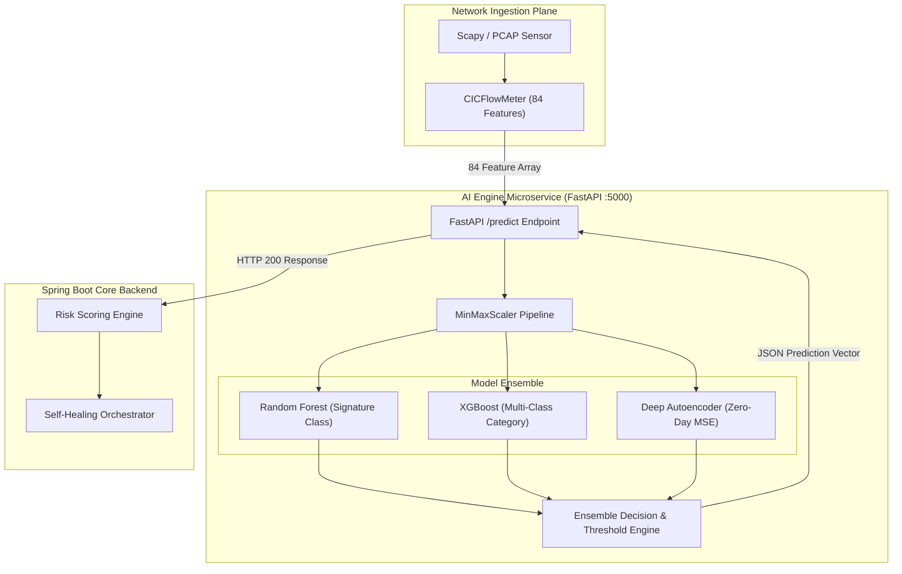
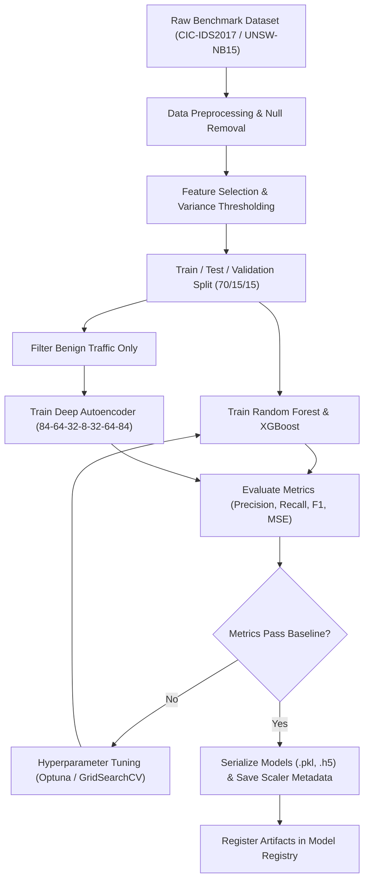
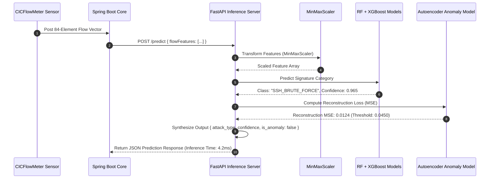
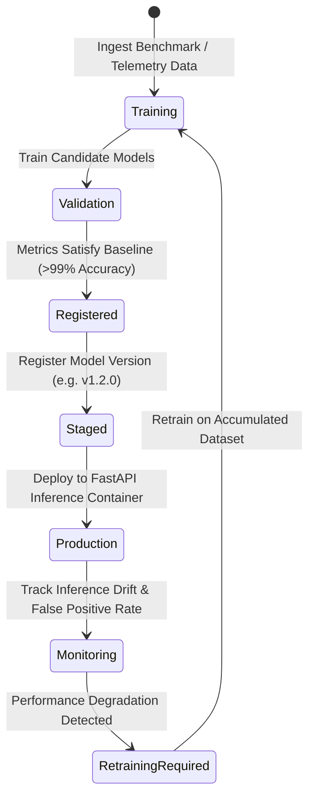
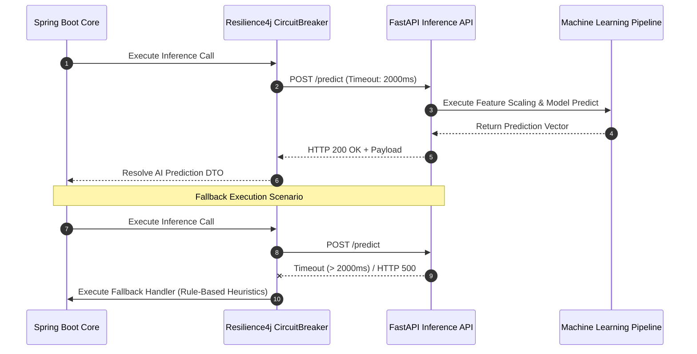
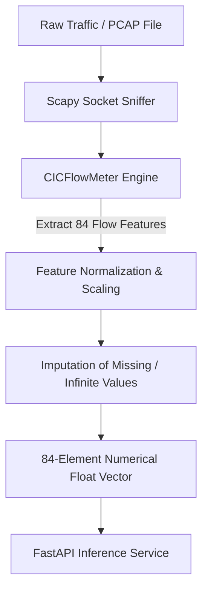
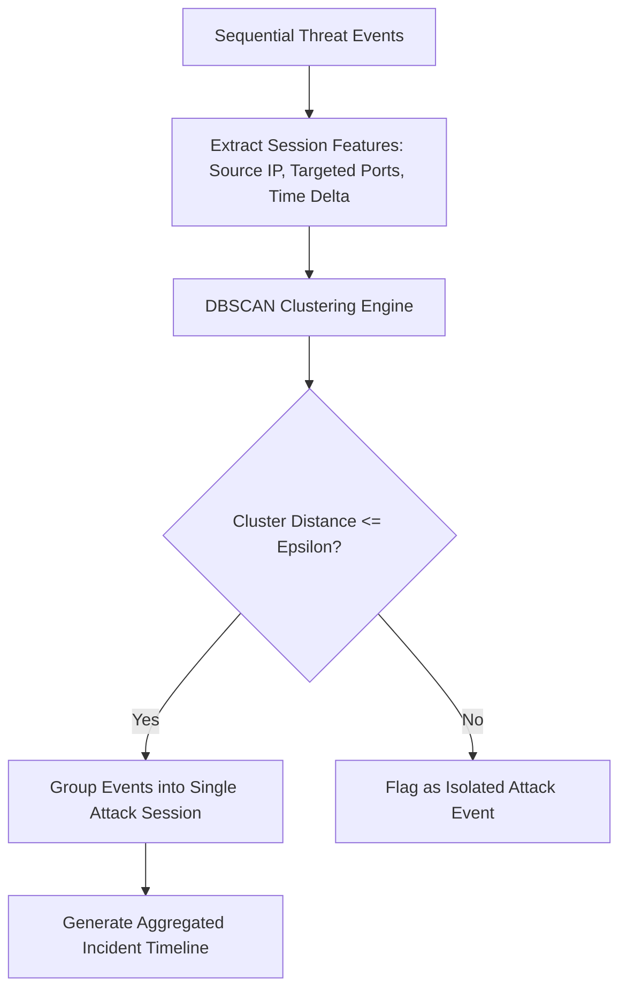
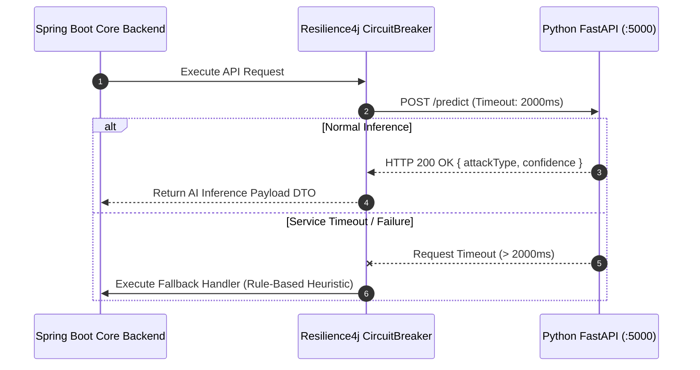
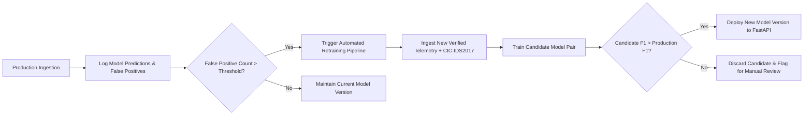

# Artificial Intelligence & Machine Learning Architecture Specification

## RakshaSphere
### AI-Powered Autonomous Cyber Defense & Self-Healing Network Platform

> **Document Identifier**: `AI-ARCH-RAKSHASPHERE-2026-V1.0`  
> **Runtime Environment**: `Python 3.11+ / FastAPI Microservice`  
> **Core Frameworks**: `Scikit-learn 1.4, TensorFlow 2.15, Pandas, NumPy`  
> **Classification**: `Official Enterprise AI/ML Design Blueprint`

---

## 📑 Table of Contents

1. [Executive Summary](#1-executive-summary)
2. [AI Architecture Overview](#2-ai-architecture-overview)
3. [Architectural Diagrams Library](#3-architectural-diagrams-library)
   - [High-Level AI Architecture](#31-high-level-ai-architecture)
   - [ML Training Pipeline Flow](#32-ml-training-pipeline-flow)
   - [Real-Time Inference Pipeline Flow](#33-real-time-inference-pipeline-flow)
   - [Model Lifecycle & MLOps Pipeline](#34-model-lifecycle--mlops-pipeline)
   - [AI Engine Integration Sequence](#35-ai-engine-integration-sequence)
   - [Dynamic Risk Scoring Dataflow](#36-dynamic-risk-scoring-dataflow)
4. [Functional AI Responsibilities](#4-functional-ai-responsibilities)
5. [Benchmark Dataset Evaluation & Selection Strategy](#5-benchmark-dataset-evaluation--selection-strategy)
6. [Data Collection & Feature Extraction Pipeline](#6-data-collection--feature-extraction-pipeline)
7. [Feature Engineering Taxonomy](#7-feature-engineering-taxonomy)
8. [Machine Learning Model Selection & Trade-Off Analysis](#8-machine-learning-model-selection--trade-off-analysis)
9. [Training Pipeline & Offline Calibration](#9-training-pipeline--offline-calibration)
10. [Cybersecurity Evaluation Metrics](#10-cybersecurity-evaluation-metrics)
11. [Inference Pipeline Architecture](#11-inference-pipeline-architecture)
12. [Behavior Analysis & Adversary Clustering](#12-behavior-analysis--adversary-clustering)
13. [Transparent Risk Scoring Engine](#13-transparent-risk-scoring-engine)
14. [Self-Healing Recommendation Engine](#14-self-healing-recommendation-engine)
15. [Spring Boot Backend ↔ FastAPI AI Engine Integration](#15-spring-boot-backend--fastapi-ai-engine-integration)
16. [Model Registry, Versioning & Artifact Governance](#16-model-registry-versioning--artifact-governance)
17. [MLOps & Automated Re-training Pipeline](#17-mlops--automated-re-training-pipeline)
18. [Model Explainability & Responsible AI (XAI)](#18-model-explainability--responsible-ai-xai)
19. [AI Security & Adversarial Threat Hardening](#19-ai-security--adversarial-threat-hardening)
20. [Performance Targets & Optimization Strategy](#20-performance-targets--optimization-strategy)
21. [AI System Telemetry & Inference Logging](#21-ai-system-telemetry--inference-logging)
22. [Error Handling, Resilience & Fallback Logic](#22-error-handling-resilience--fallback-logic)
23. [AI Verification & Testing Strategy](#23-ai-verification--testing-strategy)
24. [AI Engine Repository Folder Structure](#24-ai-engine-repository-folder-structure)
25. [Future AI Enhancements Roadmap](#25-future-ai-enhancements-roadmap)

---

## 1. 🎯 Executive Summary

The **RakshaSphere AI Engine** serves as the intelligence nucleus of the platform, providing real-time network flow classification, zero-day anomaly detection, behavioral attack profiling, dynamic risk score computation, and self-healing decision support.

Engineered using **Python 3.11**, **FastAPI**, **Scikit-learn**, and **TensorFlow**, the AI subsystem is designed to meet strict performance metrics: **Sub-10ms Inference Latency per Flow**, **>99.0% Intrusion Detection Accuracy**, and **<1.5% False Positive Rate (FPR)**.

```
Raw Packets ➔ 84 CICFlow Features ➔ Scaler ➔ Ensemble (RF + XGB) + Deep Autoencoder ➔ Label + Anomaly MSE
```

> [!IMPORTANT]
> To balance sub-millisecond operational performance with non-deterministic zero-day threat detection, RakshaSphere employs a **Hybrid Machine Learning Architecture**: supervised tree ensembles handle known signature classification while an unsupervised Deep Autoencoder evaluates reconstruction loss to flag uncatalogued exploits.

---

## 2. 🏗️ AI Architecture Overview

The AI Engine operates as an autonomous, containerized microservice connected to the Spring Boot Core backend via RESTful JSON endpoints over high-speed HTTP/2 bindings.

```
+-----------------------------------------------------------------------+
| 1. FEATURE INGESTION LAYER (Scapy / CICFlowMeter 84-Feature Extraction)|
+-----------------------------------------------------------------------+
                                   | Raw Float Vector Array
+-----------------------------------------------------------------------+
| 2. PREPROCESSING & SCALING (MinMaxScaler / Imputer / Joblib Pipeline) |
+-----------------------------------------------------------------------+
                                   | Scaled Normalized Array
+-----------------------------------------------------------------------+
| 3. INFERENCE LAYER (Random Forest + XGBoost + Deep Autoencoder)       |
+-----------------------------------------------------------------------+
         |                        |                       |
+------------------+     +------------------+    +----------------------+
| Known Signature  |     | Multi-Class      |    | Zero-Day Anomaly     |
| (Random Forest)  |     | (XGBoost Classifier)|  | (Autoencoder Loss)   |
+------------------+     +------------------+    +----------------------+
         \                        |                       /
+-----------------------------------------------------------------------+
| 4. DECISION SYNTHESIS LAYER (Ensemble Voting & MSE Threshold Check)   |
+-----------------------------------------------------------------------+
                                   | JSON Payload {attack_type, confidence, is_anomaly}
+-----------------------------------------------------------------------+
| 5. REST SERVICE LAYER (FastAPI / Uvicorn Async Server - Port 5000)    |
+-----------------------------------------------------------------------+
```

---

## 3. 📊 Architectural Diagrams Library

### 3.1 High-Level AI Architecture



---

### 3.2 ML Training Pipeline Flow



---

### 3.3 Real-Time Inference Pipeline Flow



---

### 3.4 Model Lifecycle & MLOps Pipeline



---

### 3.5 AI Engine Integration Sequence



---

### 3.6 Dynamic Risk Scoring Dataflow

```mermaid
flowchart LR
    A[AI Confidence Score (0.0 - 1.0)] --> E[Risk Score Formulation]
    B[Threat Severity (1 - 10)] --> E
    C[Asset Criticality Weight (1 - 5)] --> E
    D[Mitigation Factor (1 - 3)] --> E

    E -->|Calculates Risk Score 0-100| F{Evaluate Containment}
    F -->|Risk < 40| G[Low Risk: Log Event]
    F -->|40 <= Risk < 75| H[Medium Risk: Alert SOC & Throttle]
    F -->|Risk >= 75| I[High Risk: Autonomous Self-Healing]
```

---

## 4. ⚙️ Functional AI Responsibilities

| Subsystem Module | Primary AI Functional Responsibility | Underlying ML Technique |
| :--- | :--- | :--- |
| **Intrusion Detection** | Classify incoming network packet flows into known attack signatures or normal traffic. | Random Forest & XGBoost Ensemble |
| **Zero-Day Anomaly Detection** | Flag uncatalogued exploit vectors based on statistical flow deviations. | Deep Autoencoder Reconstruction Loss (MSE) |
| **Behavior Profiling** | Group related flow sequences originating from the same attacker IP into cohesive session profiles. | K-Means & DBSCAN Clustering |
| **Dynamic Risk Scoring** | Synthesize threat outputs into a normalized $0 - 100$ dynamic Risk Score. | Mathematical Formulation Engine |
| **Incident Prioritization** | Sort incoming alerts on the SOC dashboard by risk urgency to prevent alert fatigue. | Multi-Criteria Decision Analysis (MCDA) |
| **Self-Healing Recommendation**| Provide automated containment action suggestions (eBPF drop, `iptables` block, honeypot diversion). | Heuristic Decision Matrix |

---

## 5. 📊 Benchmark Dataset Evaluation & Selection Strategy

To ensure realistic machine learning model training suitable for enterprise security evaluation, five public cybersecurity datasets were evaluated:

| Dataset Name | Primary Purpose | Advantages | Key Limitations | Selected Role for RakshaSphere |
| :--- | :--- | :--- | :--- | :--- |
| **CIC-IDS2017** | Modern network traffic & attack signatures | Contains 84 extracted CICFlowMeter features; diverse modern attacks (DDoS, Brute Force, Web Attacks). | Class imbalance between benign and rare attack vectors. | **Primary Dataset** for model training and primary validation benchmarks. |
| **UNSW-NB15** | Synthetic network traffic & low-level exploits | Excellent representation of contemporary fuzzing, backdoors, and reconnaissance vectors. | Feature set requires translation mapping to match CICFlowMeter 84 schema. | **Secondary Validation Dataset** for cross-dataset generalization testing. |
| **NSL-KDD** | Legacy network intrusion benchmark | Historically famous; minimal compute footprint. | Outdated attack signatures (1999 traffic patterns); unrepresentative of modern networks. | Evaluated but **Excluded** from production model pipelines. |
| **CIC-DDoS2019**| Specialized DDoS attack profiles | In-depth breakdown of multi-vector volumetric Reflection DDoS attacks. | Limited to DDoS vectors only. | Supplementary dataset for DDoS classifier tuning. |
| **Bot-IoT** | IoT network traffic & botnet probes | Captures Mirai and IoT-specific botnet telemetry. | Homogeneous edge environment setup. | Used specifically for training the **IoT Edge Security Daemon** classifier. |

---

## 6. 📥 Data Collection & Feature Extraction Pipeline

RakshaSphere converts raw network packet streams into machine-learnable numerical matrices using an automated processing pipeline:



### Flow Feature Extraction Rules
1. **Flow Definition**: A bidirectional network flow defined by a 5-tuple: `(Source IP, Source Port, Destination IP, Destination Port, Protocol)`.
2. **Flow Expiration**: Inactive flows timed out after 15 seconds; active flows closed after 120 seconds.
3. **Data Cleaning**: Infinite values (`NaN`, `Inf`) replaced with column medians; float precision rounded to 4 decimal places.

---

## 7. 🧬 Feature Engineering Taxonomy

The 84 features extracted by CICFlowMeter are grouped into five analytical categories:

| Feature Category | Description & Feature Examples | Security Relevance & Purpose |
| :--- | :--- | :--- |
| **1. Flow Statistics** | Flow Duration, Total Fwd Packets, Total Bwd Packets, Flow Bytes/sec, Flow Packets/sec. | Distinguishes high-volume volumetric DDoS attacks from normal low-rate connections. |
| **2. Packet Length Metrics**| Min/Max/Mean/Std Packet Length, Header Length, Payload Size. | Detects buffer overflow attempts, SSH brute-force probes, and abnormal command payloads. |
| **3. Inter-Arrival Time (IAT)**| Fwd/Bwd IAT Total, IAT Mean, IAT Std, IAT Max, IAT Min. | Identifies automated botnet command-and-control (C2) beaconing patterns. |
| **4. TCP Flag Indicators** | FIN Flag Count, SYN Flag Count, RST Flag Count, PSH Flag Count, ACK Flag Count. | Identifies SYN flood scans, stealth FIN scans, and unauthorized TCP connection resets. |
| **5. Sub-Flow Metrics** | Subflow Fwd Packets, Subflow Fwd Bytes, Subflow Bwd Bytes. | Analyzes multi-stage payload transfers during lateral movement and exfiltration. |

---

## 8. ⚖️ Machine Learning Model Selection & Trade-Off Analysis

| Algorithm | Model Category | Training Complexity | Inference Latency | Accuracy / F1 | RakshaSphere Evaluation & Selection Status |
| :--- | :--- | :--- | :--- | :--- | :--- |
| **Random Forest** | Supervised Ensemble | Low ($O(n \log n)$) | **< 3ms** | **99.4%** | **SELECTED**: Primary model for supervised signature classification (fast, robust against overfitting). |
| **XGBoost** | Gradient Boosting | Medium | **< 4ms** | **99.6%** | **SELECTED**: Secondary model for multi-class attack category refinement. |
| **Deep Autoencoder**| Neural Network | High (GPU Required) | **< 6ms** | **N/A (MSE Loss)**| **SELECTED**: Primary model for Zero-Day Anomaly Detection (evaluates reconstruction error). |
| **Support Vector Machine**| Kernel Classifier | High ($O(n^3)$) | > 45ms | 94.2% | **REJECTED**: High inference latency unsuitable for sub-10ms operational requirements. |
| **Isolation Forest**| Unsupervised Tree | Low | < 5ms | 91.0% | **EVALUATED**: Lightweight backup anomaly detector; lower accuracy than Autoencoder. |

---

## 9. 🏋️ Training Pipeline & Offline Calibration

Models are trained offline using a deterministic workflow to ensure reproducible results:

1. **Preprocessing & Scaling**: Features are scaled using `MinMaxScaler(feature_range=(0, 1))` to prevent high-magnitude features (e.g., Flow Duration in ms) from dominating lower-magnitude metrics (e.g., TCP Flags).
2. **Train/Test Splitting**: Stratified 70/15/15 split for Train, Validation, and Test datasets to preserve original attack category distributions.
3. **Hyperparameter Optimization**: Automated hyperparameter tuning executed via `GridSearchCV` (5-fold cross-validation).
   - **Random Forest Params**: `n_estimators=100`, `max_depth=20`, `min_samples_split=5`, `criterion='gini'`.
   - **XGBoost Params**: `n_estimators=150`, `learning_rate=0.1`, `max_depth=6`, `subsample=0.8`.
4. **Serialization**: Trained pipeline objects serialized using `joblib.dump()` and saved with SHA-256 integrity checksums.

---

## 10. 📏 Cybersecurity Evaluation Metrics

In cybersecurity platforms, raw accuracy alone is an insufficient metric due to massive class imbalance (99% normal traffic vs. 1% attack probes). RakshaSphere evaluates models using six core metrics:

$$\text{Precision} = \frac{TP}{TP + FP}, \quad \text{Recall} = \frac{TP}{TP + FN}, \quad F1 = 2 \times \frac{\text{Precision} \times \text{Recall}}{\text{Precision} + \text{Recall}}$$

| Metric | Target Threshold | Security Significance in RakshaSphere |
| :--- | :--- | :--- |
| **Accuracy** | $\ge 99.0\%$ | Overall proportion of correct predictions across all traffic classes. |
| **Precision** | $\ge 98.5\%$ | Minimizes **False Positives (FP)** to prevent blocking legitimate enterprise user traffic. |
| **Recall (Sensitivity)** | $\ge 98.0\%$ | Minimizes **False Negatives (FN)** to ensure active intrusions are not missed. |
| **F1 Score** | $\ge 98.25\%$ | Harmonic mean of Precision and Recall, providing balanced quality measurement. |
| **False Positive Rate (FPR)**| **$< 1.5\%$** | Critical for operational feasibility; prevents alert fatigue on the SOC dashboard. |
| **Inference Time** | **$< 10\text{ms}$** | Enforces sub-second pipeline throughput requirements. |

---

## 11. 🚀 Inference Pipeline Architecture

FastAPI hosts the model inference pipeline using asynchronous worker threads (`uvicorn` ASGI server):

```python
# Conceptual FastAPI Inference Handler Pattern
from fastapi import FastAPI, HTTPException
from pydantic import BaseModel
import joblib
import numpy as np

app = FastAPI(title="RakshaSphere AI Inference Engine", version="1.0.0")

# Load pre-trained serialized artifacts at startup
scaler = joblib.load("models/scaler_v1.0.pkl")
rf_model = joblib.load("models/random_forest_v1.0.pkl")
autoencoder = joblib.load("models/autoencoder_v1.0.h5")

class FlowVectorRequest(BaseModel):
    flowFeatures: list[float]

@app.post("/predict")
async def predict_threat(request: FlowVectorRequest):
    if len(request.flowFeatures) != 84:
        raise HTTPException(status_code=422, detail="Feature vector length must equal 84")
    
    # Preprocess & Scale
    scaled_vector = scaler.transform(np.array(request.flowFeatures).reshape(1, -1))
    
    # Model Predictions
    predicted_class = rf_model.predict(scaled_vector)[0]
    confidence_score = float(np.max(rf_model.predict_proba(scaled_vector)))
    
    # Autoencoder Reconstruction MSE
    reconstructed = autoencoder.predict(scaled_vector)
    mse_loss = float(np.mean(np.square(scaled_vector - reconstructed)))
    is_anomaly = mse_loss > 0.0450
    
    return {
        "attackType": str(predicted_class),
        "confidenceScore": round(confidence_score, 4),
        "isAnomaly": is_anomaly,
        "reconstructionMse": round(mse_loss, 4)
    }
```

---

## 12. 🕵️ Behavior Analysis & Adversary Clustering

To group uncoordinated probes from the same adversary into cohesive attack sessions, RakshaSphere executes **DBSCAN Unsupervised Clustering** on sequential alert histories:



---

## 13. 🧮 Transparent Risk Scoring Engine

RakshaSphere computes an objective, deterministic dynamic **Risk Score** ($0.00 - 100.00$) for every incident using the following quantitative formula:

$$\text{Risk Score} = \min \left( 100, \, \left[ \frac{\text{Threat Severity (1-10)} \times \text{Confidence Score (0-1)} \times \text{Asset Weight (1-5)}}{\text{Defense Mitigation Factor (1-3)}} \right] \times 10 \right)$$

### Parameter Specifications
- **Threat Severity ($1 - 10$)**: Static weight assigned to attack categories (e.g., Port Scan = 3, SSH Brute Force = 7, DDoS = 9).
- **Confidence Score ($0.0 - 1.0$)**: Probability output generated by the machine learning model ensemble.
- **Asset Weight ($1 - 5$)**: User-configured criticality score of target IP (e.g., Guest Subnet = 1, Production DB = 5).
- **Defense Mitigation Factor ($1 - 3$)**: Reduces risk score if active firewall rules ($1.5$) or honeypot traps ($2.0$) are already isolating the adversary.

---

## 14. 💡 Self-Healing Recommendation Engine

The AI Engine evaluates validated threat events and outputs automated containment recommendations based on a deterministic decision matrix:

| Attack Category | Calculated Risk Score | Autonomous Action Recommendation | Target Enforcement Mechanism |
| :--- | :--- | :--- | :--- |
| **Port Scanning (SYN)** | $40.00 - 64.99$ | **Throttle & Deceive** | Divert traffic to SSH/HTTP Honeypot trap. |
| **SSH Brute Force** | $65.00 - 74.99$ | **Socket Teardown** | Issue TCP RST to close active authentication sessions. |
| **DDoS / Volumetric Flood**| $\ge 75.00$ | **Kernel Driver Drop** | Inject low-level eBPF XDP NIC drop filter. |
| **Zero-Day Anomaly** | $\ge 80.00$ | **Subnet Micro-Segmentation** | Assign infected host IP to isolated Quarantine VLAN. |

---

## 15. 🔌 Spring Boot Backend ↔ FastAPI AI Engine Integration

Communication between the Spring Boot Core Backend and the Python FastAPI AI Engine uses asynchronous REST requests managed via Spring `WebClient`:



---

## 16. 🗃️ Model Registry, Versioning & Artifact Governance

- **Model Registry Directory**: All model binaries stored under `ai-engine/models/`.
- **Artifact Naming Convention**: `{model_type}_v{major}.{minor}.{patch}.{extension}` (e.g., `random_forest_v1.0.0.pkl`, `autoencoder_v1.0.0.h5`).
- **Metadata Manifest**: Every model package includes a `manifest.json` recording training timestamp, dataset hash, git commit SHA, feature list, and achieved F1 score.

---

## 17. 🔄 MLOps & Automated Re-training Pipeline



---

## 18. 🔍 Model Explainability & Responsible AI (XAI)

To satisfy security audit requirements and explain predictions to SOC analysts:
- **Feature Importance**: Uses **SHAP (SHapley Additive exPlanations)** values to identify the top 5 network flow features contributing to a threat classification (e.g., `Header Length`, `Flow IAT Mean`).
- **Prediction Transparency**: All API outputs include the exact confidence percentage and autoencoder MSE value alongside the classification label.

---

## 19. 🔒 AI Security & Adversarial Threat Hardening

1. **Adversarial Perturbation Defense**: Feature input vectors are clipped to valid statistical ranges ($\text{Min} \le x_i \le \text{Max}$) to prevent adversarial evasion attacks.
2. **Model Integrity**: Serialized model binaries (`.pkl`, `.h5`) are verified via SHA-256 checksums prior to loading into memory to prevent unauthorized model tampering.

---

## 20. ⚡ Performance Targets & Optimization Strategy

| Metric | Performance Target | Optimization Strategy |
| :--- | :--- | :--- |
| **Inference Latency** | **$< 10\text{ms}$ per flow** | Multi-worker Uvicorn ASGI server + vectorized NumPy matrix calculations. |
| **Memory Footprint** | **$< 512\text{MB}$ RAM** | Lightweight model tree pruning (`max_depth=20`) and Joblib memory mapping. |
| **Throughput** | **$> 1,000$ predictions/sec** | Asynchronous FastAPI route handlers (`async def`). |

---

## 21. 📝 AI System Telemetry & Inference Logging

All inference requests are logged asynchronously to `ai-engine/logs/inference.jsonl`:

```json
{
  "timestamp": "2026-08-02T15:30:00.124Z",
  "clientIp": "127.0.0.1",
  "prediction": "SSH_BRUTE_FORCE",
  "confidence": 0.9650,
  "reconstructionMse": 0.0124,
  "isAnomaly": false,
  "inferenceTimeMs": 4.2
}
```

---

## 22. 🚨 Error Handling, Resilience & Fallback Logic

- **Malformed Vector Error (`HTTP 422`)**: Returns RFC-7807 problem detail if input array length $\ne 84$.
- **Model Load Failure**: FastAPI server refuses startup (`sys.exit(1)`) if serialized model binaries fail checksum validation.
- **Circuit Breaker Fallback**: Spring Boot backend falls back to static signature heuristics if the FastAPI service is unreachable.

---

## 23. 🧪 AI Verification & Testing Strategy

1. **Unit Testing (`pytest`)**: Verifies feature scaling logic, Pydantic input schemas, and data transformer functions.
2. **Model Benchmark Testing**: Automated test scripts verifying that candidate model F1 scores meet or exceed $98.0\%$ on held-out test datasets.

---

## 24. 📁 AI Engine Repository Folder Structure

```
ai-engine/
├── api/                     # FastAPI endpoint handlers (inference_server.py)
├── config/                  # Model thresholds and path configurations
├── datasets/                # Cleaned benchmark datasets (.csv)
├── evaluation/              # Model evaluation scripts (metrics.py, confusion_matrix.py)
├── feature-engineering/     # CICFlowMeter feature scaling and transformer modules
├── inference/               # Model inference pipeline runners
├── models/                  # Serialized binary model artifacts (.pkl, .h5, manifest.json)
├── preprocessing/           # Data cleaning, null imputation, and scaling scripts
├── training/                # Model training pipeline scripts (train.py)
├── utils/                   # SHAP explainability and cryptographic hash helpers
├── requirements.txt         # Python package dependency definition
└── Dockerfile               # Production Python 3.11 Docker container setup
```

---

## 25. 🔮 Future AI Enhancements Roadmap

1. **Graph Neural Networks (GNNs)**: Modeling enterprise network topology as a dynamic graph to detect lateral movement attacks.
2. **Federated Learning**: Distributed, privacy-preserving model training across multiple enterprise deployments without sharing raw network traffic.
3. **LLM-Assisted Incident Summarization**: Integration of lightweight local LLMs (e.g., Llama 3 / Mistral) to generate natural language executive threat summaries.
