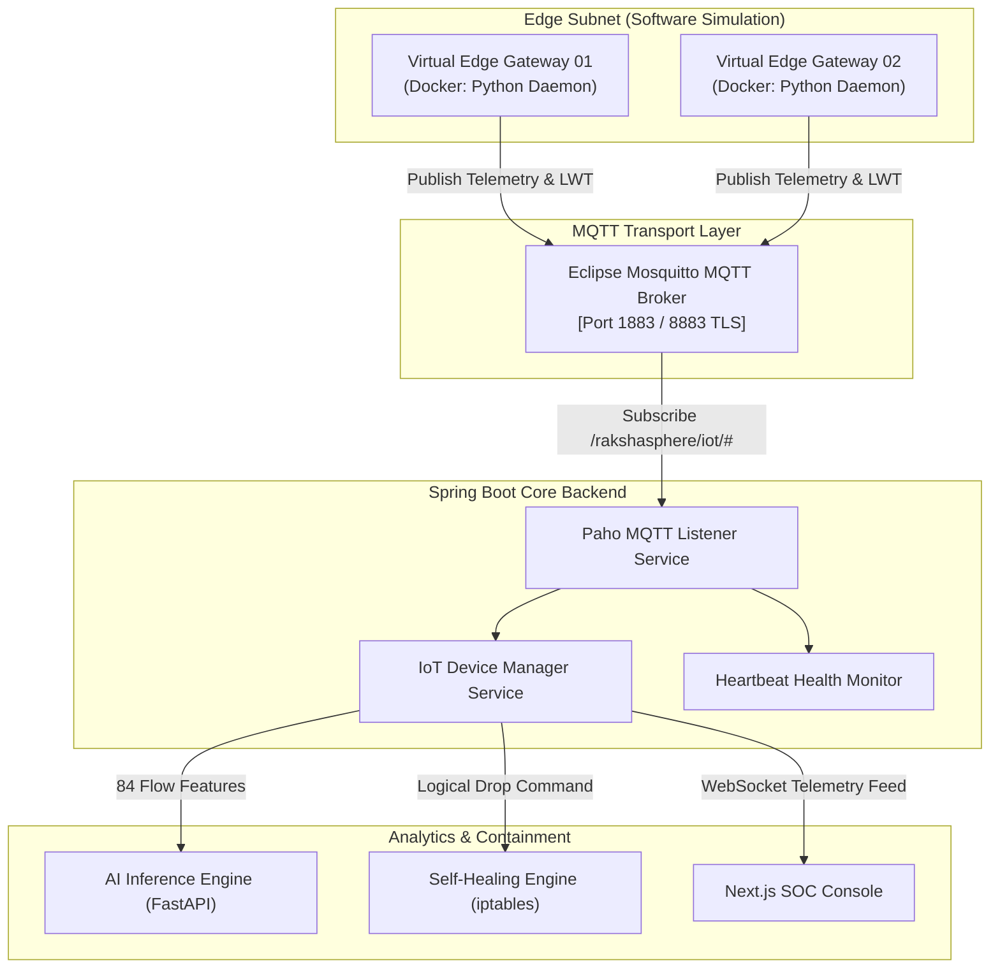
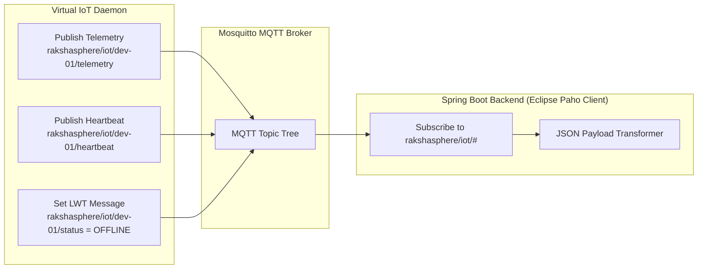
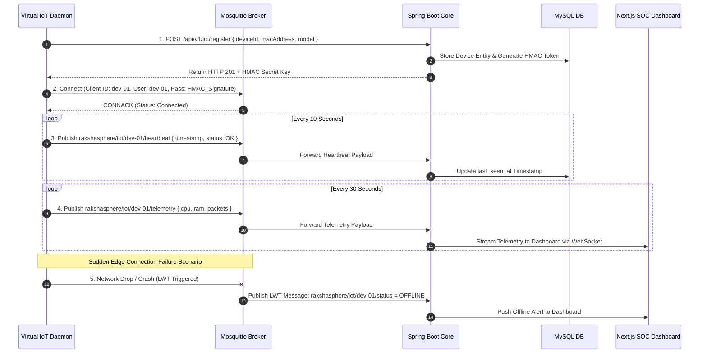
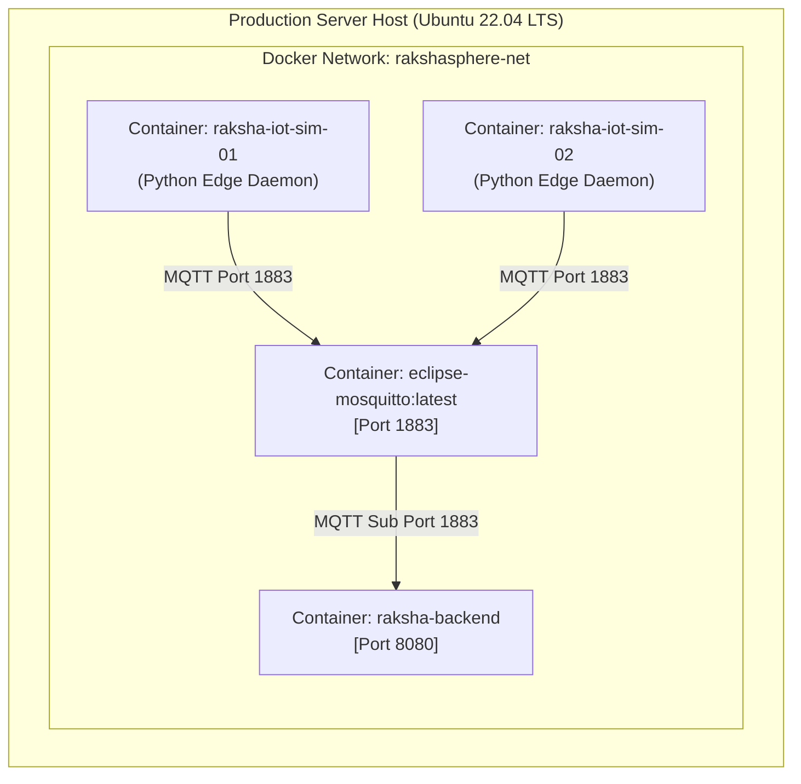
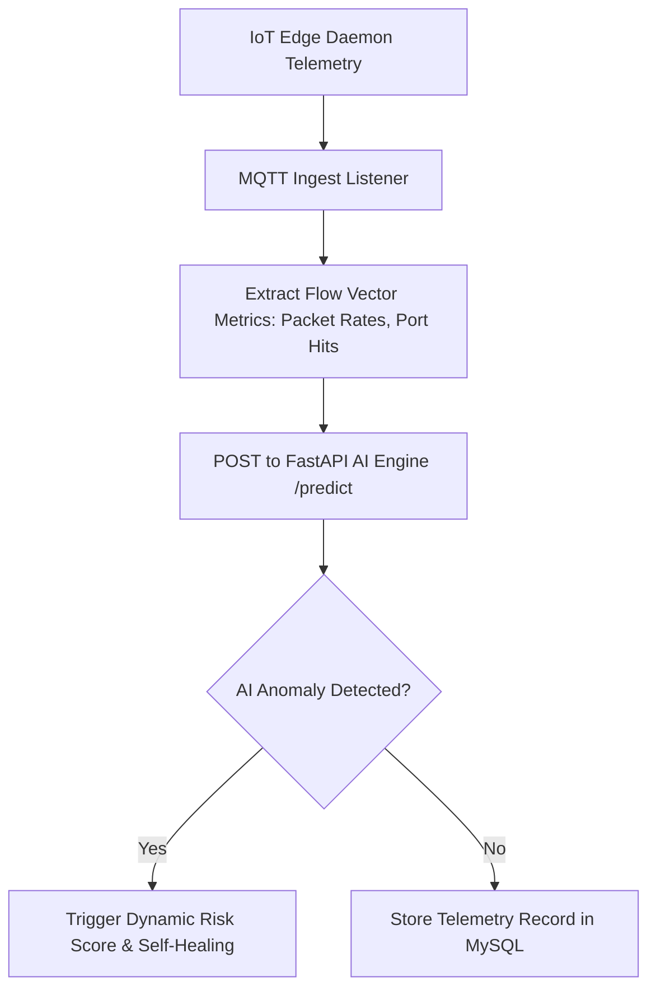
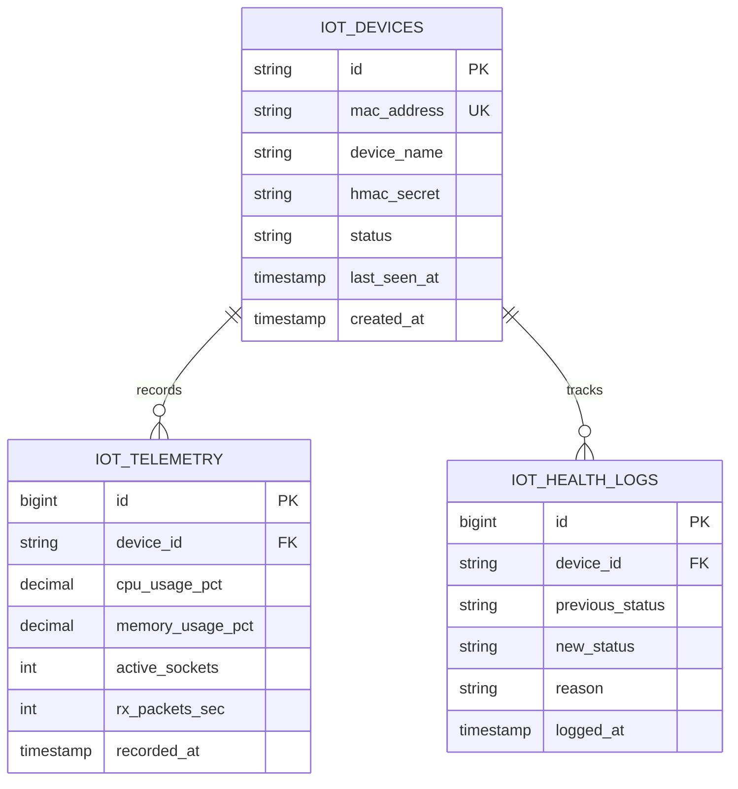

# IoT Edge Security Daemon & MQTT Architecture Specification

## RakshaSphere
### AI-Powered Autonomous Cyber Defense & Self-Healing Network Platform

> **Document Identifier**: `IOT-ARCH-RAKSHASPHERE-2026-V1.0`  
> **Protocols & Specifications**: `MQTT v5.0 / v3.1.1, Eclipse Paho Client, Eclipse Mosquitto Broker`  
> **Standards Alignment**: `NIST SP 800-213 (IoT Security), OWASP IoT Top 10, AWS IoT Architecture Guidelines`  
> **MVP Scope**: `Software-Based Virtual Device Simulation (Dockerized Python Daemons)`  
> **Classification**: `Official Enterprise IoT Subsystem Specification`

---

## 📑 Table of Contents

1. [Executive Summary](#1-executive-summary)
2. [IoT Cybersecurity Subsystem Overview](#2-iot-cybersecurity-subsystem-overview)
3. [Architectural Diagrams Library](#3-architectural-diagrams-library)
   - [High-Level IoT Architecture](#31-high-level-iot-architecture)
   - [MQTT Messaging Architecture & Dataflow](#32-mqtt-messaging-architecture--dataflow)
   - [Device Lifecycle Sequence Diagram](#33-device-lifecycle-sequence-diagram)
   - [IoT Subsystem Deployment Topology](#34-iot-subsystem-deployment-topology)
   - [IoT Component Hierarchy Diagram](#35-iot-component-hierarchy-diagram)
   - [IoT-to-AI Threat Analysis Dataflow](#36-iot-to-ai-threat-analysis-dataflow)
   - [IoT Self-Healing Logical Isolation Dataflow](#37-iot-self-healing-logical-isolation-dataflow)
4. [Device Lifecycle & Registration Management](#4-device-lifecycle--registration-management)
5. [MQTT Protocol Communication Design](#5-mqtt-protocol-communication-design)
6. [Telemetry Metrics & Sensor Schema](#6-telemetry-metrics--sensor-schema)
7. [Device Health Monitoring & Failure Detection](#7-device-health-monitoring--failure-detection)
8. [Practical Edge Threat Detection Support](#8-practical-edge-threat-detection-support)
9. [AI Engine & Machine Learning Integration](#9-ai-engine--machine-learning-integration)
10. [Autonomous Self-Healing Integration](#10-autonomous-self-healing-integration)
11. [SOC Dashboard Integration](#11-soc-dashboard-integration)
12. [Relational Database Schema & Data Model](#12-relational-database-schema--data-model)
13. [IoT Security Architecture & Authentication](#13-iot-security-architecture--authentication)
14. [Structured IoT Logging & Audit Strategy](#14-structured-iot-logging--audit-strategy)
15. [Error Handling, Broker Failover & Resiliency](#15-error-handling-broker-failover--resiliency)
16. [Performance, Scalability & Throughput Strategy](#16-performance-scalability--throughput-strategy)
17. [IoT Subsystem Repository Structure](#17-iot-subsystem-repository-structure)
18. [Quality Assurance & IoT Testing Strategy](#18-quality-assurance--iot-testing-strategy)
19. [Risk Assessment & Mitigation Matrix](#19-risk-assessment--mitigation-matrix)
20. [MVP Scope vs. Future Enterprise Roadmap](#20-mvp-scope-vs-future-enterprise-roadmap)

---

## 1. 🎯 Executive Summary

The **RakshaSphere IoT Edge Subsystem** provides secure device registration, high-frequency telemetry ingestion, heartbeat availability monitoring, anomaly detection support, and software-based logical device containment across enterprise IoT networks.

Designed for the Bachelor of Engineering Capstone Project, the Minimum Viable Product (MVP) implements a **Fully Software-Simulated Edge Subsystem** using containerized Python daemons mimicking edge gateways (Raspberry Pi / NVIDIA Jetson), communicating via an **Eclipse Mosquitto MQTT Broker** to the Spring Boot Core Backend.

```
Virtual Edge Daemon ➔ MQTT Broker (Mosquitto) ➔ Spring Boot IoT Manager ➔ AI Inference ➔ SOC Feed & Self-Healing
```

---

## 2. 🛡️ IoT Cybersecurity Subsystem Overview

### 2.1 Why RakshaSphere Includes IoT Security
Resource-constrained IoT edge devices are primary vectors for Advanced Persistent Threats (APTs), credential brute-forcing, and Mirai-style botnet recruitment due to unencrypted communications, default credentials, and unpatched firmware vulnerabilities.

### 2.2 OWASP IoT Top 10 Alignment
RakshaSphere directly mitigates OWASP IoT Top 10 vulnerabilities:
- **I1: Weak/Default Passwords**: Enforces HMAC-SHA256 per-device authentication keys.
- **I2: Insecure Network Services**: Monitors and closes unauthenticated socket listeners.
- **I3: Insecure Ecosystem Interfaces**: Validates all incoming MQTT message schemas.
- **I8: Lack of Device Management**: Implements continuous heartbeat tracking ($10\text{s}$ interval) and automated status management.

---

## 3. 📊 Architectural Diagrams Library

### 3.1 High-Level IoT Architecture



---

### 3.2 MQTT Messaging Architecture & Dataflow



---

### 3.3 Device Lifecycle Sequence Diagram



---

### 3.4 IoT Subsystem Deployment Topology



---

### 3.5 IoT Component Hierarchy Diagram

```mermaid
component
    package "Edge Layer (Software Simulation)" {
        [Virtual Packet Sniffer] --> [Telemetry Collector]
        [Telemetry Collector] --> [Paho Python Publisher]
    }

    package "Transport Layer" {
        [Mosquitto MQTT Broker]
    }

    package "Backend IoT Engine" {
        [Paho Java Ingest Listener] --> [Device Registration Manager]
        [Paho Java Ingest Listener] --> [Heartbeat Availability Monitor]
        [Paho Java Ingest Listener] --> [IoT Telemetry Service]
    }

    [Paho Python Publisher] ..> [Mosquitto MQTT Broker] : MQTT Protocol
    [Mosquitto MQTT Broker] ..> [Paho Java Ingest Listener] : MQTT Protocol
```

---

### 3.6 IoT-to-AI Threat Analysis Dataflow



---

### 3.7 IoT Self-Healing Logical Isolation Dataflow

```mermaid
flowchart LR
    A[IoT Device Flagged as Compromised] --> B[Self-Healing Engine Triggered]
    B --> C["Execute Local iptables Rule on Gateway Host:\niptables -I INPUT -s 192.168.1.150 -j DROP"]
    C --> D[Publish MQTT Control Command:\nrakshasphere/iot/dev-01/containment { action: ISOLATE }]
    D --> E[Update Device Status to QUARANTINED on SOC UI]
```

---

## 4. 🔄 Device Lifecycle & Registration Management

The IoT device lifecycle consists of eight explicit states:

```
Register ➔ Authenticate ➔ Connect ➔ Telemetry ➔ Heartbeat ➔ Monitor ➔ Contain (if needed) ➔ Disconnect
```

1. **Registration**: Virtual IoT nodes submit identity metadata (`macAddress`, `deviceModel`, `firmwareVersion`) via `POST /api/v1/iot/register`.
2. **Credential Provisioning**: Backend issues a unique `device_id` (UUID v4) and an HMAC-SHA256 secret key.
3. **Authentication**: Device connects to MQTT Broker passing `clientId = device_id`, `username = device_id`, and `password = HMAC_SHA256(device_id, secret)`.
4. **Heartbeat Maintenance**: Device publishes a periodic ping every 10 seconds. Missing 3 consecutive pings (30 seconds) triggers an `OFFLINE` status alert.

---

## 5. 📡 MQTT Protocol Communication Design

### 5.1 Topic Taxonomy & Naming Conventions
All topics follow a hierarchical namespace: `rakshasphere/iot/{device_id}/{message_type}`

| Topic Path | Direction | Quality of Service (QoS) | Purpose |
| :--- | :--- | :--- | :--- |
| `rakshasphere/iot/{id}/telemetry` | Device $\rightarrow$ Broker $\rightarrow$ Backend | **QoS 0** (At most once) | High-frequency telemetry metrics (CPU, RAM, packet rates). |
| `rakshasphere/iot/{id}/heartbeat` | Device $\rightarrow$ Broker $\rightarrow$ Backend | **QoS 1** (At least once) | Device availability ping ($10\text{s}$ interval). |
| `rakshasphere/iot/{id}/status` | Device $\rightarrow$ Broker $\rightarrow$ Backend | **QoS 1** (Retained) | LWT connection status (`ONLINE` / `OFFLINE`). |
| `rakshasphere/iot/{id}/containment` | Backend $\rightarrow$ Broker $\rightarrow$ Device | **QoS 2** (Exactly once) | Self-healing logical isolation control commands. |

### 5.2 Last Will and Testament (LWT) Specification
When an edge daemon connects to Mosquitto, it registers an LWT payload:
- **Topic**: `rakshasphere/iot/{device_id}/status`
- **Payload**: `{"status": "OFFLINE", "reason": "UNEXPECTED_DISCONNECT"}`
- **QoS**: `1` | **Retain**: `true`

---

## 6. 📊 Telemetry Metrics & Sensor Schema

Telemetry payloads are formatted as lightweight JSON objects:

```json
{
  "deviceId": "EDGE-GATEWAY-01",
  "timestamp": "2026-08-02T15:30:00Z",
  "cpuUsagePct": 14.5,
  "memoryUsagePct": 32.8,
  "networkStats": {
    "activeSockets": 12,
    "rxPacketsPerSec": 450,
    "txPacketsPerSec": 320,
    "droppedPackets": 0
  },
  "connectionQuality": {
    "latencyMs": 18.4,
    "signalStrengthDbm": -62
  }
}
```

---

## 7. ⏱️ Device Health Monitoring & Failure Detection

The `HeartbeatHealthMonitor` service in Spring Boot continuously tracks device availability:

```mermaid
flowchart TD
    A[Scheduled Health Scanner (Every 10s)] --> B[Query active IoT devices]
    B --> C{Current Time - last_seen_at > 30s?}
    C -->|Yes| D[Mark Device Status: OFFLINE]
    C -->|No| E[Maintain Device Status: ONLINE]
    D --> F[Publish Alert Event to Next.js SOC Dashboard]
```

---

## 8. 🎯 Practical Edge Threat Detection Support

While full edge intrusion detection is offloaded to the Central AI Engine, the software IoT Agent performs basic edge anomaly checks:
- **Socket Flooding**: Flags anomalous surges in active network sockets ($> 100$ connections).
- **CPU Spike Anomaly**: Flags sustained CPU utilization ($> 90\%$ for $> 60$ seconds) indicative of crypto-mining malware.
- **Unauthorized Port Listener**: Scans local host ports; flags unapproved open listening ports (`23`, `445`).

---

## 9. 🧠 AI Engine & Machine Learning Integration

Network statistics extracted from IoT edge telemetry are converted into 84-feature flow vectors and transmitted to the Python FastAPI AI Engine to detect Mirai botnet scans or volumetric denial-of-service attempts.

---

## 10. 🔄 Autonomous Self-Healing Integration

When an IoT device is classified as compromised:
1. The backend issues a logical containment command via MQTT (`rakshasphere/iot/{id}/containment`).
2. Simultaneously, host-level `iptables` drop rules isolate the device's IP from accessing internal database subnets.
3. The device status updates to `QUARANTINED` on the SOC Dashboard.

---

## 11. 🖥️ SOC Dashboard Integration

The Next.js SOC Dashboard features a dedicated **IoT Device Command Center** (`app/(dashboard)/dashboard/page.tsx`):
- **Live Device Map / Grid**: Card view displaying device status (`ONLINE`, `OFFLINE`, `QUARANTINED`).
- **Telemetry Charts**: Real-time Recharts line graphs plotting CPU, RAM, and packet rate histories.
- **One-Click Logical Isolation**: Button allowing SOC analysts to manually quarantine suspicious edge nodes.

---

## 12. 🗄️ Relational Database Schema & Data Model

The IoT Subsystem uses three relational tables within the MySQL database:



---

## 13. 🔒 IoT Security Architecture & Authentication

1. **HMAC-SHA256 Authentication**: Devices generate a cryptographic signature per connect attempt: $\text{Password} = \text{HMAC-SHA256}(\text{device\_id}, \text{hmac\_secret})$.
2. **Topic Authorization**: Mosquitto ACLs restrict devices to publishing exclusively to their own topic hierarchy (`rakshasphere/iot/{device_id}/#`).
3. **Transport Security (Production Roadmap)**: Enforces TLS 1.3 encryption on MQTT port 8883 using X.509 client certificates.

---

## 14. 📝 Structured IoT Logging & Audit Strategy

All IoT events are logged in structured JSON format via Logback (`iot.json`):

```json
{
  "timestamp": "2026-08-02T15:30:00Z",
  "logLevel": "INFO",
  "subsystem": "IOT_DAEMON",
  "deviceId": "EDGE-GATEWAY-01",
  "event": "HEARTBEAT_RECEIVED",
  "status": "ONLINE",
  "latencyMs": 14.2
}
```

---

## 15. 🚨 Error Handling, Broker Failover & Resiliency

- **MQTT Disconnect & Auto-Reconnect**: Paho client configured with `setAutomaticReconnect(true)` and exponential backoff ($1\text{s} - 60\text{s}$).
- **Offline Telemetry Buffering**: Python edge daemons buffer up to $1,000$ telemetry metric objects in memory if the Mosquitto broker is unreachable.

---

## 16. ⚡ Performance, Scalability & Throughput Strategy

- **QoS 0 Optimization**: Telemetry metrics use QoS 0 to maximize throughput and minimize network overhead.
- **Database Batch Ingestion**: Inbound telemetry rows are inserted into MySQL using JDBC batch operations (`rewriteBatchedStatements=true`) every 5 seconds.

---

## 17. 📁 IoT Subsystem Repository Structure

```
iot-agent/                           # Edge Daemon Software Simulation (Python)
├── agent.py                         # Main edge sniffer & MQTT publisher script
├── config.json                      # Virtual device configurations
├── requirements.txt                 # Python paho-mqtt dependencies
└── Dockerfile                       # Container blueprint for virtual device simulation

backend/src/main/java/com/rakshasphere/
├── controller/
│   └── IoTDeviceController.java     # REST endpoints for registration & SOC queries
├── service/
│   ├── IoTDeviceManager.java        # Core device state & lifecycle manager
│   ├── MqttIngestListener.java      # Paho Java subscriber handling inbound topics
│   └── HeartbeatHealthMonitor.java  # Scheduled availability scanner
├── model/entity/
│   ├── IoTDevice.java               # JPA entity for registered devices
│   └── IoTTelemetry.java            # JPA entity for metric records
└── repository/
    ├── IoTDeviceRepository.java
    └── IoTTelemetryRepository.java
```

---

## 18. 🧪 Quality Assurance & IoT Testing Strategy

1. **Virtual Device Scale Testing**: Spin up 50 Dockerized Python edge daemons concurrently to verify Mosquitto broker throughput.
2. **LWT Failure Testing**: Forcefully stop a virtual device container (`docker stop raksha-iot-sim-01`) and verify that Mosquitto publishes the LWT `OFFLINE` status within 10 seconds.

---

## 19. ⚠️ Risk Assessment & Mitigation Matrix

| Risk Domain | Identified Risk | Impact | Architectural Mitigation Strategy |
| :--- | :--- | :--- | :--- |
| **Broker Downtime** | Mosquitto broker crash halts telemetry ingestion. | High | Enable Docker `restart: unless-stopped` policies and offline message buffering in edge daemons. |
| **Telemetry Flooding** | Compromised IoT device floods broker with telemetry. | Medium | Enforce Mosquitto per-client rate limits (`max_inflight_messages 20`). |
| **Rogue Device Registration**| Unauthorized device connects to MQTT broker. | Critical | Enforce HMAC-SHA256 password validation and Mosquitto ACL topic rules. |

---

## 20. 🔮 MVP Scope vs. Future Enterprise Roadmap

| Subsystem Feature | Minimum Viable Product (MVP) | Future Enterprise Scope |
| :--- | :--- | :--- |
| **Device Execution Target** | Software virtual device simulation via Python Docker containers. | Physical ESP32 microcontrollers & Raspberry Pi 4 edge gateways. |
| **Protocols Supported** | MQTT over TCP (Port 1883). | MQTT over TLS 1.3 (Port 8883), CoAP, LoRaWAN, Zigbee, BLE Mesh. |
| **Device Management** | Local REST registration & Mosquitto ACLs. | AWS IoT Core / Azure IoT Hub cloud integration & Over-The-Air (OTA) updates. |
| **Edge Intelligence** | Centralized FastAPI AI analysis. | TensorFlow Lite Edge AI executing intrusion inference directly on edge nodes. |
