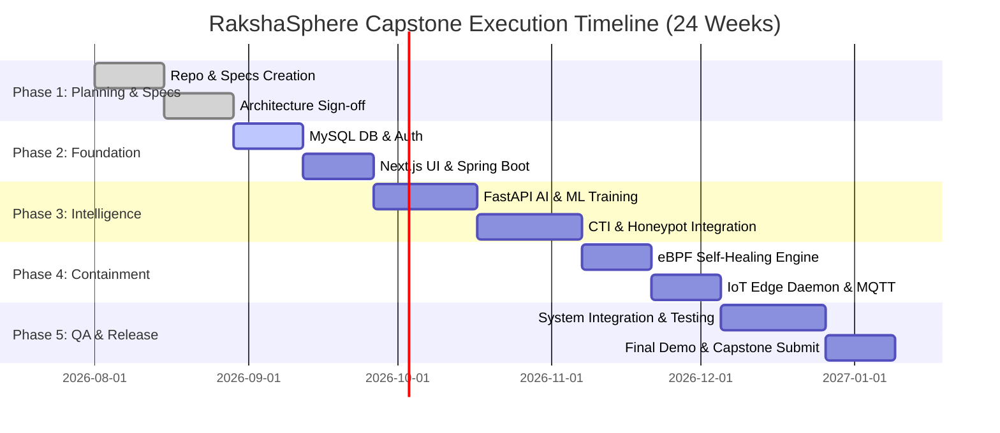
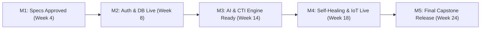
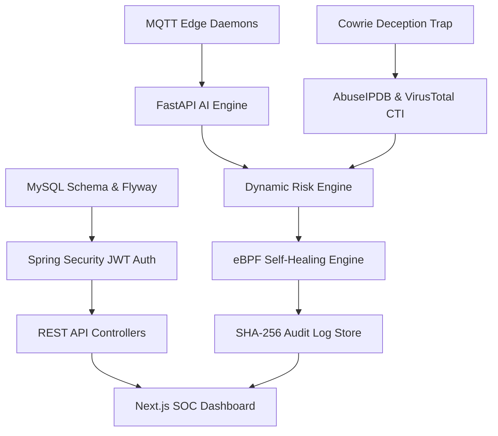
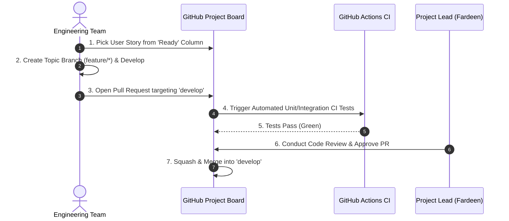
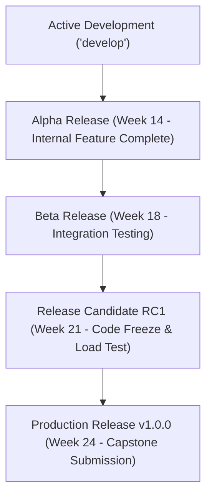

# Product Roadmap & Project Execution Plan

## RakshaSphere
### AI-Powered Autonomous Cyber Defense & Self-Healing Network Platform

> **Document Identifier**: `ROADMAP-EXEC-RAKSHASPHERE-2026-V1.0`  
> **Project Type**: `Bachelor of Engineering Final Year Capstone Project (1 Academic Year)`  
> **Agile Framework**: `Scrum & Milestone-Based Delivery (2-Week Sprints)`  
> **Standards Alignment**: `PMBOK v7, Scrum Guide 2020, Google TPM Management Guidelines`  
> **Classification**: `Official Master Project Execution Plan & Delivery Roadmap`

---

## 📑 Table of Contents

1. [Executive Summary](#1-executive-summary)
2. [Product Vision & Mission](#2-product-vision--mission)
3. [Minimum Viable Product (MVP) Definition](#3-minimum-viable-product-mvp-definition)
4. [5-Phase High-Level Project Roadmap](#4-5-phase-high-level-project-roadmap)
5. [Architectural Diagrams Library](#5-architectural-diagrams-library)
   - [Gantt Chart Project Timeline](#51-gantt-chart-project-timeline)
   - [Milestone Delivery Sequence](#52-milestone-delivery-sequence)
   - [Subsystem Dependency Graph](#53-subsystem-dependency-graph)
   - [Team Agile Workflow Sequence](#54-team-agile-workflow-sequence)
   - [Software Release Lifecycle Flow](#55-software-release-lifecycle-flow)
6. [Detailed 2-Week Sprint Schedules](#6-detailed-2-week-sprint-schedules)
7. [Project Milestones & Verification Criteria](#7-project-milestones--verification-criteria)
8. [RACI Governance Matrix](#8-raci-governance-matrix)
9. [24-Week Detailed Weekly Execution Plan](#9-24-week-detailed-weekly-execution-plan)
10. [MoSCoW Feature Prioritization Matrix](#10-moscow-feature-prioritization-matrix)
11. [Risk Management & Mitigation Strategy](#11-risk-management--mitigation-strategy)
12. [Quality Gates & Entry/Exit Criteria](#12-quality-gates--entryexit-criteria)
13. [Progress Tracking, Burndown & Metrics](#13-progress-tracking-burndown--metrics)
14. [Communication & Collaboration Plan](#14-communication--collaboration-plan)
15. [Release Management Strategy](#15-release-management-strategy)
16. [Key Performance Indicators (KPIs) & Success Metrics](#16-key-performance-indicators-kpis--success-metrics)
17. [Final Academic Submission Checklist](#17-final-academic-submission-checklist)
18. [Post-Submission Enterprise Roadmap](#18-post-submission-enterprise-roadmap)

---

## 1. 🎯 Executive Summary

The **RakshaSphere Product Roadmap and Execution Plan** outlines the strategic, tactical, and operational milestones for designing, implementing, verifying, and deploying the platform across a 24-week academic engineering project cycle.

Leveraging **Agile/Scrum methodologies**, **PMBOK project management principles**, and **GitHub Project Boards**, the roadmap coordinates the responsibilities of four specialized student engineers to ensure on-time delivery of a production-grade Minimum Viable Product (MVP).

---

## 2. 🚀 Product Vision & Mission

### 2.1 Long-Term Product Vision
To provide enterprise networks and IoT environments with an autonomous, AI-driven defense system capable of detecting complex cyber intrusions and healing network infrastructure in sub-second timeframes without requiring human intervention.

### 2.2 Project Mission
To engineer a modular, secure-by-design cyber defense platform integrating real-time ML packet classification, threat intelligence enrichment, deception honeypots, eBPF network containment, and IoT edge daemon monitoring within a unified web console.

---

## 3. 📦 Minimum Viable Product (MVP) Definition

To guarantee successful completion, RakshaSphere prioritizes **Core MVP Deliverables** over secondary enhancements:

```
[Core MVP Scope] ➔ Spring Boot Core + Next.js UI + FastAPI AI + Honeypot + CTI + eBPF Self-Healing + Docker
```

| Subsystem Component | MUST Complete (MVP Scope) | Postponed (Future Scope) |
| :--- | :--- | :--- |
| **Backend Core** | Java 21, Spring Boot 3, RSA-256 JWT, MySQL 8.0, REST APIs. | OAuth2 / OpenID Connect, Multi-Tenant Cloud. |
| **Frontend UI** | Next.js 14 App Router, Tailwind CSS, STOMP WebSockets, Alert Feeds. | Mobile iOS/Android companion app. |
| **AI Inference Engine** | Python FastAPI, Random Forest, XGBoost, Deep Autoencoder. | Real-time online model retraining pipeline. |
| **Self-Healing Engine**| Sub-150ms eBPF XDP NIC drop, host `iptables`, TCP RST kill. | Cisco Switch hardware ACL integration. |
| **Adaptive Honeypot** | Cowrie SSH trap, HTTP trap, payload hash extraction. | Windows RDP decoy traps. |
| **Threat Intelligence**| AbuseIPDB v2, VirusTotal v3, local MITRE STIX 2.1 mapping. | TAXII 2.1 real-time intelligence feed server. |
| **IoT Edge Agent** | Software-based Python edge daemon simulation, MQTT Mosquitto. | Physical ESP32 hardware & LoRaWAN radios. |
| **Deployment** | Single-node Docker Compose v2 stack, Nginx TLS 1.3 proxy. | Multi-node Kubernetes (K8s) Helm deployment. |

---

## 4. 🗓️ 5-Phase High-Level Project Roadmap

The 24-week academic execution plan is structured across five distinct engineering phases:

```
Phase 1 (W1-W4): Architecture & Specs ➔ Phase 2 (W5-W8): Core Backend & UI ➔ Phase 3 (W9-W14): AI, CTI & Honeypot ➔ Phase 4 (W15-W18): Self-Healing & IoT ➔ Phase 5 (W19-W24): QA, Deployment & Submission
```

---

## 5. 📊 Architectural Diagrams Library

### 5.1 Gantt Chart Project Timeline



---

### 5.2 Milestone Delivery Sequence



---

### 5.3 Subsystem Dependency Graph



---

### 5.4 Team Agile Workflow Sequence



---

### 5.5 Software Release Lifecycle Flow



---

## 6. 🏃 Detailed 2-Week Sprint Schedules

Execution is broken down into **12 Two-Week Sprints**:

| Sprint | Goal | Key Deliverables | Team Lead |
| :--- | :--- | :--- | :--- |
| **Sprint 1 (W1-2)** | Architecture & Repo Setup | Master README, 14 Architecture Specs, GitHub Repo rules. | Fardeen Akmal |
| **Sprint 2 (W3-4)** | Docker & Environment Setup | `docker-compose.dev.yml`, Nginx skeleton, MySQL container. | Suvajit Ghosh |
| **Sprint 3 (W5-6)** | Database & Authentication | Flyway schemas, RSA-256 JWT Spring Security filters. | Fardeen Akmal |
| **Sprint 4 (W7-8)** | Frontend Dashboard Base | Next.js 14 App Router, shadcn/ui theme, Auth pages. | Jigisha Naidu |
| **Sprint 5 (W9-10)**| AI Inference Engine | Python FastAPI server, Random Forest/XGBoost models. | Sushil Nirmal |
| **Sprint 6 (W11-12)**| Threat Intelligence Engine | AbuseIPDB v2, VirusTotal v3, Redis 24h caching, STIX mapping.| Sushil Nirmal |
| **Sprint 7 (W13-14)**| Adaptive Honeypot Traps | Cowrie SSH decoy integration, NAT redirection rules. | Sushil Nirmal |
| **Sprint 8 (W15-16)**| Self-Healing Containment | eBPF XDP driver drops, `iptables` enforcer, health verifier.| Fardeen Akmal |
| **Sprint 9 (W17-18)**| IoT Edge Security Daemon | Containerized Python virtual edge daemons, Mosquitto MQTT. | Suvajit Ghosh |
| **Sprint 10 (W19-20)**| WebSockets & Dashboard | Real-time STOMP alert streaming, radar UI widgets. | Jigisha Naidu |
| **Sprint 11 (W21-22)**| Integration & QA Scans | k6 load tests, OWASP ZAP security scans, E2E tests. | All Team Members|
| **Sprint 12 (W23-24)**| Production Deployment | Production `docker-compose.yml`, Final Capstone Submission.| All Team Members|

---

## 7. 🏆 Project Milestones & Verification Criteria

| Milestone ID | Target Week | Milestone Name | Verification Criteria |
| :--- | :--- | :--- | :--- |
| **M1** | Week 4 | **Architecture Approval** | All 14 architectural specs merged; GitHub CI operational. |
| **M2** | Week 8 | **Auth & Database Baseline** | User login returns valid RSA-256 JWT; MySQL schemas migrated. |
| **M3** | Week 14 | **AI & Intelligence Engine** | AI model inference $< 10\text{ms}$; AbuseIPDB CTI cache working. |
| **M4** | Week 18 | **Autonomous Self-Healing** | eBPF packet drops execute in $< 150\text{ms}$; IoT telemetry live. |
| **M5** | Week 24 | **Final Capstone Release** | Production deployment verified; final academic submission done. |

---

## 8. 📊 RACI Governance Matrix

| Subsystem Component | Fardeen Akmal (Lead) | Jigisha Naidu (Frontend) | Sushil Nirmal (AI/Security) | Suvajit Ghosh (IoT/DevOps) |
| :--- | :---: | :---: | :---: | :---: |
| **System Architecture & Specs** | **Accountable** | Responsible | Responsible | Responsible |
| **Spring Boot Backend Core** | **Accountable** | Consulted | Consulted | Responsible |
| **Next.js Frontend & UI** | Consulted | **Accountable** | Informed | Informed |
| **AI Inference Engine** | Consulted | Informed | **Accountable** | Informed |
| **Adaptive Honeypot** | Informed | Informed | **Accountable** | Responsible |
| **Self-Healing Engine** | **Accountable** | Informed | Responsible | Consulted |
| **IoT Edge & MQTT** | Informed | Informed | Informed | **Accountable** |
| **Docker & CI/CD Pipeline** | Responsible | Informed | Informed | **Accountable** |
| **Quality Assurance Testing** | **Accountable** | Responsible | Responsible | Responsible |

*RACI Legend: **A** = Accountable (Final Decision), **R** = Responsible (Doer), **C** = Consulted, **I** = Informed.*

---

## 9. 📅 24-Week Detailed Weekly Execution Plan

- **Weeks 1–4**: Repository initialization, 14 architecture spec documents, Docker development environment setup.
- **Weeks 5–8**: MySQL schema migration, RSA-256 JWT auth implementation, Next.js UI component setup.
- **Weeks 9–12**: Python FastAPI AI model training (CIC-IDS2017 dataset), AbuseIPDB/VirusTotal CTI integration.
- **Weeks 13–16**: Cowrie SSH honeypot containerization, eBPF XDP driver packet drop development.
- **Weeks 17–20**: IoT edge daemon MQTT simulation, STOMP WebSocket real-time dashboard streaming.
- **Weeks 21–24**: Full system integration testing, k6 load benchmarks, OWASP ZAP security audits, final Capstone presentation delivery.

---

## 10. 🎯 MoSCoW Feature Prioritization Matrix

- **MUST HAVE**: RSA-256 JWT Auth, Next.js Dashboard, FastAPI AI Engine, AbuseIPDB CTI, eBPF Self-Healing, Docker Compose.
- **SHOULD HAVE**: Real-time STOMP WebSocket feeds, Cowrie SSH Honeypot, IoT Daemon MQTT simulation.
- **COULD HAVE**: PDF report generation, dark/light theme switcher, historical threat timeline player.
- **WON'T HAVE (Current Release)**: Physical ESP32 microcontrollers, Kubernetes cluster, cloud-native AWS EKS deployment.

---

## 11. ⚠️ Risk Management & Mitigation Strategy

| Risk Category | Identified Threat | Likelihood | Impact | Mitigation Strategy |
| :--- | :--- | :--- | :--- | :--- |
| **Technical** | eBPF kernel driver incompatibility on host OS. | Medium | High | Maintain host `iptables` drop rule as automated fallback. |
| **Schedule** | Feature creep delays core MVP completion. | Medium | High | Strictly enforce MoSCoW priorities; freeze features at Week 18. |
| **External API**| AbuseIPDB rate limits exceeded during testing. | High | Medium | Implement 24-hour Redis caching and WireMock stubs for offline CI runs. |

---

## 12. 🚥 Quality Gates & Entry/Exit Criteria

No feature branch is merged into `develop` without satisfying explicit quality criteria:
- **Code Coverage**: $\ge 80\%$ line and branch coverage verified by JaCoCo.
- **Security Audit**: Zero High or Critical vulnerabilities flagged by Trivy container scanner.
- **Performance Threshold**: Self-healing reaction latency verified $< 150\text{ms}$.

---

## 13. 📈 Progress Tracking, Burndown & Metrics

Project progress is tracked using the **GitHub Project Board**:
- **Sprint Burndown Chart**: Calculated based on issue story points completed per 2-week sprint.
- **Target Velocity**: 25–30 story points per sprint across the 4-member team.

---

## 14. 💬 Communication & Collaboration Plan

- **Weekly Sprint Planning**: Mondays 10:00 AM (Sprint Goal & Task Assignment).
- **Daily Async Standup**: Brief progress message posted to team channel by 18:00 UTC.
- **Code Review SLA**: Pull Requests reviewed within 24 hours of submission.

---

## 15. 🚀 Release Management Strategy

- **Alpha Release (Week 14)**: Internal backend and AI engine API integration complete.
- **Beta Release (Week 18)**: Complete end-to-end flow from packet capture to self-healing drop.
- **Release Candidate RC1 (Week 21)**: Code freeze; load and security testing sign-off.
- **Production Release v1.0.0 (Week 24)**: Tagged production build for Capstone submission.

---

## 16. 📊 Key Performance Indicators (KPIs) & Success Metrics

1. **Feature Completion Rate**: $100\%$ of Must-Have MVP features delivered.
2. **Containment Reaction Latency**: End-to-end response time **$< 150\text{ms}$**.
3. **AI Classification Accuracy**: $\ge 99.0\%$ on held-out test datasets.
4. **False Positive Rate**: $< 1.5\%$ benign traffic false isolation rate.

---

## 17. 🎓 Final Academic Submission Checklist

- [ ] Complete Source Code Repository (clean Git history).
- [ ] 14 Architectural & Technical Specification Documents under [`docs/`](file:///home/fardeen/RakshaSphere/docs).
- [ ] Production `docker-compose.yml` & Nginx deployment scripts.
- [ ] Automated Test Suite Execution Reports (JUnit, Vitest, pytest, k6).
- [ ] Final Capstone Project Report (PDF) & Presentation Slide Deck.

---

## 18. 🔮 Post-Submission Enterprise Roadmap

Following academic submission, RakshaSphere is positioned for open-source community expansion and commercialization:
- **Phase 6 (Post-Graduation)**: Kubernetes (K8s) Helm Chart deployment & Cloud-Native AWS EKS hosting.
- **Phase 7**: Physical ESP32 hardware edge nodes & STIX/TAXII 2.1 enterprise threat sharing.
