# Security Architecture & Secure Software Development Lifecycle (SSDLC) Specification

## RakshaSphere
### AI-Powered Autonomous Cyber Defense & Self-Healing Network Platform

> **Document Identifier**: `SEC-ARCH-RAKSHASPHERE-2026-V1.0`  
> **Framework Compliance**: `OWASP ASVS v4.0, OWASP Top 10:2021, OWASP API Security Top 10, NIST CSF v2.0, NIST SP 800-53`  
> **Security Model**: `Zero Trust Network Architecture (ZTNA - NIST SP 800-207) & Defense-in-Depth`  
> **Classification**: `Official Master Security Architecture & SSDLC Specification`

---

## 📑 Table of Contents

1. [Executive Summary](#1-executive-summary)
2. [Security Philosophy & Core Principles](#2-security-philosophy--core-principles)
3. [Security Architecture & Trust Boundaries](#3-security-architecture--trust-boundaries)
   - [High-Level Security Architecture](#31-high-level-security-architecture)
   - [System Trust Boundaries Diagram](#32-system-trust-boundaries-diagram)
   - [Secure Data Flow Architecture](#33-secure-data-flow-architecture)
   - [Authentication Sequence Diagram](#34-authentication-sequence-diagram)
   - [Authorization & RBAC Decision Sequence](#35-authorization--rbac-decision-sequence)
4. [System Threat Modeling & DFD Level 1](#4-system-threat-modeling--dfd-level-1)
5. [Authentication Architecture & Token Lifecycle](#5-authentication-architecture--token-lifecycle)
6. [Authorization & Role-Based Access Control (RBAC)](#6-authorization--role-based-access-control-rbac)
7. [Input Validation, Sanitization & Encoding](#7-input-validation-sanitization--encoding)
8. [API Security & OWASP Protection Strategy](#8-api-security--owasp-protection-strategy)
9. [Data Protection, Cryptography & Secrets Management](#9-data-protection-cryptography--secrets-management)
10. [Database Security & Query Hardening](#10-database-security--query-hardening)
11. [AI Engine Security & Model Integrity](#11-ai-engine-security--model-integrity)
12. [Honeypot Sandbox Security & Container Boundaries](#12-honeypot-sandbox-security--container-boundaries)
13. [IoT Security & MQTT Authentication](#13-iot-security--mqtt-authentication)
14. [Docker Container Infrastructure Hardening](#14-docker-container-infrastructure-hardening)
15. [Security Logging, Audit & Telemetry Architecture](#15-security-logging-audit--telemetry-architecture)
16. [Secure Software Development Lifecycle (SSDLC)](#16-secure-software-development-lifecycle-ssdlc)
17. [Incident Response (IR) Plan & Workflow](#17-incident-response-ir-plan--workflow)
18. [Enterprise Compliance & Framework Mapping](#18-enterprise-compliance--framework-mapping)
19. [Vulnerability & Patch Management Strategy](#19-vulnerability--patch-management-strategy)
20. [Security Verification & Penetration Testing](#20-security-verification--penetration-testing)
21. [Quantitative Risk Assessment Matrix](#21-quantitative-risk-assessment-matrix)
22. [Security Repository Folder Structure](#22-security-repository-folder-structure)
23. [Module-Wise Security Best Practices](#23-module-wise-security-best-practices)
24. [MVP Security Scope vs. Future Enterprise Scope](#24-mvp-security-scope-vs-future-enterprise-scope)

---

## 1. 🎯 Executive Summary

The **RakshaSphere Security Architecture** defines the technical controls, cryptographic protocols, defense-in-depth strategies, and secure software development lifecycle (SSDLC) standards governing the platform.

Designed following **OWASP ASVS Level 2**, **NIST CSF v2.0**, and **Zero Trust Architecture (NIST SP 800-207)**, this document establishes a zero-compromise security posture that protects internal platform services, user sessions, database persistence, AI inference models, and edge communications while operating in adversarial network environments.

---

## 2. 🛡️ Security Philosophy & Core Principles

RakshaSphere enforces six fundamental security engineering principles:

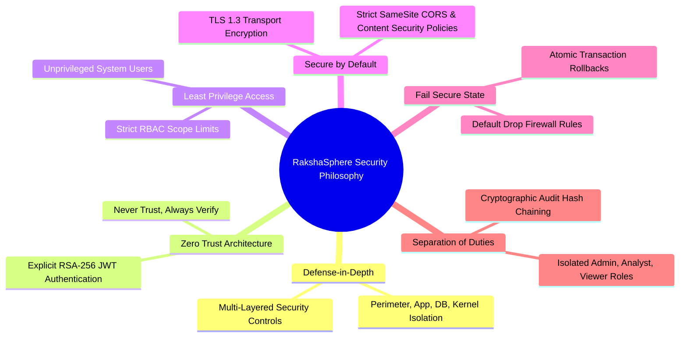

1. **Defense-in-Depth**: No single security control is relied upon exclusively. Security is enforced at the Nginx Proxy perimeter, Spring Security application layer, MySQL database layer, Linux eBPF driver layer, and Docker container runtime level.
2. **Zero Trust Architecture (ZTNA)**: No network segment—whether local enterprise subnets, IoT edge nodes, or internal Docker bridge networks—is assumed implicitly trusted. All inter-service requests must carry explicit authentication and authorization context.
3. **Least Privilege**: All application components, database connections, and Docker containers run under minimal necessary privileges. Custom system daemons execute under unprivileged user handles (`raksha-agent`, `nobody`).
4. **Secure-by-Default**: Systems default to strict security configurations. Unauthenticated endpoints are rejected; default database passwords are forbidden; network ports remain closed unless explicitly required.
5. **Fail-Secure**: Upon encountering unexpected system exceptions, missing parameters, or component timeouts, RakshaSphere terminates execution securely without leaking internal stack traces or granting access.
6. **Separation of Duties**: Operational capabilities are strictly partitioned across roles (`ROLE_ADMIN`, `ROLE_SOC_ANALYST`, `ROLE_USER`) to prevent single-operator privilege abuse.

---

## 3. 🏗️ Security Architecture & Trust Boundaries

### 3.1 High-Level Security Architecture

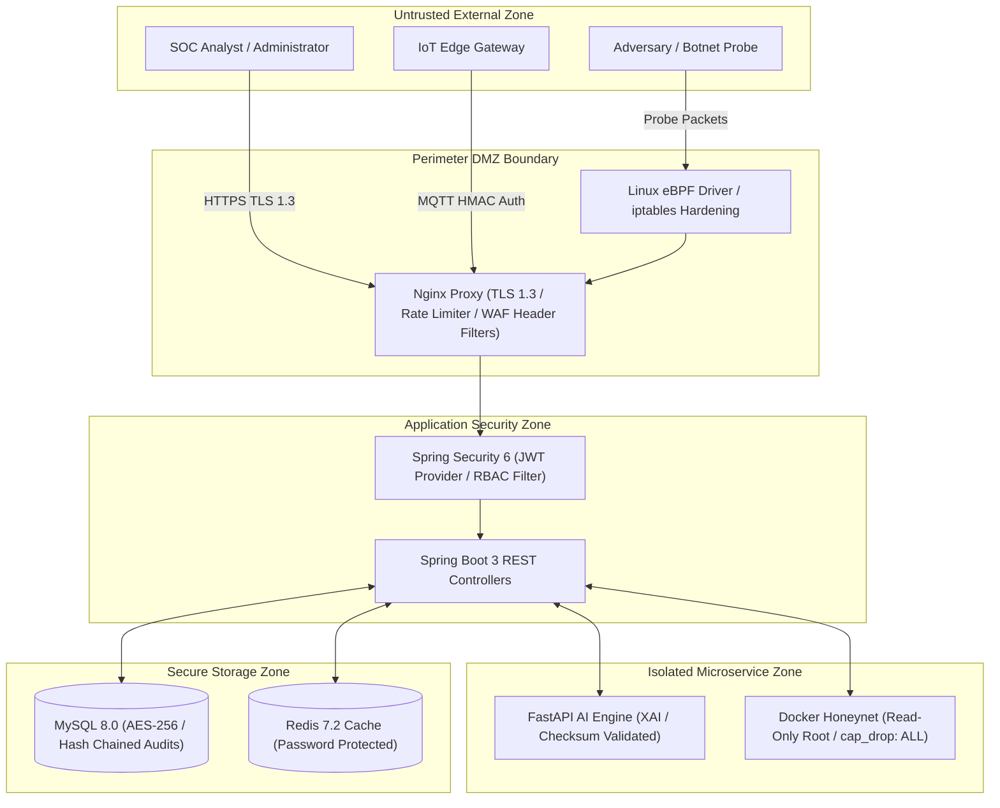

---

### 3.2 System Trust Boundaries Diagram

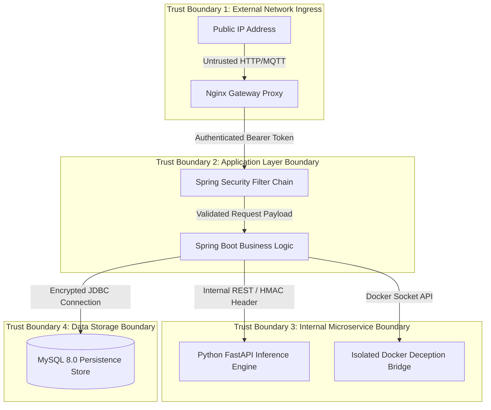

---

### 3.3 Secure Data Flow Architecture

```mermaid
flowchart LR
    A[Client Inputs Payload] --> B[Client-Side Zod Validation]
    B --> C[TLS 1.3 Transport Encryption]
    C --> D[Nginx Rate Limit & Header Inspection]
    D --> E[Spring Security RSA-256 JWT Verification]
    E --> F[Hibernate Validator JSR-380 Annotation Check]
    F --> G[Parameterized SQL / JPA Processing]
    G --> H[SHA-256 Cryptographic Audit Chain Logging]
```

---

### 3.4 Authentication Sequence Diagram

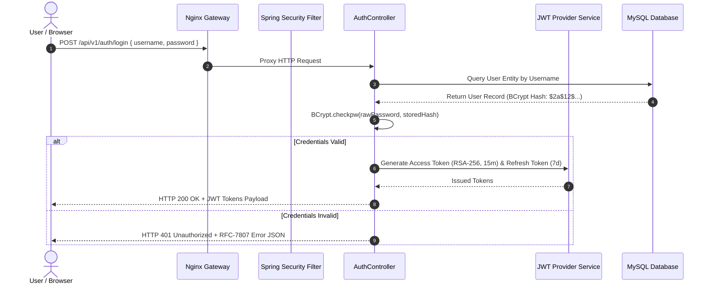

---

### 3.5 Authorization & RBAC Decision Sequence

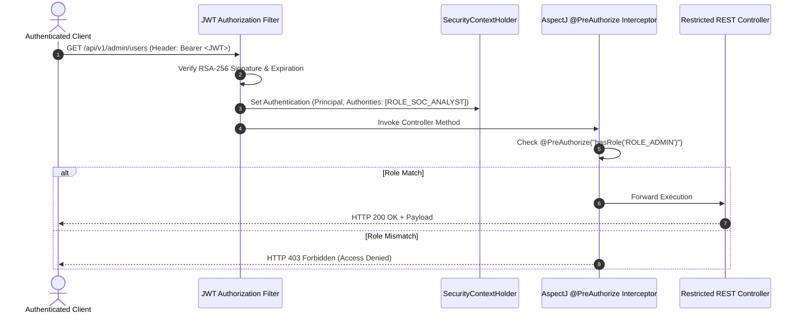

---

## 4. 🕵️ System Threat Modeling & DFD Level 1

RakshaSphere applies **STRIDE Threat Modeling** across data flow boundaries:

```mermaid
flowchart TD
    ExtUser(("External User / Adversary"))
    P1["1.0 Gateway Rate Limiting & TLS Termination"]
    P2["2.0 JWT Authentication & RBAC Authorization"]
    P3["3.0 AI Threat Classification & Risk Scoring"]
    P4["4.0 Autonomous Self-Healing Containment"]
    
    D1[[(D1) MySQL Database Store]]
    D2[[(D2) Immutable Audit Log Store]]

    ExtUser -->|Untrusted Traffic| P1
    P1 -->|Cleaned HTTP Flow| P2
    P2 -->|Authenticated Request| P3
    P3 -->|Risk Payload| P4
    P3 <-->|JPA Read/Write| D1
    P4 -->|Write Chained Log| D2
```

### STRIDE Risk Mitigation Mapping

| Threat Category | Identified System Risk | Architectural Security Control |
| :--- | :--- | :--- |
| **Spoofing** | Adversary impersonates legitimate SOC analyst or IoT node. | RSA-256 JWT signatures for users; HMAC-SHA256 signatures for IoT nodes. |
| **Tampering** | Attacker modifies historical audit records or security alerts. | Cryptographic SHA-256 row-level hash chaining ($\text{Hash}_n = \text{SHA256}(\text{Data}_n \parallel \text{Hash}_{n-1})$). |
| **Repudiation** | Operator denies executing manual self-healing rule override. | Immutable audit logs binding `username`, `action`, `timestamp`, and `origin_ip`. |
| **Information Disclosure** | Sensitive API keys or database credentials exposed. | Environment variable injection (`.env`), AES-256-GCM data encryption at rest. |
| **Denial of Service** | Volumetric HTTP flood overwhelms REST controllers. | Redis-backed token bucket rate limiting (`100 req/min`) and eBPF XDP NIC drops. |
| **Elevation of Privilege** | Analyst exploits endpoint vulnerability to gain Admin rights. | Declarative Method-Level Security (`@PreAuthorize`) and Spring Security RBAC filters. |

---

## 5. 🔑 Authentication Architecture & Token Lifecycle

### 5.1 JWT Token Specification
- **Algorithm**: `RS256` (Asymmetric RSA 2048-bit key pair).
- **Access Token TTL**: 15 Minutes ($900\text{ seconds}$).
- **Refresh Token TTL**: 7 Days ($604,800\text{ seconds}$) with single-use rotation.

```json
{
  "header": {
    "alg": "RS256",
    "typ": "JWT"
  },
  "payload": {
    "sub": "soc_analyst_01",
    "roles": ["ROLE_SOC_ANALYST"],
    "iss": "rakshasphere-auth-service",
    "iat": 1785684600,
    "exp": 1785685500,
    "jti": "c89a2f10-43b1-4f28-8921-998811223344"
  }
}
```

---

## 6. 🛂 Authorization & Role-Based Access Control (RBAC)

RakshaSphere defines three strict system roles:

| Role Name | Access Privilege Scope | Allowed Operations |
| :--- | :--- | :--- |
| **`ROLE_ADMIN`** | Full System Control | User onboarding, system configuration, manual self-healing overrides, full rule creation. |
| **`ROLE_SOC_ANALYST`** | Operations & Triage | View real-time alert feeds, inspect honeypot sessions, request semi-automatic remediation, export reports. |
| **`ROLE_USER`** | Read-Only Monitoring | View executive summary dashboards and high-level risk score trends only. |

---

## 7. 🧹 Input Validation, Sanitization & Encoding

1. **Frontend Input Validation**: All input forms validated using **Zod** schemas prior to submission.
2. **Backend Input Validation**: JSR-380 Hibernate Validator annotations (`@NotNull`, `@Size`, `@Pattern`, `@ValidIP`) applied to all Data Transfer Objects (DTOs).
3. **Cross-Site Scripting (XSS) Prevention**: All output fields rendered in the Next.js frontend undergo automatic React HTML entity encoding.

---

## 8. 🌐 API Security & OWASP Protection Strategy

RakshaSphere implements defensive controls addressing the **OWASP API Security Top 10:2023**:

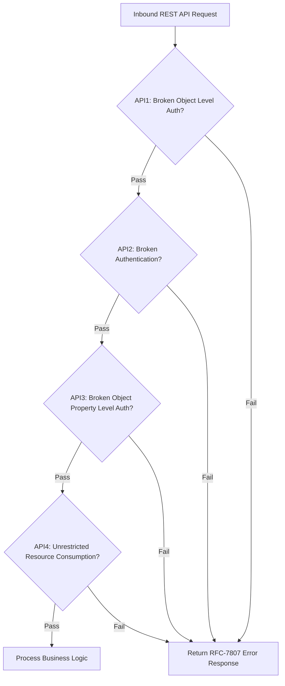

| OWASP API Risk | System Security Mitigation Control |
| :--- | :--- |
| **API1: Broken Object Level Authorization** | Database queries enforce user tenant and role boundaries (`WHERE alert.id = :id AND tenant = :tenant`). |
| **API2: Broken Authentication** | Asymmetric RSA-256 JWT validation; short-lived 15-minute expiration. |
| **API3: Broken Object Property Level Auth** | DTO projections explicitly limit fields returned to clients; sensitive hashes stripped. |
| **API4: Unrestricted Resource Consumption** | Redis token-bucket rate limiting (`100 req/min` per IP) and strict pagination limits (`max size=100`). |

---

## 9. 🔒 Data Protection, Cryptography & Secrets Management

1. **Encryption in Transit**: Transport Layer Security (**TLS 1.3**) enforced across all web traffic via Nginx proxy.
2. **Encryption at Rest**: Sensitive database columns (API keys, integration secrets) encrypted using **AES-256-GCM**.
3. **Password Storage**: Passwords hashed using **BCrypt** with a minimum cost factor of 12.
4. **Secrets Management**: Secrets loaded exclusively via environment variables (`${MYSQL_PASSWORD}`) at container boot time.

---

## 10. 🗄️ Database Security & Query Hardening

- **Parameterized Queries**: All database operations execute through Spring Data JPA / Hibernate ORM parameterized queries, completely eliminating SQL Injection (SQLi) attack vectors.
- **Least Privilege User Accounts**: Application backend connects using `raksha_app_user` limited to `SELECT`, `INSERT`, `UPDATE`, and `DELETE` privileges.

---

## 11. 🧠 AI Engine Security & Model Integrity

1. **Model Binary Integrity**: Serialized model files (`.pkl`, `.h5`) are verified via SHA-256 cryptographic checksums prior to loading into memory.
2. **Input Sanitization**: Input feature vectors are clipped to valid statistical ranges ($\text{Min} \le x_i \le \text{Max}$) to prevent adversarial evasion attacks.

---

## 12. 🍯 Honeypot Sandbox Security & Container Boundaries

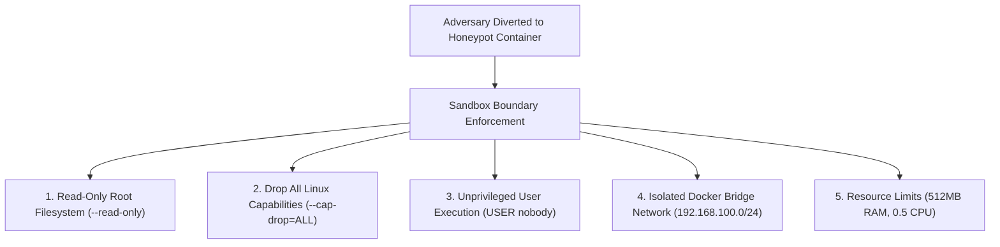

---

## 13. 📟 IoT Security & MQTT Authentication

1. **HMAC-SHA256 Device Authentication**: Devices authenticate to Mosquitto MQTT broker using per-device HMAC signatures ($\text{Password} = \text{HMAC-SHA256}(\text{device\_id}, \text{hmac\_secret})$).
2. **Mosquitto ACL Topic Rules**: Edge devices are restricted to publishing exclusively to their designated sub-tree (`rakshasphere/iot/{device_id}/#`).

---

## 14. 🐳 Docker Container Infrastructure Hardening

- **Minimal Base Images**: Built on minimal runtime distributions (`alpine`, `slim`, `temurin-jre`).
- **Container Vulnerability Scanning**: Images scanned in CI/CD via **Trivy**; builds containing High or Critical vulnerabilities are automatically rejected.

---

## 15. 📝 Security Logging, Audit & Telemetry Architecture

High-priority security actions (self-healing triggers, manual overrides, user privilege changes) write immutable audit records to the `AUDIT_LOGS` table:

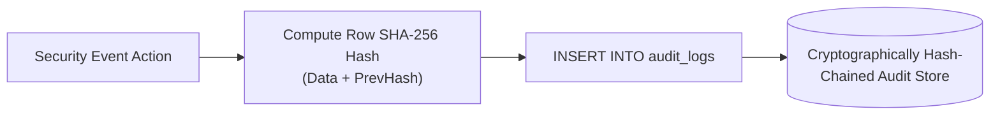

---

## 16. 🔄 Secure Software Development Lifecycle (SSDLC)

RakshaSphere integrates security across every software development lifecycle phase:

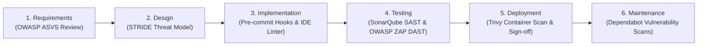

---

## 17. 🚨 Incident Response (IR) Plan & Workflow

RakshaSphere applies the **NIST SP 800-61 Incident Response Lifecycle**:

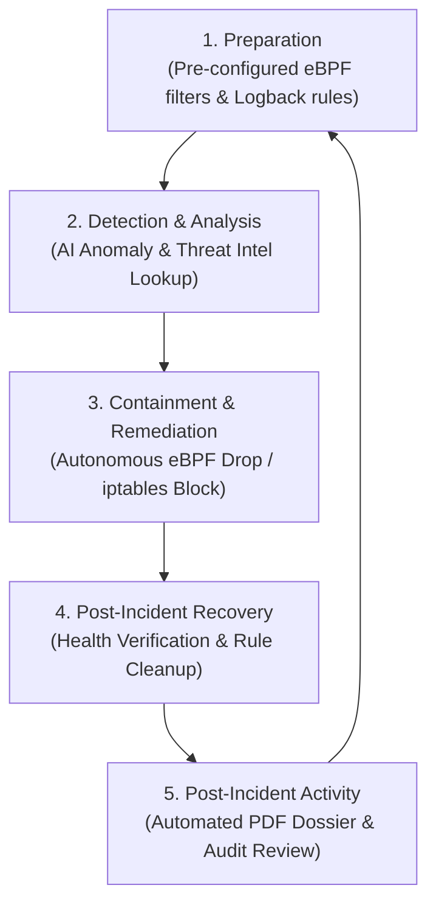

---

## 18. 📊 Enterprise Compliance & Framework Mapping

| Security Control | OWASP ASVS v4.0 | NIST CSF v2.0 | CIS Controls v8 | Implementation Status |
| :--- | :--- | :--- | :--- | :--- |
| **RSA-256 JWT Authentication** | V2.1.1 (Verify Auth) | PR.AA-01 (Identity) | CIS 6.1 (Access Control) | **Implemented (MVP)** |
| **Role-Based Access Control** | V4.1.1 (Access Control)| PR.AA-02 (Access Mgmt) | CIS 6.2 (Privilege Control) | **Implemented (MVP)** |
| **TLS 1.3 Transport Encryption**| V9.1.1 (Communications)| PR.DS-02 (Transiting Data)| CIS 3.10 (Encrypt Data) | **Implemented (MVP)** |
| **AES-256 Data Encryption** | V8.1.1 (Data Protection)| PR.DS-01 (Data at Rest) | CIS 3.11 (Encrypt Rest) | **Implemented (MVP)** |
| **eBPF/iptables Containment** | V10.1.1 (Malicious Code)| DE.CM-01 (Monitoring) | CIS 13.3 (Network Filter) | **Implemented (MVP)** |
| **Multi-Factor Auth (MFA)** | V2.8.1 (Authenticator)| PR.AA-03 (MFA) | CIS 6.3 (MFA Enforce) | **Future Enhancement** |

---

## 19. 🛠️ Vulnerability & Patch Management Strategy

1. **Dependency Scanning**: Dependabot scans repository dependencies daily for published CVEs.
2. **Automated Patching**: Base Docker images updated monthly to ingest OS-level security patches.

---

## 20. 🧪 Security Verification & Penetration Testing

- **Static Application Security Testing (SAST)**: SonarQube scans source code for security vulnerabilities.
- **Dynamic Application Security Testing (DAST)**: OWASP ZAP scans REST endpoints during CI/CD build execution.

---

## 21. ⚠️ Quantitative Risk Assessment Matrix

| Risk Domain | Threat Description | Likelihood | Impact | Overall Risk Rating | Architectural Mitigation Strategy |
| :--- | :--- | :--- | :--- | :--- | :--- |
| **Auth Bypass** | Attacker forge JWT token signature. | Low | Critical | **HIGH** | Enforce asymmetric RSA-256 verification with strict key validation. |
| **Honeypot Breakout** | Attacker exploits zero-day escape to host OS. | Low | Critical | **HIGH** | Run container as `--read-only`, drop capabilities (`cap_drop: ALL`), non-root user. |
| **Rate Limit DoS** | Volumetric REST API flood exhausts threads. | High | Medium | **HIGH** | Redis-backed token bucket rate limiting (`100 req/min`) and eBPF XDP NIC drops. |
| **Audit Hash Alteration**| Compromised user alters historical logs. | Medium | High | **HIGH** | Row-level SHA-256 hash chaining ($\text{Hash}_n = \text{SHA256}(\text{Data}_n \parallel \text{Hash}_{n-1})$). |

---

## 22. 📁 Security Repository Folder Structure

```
backend/src/main/java/com/rakshasphere/
├── security/
│   ├── authentication/   # AuthController & UserDetailsService
│   ├── authorization/    # RBAC Method Interceptors & PermissionGuards
│   ├── jwt/              # RSA-256 JWT Token Provider & Validation Filters
│   └── audit/            # Cryptographic SHA-256 Hash Chained Audit Logger
├── config/
│   ├── SecurityConfig.java # Master Spring Security 6 Filter Chain Configuration
│   └── CorsConfig.java     # Strict CORS & CSP Header Policies
```

---

## 23. 💡 Module-Wise Security Best Practices

- **Frontend**: Enforce `sessionStorage` token isolation; sanitize raw honeypot terminal text.
- **Backend**: Enforce `@PreAuthorize` guards; mandate parameter validation via `@Valid`.
- **Database**: Run under restricted DB user `raksha_app_user`; enforce hash-chained audit logs.
- **Docker**: Execute unprivileged containers (`USER nobody`); drop all Linux capabilities (`--cap-drop=ALL`).

---

## 24. 🔮 MVP Security Scope vs. Future Enterprise Scope

| Security Capability | Minimum Viable Product (MVP) | Future Enterprise Scope |
| :--- | :--- | :--- |
| **Authentication** | Asymmetric RSA-256 JWT Access & Refresh Tokens. | OAuth2 / OpenID Connect (OIDC) & Multi-Factor Authentication (MFA). |
| **Secrets Management** | Environment Variables & Encrypted `.env` files. | HashiCorp Vault / AWS Secrets Manager integration. |
| **IoT Authentication** | HMAC-SHA256 Device Signatures & Mosquitto ACLs. | X.509 Certificate-Based Mutual TLS (mTLS) Device Authentication. |
| **SIEM Integration** | Local Hash-Chained MySQL Audit Store & Logback JSON. | Outbound Syslog / CEF streaming to Splunk & Elastic SIEM. |
