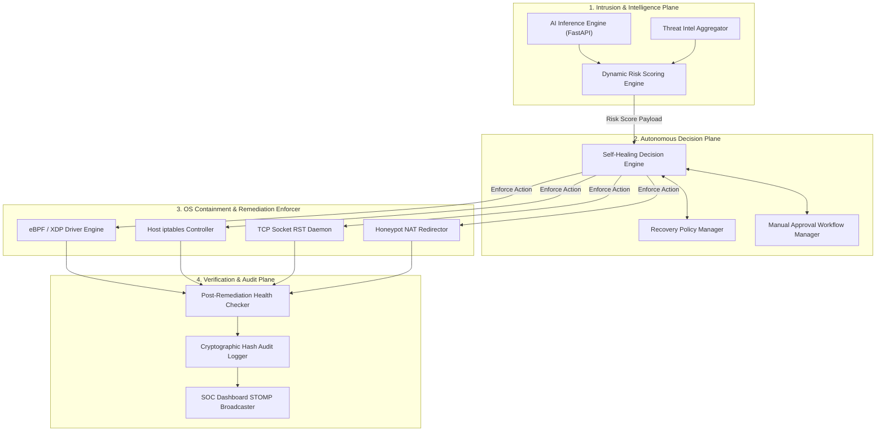
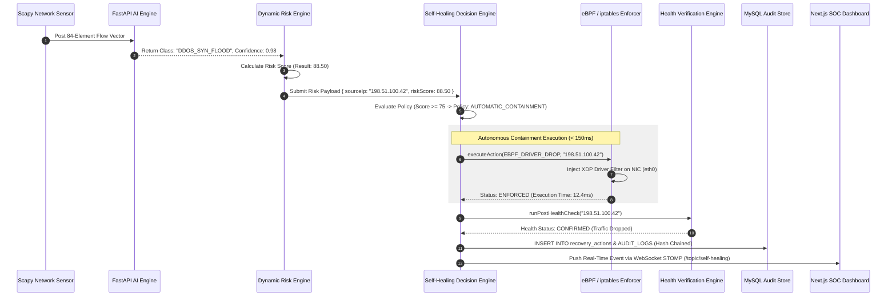
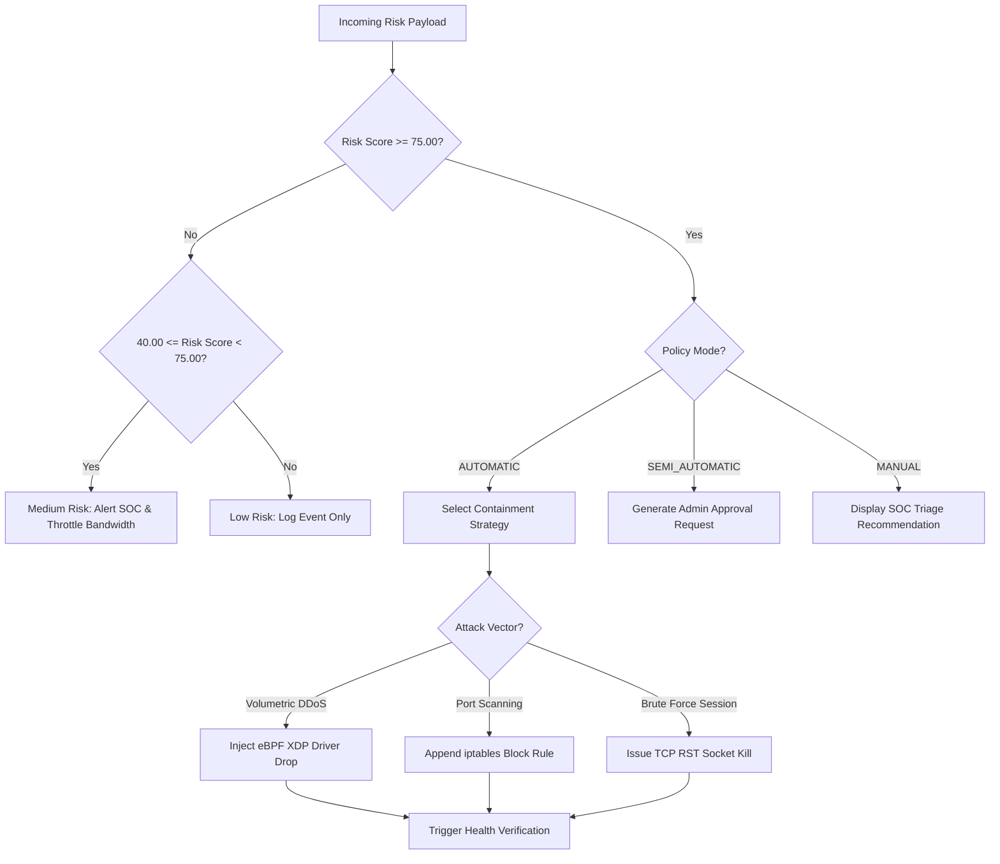
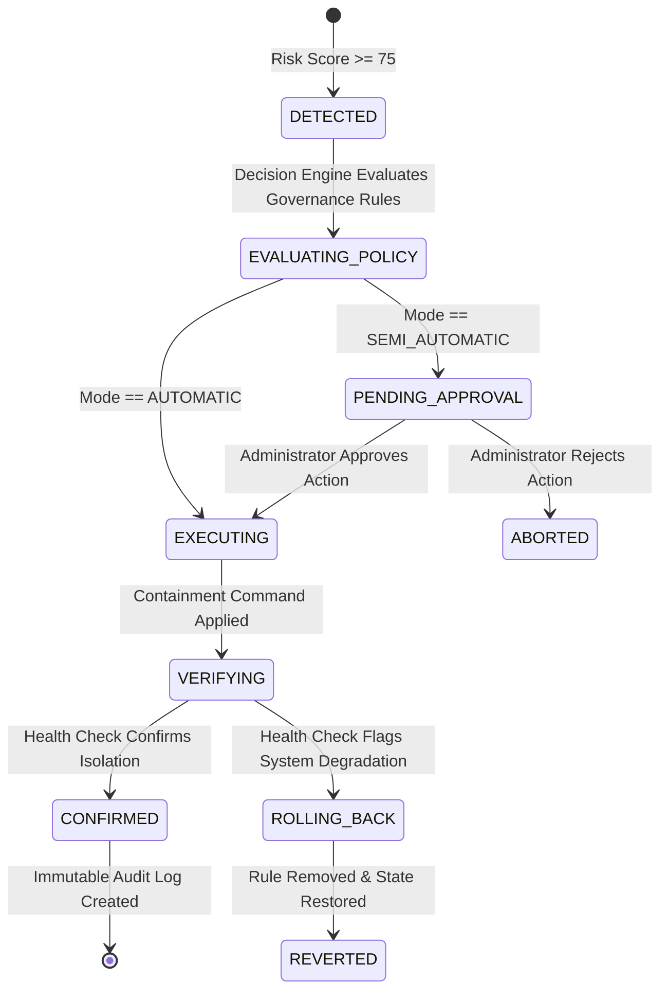
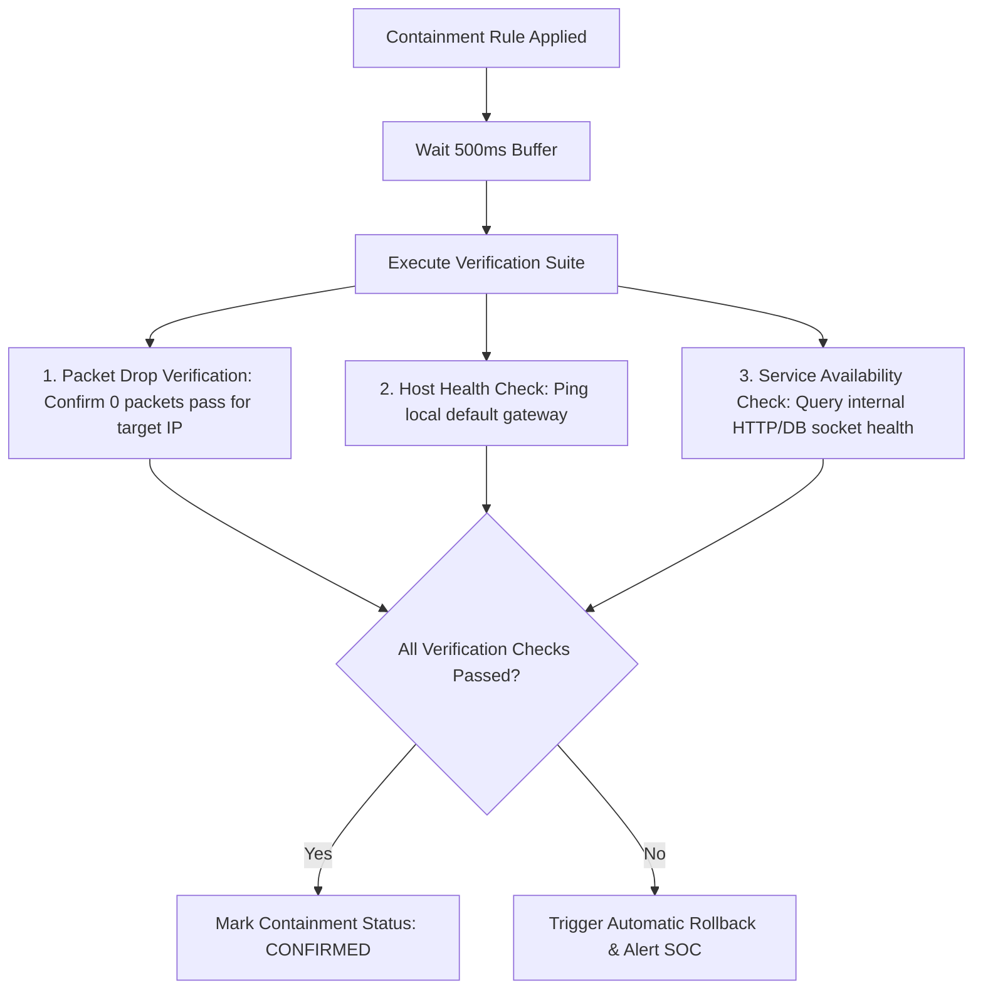
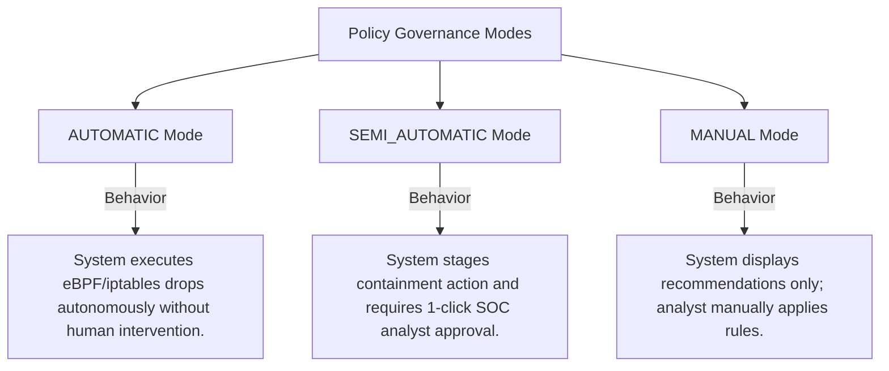
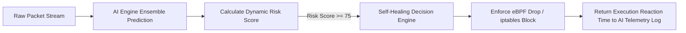
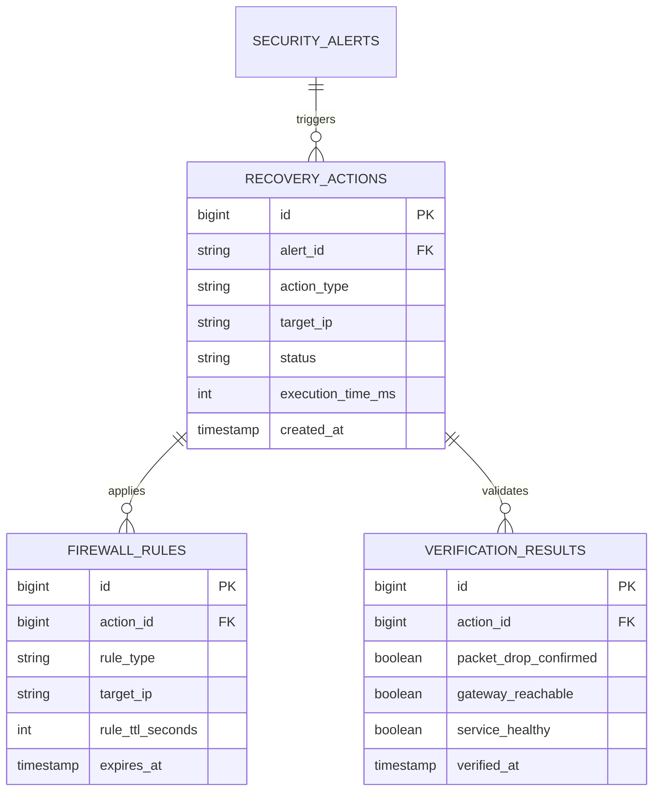

# Self-Healing Network & Autonomous Containment Architecture Specification

## RakshaSphere
### AI-Powered Autonomous Cyber Defense & Self-Healing Network Platform

> **Document Identifier**: `SELF-HEAL-ARCH-RAKSHASPHERE-2026-V1.0`  
> **Standards Alignment**: `NIST CSF v2.0, MITRE D3FEND, Zero Trust Architecture (NIST SP 800-207), OWASP, Google SRE`  
> **Containment Engines**: `Linux eBPF/XDP Drivers, Dynamic iptables, TCP RST Socket Kill Daemon`  
> **Classification**: `Official Enterprise Self-Healing Subsystem Specification`

---

## 📑 Table of Contents

1. [Executive Summary](#1-executive-summary)
2. [What is a Self-Healing Network?](#2-what-is-a-self-healing-network)
3. [Architectural Diagrams Library](#3-architectural-diagrams-library)
   - [High-Level Self-Healing System Architecture](#31-high-level-self-healing-system-architecture)
   - [End-to-End Recovery Pipeline Sequence](#32-end-to-end-recovery-pipeline-sequence)
   - [Decision Engine Logic Flowchart](#33-decision-engine-logic-flowchart)
   - [Self-Healing Component Diagram](#34-self-healing-component-diagram)
   - [Containment & Recovery Lifecycle State Diagram](#35-containment--recovery-lifecycle-state-diagram)
   - [SOC Dashboard Recovery Flow](#36-soc-dashboard-recovery-flow)
4. [Autonomous Decision Engine Architecture](#4-autonomous-decision-engine-architecture)
5. [Containment Strategies & Enforcement Mechanisms](#5-containment-strategies--enforcement-mechanisms)
6. [Recovery & Remediation Strategies](#6-recovery--remediation-strategies)
7. [Post-Remediation Verification Engine](#7-post-remediation-verification-engine)
8. [Recovery Policy Framework & Governance](#8-recovery-policy-framework--governance)
9. [AI Engine & Machine Learning Integration](#9-ai-engine--machine-learning-integration)
10. [Threat Intelligence Integration Engine](#10-threat-intelligence-integration-engine)
11. [SOC Operations Dashboard Integration](#11-soc-operations-dashboard-integration)
12. [Relational Database Schema & Data Model](#12-relational-database-schema--data-model)
13. [Security Architecture, RBAC & Approval Workflows](#13-security-architecture-rbac--approval-workflows)
14. [Structured Self-Healing Logging & Audit Strategy](#14-structured-self-healing-logging--audit-strategy)
15. [Error Handling, Failure Recovery & Rollback Strategy](#15-error-handling-failure-recovery--rollback-strategy)
16. [Performance, Concurrency & Latency Strategy](#16-performance-concurrency--latency-strategy)
17. [Self-Healing Engine Repository Structure](#17-self-healing-engine-repository-structure)
18. [Quality Assurance & Self-Healing Testing Strategy](#18-quality-assurance--self-healing-testing-strategy)
19. [Risk Assessment & Mitigation Matrix](#19-risk-assessment--mitigation-matrix)
20. [MVP Scope vs. Future Enterprise Scope](#20-mvp-scope-vs-future-enterprise-scope)

---

## 1. 🎯 Executive Summary

The **RakshaSphere Self-Healing Network Subsystem** provides closed-loop autonomous containment, damage reduction, and network service recovery following the detection of high-risk cyber intrusions.

Moving beyond passive alerting, the Self-Healing Engine evaluates dynamic risk scores, validates threat context against policy rules, and executes sub-second OS-level containment mechanisms—including **eBPF/XDP driver-level packet drops**, **dynamic host `iptables` rule injection**, **TCP RST socket teardowns**, and **honeypot NAT diversions**.

```
Threat Detection ➔ Risk Score (>=75) ➔ Decision Engine ➔ eBPF Drop / iptables Block ➔ Health Verification ➔ Audit Log
```

### Core Subsystem Objectives
- **Sub-150ms Containment Latency**: Execute driver and network-level packet drops in under 150 milliseconds from threat validation.
- **Zero-Trust Micro-Containment**: Isolate compromised source IPs or sessions without disrupting unrelated enterprise subnet traffic.
- **Automated Verification & Rollback**: Validate service health post-containment; execute automated rollback if legitimate network connectivity is impaired.
- **Cryptographic Auditability**: Log every self-healing execution to an immutable MySQL table with row-level SHA-256 hash chaining.

---

## 2. 🛡️ What is a Self-Healing Network?

### 2.1 Definition & Philosophy
A **Self-Healing Network** is an autonomous network architecture that continuously monitors system health, detects operational anomalies or cyber intrusions, executes corrective containment actions without human intervention, and verifies post-remediation operational stability.

### 2.2 Why RakshaSphere Integrates Self-Healing Capabilities
1. **Human Reaction Latency**: Manual SOC triage takes minutes or hours; active exploits (e.g., ransomware lateral movement or volumetric SYN floods) inflict catastrophic damage within seconds.
2. **Alert Fatigue Reduction**: Automating low-level routine containment allows security analysts to focus on strategic threat hunting.
3. **MITRE D3FEND Alignment**: Implements standardized countermeasure techniques: *Network Traffic Filtering (D3-NTF)*, *User Session Isolation (D3-USI)*, and *Executable Quarantining (D3-EQ)*.

---

## 3. 📊 Architectural Diagrams Library

### 3.1 High-Level Self-Healing System Architecture



---

### 3.2 End-to-End Recovery Pipeline Sequence



---

### 3.3 Decision Engine Logic Flowchart



---

### 3.4 Self-Healing Component Diagram

```mermaid
component
    package "Detection Ingestion" {
        [Risk Score Receiver]
    }

    package "Self-Healing Core Engine" {
        [Policy Engine] --> [Strategy Selector]
        [Strategy Selector] --> [eBPF Enforcer]
        [Strategy Selector] --> [iptables Enforcer]
        [Strategy Selector] --> [Socket Teardown Enforcer]
        [Strategy Selector] --> [Health Verifier]
    }

    package "Persistence & Messaging" {
        database "MySQL Audit Store"
        [STOMP WebSocket Broadcaster]
    }

    [Risk Score Receiver] ..> [Policy Engine] : RiskPayload DTO
    [Health Verifier] ..> [MySQL Audit Store] : JPA Save
    [Health Verifier] ..> [STOMP WebSocket Broadcaster] : Alert Broadcast
```

---

### 3.5 Containment & Recovery Lifecycle State Diagram



---

### 3.6 SOC Dashboard Recovery Flow

```mermaid
flowchart TD
    A[Autonomous Self-Healing Action Executed] --> B[Push STOMP WebSocket Message to /topic/self-healing]
    B --> C[Update Dashboard Active Containment Badge]
    B --> D[Append Entry to Recovery Audit Timeline Table]
    D --> E{Analyst Clicks 'Revert Rule'?}
    E -->|Yes| F[POST /api/v1/self-healing/remediate { action: REVERT_BLOCK }]
    F --> G[Remove eBPF / iptables Drop Rule & Write Audit Log]
    E -->|No| H[Maintain Active Block until Expiration]
```

---

## 4. 🧠 Autonomous Decision Engine Architecture

The Decision Engine synthesizes multiple security inputs to select an optimal, proportional containment strategy:

### 4.1 Decision Matrix Inputs
1. **Calculated Risk Score ($0.00 - 100.00$)**: Output from the dynamic risk engine.
2. **AI Model Confidence ($0.0 - 1.0$)**: Machine learning ensemble probability.
3. **MITRE ATT&CK TTP ID**: Taxonomy identifier (e.g., `T1110` for SSH Brute Force).
4. **Asset Criticality Weight ($1 - 5$)**: Target host importance multiplier.
5. **System Governance Policy**: Configured execution mode (`AUTOMATIC`, `SEMI_AUTOMATIC`, `MANUAL`).

### 4.2 Proportional Action Selection Rules

| Risk Score Range | Attack Profile | System Mode | Selected Containment Mechanism | Target Latency |
| :--- | :--- | :--- | :--- | :--- |
| $< 40.00$ | Reconnaissance / Scan | All Modes | **Log & Monitor**: Record event; no containment. | N/A |
| $40.00 - 64.99$ | Low-Rate Probing | AUTOMATIC | **Honeypot Diversion**: Reroute IP to decoy container via NAT. | $< 250\text{ms}$ |
| $65.00 - 74.99$ | SSH / Web Brute Force | AUTOMATIC | **Socket Kill & iptables Block**: Issue TCP RST and drop IP. | $< 100\text{ms}$ |
| $\ge 75.00$ | Volumetric DDoS / Exploit | AUTOMATIC | **eBPF Driver Drop**: Inject low-level XDP packet drop filter. | **$< 15\text{ms}$** |

---

## 5. 🛠️ Containment Strategies & Enforcement Mechanisms

RakshaSphere implements four practical containment mechanisms at the OS and network layers:

### 1. eBPF / XDP Driver-Level Packet Drop
- **Purpose**: Drops malicious network frames at the NIC driver layer before packet buffer allocation in Linux kernel memory.
- **Implementation**: Uses `libbpf` to attach an eBPF BPF_MAP_TYPE_HASH lookup map containing blocked IPs to the `XDP_DROP` hook on interface `eth0`.
- **Target Latency**: $< 15\text{ms}$.

### 2. Dynamic Host `iptables` Rule Injection
- **Purpose**: Applies host-level firewall drop rules to isolate malicious IPs from local transport sockets.
- **Implementation**: Executes Linux system command: `iptables -I INPUT -s {target_ip} -j DROP`.
- **Target Latency**: $< 50\text{ms}$.

### 3. TCP Socket RST Teardown
- **Purpose**: Instantly terminates active, established TCP authentication sessions associated with compromised credentials.
- **Implementation**: Issues TCP RST packets via `ss -k dst {target_ip}` or `tcpkill`.
- **Target Latency**: $< 50\text{ms}$.

### 4. Honeypot NAT Diversion
- **Purpose**: Diverts suspicious reconnaissance probes into isolated Docker honeypot containers.
- **Implementation**: Modifies host PREROUTING NAT table: `iptables -t nat -A PREROUTING -s {target_ip} -p tcp --dport 22 -j REDIRECT --to-ports 2222`.
- **Target Latency**: $< 200\text{ms}$.

---

## 6. 🔄 Recovery & Remediation Strategies

Following successful threat containment, the Self-Healing Engine manages network service recovery:

1. **Firewall Rule Expiration & Cleanup**: Temporary firewall drop rules are configured with a default 24-hour TTL. A background scheduler (`LogCleanupTask`) automatically removes expired rules.
2. **Session Cleanup & State Reset**: Clears invalid authentication state entries in Redis for compromised internal accounts.
3. **Manual Operator Rollback**: Authorized administrators (`ROLE_ADMIN`) can execute an instant one-click unblock via the SOC Dashboard, removing applied eBPF/iptables rules within 1 second.

---

## 7. 🧪 Post-Remediation Verification Engine

To ensure an applied containment action successfully isolates the threat without inducing self-inflicted network outages:



---

## 8. 📋 Recovery Policy Framework & Governance

Administrators configure the platform's self-healing posture using three policy execution modes:



---

## 9. 🧠 AI Engine & Machine Learning Integration

The Self-Healing Engine receives risk payloads from the Python FastAPI AI Engine and returns execution metrics:



---

## 10. 🌐 Threat Intelligence Integration Engine

The Decision Engine cross-references AbuseIPDB reputation scores prior to enforcing permanent blocks:
- **High Abuse Confidence ($> 80\%$)**: Instantly elevates rule execution mode to `AUTOMATIC`.
- **Low Abuse Confidence ($< 20\%$) / Internal Subnet IP**: Forces policy mode to `SEMI_AUTOMATIC` requiring analyst approval to prevent false positive isolation of internal enterprise hosts.

---

## 11. 🖥️ SOC Operations Dashboard Integration

The Next.js SOC Dashboard features a **Self-Healing Control Panel** (`app/(dashboard)/settings/page.tsx` & `/alerts`):
- **Live Containment Feed**: Displays real-time eBPF and `iptables` active drop rules.
- **One-Click Revert Button**: Allows administrators to immediately remove host blocks.
- **Policy Mode Selector**: Radio buttons allowing admins to toggle between `AUTOMATIC`, `SEMI_AUTOMATIC`, and `MANUAL` execution modes.

---

## 12. 🗄️ Relational Database Schema & Data Model

The Self-Healing Subsystem uses three relational tables within the MySQL database:



---

## 13. 🔒 Security Architecture, RBAC & Approval Workflows

1. **Role-Based Access Control**: Reverting a containment rule or changing system policy modes requires explicit `ROLE_ADMIN` authorization.
2. **Cryptographic Audit Chaining**: Every self-healing action writes a record to the `AUDIT_LOGS` table with row-level SHA-256 hash chaining ($\text{Hash}_n = \text{SHA256}(\text{Data}_n \parallel \text{Hash}_{n-1})$).
3. **Privilege Escalation Controls**: The backend process executing `iptables` or eBPF commands runs under a dedicated, unprivileged system user (`raksha-agent`) granted narrow `sudoers` privileges for specific binary paths only.

---

## 14. 📝 Structured Self-Healing Logging & Audit Strategy

All self-healing actions are logged in structured JSON format via Logback (`self-healing.json`):

```json
{
  "timestamp": "2026-08-02T15:22:01.120Z",
  "logLevel": "INFO",
  "subsystem": "SELF_HEALING_ENGINE",
  "action": "EBPF_DRIVER_DROP",
  "targetIp": "198.51.100.42",
  "riskScore": 88.50,
  "executionTimeMs": 12.4,
  "status": "ENFORCED",
  "verification": "PASSED"
}
```

---

## 15. 🚨 Error Handling, Failure Recovery & Rollback Strategy

- **Execution Failure**: If an eBPF injection command fails, the engine falls back to `iptables` drop rule injection within 20 milliseconds.
- **Verification Failure**: If post-remediation health checks detect that host gateway connectivity is broken, the engine immediately executes an automated rollback (`iptables -D`) and issues a high-priority alert to the SOC dashboard.
- **Command Timeout**: System process execution calls time out after 2,000 milliseconds to prevent thread starvation.

---

## 16. ⚡ Performance, Concurrency & Latency Strategy

- **Sub-150ms Reaction Pipeline**: Virtual Threads in Java 21 execute containment calls asynchronously without blocking HTTP request threads.
- **eBPF XDP Performance**: Driver-level frame drops process up to $10,000,000$ packets/sec per core with $< 1\%$ CPU utilization.

---

## 17. 📁 Self-Healing Engine Repository Structure

```
backend/src/main/java/com/rakshasphere/
├── controller/
│   └── SelfHealingController.java    # REST API endpoints for manual overrides & policy configs
├── service/
│   ├── SelfHealingService.java       # Master containment orchestrator
│   ├── DecisionEngine.java           # Rule evaluation and priority matrix engine
│   ├── EbpfContainmentService.java   # Low-level eBPF XDP driver wrapper
│   ├── IptablesService.java          # Host iptables command wrapper
│   └── HealthVerificationService.java# Post-remediation health check verifier
├── model/entity/
│   ├── RecoveryAction.java           # JPA entity for self-healing actions
│   ├── FirewallRule.java             # JPA entity for active blocks
│   └── VerificationResult.java       # JPA entity for health checks
└── repository/
    ├── RecoveryActionRepository.java
    └── FirewallRuleRepository.java
```

---

## 18. 🧪 Quality Assurance & Self-Healing Testing Strategy

1. **Containment Speed Testing**: Automated benchmark scripts measuring time elapsed from alert ingestion to network packet drop verification ($< 150\text{ms}$).
2. **Rollback Verification Testing**: Synthetic failure injection tests confirming automated rule removal occurs when health checks fail.
3. **RBAC Authorization Testing**: MockMVC tests ensuring non-admin users cannot alter self-healing policies or revert firewall rules.

---

## 19. ⚠️ Risk Assessment & Mitigation Matrix

| Risk Domain | Identified Threat / Risk | Impact | Architectural Mitigation Strategy |
| :--- | :--- | :--- | :--- |
| **False Positive Blocking** | System automatically blocks legitimate internal host or gateway IP. | High | Enforce Admin Whitelist tables (`127.0.0.1`, default gateways) and require manual approval for internal IPs. |
| **Self-Inflicted Outage** | Firewall rule syntax error disrupts all host networking. | Critical | Run automated post-remediation health checks; execute instant rollback if gateway ping fails. |
| **Containment Loop** | Rapid recurring alerts cause duplicate rule creation. | Medium | Maintain active block lookup set in Redis to skip duplicate rule commands. |
| **Privilege Escalation** | Attacker exploits backend process to issue arbitrary `sudo` commands. | Critical | Restrict `sudoers` file to explicit binary paths (`/sbin/iptables`, `/usr/sbin/bpftool`) only. |

---

## 20. 🔮 MVP Scope vs. Future Enterprise Scope

| Subsystem Capability | Minimum Viable Product (MVP) | Future Enterprise Scope |
| :--- | :--- | :--- |
| **Containment Mechanisms** | eBPF XDP NIC drop, host `iptables`, TCP RST socket kill, Honeypot NAT. | Cloud Security Group APIs (AWS SG / Azure NSG), Cisco switch ACLs. |
| **Policy Modes** | `AUTOMATIC`, `SEMI_AUTOMATIC`, `MANUAL` global toggles. | Per-subnet granular policy governance matrices. |
| **Verification Engine** | Local gateway ping & HTTP socket availability check. | Synthetic end-to-end user transaction testing. |
| **SOAR Integration** | Local execution + STOMP WebSockets + MySQL Audit Log. | Native STIX/TAXII webhooks for Palo Alto Cortex XSOAR & Splunk SOAR. |
