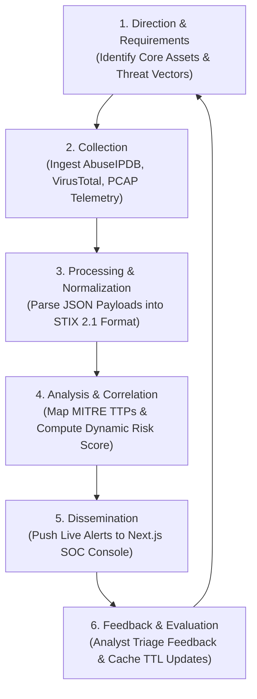
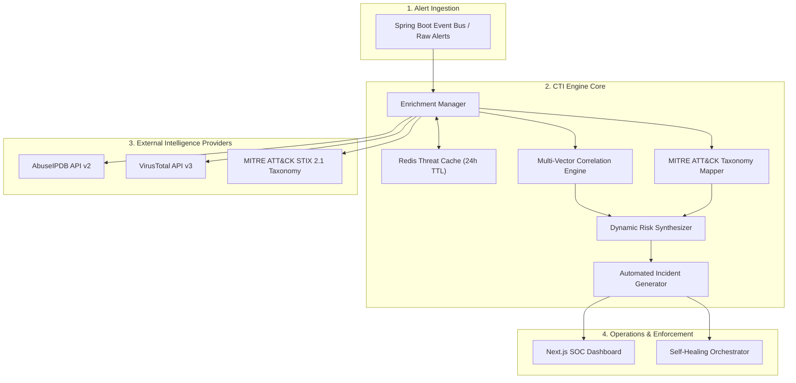
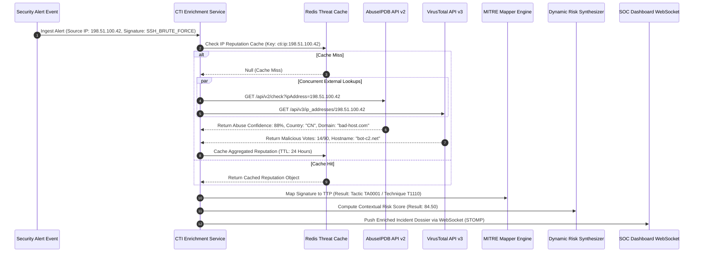
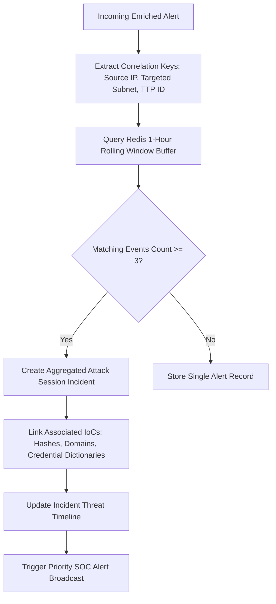
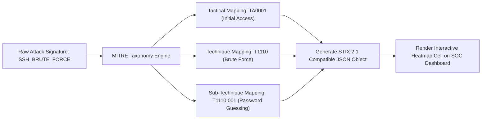
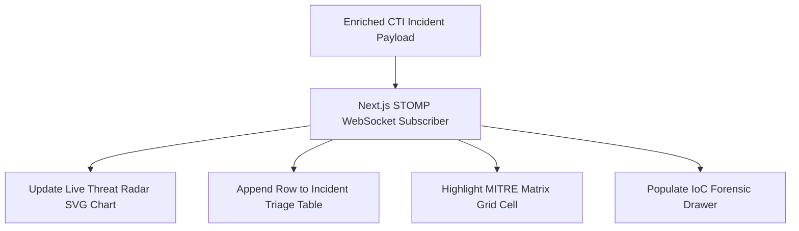
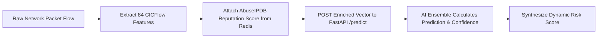
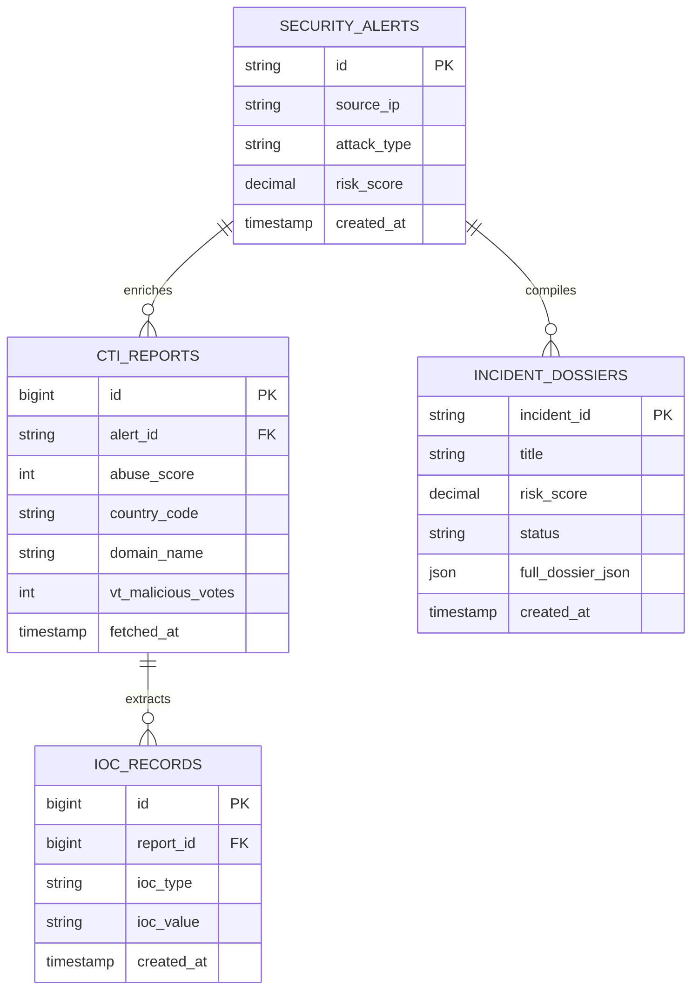
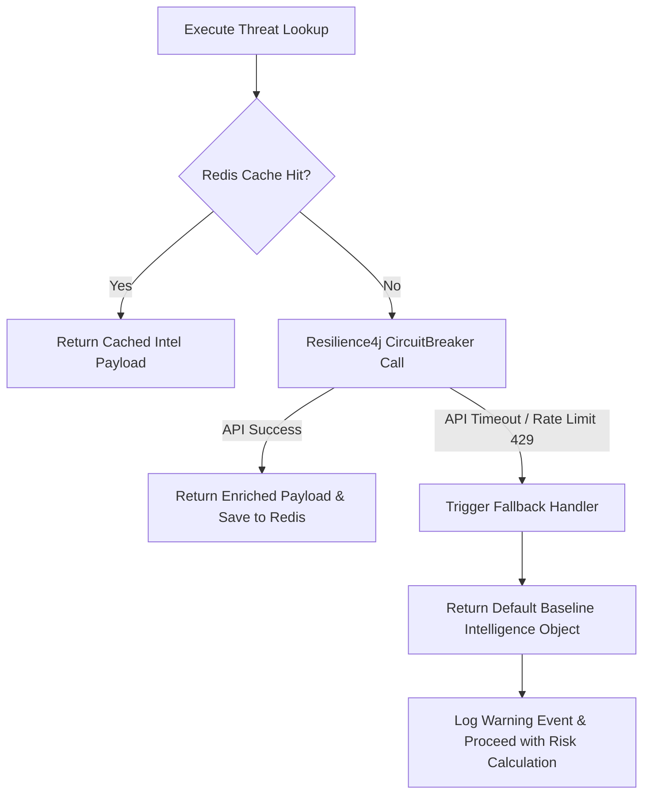

# Cyber Threat Intelligence (CTI) Engine Architecture Specification

## RakshaSphere
### AI-Powered Autonomous Cyber Defense & Self-Healing Network Platform

> **Document Identifier**: `CTI-ARCH-RAKSHASPHERE-2026-V1.0`  
> **Standards Alignment**: `MITRE ATT&CK v14.1, MITRE D3FEND, NIST SP 800-150, STIX 2.1, OWASP`  
> **Primary External APIs**: `VirusTotal API v3, AbuseIPDB API v2, MITRE TAXII`  
> **Classification**: `Official Enterprise Threat Intelligence Engine Specification`

---

## 📑 Table of Contents

1. [Executive Summary](#1-executive-summary)
2. [Threat Intelligence Overview & Intelligence Lifecycle](#2-threat-intelligence-overview--intelligence-lifecycle)
3. [Architectural Diagrams Library](#3-architectural-diagrams-library)
   - [High-Level CTI Subsystem Architecture](#31-high-level-cti-subsystem-architecture)
   - [Threat Enrichment & Incident Generation Sequence](#32-threat-enrichment--incident-generation-sequence)
   - [Threat Correlation Workflow Dataflow](#33-threat-correlation-workflow-dataflow)
   - [MITRE ATT&CK Mapping & Taxonomy Pipeline](#34-mitre-attck-mapping--taxonomy-pipeline)
   - [CTI Component Interaction Diagram](#35-cti-component-interaction-diagram)
   - [SOC Dashboard Intelligence Integration](#36-soc-dashboard-intelligence-integration)
4. [External & Internal Intelligence Sources](#4-external--internal-intelligence-sources)
5. [Threat Enrichment Pipeline Architecture](#5-threat-enrichment-pipeline-architecture)
6. [MITRE ATT&CK Taxonomy & Detection Mapping](#6-mitre-attck-taxonomy--detection-mapping)
7. [Multi-Vector Threat Correlation Engine](#7-multi-vector-threat-correlation-engine)
8. [Transparent Contextual Risk Assessment Formula](#8-transparent-contextual-risk-assessment-formula)
9. [Automated Incident Dossier Generation](#9-automated-incident-dossier-generation)
10. [Indicators of Compromise (IoC) Management](#10-indicators-of-compromise-ioc-management)
11. [AI Engine & Machine Learning Integration](#11-ai-engine--machine-learning-integration)
12. [SOC Operations Console Integration](#12-soc-operations-console-integration)
13. [Relational Database Schema & Data Model](#13-relational-database-schema--data-model)
14. [Security Architecture & Secrets Management](#14-security-architecture--secrets-management)
15. [Structured CTI Logging & Audit Strategy](#15-structured-cti-logging--audit-strategy)
16. [Error Handling, Circuit Breakers & Fallback Logic](#16-error-handling-circuit-breakers--fallback-logic)
17. [Performance, Caching & Rate Limit Strategy](#17-performance-caching--rate-limit-strategy)
18. [CTI Engine Repository Folder Structure](#18-cti-engine-repository-folder-structure)
19. [Quality Assurance & CTI Testing Strategy](#19-quality-assurance--cti-testing-strategy)
20. [Risk Assessment & Mitigation Matrix](#20-risk-assessment--mitigation-matrix)
21. [MVP Capabilities vs. Future Enterprise Scope](#21-mvp-capabilities-vs-future-enterprise-scope)

---

## 1. 🎯 Executive Summary

The **RakshaSphere Cyber Threat Intelligence (CTI) Engine** enriches raw network intrusion alerts with contextual global threat data, correlates multi-stage attack events, maps adversary behaviors to the **MITRE ATT&CK Framework**, and synthesizes dynamic risk metrics to support autonomous self-healing decision-making.

Operating as an integrated subsystem within the Spring Boot Core Backend, the CTI Engine aggregates intelligence from **AbuseIPDB**, **VirusTotal**, and official **MITRE ATT&CK STIX 2.1** datasets, reducing manual analyst triage time from hours to sub-second automated lookups.

```
Raw Alert ➔ AbuseIPDB / VirusTotal ➔ MITRE TTP Mapping ➔ Risk Scoring Formula ➔ Incident Dossier ➔ SOC Feed
```

---

## 2. 🌐 Threat Intelligence Overview & Intelligence Lifecycle

### 2.1 What is Cyber Threat Intelligence (CTI)?
Cyber Threat Intelligence is evidence-based security knowledge—including context, mechanisms, indicators, implications, and actionable advice—about an existing or emerging threat to assets that can be used to inform security decisions.

### 2.2 Why RakshaSphere Integrates CTI
1. **Contextual Augmentation**: Transforming isolated local anomalies (e.g., an internal port scan) into enriched threat incidents (e.g., "Known Chinese Botnet IP targeting SSH via T1110").
2. **Alert Prioritization**: Filtering noise by weighting local alert severity against global reputation scores.
3. **Automated Incident Response**: Supplying high-confidence IoCs directly to the Self-Healing Network Engine for autonomous eBPF/iptables containment.

### 2.3 The 6-Stage Intelligence Lifecycle



---

## 3. 📊 Architectural Diagrams Library

### 3.1 High-Level CTI Subsystem Architecture



---

### 3.2 Threat Enrichment & Incident Generation Sequence



---

### 3.3 Threat Correlation Workflow Dataflow



---

### 3.4 MITRE ATT&CK Mapping & Taxonomy Pipeline



---

### 3.5 CTI Component Interaction Diagram

```mermaid
component
    package "Alert Ingestion" {
        [Security Event Listener]
    }

    package "Threat Intelligence Core" {
        [Enrichment Manager] --> [Cache Controller]
        [Enrichment Manager] --> [AbuseIPDB Client]
        [Enrichment Manager] --> [VirusTotal Client]
        [Enrichment Manager] --> [STIX Taxonomy Mapper]
        [Enrichment Manager] --> [Correlation Engine]
    }

    package "Storage Layer" {
        database "Redis Cache"
        database "MySQL Database"
    }

    [Security Event Listener] ..> [Enrichment Manager] : ApplicationEvent
    [Cache Controller] ..> [Redis Cache] : Jedis Commands
    [Correlation Engine] ..> [MySQL Database] : JPA Persistence
```

---

### 3.6 SOC Dashboard Intelligence Integration



---

## 4. 🔌 External & Internal Intelligence Sources

RakshaSphere integrates three primary intelligence sources in its Minimum Viable Product (MVP) build:

| Intelligence Source | Type | Information Extracted | API Rate Limits & Constraints | Caching Strategy |
| :--- | :--- | :--- | :--- | :--- |
| **AbuseIPDB (v2 API)** | External Commercial / Free API | IP Abuse Confidence Score ($0-100\%$), Country Code, ISP, Domain, Usage Type. | Free Tier: 1,000 requests/day. Strict rate limiting. | Cached in Redis for **24 Hours** (`cti:ip:{ip}`). |
| **VirusTotal (v3 API)** | External Multi-Scanner API | Domain maliciousness ratings, IP reputation, SHA-256 payload file analysis. | Public API: 4 requests/min, 500 requests/day. | Cached in Redis for **24 Hours** (`cti:vt:{hash_or_ip}`). |
| **MITRE ATT&CK (v14.1)**| Internal Local STIX 2.1 Dataset | Tactical mapping, technique descriptions, sub-techniques, recommended mitigation controls. | Static local JSON dataset. Unlimited local queries. | Loaded into memory at backend startup. |

---

## 5. 🔍 Threat Enrichment Pipeline Architecture

```
Alert Ingest ➔ Cache Check ➔ Concurrent API Lookups ➔ MITRE Mapping ➔ Risk Scoring ➔ Incident Dossier
```

1. **Alert Ingestion**: Ingests raw alerts containing `source_ip`, `target_ip`, `target_port`, `protocol`, and `classified_signature`.
2. **Cache Check**: Queries Redis key `cti:ip:{source_ip}`. On cache hit, enrichment completes instantly (< 2ms).
3. **External Lookup Execution**: On cache miss, executes asynchronous concurrent REST queries via Spring `WebClient` to AbuseIPDB and VirusTotal.
4. **Context Synthesis**: Aggregates reputation scores, geo-location data, and domain metadata into a unified `ThreatContext` object.
5. **MITRE ATT&CK Translation**: Resolves signature to standardized STIX 2.1 TTP identifiers (`T1110`, `T1046`).
6. **Risk Score Formulation**: Passes context attributes to the dynamic risk engine to calculate a normalized risk score ($0.00 - 100.00$).

---

## 6. 🛡️ MITRE ATT&CK Taxonomy & Detection Mapping

RakshaSphere correlates classified attack signatures directly to official MITRE ATT&CK Enterprise Matrix v14.1 techniques:

| Local Attack Signature | MITRE Tactic | Tactic ID | MITRE Technique Name | Technique ID |
| :--- | :--- | :--- | :--- | :--- |
| `SSH_BRUTE_FORCE` | Initial Access | `TA0001` | Brute Force | `T1110` |
| `PORT_SCAN_SYN` | Discovery | `TA0007` | Network Service Discovery | `T1046` |
| `HTTP_SQL_INJECTION` | Credential Access | `TA0006` | Exploit Public-Facing Application | `T1190` |
| `DDOS_SYN_FLOOD` | Impact | `TA0040` | Network Denial of Service | `T1498` |
| `COMMAND_EXEC_WGET` | Execution | `TA0002` | Command and Scripting Interpreter | `T1059` |

---

## 7. 🔗 Multi-Vector Threat Correlation Engine

To prevent alert fatigue and compile isolated probes into cohesive incident narratives, the correlation engine links events across five dimensions:

1. **Source IP Grouping**: Aggregates all alerts originating from the same source IP within a rolling 1-hour time window into an `AttackSession`.
2. **Subnet Probing Correlation**: Identifies sequential scans across multiple internal IP targets originating from a single external Class C subnet (`/24`).
3. **Cross-Service Vectoring**: Links initial SSH brute-forcing attempts on port 22 with subsequent HTTP probes on port 80/443 from the same adversary.
4. **Payload Hash Matching**: Correlates file download attempts across different honeypot traps when matching SHA-256 payload hashes are identified.
5. **Behavioral Session Similarity**: Groups sessions demonstrating identical command sequence execution vectors (`uname -a -> wget -> chmod +x -> ./payload`).

---

## 8. 🧮 Transparent Contextual Risk Assessment Formula

To satisfy security audit requirements, RakshaSphere calculates an objective, deterministic dynamic **Risk Score** ($0.00 - 100.00$) for every enriched incident:

$$\text{Risk Score} = \min \left( 100, \, \left[ \frac{\text{Severity (1-10)} \times \text{Confidence (0-1)} \times \text{Asset Weight (1-5)} \times \text{Reputation Multiplier (1.0-2.0)}}{\text{Mitigation Factor (1.0-3.0)}} \right] \times 5 \right)$$

### Formula Component Definitions
- **Severity ($1 - 10$)**: Base attack severity (Port Scan = 3, SSH Brute Force = 7, DDoS = 9).
- **Confidence ($0.0 - 1.0$)**: Probability output from the AI Machine Learning Engine.
- **Asset Weight ($1 - 5$)**: Target asset criticality multiplier (Guest Wi-Fi = 1, Production Database = 5).
- **Reputation Multiplier ($1.0 - 2.0$)**: Derived from AbuseIPDB score ($1.0 + \frac{\text{AbuseScore}\%}{100}$).
- **Mitigation Factor ($1.0 - 3.0$)**: Reduces risk if active firewall drop rules ($1.5$) or honeypot traps ($2.0$) are already containing the source IP.

---

## 9. 📄 Automated Incident Dossier Generation

When a threat event completes correlation and risk evaluation, the CTI Engine generates a structured **Incident Dossier** exported as JSON or PDF:

```json
{
  "incidentId": "INC-2026-0802-8921",
  "title": "High Severity SSH Brute Force & Volumetric Reconnaissance",
  "overallRiskScore": 84.50,
  "status": "CONTAINED",
  "firstSeen": "2026-08-02T15:20:00Z",
  "lastSeen": "2026-08-02T15:22:01Z",
  "adversary": {
    "ipAddress": "198.51.100.42",
    "abuseConfidenceScore": 88,
    "country": "CN",
    "isp": "Example Asia Telecom",
    "domain": "bad-host.net"
  },
  "mitreTaxonomy": {
    "tactic": "Initial Access (TA0001)",
    "technique": "Brute Force (T1110)",
    "subTechnique": "Password Guessing (T1110.001)"
  },
  "indicatorsOfCompromise": [
    { "type": "IPv4", "value": "198.51.100.42" },
    { "type": "SHA-256", "value": "e3b0c44298fc1c149afbf4c8996fb92427ae41e4649b934ca495991b7852b855" }
  ],
  "autonomousActionsTaken": [
    { "action": "EBPF_DRIVER_DROP", "status": "ENFORCED", "timestamp": "2026-08-02T15:22:01.120Z" }
  ],
  "recommendations": [
    "Maintain active eBPF driver drop for 24 hours.",
    "Inspect internal hosts 10.0.1.50 for secondary SSH authentication attempts."
  ]
}
```

---

## 10. 🎯 Indicators of Compromise (IoC) Management

The CTI Engine manages eight core IoC types:

| IoC Type | Extraction Source | Storage Table | Retain Schedule | Primary Usage |
| :--- | :--- | :--- | :--- | :--- |
| **IPv4 / IPv6** | Packet Ingestion / Honeypots | `threat_events` | 90 Days | eBPF/iptables drop enforcement & AbuseIPDB lookups. |
| **SHA-256 Hashes** | Honeypot Payload Uploads | `captured_payloads` | 180 Days | VirusTotal malware hash scanning & threat correlation. |
| **Domains / URLs** | Honeypot Shell `wget`/`curl` | `ioc_records` | 180 Days | Outbound firewall blocklists & C2 identification. |
| **User-Agents** | HTTP Web Honeypots | `ioc_records` | 90 Days | Web Application Firewall (WAF) rule filters. |
| **Credential Pairs**| Honeypot Authentication Logs| `honeypot_credentials`| 180 Days | Password dictionary updating and internal compromise checks. |

---

## 11. 🧠 AI Engine & Machine Learning Integration

The CTI Engine enriches the feature context supplied to the Python FastAPI AI Engine:



---

## 12. 🖥️ SOC Operations Console Integration

The Next.js SOC Console displays threat intelligence via four dedicated UI components:
1. **Threat Intel Detail Drawer**: Slide-out panel showing AbuseIPDB reputation gauges, country flags, ISP details, and VirusTotal detection counts.
2. **Interactive MITRE Heatmap**: Color-coded ATT&CK matrix view highlighting targeted tactics.
3. **Attack Timeline Widget**: Chronological visual timeline plotting correlation events from initial probe to automated containment.
4. **Export Dossier Button**: One-click PDF/JSON export for executive reporting.

---

## 13. 🗄️ Relational Database Schema & Data Model

The CTI Subsystem uses four primary relational tables within the MySQL database:



---

## 14. 🔒 Security Architecture & Secrets Management

> [!CAUTION]
> External Threat Intelligence API Keys (AbuseIPDB, VirusTotal) MUST NEVER be committed to source code repositories.

1. **Secrets Injection**: API keys are loaded at runtime via environment variables (`${ABUSEIPDB_API_KEY}`, `${VIRUSTOTAL_API_KEY}`) and injected into Spring `@Configuration` beans.
2. **Outbound TLS 1.3**: All external REST API calls enforced over HTTPS TLS 1.3 with strict certificate validation.
3. **Data Privacy**: Customer IP addresses are obfuscated or anonymized before submitting queries to public threat databases if privacy mode is enabled.

---

## 15. 📝 Structured CTI Logging & Audit Strategy

All threat intelligence operations are logged in structured JSON format via Logback (`cti.json`):

```json
{
  "timestamp": "2026-08-02T15:22:01.120Z",
  "logLevel": "INFO",
  "subsystem": "CTI_ENGINE",
  "event": "EXTERNAL_LOOKUP_COMPLETE",
  "sourceIp": "198.51.100.42",
  "abuseScore": 88,
  "vtVotes": 14,
  "executionTimeMs": 142,
  "cacheHit": false
}
```

---

## 16. 🚨 Error Handling, Circuit Breakers & Fallback Logic

External Threat Intelligence API calls are protected by **Resilience4j Circuit Breakers**:



---

## 17. ⚡ Performance, Caching & Rate Limit Strategy

1. **Redis Caching**: External API lookups cached in Redis with a 24-hour TTL (`cti:ip:{ip}`). Achieves $> 95\%$ cache hit rate during recurring network scans.
2. **Rate Limit Throttling**: Internal token-bucket limiters prevent exceeding AbuseIPDB (1,000 req/day) and VirusTotal (4 req/min) free tier caps.
3. **Concurrent Processing**: Calls to AbuseIPDB and VirusTotal execute in parallel using Java 21 `CompletableFuture.allOf()` / Virtual Threads.

---

## 18. 📁 CTI Engine Repository Folder Structure

```
backend/src/main/java/com/rakshasphere/
├── controller/
│   └── ThreatIntelController.java   # REST API endpoints for threat lookups & reports
├── service/
│   ├── ThreatIntelService.java      # Master enrichment orchestrator
│   ├── MitreMapperService.java      # STIX 2.1 TAXII taxonomy parser
│   ├── CorrelationService.java      # Multi-vector attack session aggregator
│   └── IncidentReportService.java   # PDF/JSON dossier generation engine
├── integration/
│   ├── AbuseIPDBClient.java         # Spring WebClient for AbuseIPDB API v2
│   └── VirusTotalClient.java        # Spring WebClient for VirusTotal API v3
├── model/entity/
│   ├── CtiReport.java               # JPA entity for threat lookups
│   ├── IocRecord.java               # JPA entity for extracted IoCs
│   └── IncidentDossier.java         # JPA entity for compiled incident reports
└── repository/
    ├── CtiReportRepository.java
    └── IncidentDossierRepository.java
```

---

## 19. 🧪 Quality Assurance & CTI Testing Strategy

1. **Lookup Unit Testing**: Mockito tests verifying Spring WebClient parsing of AbuseIPDB and VirusTotal JSON payloads.
2. **Circuit Breaker Testing**: Synthetic network drop tests verifying Resilience4j fallbacks execute within $< 2,000\text{ms}$.
3. **MITRE Mapping Validation**: Automated assertions confirming signature mappings correspond to valid MITRE ATT&CK v14.1 IDs.

---

## 20. ⚠️ Risk Assessment & Mitigation Matrix

| Risk Domain | Identified Risk | Impact | Architectural Mitigation Strategy |
| :--- | :--- | :--- | :--- |
| **API Rate Limit Exceeded**| External APIs block requests due to rate limits. | High | Cache lookups in Redis for 24h and enforce internal token bucket rate limiters. |
| **External API Downtime** | AbuseIPDB or VirusTotal server outages. | Medium | Resilience4j Circuit Breakers with graceful fallback to local baseline intelligence. |
| **False Intelligence** | External feed flags legitimate IP as malicious. | High | Combine local AI confidence scores with external intelligence; allow manual SOC analyst overrides. |
| **Outdated STIX Taxonomy**| Local MITRE dataset becomes outdated. | Low | Load STIX 2.1 JSON datasets dynamically from version-controlled resources. |

---

## 21. 🔮 MVP Capabilities vs. Future Enterprise Scope

| CTI Subsystem Feature | Minimum Viable Product (MVP) | Future Enterprise Scope |
| :--- | :--- | :--- |
| **Intelligence Feeds** | AbuseIPDB API v2, VirusTotal API v3, Local MITRE ATT&CK. | AlienVault OTX, MISP, OpenCTI, Commercial TAXII Feeds. |
| **Taxonomy Standard** | Static STIX 2.1 JSON file mapping. | Full dynamic STIX 2.1 / TAXII 2.1 server integration. |
| **Correlation** | Single IP / rolling 1-hour session grouping. | Graph Neural Network (GNN) multi-tenant cross-cluster correlation. |
| **SOAR Integration** | Local eBPF/iptables self-healing execution. | Outbound webhooks for Splunk SOAR, Palo Alto Cortex XSOAR. |
