# RakshaSphere - Enterprise System Architecture Specification

> **AI-Powered Autonomous Cyber Defense & Self-Healing Network Platform**  
> **Document Version**: `v1.0.0` | **Status**: `Approved Architecture Baseline` | **Classification**: `Technical Specification`

---

## 📑 Table of Contents

1. [Executive Summary](#-executive-summary)
2. [Project Vision](#-project-vision)
3. [Architecture Goals](#-architecture-goals)
4. [Core Design Principles](#-core-design-principles)
5. [System Architecture Overview](#-system-architecture-overview)
6. [Architectural Diagrams](#-architectural-diagrams)
   - [High-Level System Architecture](#1-high-level-system-architecture)
   - [System Component Diagram](#2-system-component-diagram)
   - [C4 Container Diagram](#3-c4-container-diagram)
   - [Deployment Topology Diagram](#4-deployment-topology-diagram)
   - [End-to-End Sequence Diagram](#5-end-to-end-sequence-diagram)
   - [Network Topology Diagram](#6-network-topology-diagram)
   - [Request Flow Pipeline](#7-request-flow-pipeline)
   - [Module Interaction Matrix](#8-module-interaction-matrix)
   - [Authentication & RBAC Sequence](#9-authentication--rbac-sequence)
   - [Data Flow Diagram (DFD Level 1)](#10-data-flow-diagram-dfd-level-1)
7. [Detailed Module Specifications](#-detailed-module-specifications)
   - [1. Frontend Presentation Module](#1-frontend-presentation-module)
   - [2. Backend Core Module](#2-backend-core-module)
   - [3. Artificial Intelligence Engine](#3-artificial-intelligence-engine)
   - [4. Database Subsystem](#4-database-subsystem)
   - [5. IoT Security Agent](#5-iot-security-agent)
   - [6. Threat Intelligence Subsystem](#6-threat-intelligence-subsystem)
   - [7. Adaptive Honeypot Subsystem](#7-adaptive-honeypot-subsystem)
   - [8. Self-Healing Network Engine](#8-self-healing-network-engine)
   - [9. Security Operations Center (SOC) Console](#9-security-operations-center-soc-console)
8. [Multi-Tier Architectural Layering](#-multi-tier-architectural-layering)
9. [Inter-Module Communication Protocols](#-inter-module-communication-protocols)
10. [Authentication & Authorization Architecture](#-authentication--authorization-architecture)
11. [Security Architecture & Defensive Controls](#-security-architecture--defensive-controls)
12. [Artificial Intelligence & Machine Learning Architecture](#-artificial-intelligence--machine-learning-architecture)
13. [Threat Intelligence & Contextual Enrichment](#-threat-intelligence--contextual-enrichment)
14. [Self-Healing & Autonomous Orchestration Architecture](#-self-healing--autonomous-orchestration-architecture)
15. [IoT Edge & Mesh Architecture](#-iot-edge--mesh-architecture)
16. [Deployment & Infrastructure Architecture](#-deployment--infrastructure-architecture)
17. [Repository & Directory Responsibilities](#-repository--directory-responsibilities)
18. [Architectural Trade-offs & Technology Decisions](#-architectural-trade-offs--technology-decisions)
19. [Non-Functional Requirements (NFRs)](#-non-functional-requirements-nfrs)
20. [Risk Assessment & Mitigation Matrix](#-risk-assessment--mitigation-matrix)
21. [Future Architectural Scope](#-future-architectural-scope)

---

## 1. 🎯 Executive Summary

**RakshaSphere** is an enterprise-grade autonomous cyber defense and self-healing platform engineered to address the critical gaps in modern security operations centers (SOCs): manual intervention latency, alert fatigue, static signature limitations, and uncoordinated containment.

By combining low-latency packet flow analysis, machine learning anomaly detection, dynamic honeypot traps, threat intelligence aggregation (AbuseIPDB, VirusTotal, MITRE ATT&CK), automated risk score synthesis, and autonomous network remediation (eBPF/iptables), RakshaSphere delivers a **closed-loop security architecture** capable of detecting and containing cyber threats within milliseconds.

```
Incoming Flow ➔ Packet Extraction ➔ AI Inference ➔ Deception/Intel ➔ Risk Score ➔ Self-Healing Drop ➔ Live SOC Alert
```

> [!IMPORTANT]
> RakshaSphere is designed as a modular, containerized multi-tier solution capable of deploying across edge gateways, local enterprise subnets, and cloud infrastructure while providing centralized command and control.

---

## 2. 👁️ Project Vision

The vision of RakshaSphere is to pioneer an **Autonomous Cyber Defense Framework** that converts security postures from reactive incident handling to proactive self-defending networks. The platform isolates compromised assets, tricks attackers into ephemeral deception traps, enriches threat vectors with global intelligence, and heals network segments without human intervention—all while keeping SOC analysts informed through real-time WebSockets.

---

## 3. 🎯 Architecture Goals

1. **Sub-Second Threat Detection & Containment**: Process incoming packet windows, execute multi-model ML inference, evaluate risk metrics, and enforce network blocking rules in under 150 milliseconds.
2. **Zero-Day Resilience**: Utilize deep autoencoder reconstruction error thresholding alongside supervised classifiers to flag uncatalogued zero-day exploits.
3. **Active Adversary Deception**: Transparently divert suspicious probing sessions away from core production databases into dynamic Docker honeypots.
4. **Deterministic Risk Scoring**: Standardize threat prioritization using a mathematical formula combining severity, confidence, asset weight, and mitigation status.
5. **Architectural Decoupling**: Maintain clear isolation between ingestion sensors, analytical AI engines, business backend services, persistent storage, and user interfaces.

---

## 4. 💎 Core Design Principles

| Principle | Engineering Strategy | Architectural Implementation |
| :--- | :--- | :--- |
| **Scalability** | Horizontal microservice scaling & asynchronous messaging | Independent deployment of Python FastAPI nodes, stateless Spring Boot instances, and read-replica MySQL databases. |
| **Modularity** | Decoupled functional domains | Loose coupling via REST APIs, gRPC, STOMP WebSockets, and Redis message channels. |
| **Security** | Defense-in-depth & Zero Trust | OAuth2/JWT authentication, RBAC, TLS 1.3 in transit, AES-256 at rest, eBPF driver isolation, and cryptographic audit logs. |
| **Reliability** | Fault tolerance & graceful degradation | Circuit breakers (Resilience4j), fallback rules for threat intel timeouts, health check heartbeats. |
| **Maintainability** | Clean Code & Domain-Driven Design (DDD) | Strict layer isolation, dependency injection, comprehensive OpenAPI specs, and uniform logging standards. |
| **Extensibility** | Plugin-oriented integration | Abstract interfaces for adding new honeypot trap types, additional AI models, or third-party threat intel APIs. |
| **Performance** | High throughput & sub-millisecond execution | Java 21 Virtual Threads (Project Loom), eBPF XDP packet filtering, Redis token bucket caching, and optimized NumPy vector math. |

---

## 5. 🏗️ System Architecture Overview

RakshaSphere is divided into five core operational planes:

1. **Edge & Ingestion Plane**: Ingests raw network traffic via PCAP/Scapy sensors and IoT Edge Daemons, transforming raw packets into 84-feature CICFlow vectors.
2. **Artificial Intelligence Plane**: Runs real-time inference on flow features using a multi-model ensemble (Random Forest + XGBoost + Deep Autoencoders) hosted on a Python FastAPI server.
3. **Core Business & Orchestration Plane**: Built on Spring Boot 3 / Java 21, managing state, executing risk scoring algorithms, correlating MITRE ATT&CK TTPs, querying threat intel, and controlling honeypot life cycles.
4. **Autonomous Response Plane**: Executes dynamic host firewall rules (`iptables`), socket termination daemons, and kernel driver drops (`eBPF/XDP`).
5. **Presentation & Operations Plane**: Single-page Next.js 14 SOC Dashboard streaming live security events, honeypot telemetry, and network topology maps over STOMP WebSockets.

---

## 6. 📊 Architectural Diagrams

### 1. High-Level System Architecture

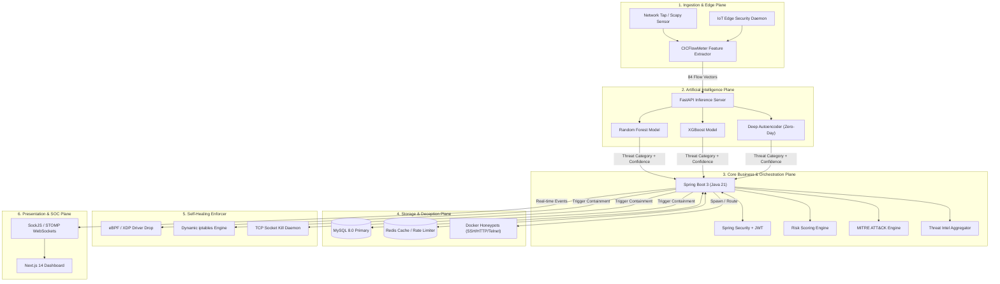

---

### 2. System Component Diagram

```mermaid
component
    package "Ingestion Component" {
        [Packet Sniffer] --> [Flow Aggregator]
    }

    package "AI Component" {
        [Feature Normalizer] --> [Ensemble Predictor]
    }

    package "Backend Core Component" {
        [Security Event Bus] --> [Risk Synthesizer]
        [Security Event Bus] --> [MITRE Taxonomy Mapper]
        [Security Event Bus] --> [Self-Healing Controller]
    }

    package "Storage Component" {
        database "MySQL Database"
        database "Redis Cache"
    }

    package "Deception Component" {
        [Trap Orchestrator] --> [Container Decoys]
    }

    package "UI Component" {
        [SOC Radar View]
        [Alert Timeline]
    }

    [Flow Aggregator] ..> [Feature Normalizer] : HTTP REST
    [Ensemble Predictor] ..> [Security Event Bus] : JSON Payload
    [Self-Healing Controller] ..> [MySQL Database] : JPA Write
    [Self-Healing Controller] ..> [Container Decoys] : Docker Socket API
    [Security Event Bus] ..> [SOC Radar View] : WebSockets
```

---

### 3. C4 Container Diagram

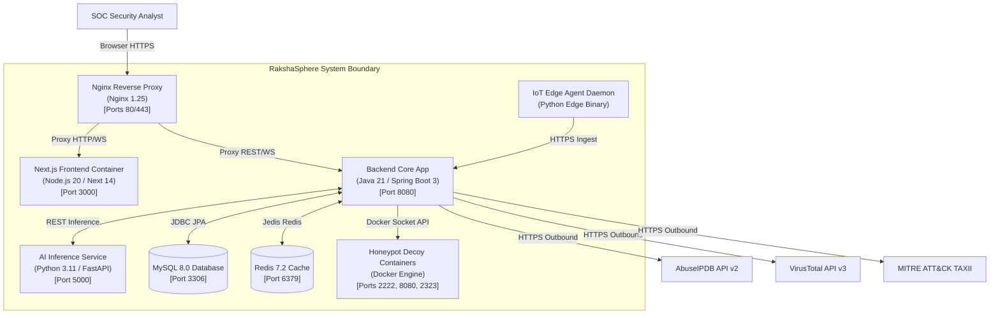

---

### 4. Deployment Topology Diagram

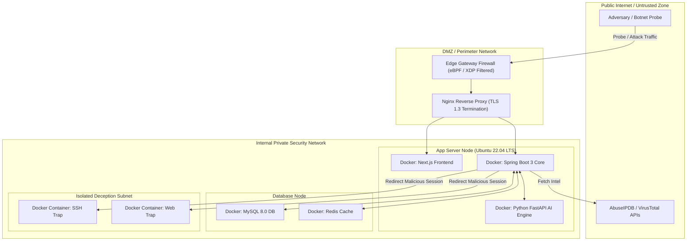

---

### 5. End-to-End Sequence Diagram

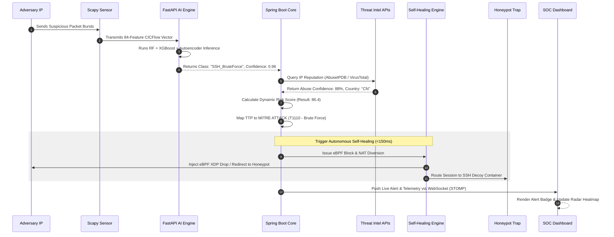

---

### 6. Network Topology Diagram

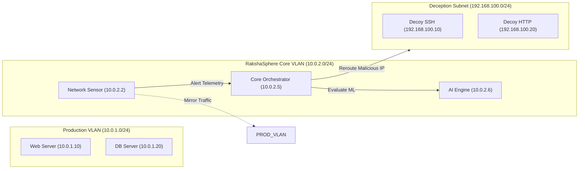

---

### 7. Request Flow Pipeline

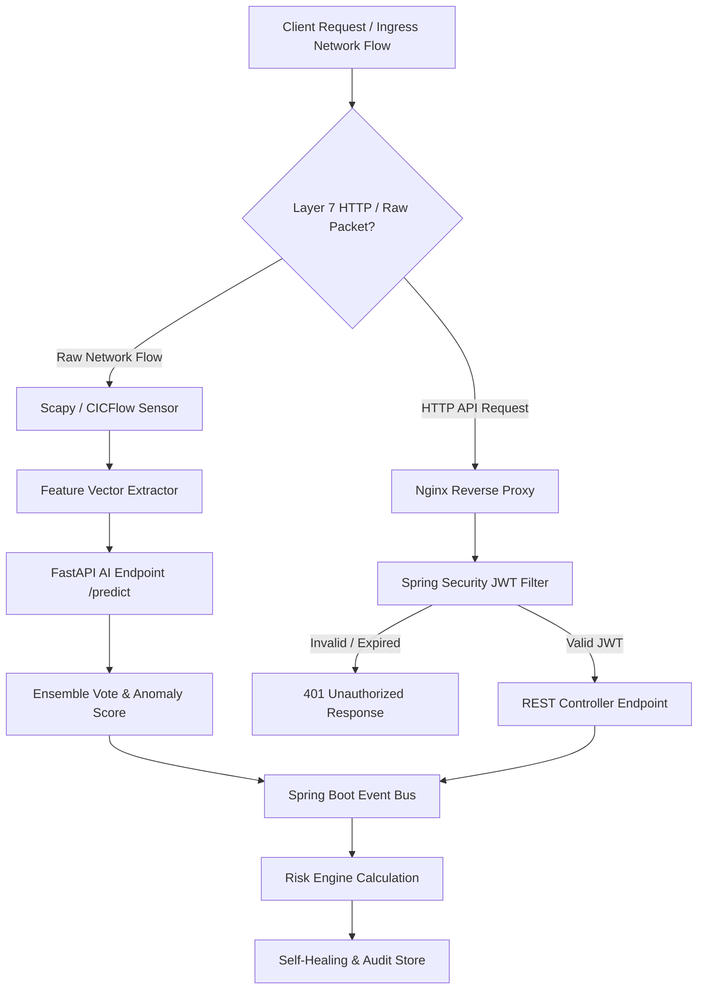

---

### 8. Module Interaction Matrix

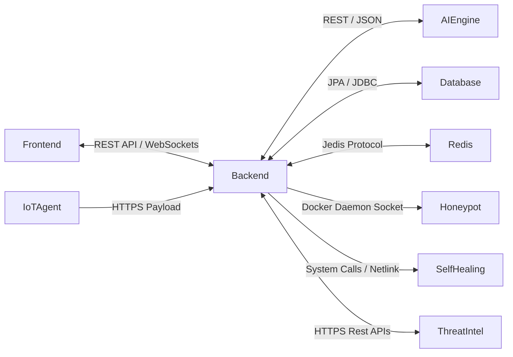

---

### 9. Authentication & RBAC Sequence

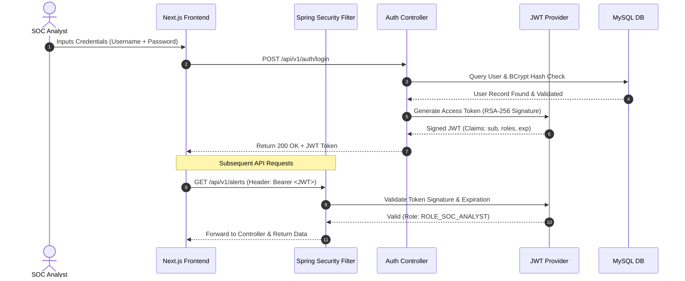

---

### 10. Data Flow Diagram (DFD Level 1)

```mermaid
flowchart TD
    ExtNetwork(("External Network / Attacker"))
    Process_1["1.0 Capture & Extract Flow Features"]
    Process_2["2.0 ML Classification & Anomaly Detection"]
    Process_3["3.0 Threat Intel Enrichment & Risk Scoring"]
    Process_4["4.0 Self-Healing Execution & Deception"]
    Process_5["5.0 SOC Dashboard Visualization"]

    Store_Alerts[[(D1) Security Alerts Store]]
    Store_Audit[[(D2) Audit Trail Store]]
    Store_Intel[[(D3) Threat Intel Cache]]

    ExtNetwork -->|Raw Packets| Process_1
    Process_1 -->|84 Feature Array| Process_2
    Process_2 -->|Attack Label + Confidence| Process_3
    Process_3 <-->|Query / Save Rep| Store_Intel
    Process_3 -->|Risk Score + TTP| Process_4
    Process_3 -->|Write Alert| Store_Alerts
    Process_4 -->|Enforce iptables / eBPF| ExtNetwork
    Process_4 -->|Write Action Log| Store_Audit
    Store_Alerts -->|Stream Data| Process_5
    Store_Audit -->|Stream Data| Process_5
```

---

## 7. 🧩 Detailed Module Specifications

### 1. Frontend Presentation Module
- **Responsibilities**: Provides an intuitive, high-performance user interface for SOC analysts, displaying live telemetry, risk matrices, honeypot sessions, and system configuration screens.
- **Inputs**: WebSocket STOMP messages, user interaction events, REST API response payloads.
- **Outputs**: Formatted React UI components, network topology graphs, manual override REST requests.
- **Dependencies**: React 18, Next.js 14, Tailwind CSS, Lucide React, Recharts, SockJS-client, StompJS.
- **Internal Components**:
  - `AlertFeedComponent`: Renders incoming real-time security events.
  - `MitreMatrixComponent`: Interactive ATT&CK heatmaps.
  - `HoneypotTerminal`: Web console streaming raw keystrokes from deception containers.
  - `TopologyGraph`: Canvas view of internal assets and network nodes.
- **Future Expansion**: Add mobile PWA notifications and multi-tenant branding.

---

### 2. Backend Core Module
- **Responsibilities**: Acts as the central orchestrator of the system. Manages authentication, routes requests, processes security events, calculates risk scores, queries external APIs, and invokes self-healing actions.
- **Inputs**: AI model predictions, IoT agent telemetry, REST HTTP client requests, external threat intel responses.
- **Outputs**: Database entity persistence, WebSocket event broadcasts, Docker API calls, eBPF/iptables system commands.
- **Dependencies**: Java 21, Spring Boot 3.2, Spring Security, Hibernate ORM, Nimbus JWT, Resilience4j.
- **Internal Components**:
  - `SecurityEventBus`: Internal event handling using Spring `@EventListener` / ApplicationEventPublisher.
  - `RiskScoringEngine`: Algorithmic evaluation of dynamic threat severity.
  - `MitreMapper`: Translates attack signatures into STIX 2.1 ATT&CK TTP IDs.
  - `SelfHealingOrchestrator`: Translates risk events into OS-level containment rules.
- **Future Expansion**: Migration from monolithic event bus to Apache Kafka / RabbitMQ cluster.

---

### 3. Artificial Intelligence Engine
- **Responsibilities**: Performs real-time feature normalization, signature classification, and autoencoder anomaly detection on network flow vectors.
- **Inputs**: JSON payloads containing 84-feature arrays from CICFlowMeter/Scapy sensors.
- **Outputs**: JSON objects containing `attack_type`, `confidence_score`, `is_anomaly`, and `reconstruction_mse`.
- **Dependencies**: Python 3.11, FastAPI, Scikit-learn, TensorFlow 2.15, NumPy, Pandas, Joblib.
- **Internal Components**:
  - `FeatureScaler`: Standardizes raw flow metrics using saved MinMaxScaler pipelines.
  - `RandomForestClassifier`: Identifies known attack patterns (DDoS, Scan, BruteForce).
  - `XGBoostEngine`: High-speed multi-class classification model.
  - `AutoencoderDetector`: Deep neural network calculating MSE reconstruction loss for zero-day detection.
- **Future Expansion**: GPU-accelerated TensorRT inference for 10Gbps+ pipe monitoring.

---

### 4. Database Subsystem
- **Responsibilities**: Provides persistent, transactional relational storage for user credentials, security alerts, asset metadata, risk histories, and audit trails.
- **Inputs**: JDBC queries and ORM operations from Spring Boot backend.
- **Outputs**: Relational query result sets, index hits, audit verification records.
- **Dependencies**: MySQL 8.0 Server, Redis 7.2 (Caching & Rate Limiting).
- **Internal Components**:
  - `users`: User identity and RBAC storage.
  - `security_alerts`: Primary log of all classified intrusion events.
  - `asset_inventory`: Criticality weighting catalog for network assets.
  - `audit_trail`: Cryptographically chained action history.
- **Future Expansion**: Automated partitioning of historical log tables by month/year.

---

### 5. IoT Security Agent
- **Responsibilities**: Lightweight daemon executing on edge gateways and IoT nodes to capture socket headers, monitor local network states, and enforce edge isolation commands.
- **Inputs**: Local network adapter interfaces (`eth0`, `wlan0`), command instructions from Central Backend.
- **Outputs**: Compressed HTTP telemetry posts, local `iptables` drop execution.
- **Dependencies**: Python 3.11, `scapy`, `requests`, system `iptables`.
- **Internal Components**:
  - `PacketSniffer`: Low-overhead socket filter.
  - `HeartbeatSender`: Telemetry ping reporter.
  - `EdgeEnforcer`: Local host firewall rule applicator.
- **Future Expansion**: Compilation into native C / Rust binary for microcontrollers (ESP32 / ARM Cortex-M).

---

### 6. Threat Intelligence Subsystem
- **Responsibilities**: Queries external reputation databases (AbuseIPDB, VirusTotal) and normalizes threat data against MITRE ATT&CK taxonomy.
- **Inputs**: Malicious source IP addresses, domain names, file hashes.
- **Outputs**: Enriched threat objects containing abuse confidence percentage, country codes, ISP details, and STIX TTP mappings.
- **Dependencies**: Spring WebClient, Jackson JSON parser, MITRE ATT&CK STIX 2.1 dataset.
- **Internal Components**:
  - `AbuseIPDBClient`: Asynchronous API integration wrapper.
  - `VirusTotalClient`: Hash/Domain lookup client.
  - `StixTaxonomyParser`: Local JSON parser mapping signatures to MITRE IDs.
- **Future Expansion**: Custom STIX/TAXII feed ingestion from private enterprise SIEMs.

---

### 7. Adaptive Honeypot Subsystem
- **Responsibilities**: Manages dynamic deception environments, instantiating decoy Docker containers and managing transparent network NAT redirection.
- **Inputs**: Containment signals from Backend Core specifying target protocol (SSH, HTTP, Telnet).
- **Outputs**: Active trap containers, captured keystrokes, downloaded payload binaries.
- **Dependencies**: Docker Engine API (`docker-java` client), Linux `iptables` PREROUTING NAT.
- **Internal Components**:
  - `TrapManager`: Docker socket controller spinning up container instances.
  - `NatRedirector`: Modifies host PREROUTING chains to route attacker IPs to decoy container ports.
  - `ForensicLogger`: Ingests container stdout streams to log attacker commands.
- **Future Expansion**: High-interaction virtual machine honeypots using QEMU/KVM.

---

### 8. Self-Healing Network Engine
- **Responsibilities**: Executes low-latency autonomous network containment based on validated risk scores.
- **Inputs**: Automated mitigation instructions (IP, Target Interface, Action Type).
- **Outputs**: Applied kernel filters, killed TCP sockets, updated host firewall rules.
- **Dependencies**: Linux eBPF / XDP bytecode, `iptables`, `tcpkill` / `ss` utilities.
- **Internal Components**:
  - `EbpfLoader`: Compiles and attaches XDP packet drop bytecodes to network interfaces.
  - `IptablesController`: Appends dynamic drop rules to input/forward chains.
  - `SocketKiller`: Sends TCP RST packets to instantly tear down active malicious connections.
- **Future Expansion**: eBPF-based stateful connection tracking and automated VLAN tagging.

---

### 9. Security Operations Center (SOC) Console
- **Responsibilities**: Aggregates all system insights into a visual dashboard for human operator monitoring.
- **Inputs**: WebSockets STOMP subscription streams (`/topic/alerts`, `/topic/honeypot`, `/topic/healing`).
- **Outputs**: Rendered UI widgets, alert triage actions, configuration updates.
- **Dependencies**: Next.js App Router, Tailwind CSS, Recharts.
- **Internal Components**:
  - `RealtimeRadar`: Live SVG chart showing attack directions and frequencies.
  - `AuditLogViewer`: Searchable grid of system self-healing actions.
  - `SystemHealthWidget`: Monitored metrics of CPU, Memory, and DB pool states.
- **Future Expansion**: Integrated SIEM log export (Syslog / CEF format).

---

## 8. 🏢 Multi-Tier Architectural Layering

```
+-----------------------------------------------------------------------+
| 1. PRESENTATION LAYER (Next.js 14 / React 18 / Tailwind CSS)          |
+-----------------------------------------------------------------------+
                                   | HTTP REST / WebSockets (STOMP)
+-----------------------------------------------------------------------+
| 2. API & GATEWAY LAYER (Spring Security / Nginx Proxy / JWT Auth)     |
+-----------------------------------------------------------------------+
                                   | Controller / DTO Binding
+-----------------------------------------------------------------------+
| 3. BUSINESS LOGIC LAYER (Spring Boot Services / Risk Engine / MITRE) |
+-----------------------------------------------------------------------+
             | REST JSON             | JPA ORM          | eBPF / Syscall
+--------------------------+  +-------------------+  +------------------+
| 4. AI INFERENCE LAYER    |  | 5. PERSISTENCE    |  | 6. INFRASTRUCTURE|
| (Python FastAPI / TF /   |  | (MySQL 8.0 /      |  | (Linux Kernel /  |
| Scikit-learn Models)     |  |  Redis Cache)     |  |  eBPF / Docker)  |
+--------------------------+  +-------------------+  +------------------+
```

---

## 9. 🔄 Inter-Module Communication Protocols

| Source Module | Target Module | Protocol / Medium | Payload Format | Sync / Async |
| :--- | :--- | :--- | :--- | :--- |
| **Network Sensor** | **AI Engine** | HTTP REST (`/predict`) | JSON (84 Feature Vector) | Synchronous |
| **AI Engine** | **Backend Core** | HTTP REST (`/api/v1/telemetry`) | JSON (Classification + MSE) | Synchronous |
| **Backend Core** | **MySQL Database**| JDBC (HikariCP) | SQL Binary Protocol | Synchronous |
| **Backend Core** | **Redis Cache** | Jedis / RESP | Binary Key-Value | Synchronous |
| **Backend Core** | **Threat Intel** | HTTPS REST | JSON (API Standard) | Asynchronous |
| **Backend Core** | **Honeypot** | UNIX Socket (`/var/run/docker.sock`) | Docker API Spec | Synchronous |
| **Backend Core** | **Self-Healing**| Local Subprocess / Netlink | C Bytecode / Syscall | Synchronous |
| **Backend Core** | **SOC Frontend** | WebSockets (SockJS/STOMP) | JSON Frame Broadcast | Asynchronous |

---

## 10. 🔑 Authentication & Authorization Architecture

RakshaSphere implements a stateless **JWT (JSON Web Token)** authentication scheme managed by **Spring Security 6**.

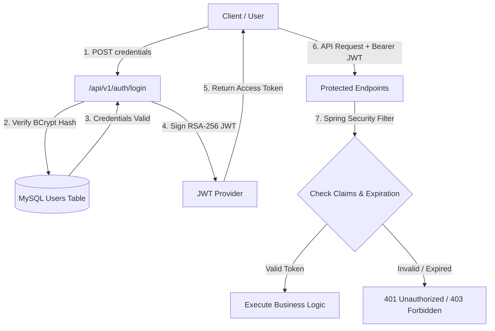

### Role-Based Access Control (RBAC) Matrix

| Role | Access Scope | Allowed Operations |
| :--- | :--- | :--- |
| `ROLE_ADMIN` | Full System Access | User management, system configuration, rule overrides, full manual control. |
| `ROLE_SOC_ANALYST` | Operations & Triage | View alert feeds, inspect honeypot sessions, trigger manual remediation, export reports. |
| `ROLE_USER` | Read-Only Monitoring | View high-level executive dashboards and risk scores only. |

---

## 11. 🛡️ Security Architecture & Defensive Controls

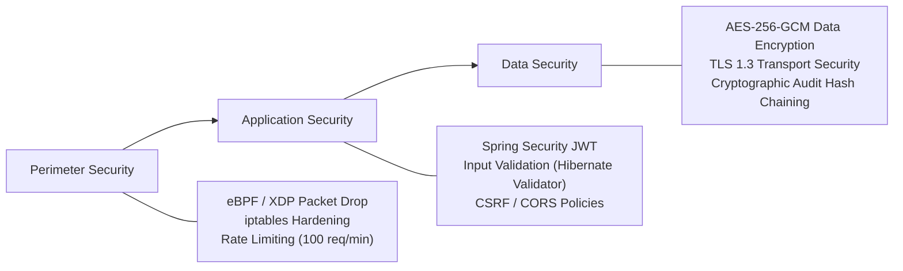

1. **Input Sanitation & Injection Protection**: All API DTOs are validated using JSR-380 Hibernate Validator annotations (`@NotNull`, `@Size`, `@Pattern`). Prepared statements via Spring Data JPA eliminate SQL injection risks.
2. **Rate Limiting**: Redis-backed Token Bucket algorithm caps API traffic per IP address to prevent brute-force or DoS attacks against internal controllers.
3. **Cryptographic Audit Log Chaining**: Audit records contain SHA-256 hashes linking each log entry to the hash of the preceding entry ($\text{Hash}_n = \text{SHA256}(\text{Data}_n \parallel \text{Hash}_{n-1})$), providing tamper-evident log integrity.

---

## 12. 🧠 Artificial Intelligence & Machine Learning Architecture

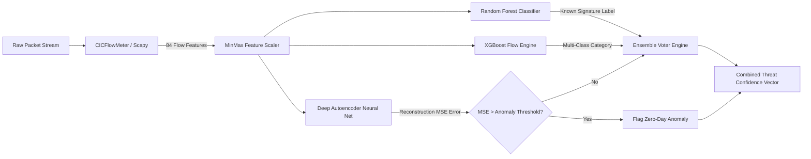

### Machine Learning Model Specifications

1. **Random Forest Classifier**: Supervised model trained on CIC-IDS2017 dataset featuring 100 decision trees. Captures non-linear feature relationships for known attack profiles (DDoS, SYN Floods, Port Scans).
2. **XGBoost Engine**: High-performance gradient boosted decision trees optimized for rapid classification of multi-class intrusion types.
3. **Deep Autoencoder (Zero-Day Detector)**:
   - **Input/Output Dimensionality**: 84 Features
   - **Hidden Architecture**: `84 -> 64 -> 32 -> 8 (Bottleneck) -> 32 -> 64 -> 84`
   - **Loss Function**: Mean Squared Error (MSE)
   - **Logic**: Trained exclusively on benign network traffic. When an uncatalogued exploit pattern is introduced, the autoencoder fails to reconstruct the input accurately, yielding a high MSE spike that flags a Zero-Day Anomaly.

---

## 13. 🌐 Threat Intelligence & Contextual Enrichment

RakshaSphere enriches raw local threat events with global security context using an automated pipeline:

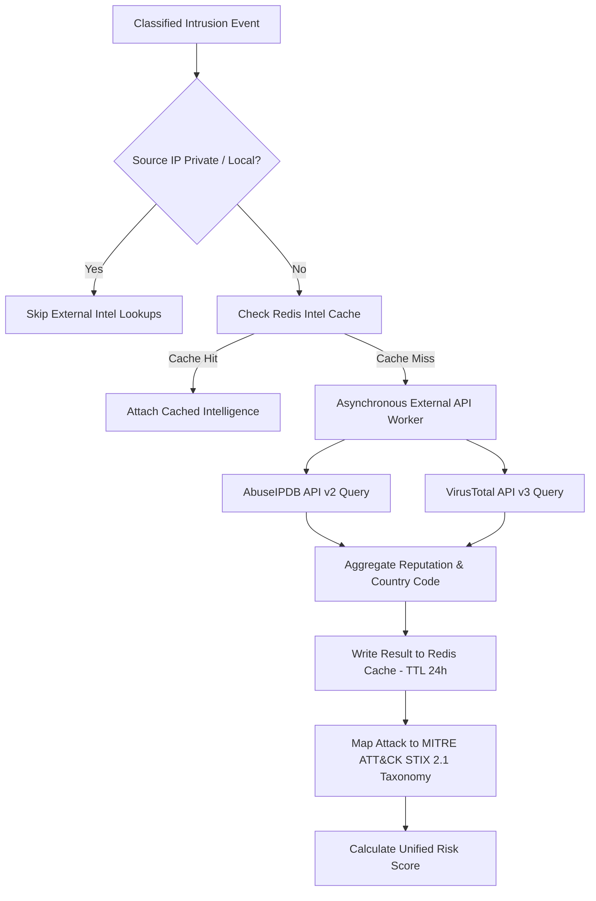

---

## 14. 🔄 Self-Healing & Autonomous Orchestration Architecture

The Self-Healing Engine operates on a closed feedback loop that executes automated containment when threat risk scores surpass user-defined operational thresholds.

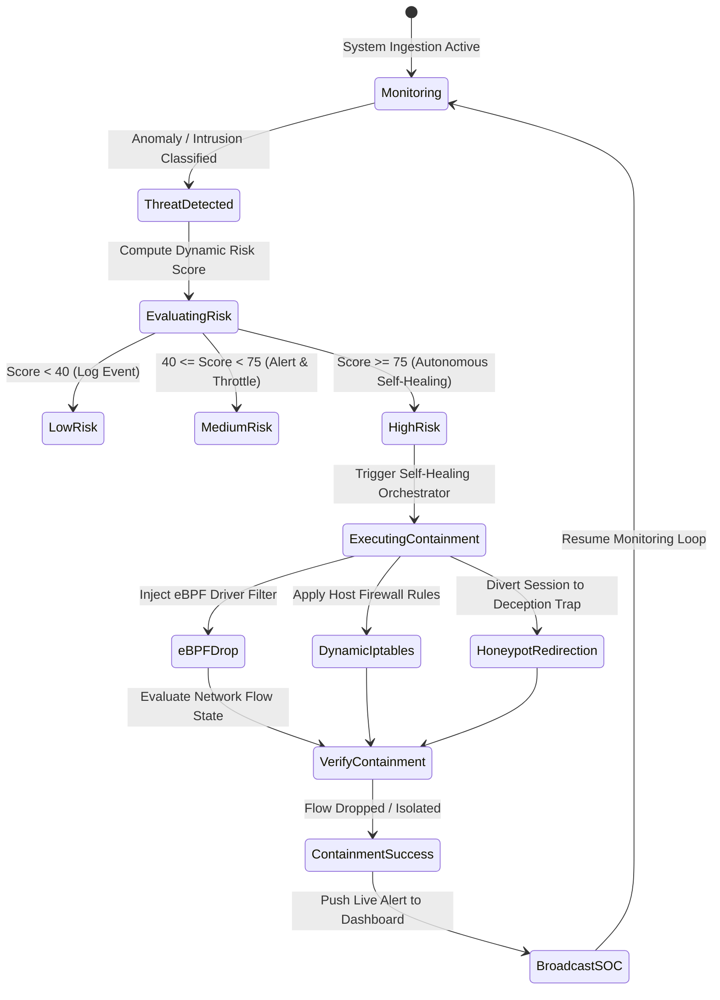

---

## 15. 📟 IoT Edge & Mesh Architecture

To secure resource-constrained IoT gateways and edge devices, RakshaSphere deploys a lightweight edge daemon (`iot-agent`).

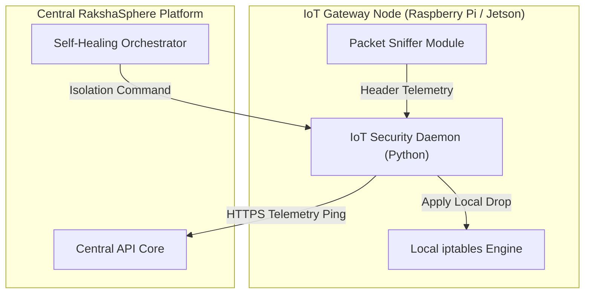

---

## 16. 🐳 Deployment & Infrastructure Architecture

RakshaSphere utilizes Docker and Docker Compose for unified multi-container orchestration.

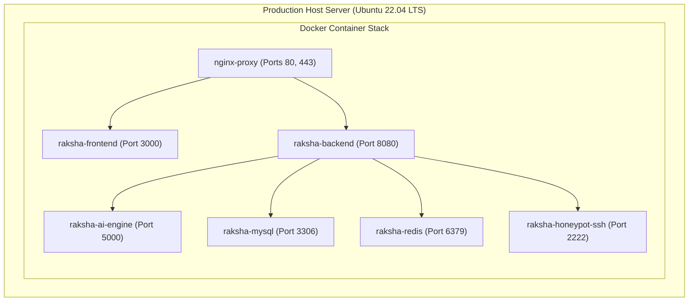

### GitHub Actions CI/CD Pipeline Workflow

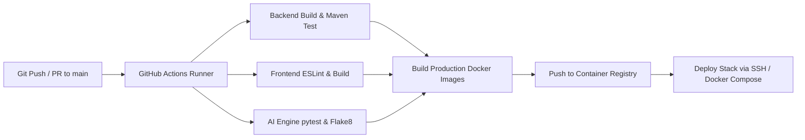

---

## 17. 📁 Repository & Directory Responsibilities

| Directory | Core Purpose & Technical Scope |
| :--- | :--- |
| **`.github/`** | Contains GitHub Actions CI/CD workflow manifests (`backend-ci.yml`, `frontend-ci.yml`, `ai-engine-ci.yml`), issue templates, and PR guidelines. |
| **`frontend/`** | Next.js 14 Web Application containing App Router page components, Tailwind CSS styling configurations, custom React hooks, and WebSocket connection wrappers. |
| **`backend/`** | Enterprise Java 21 / Spring Boot 3 microservice source code, including security filters, REST controllers, JPA domain entities, risk scoring services, and Docker API integrations. |
| **`database/`** | Relational database bootstrap scripts (`init.sql`) and Flyway migration scripts defining schema structures, table indexes, and seed datasets. |
| **`ai-engine/`** | Python machine learning service containing FastAPI server endpoints (`inference_server.py`), pre-trained binary models (`.pkl`, `.h5`), feature scaling modules, and model training pipelines. |
| **`iot-agent/`** | Lightweight edge security daemon intended for execution on edge nodes to sniff packet headers and enforce local network containment commands. |
| **`docker/`** | Production and development Docker Compose deployment files (`docker-compose.yml`, `docker-compose.dev.yml`), Nginx reverse proxy configurations, and environment template files (`.env.example`). |
| **`docs/`** | Master technical specification library, including system architecture, API specifications, database schema diagrams, testing runbooks, security policies, and AI model documentation. |

---

## 18. ⚖️ Architectural Trade-offs & Technology Decisions

### 1. Java 21 / Spring Boot vs. Node.js / Express for Backend Core
- **Decision**: Selected **Java 21 / Spring Boot 3**.
- **Rationale**: Spring Boot provides enterprise-grade thread safety, robust dependency injection, native integration with Spring Security/RBAC, and superior multi-threading via Java 21 Virtual Threads (Project Loom). Node.js single-threaded event loops risk blocking during heavy multi-socket state processing.

### 2. Next.js 14 (App Router) vs. Plain React SPA
- **Decision**: Selected **Next.js 14**.
- **Rationale**: Next.js combines Server-Side Rendering (SSR) for static dashboard layouts with client-side hydration for dynamic WebSocket telemetry streaming, providing optimal page load performance and modern modular component architecture.

### 3. MySQL 8.0 vs. MongoDB / PostgreSQL
- **Decision**: Selected **MySQL 8.0**.
- **Rationale**: Security audit logs, user RBAC privileges, and alert histories require strict ACID compliance and explicit relational foreign-key constraints. PostgreSQL is a viable alternative, but MySQL 8.0 offers lightweight footprint and universal cloud hosting compatibility.

### 4. FastAPI vs. Flask / Django for AI Inference
- **Decision**: Selected **Python FastAPI**.
- **Rationale**: FastAPI leverages Python `asyncio` and Pydantic validation, offering sub-millisecond serialization speeds nearly 3x faster than Flask, making it ideal for hosting real-time ML inference endpoints.

### 5. Docker Compose vs. Kubernetes for Initial Deployment
- **Decision**: Selected **Docker Compose**.
- **Rationale**: For a 4-developer engineering team, Docker Compose delivers deterministic multi-container orchestration without the excessive infrastructure overhead and complexity of managing Kubernetes clusters during initial deployment phases.

---

## 19. 📊 Non-Functional Requirements (NFRs)

| NFR Category | Target Metric / Requirement | Architectural Mechanism |
| :--- | :--- | :--- |
| **Availability** | **99.9% Uptime** | Docker container auto-restart policies (`restart: unless-stopped`), health checks, and database connection pooling (HikariCP). |
| **Performance** | **< 150ms Response Time** | eBPF kernel drops, optimized NumPy vector math, Redis caching, and WebSocket streaming. |
| **Scalability** | **Up to 10,000 Flows/sec** | Stateless Spring Boot instances and asynchronous FastAPI background worker threads. |
| **Security** | **OWASP Top 10 Compliant** | JWT authentication, RBAC, TLS 1.3 encryption, AES-256 storage, and tamper-evident audit chaining. |
| **Maintainability**| **Modular Decoupling** | Strict separation of concerns across 6 multi-tier architecture layers. |
| **Usability** | **Sub-Second UI Updates** | Responsive Tailwind CSS dark mode console streaming live alerts over WebSockets. |

---

## 20. ⚠️ Risk Assessment & Mitigation Matrix

| Risk Domain | Identified Threat / Risk | Impact | Architectural Mitigation Strategy |
| :--- | :--- | :--- | :--- |
| **Performance** | High packet volume causes queue backlog in Python AI Engine | High | Deploy multiple worker processes via `uvicorn --workers 4` and cache clean flows in Redis. |
| **Security** | Attacker breaks out of honeypot container onto host OS | Critical | Enforce strict Docker container privilege restrictions (`read_only` root filesystem, `cap_drop: ALL`, unprivileged user execution). |
| **Reliability** | External Threat Intel API timeout (AbuseIPDB/VirusTotal) | Medium | Wrap external REST calls in Resilience4j Circuit Breakers with 2-second fallback timeouts. |
| **Data Integrity**| Unauthorized alteration of system audit logs | High | Implement cryptographic SHA-256 hash chaining on all audit log rows. |

---

## 21. 🔮 Future Architectural Scope

1. **Kubernetes Native Operator**: Development of Custom Resource Definitions (CRDs) for deploying RakshaSphere edge sensors as native K8s DaemonSets.
2. **Enterprise SOAR Integration**: Automated webhook connectors to enterprise SIEM/SOAR platforms (Splunk, Elastic SIEM, Palo Alto Cortex XSOAR).
3. **Federated Learning Network**: Privacy-preserving ML model updates across multiple distributed organizational deployments.
4. **Hardware-Accelerated Ingestion**: Utilizing DPDK (Data Plane Development Kit) for 40Gbps+ enterprise network interface card processing.
