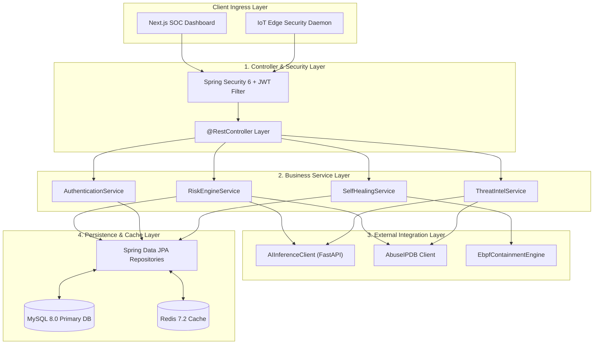
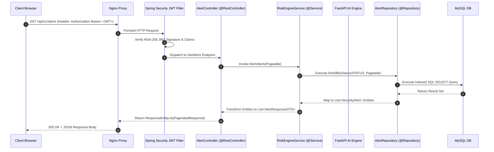
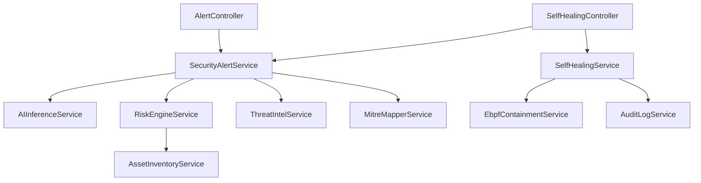
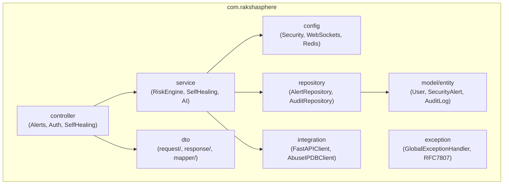
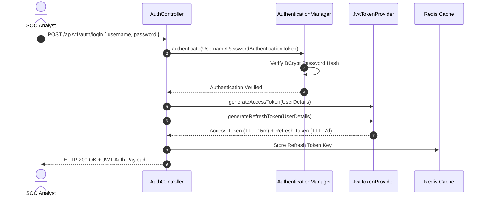
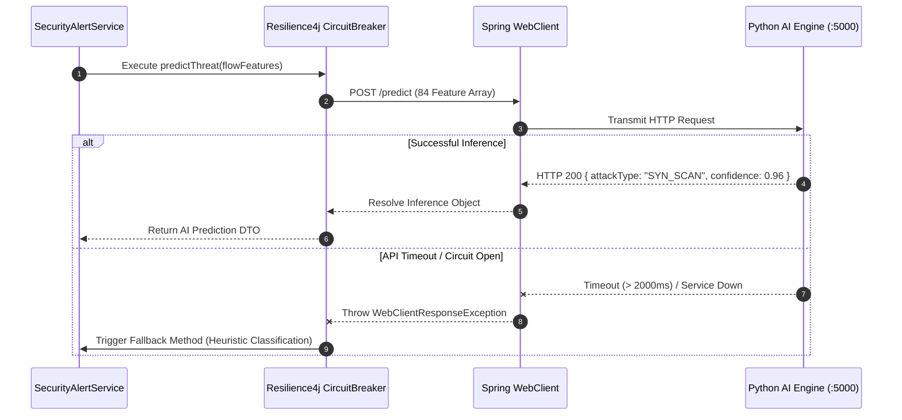
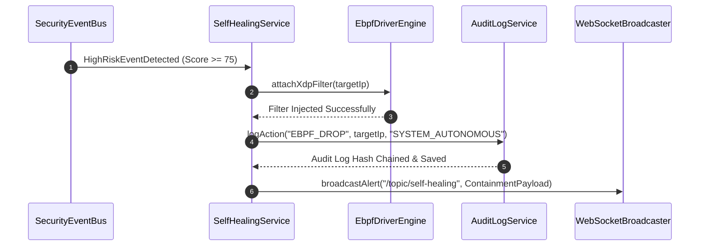
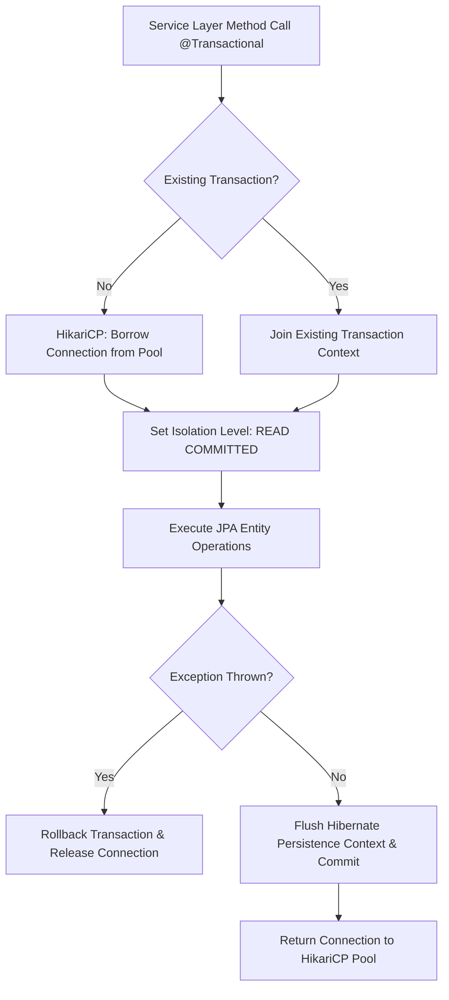

# Backend Architecture Specification

## RakshaSphere
### AI-Powered Autonomous Cyber Defense & Self-Healing Network Platform

> **Document Identifier**: `BACKEND-ARCH-RAKSHASPHERE-2026-V1.0`  
> **Target Runtime**: `Java 21 LTS (Project Loom Virtual Threads)`  
> **Framework**: `Spring Boot 3.2.x & Spring Security 6.x`  
> **Classification**: `Official Enterprise Backend Architectural Specification`

---

## 📑 Table of Contents

1. [Executive Summary](#1-executive-summary)
2. [Backend Architecture Overview](#2-backend-architecture-overview)
3. [Architectural Diagrams Library](#3-architectural-diagrams-library)
   - [High-Level Backend Layering](#31-high-level-backend-layering)
   - [Request Lifecycle Sequence](#32-request-lifecycle-sequence)
   - [Service Dependency Graph](#33-service-dependency-graph)
   - [Java Package Architecture](#34-java-package-architecture)
   - [Authentication & JWT State Flow](#35-authentication--jwt-state-flow)
   - [AI Microservice Integration Sequence](#36-ai-microservice-integration-sequence)
   - [Self-Healing Execution Sequence](#37-self-healing-execution-sequence)
   - [Database Interaction & Transaction Pipeline](#38-database-interaction--transaction-pipeline)
4. [Backend Project Structure](#4-backend-project-structure)
5. [Controller Layer Design](#5-controller-layer-design)
6. [Service Layer Architecture](#6-service-layer-architecture)
7. [Repository & Persistence Layer Design](#7-repository--persistence-layer-design)
8. [DTO Architecture & Mapping Strategy](#8-dto-architecture--mapping-strategy)
9. [Core Entity Taxonomy](#9-core-entity-taxonomy)
10. [Authentication & Authorization Subsystem](#10-authentication--authorization-subsystem)
11. [Backend Security Architecture](#11-backend-security-architecture)
12. [AI Microservice Integration (FastAPI Client)](#12-ai-microservice-integration-fastapi-client)
13. [Threat Intelligence Integration Engine](#13-threat-intelligence-integration-engine)
14. [Autonomous Self-Healing Engine](#14-autonomous-self-healing-engine)
15. [Background Tasks & Scheduling Architecture](#15-background-tasks--scheduling-architecture)
16. [Structured Logging & Audit Strategy](#16-structured-logging--audit-strategy)
17. [Global Exception Handling (RFC 7807)](#17-global-exception-handling-rfc-7807)
18. [Configuration & Environment Profiles](#18-configuration--environment-profiles)
19. [Performance, Concurrency & Caching Strategy](#19-performance-concurrency--caching-strategy)
20. [Database Interaction & Transaction Management](#20-database-interaction--transaction-management)
21. [Folder Responsibility Matrix](#21-folder-responsibility-matrix)
22. [Design Patterns & Architectural Taxonomy](#22-design-patterns--architectural-taxonomy)
23. [Deployment, Containers & CI/CD](#23-deployment-containers--cicd)
24. [Monitoring, Observability & Actuator Metrics](#24-monitoring-observability--actuator-metrics)
25. [Backend Testing & Quality Assurance Strategy](#25-backend-testing--quality-assurance-strategy)
26. [Scalability & Capacity Planning](#26-scalability--capacity-planning)
27. [Future Enhancements Roadmap](#27-future-enhancements-roadmap)

---

## 1. 🎯 Executive Summary

The **RakshaSphere Backend Core** functions as the central command orchestrator of the autonomous cyber defense platform. Built on **Java 21 LTS** and **Spring Boot 3.2**, it coordinates state management, high-throughput network flow ingestion, machine learning inference execution (Python FastAPI), global threat intelligence enrichment, dynamic risk scoring, autonomous self-healing containment (eBPF/iptables), and real-time WebSocket telemetry streaming to the SOC dashboard.

### Core Architectural Goals
- **High Concurrency & Low Latency**: Leverage **Java 21 Virtual Threads (Project Loom)** to handle thousands of concurrent HTTP and WebSocket connections without OS thread pool exhaustion.
- **Enterprise Security**: Enforce Zero Trust boundaries, OAuth2/JWT authentication, Spring Security 6 RBAC, rate limiting, and cryptographic audit log chaining.
- **Resilient Microservice Integration**: Protect inter-service calls (AI Inference Engine, Threat Intel APIs) using **Resilience4j Circuit Breakers**, retry policies, and automated fallback handlers.

---

## 2. 🏗️ Backend Architecture Overview

The backend architecture is strictly decoupled into eight (8) functional layers:

```
+-----------------------------------------------------------------------+
| 1. PRESENTATION / CONTROLLER LAYER (@RestController / ResponseEntity) |
+-----------------------------------------------------------------------+
                                   | DTO Validation / Binding
+-----------------------------------------------------------------------+
| 2. SECURITY & AUTHENTICATION LAYER (Spring Security 6 / JWT Filters) |
+-----------------------------------------------------------------------+
                                   | Authorized Request Execution
+-----------------------------------------------------------------------+
| 3. BUSINESS SERVICE LAYER (@Service / Transactional Domain Logic)     |
+-----------------------------------------------------------------------+
         |                        |                       |
+------------------+     +------------------+    +----------------------+
| 4. AI INTEGRATION|     | 5. THREAT INTEL  |    | 6. SELF-HEALING      |
| (WebClient/FastAPI)|   | (Resilience4j APIs)|  | (eBPF/iptables Hooks)|
+------------------+     +------------------+    +----------------------+
         \                        |                       /
+-----------------------------------------------------------------------+
| 7. REPOSITORY & PERSISTENCE LAYER (Spring Data JPA / Hibernate 6)     |
+-----------------------------------------------------------------------+
                                   | HikariCP JDBC Protocol
+-----------------------------------------------------------------------+
| 8. STORAGE & CACHING LAYER (MySQL 8.0 Primary DB / Redis 7.2 Cache)   |
+-----------------------------------------------------------------------+
```

---

## 3. 📊 Architectural Diagrams Library

### 3.1 High-Level Backend Layering



---

### 3.2 Request Lifecycle Sequence



---

### 3.3 Service Dependency Graph



---

### 3.4 Java Package Architecture



---

### 3.5 Authentication & JWT State Flow



---

### 3.6 AI Microservice Integration Sequence



---

### 3.7 Self-Healing Execution Sequence



---

### 3.8 Database Interaction & Transaction Pipeline



---

## 4. 📁 Backend Project Structure

```
backend/
├── src/main/java/com/rakshasphere/
│   ├── config/              # Security, CORS, WebSocket, Redis, & Swagger configs
│   ├── constants/           # Global string constants & system parameters
│   ├── controller/         # REST API Controllers (@RestController)
│   ├── dto/                # Data Transfer Objects
│   │   ├── request/        # Inbound payload validation DTOs
│   │   ├── response/       # Outbound JSON response DTOs
│   │   └── mapper/         # MapStruct DTO-to-Entity mapping interfaces
│   ├── enums/              # ThreatType, RiskLevel, ActionType, UserRole
│   ├── exception/          # GlobalExceptionHandler (@ControllerAdvice) & RFC-7807
│   ├── integration/        # External HTTP clients (FastAPI, AbuseIPDB, VirusTotal)
│   ├── middleware/         # Spring MVC Interceptors & Rate-Limiting Filters
│   ├── model/              # JPA Domain Entities
│   │   └── entity/         # User, SecurityAlert, RiskScore, AuditLog, HoneypotSession
│   ├── repository/         # Spring Data JPA interfaces
│   ├── scheduler/          # Scheduled background cron tasks (@Scheduled)
│   ├── security/           # JWT providers, UserDetailsService, Auth filters
│   ├── service/            # Core business logic implementations (@Service)
│   ├── validation/         # Custom JSR-380 validator annotations (@ValidIP)
│   └── util/               # Mathematical risk formulas & crypto utility helpers
└── src/main/resources/
    ├── application.yml     # Master configuration file
    ├── db/migration/       # Flyway SQL migration scripts
    └── templates/          # Email / Incident report export templates
```

---

## 5. 🕹️ Controller Layer Design

- **Annotation Standard**: `@RestController`, `@RequestMapping("/api/v1/{resource}")`, `@Validated`.
- **Response Wrapping**: All controllers return `ResponseEntity<ApiResponseDTO<T>>` maintaining unified JSON envelopes.
- **Input Validation**: Request DTOs are annotated with JSR-380 annotations (`@NotNull`, `@Size`, `@Pattern`). Invalid requests trigger `@ExceptionHandler(MethodArgumentNotValidException.class)`.

---

## 6. ⚙️ Service Layer Architecture

- **Business Isolation**: Services contain all domain rules, risk calculations, and state transition logic.
- **Transactional Declarations**: Read operations marked `@Transactional(readOnly = true)`; state mutations marked `@Transactional(rollbackFor = Exception.class)`.
- **Circuit Breaker Resilience**: Calls to external AI engines or threat intelligence lookups are wrapped in Resilience4j `@CircuitBreaker` and `@Retry` annotations.

---

## 7. 🗄️ Repository & Persistence Layer Design

- **Framework**: Spring Data JPA extending `JpaRepository<T, ID>` and `JpaSpecificationExecutor<T>`.
- **Query Optimization**: Complex queries use JPQL or native SQL with indexed lookups (`@Query("SELECT a FROM SecurityAlert a WHERE a.sourceIp = :ip")`).
- **Pagination Standard**: All collection endpoints pass `Pageable` parameters returning `Page<T>` wrapper instances.

---

## 8. 🔄 DTO Architecture & Mapping Strategy

- **Immutability**: DTOs implemented as Java 21 **Records** (`public record LoginRequestDTO(@NotNull String username, @NotNull String password) {}`).
- **Mapper Pattern**: Data mapping between Entities and DTOs handled via **MapStruct** compile-time mappers, eliminating runtime reflection overhead.

---

## 9. 📦 Core Entity Taxonomy

1. **`User`**: System identity, BCrypt password hash, assigned `Role`.
2. **`SecurityAlert`**: Master record of classified threat events.
3. **`RiskScore`**: Dynamic risk score calculation record ($0.00 - 100.00$).
4. **`HoneypotSession`**: Attacker decoy trap interaction telemetry.
5. **`RecoveryAction`**: Log of autonomous self-healing eBPF/iptables containment actions.
6. **`AuditLog`**: Cryptographically hash-chained system action audit log.

---

## 10. 🔑 Authentication & Authorization Subsystem

- **Stateless Tokens**: Signed RSA-256 JWT access tokens (15-minute TTL) passed in `Authorization: Bearer <JWT>` header.
- **Role-Based Access Control (RBAC)**: Enforced via Spring Security annotations (`@PreAuthorize("hasRole('ROLE_ADMIN')")`).

---

## 11. 🛡️ Backend Security Architecture

- **Password Storage**: BCrypt hashing with cost factor 12.
- **API Protection**: Redis token-bucket rate limiting (`100 req/min` per IP).
- **Audit Logging**: SHA-256 row-level hash chaining ($\text{Hash}_n = \text{SHA256}(\text{Data}_n \parallel \text{Hash}_{n-1})$).

---

## 12. 🧠 AI Microservice Integration (FastAPI Client)

- **Client Engine**: Asynchronous Spring `WebClient` calling `http://ai-engine:5000/predict`.
- **Fault Tolerance**: Fallback to heuristic rule classification if FastAPI inference fails or times out (> 2000ms).

---

## 13. 🌐 Threat Intelligence Integration Engine

- **Aggregated Services**: AbuseIPDB API v2 & VirusTotal API v3.
- **Caching Strategy**: API response payloads cached in Redis with a 24-hour Time-to-Live (TTL) to prevent hitting external API rate limits.

---

## 14. 🔄 Autonomous Self-Healing Engine

- **Trigger Threshold**: Risk Score $\ge 75.00$.
- **Mitigation Execution**: Injects eBPF XDP NIC driver packet drops, updates host `iptables` drop chains, and sends TCP RST packets to close active connections.

---

## 15. ⏱️ Background Tasks & Scheduling Architecture

Spring `@Scheduled` cron tasks execute background administrative tasks:
- **`ThreatScanTask`**: Periodic check for un-remediated high-risk events (Every 30 seconds).
- **`TelemetryCleanupTask`**: Purges telemetry metrics older than 30 days (Daily at 03:00 UTC).
- **`HealthCheckTask`**: Pings AI engine and DB connection pools (Every 60 seconds).

---

## 16. 📝 Structured Logging & Audit Strategy

- **Application Logs**: Logged in structured JSON format via Logback (`application.json`).
- **Cryptographic Audit Logs**: Security operations written to `AUDIT_LOGS` table with cryptographic hash validation.

---

## 17. 🚨 Global Exception Handling (RFC 7807)

Implemented using `@ControllerAdvice` returning standard `ProblemDetail` responses:

```json
{
  "type": "https://api.rakshasphere.io/errors/invalid-input",
  "title": "Validation Failed",
  "status": 422,
  "detail": "Target IP address must be a valid IPv4 or IPv6 format",
  "instance": "/api/v1/self-healing/remediate",
  "timestamp": "2026-08-02T15:30:00Z"
}
```

---

## 18. ⚙️ Configuration & Environment Profiles

- **Spring Profiles**: `dev` (Local H2/MySQL dev DB), `test` (JUnit Testcontainers), `prod` (Production MySQL & Redis stack).
- **Secrets Management**: Sensitive credentials injected via environment variables (`${MYSQL_PASSWORD}`).

---

## 19. ⚡ Performance, Concurrency & Caching Strategy

- **Virtual Threads**: Enabled via `spring.threads.virtual.enabled=true`.
- **Database Connection Pool**: HikariCP with 20 active connections.
- **Caching**: `@Cacheable(value = "threatIntel", key = "#ip")` backed by Redis.

---

## 20. 🗄️ Database Interaction & Transaction Management

- **Isolation Level**: `READ COMMITTED` enforced to prevent dirty reads.
- **Batch Processing**: Enabled via `spring.jpa.properties.hibernate.jdbc.batch_size=50`.

---

## 21. 📁 Folder Responsibility Matrix

| Backend Directory | Primary Engineering Responsibility |
| :--- | :--- |
| **`controller/`** | Maps HTTP requests to service calls; validates inputs; returns ResponseEntity objects. |
| **`service/`** | Implements core business logic, risk scoring formulas, and transaction boundaries. |
| **`repository/`** | Executes Spring Data JPA queries against MySQL database. |
| **`model/entity/`**| Defines JPA domain entities and column mapping constraints. |
| **`dto/`** | Defines immutable Java records for request/response payloads. |
| **`integration/`** | WebClient wrappers calling external APIs (FastAPI, AbuseIPDB, VirusTotal). |

---

## 22. 🧩 Design Patterns & Architectural Taxonomy

- **Model-View-Controller (MVC)**: Separates API representation from domain models.
- **Repository Pattern**: Abstracts relational query execution.
- **Factory Pattern**: `HoneypotTrapFactory` dynamically instantiates container traps.
- **Strategy Pattern**: `SelfHealingStrategy` selects mitigation algorithm based on risk score.

---

## 23. 🐳 Deployment, Containers & CI/CD

- **Dockerization**: Multi-stage build Dockerfile utilizing `eclipse-temurin:21-jdk` base image.
- **CI/CD**: GitHub Actions workflow (`backend-ci.yml`) compiling binaries, executing unit tests, building Docker images, and deploying stack.

---

## 24. 📊 Monitoring, Observability & Actuator Metrics

- **Spring Boot Actuator**: Exposes operational health endpoints (`/actuator/health`, `/actuator/metrics`).
- **Prometheus Metrics**: Metrics exported in Prometheus format for Grafana dashboard consumption.

---

## 25. 🧪 Backend Testing & Quality Assurance Strategy

- **Unit Testing**: JUnit 5 & Mockito testing service layer logic.
- **Integration Testing**: `@SpringBootTest` with Testcontainers running real MySQL and Redis instances.

---

## 26. 📈 Scalability & Capacity Planning

- **Stateless Microservice**: Backend instances scale horizontally behind Nginx load balancers.
- **Queue Integration**: Future expansion path to offload packet flow ingestion to Apache Kafka.

---

## 27. 🔮 Future Enhancements Roadmap

1. **gRPC Proto Endpoints**: Ultra-low-latency inter-service communication.
2. **Apache Kafka Integration**: High-throughput distributed event streaming.
3. **SOAR Webhooks**: Outbound alerts to Splunk and Palo Alto Cortex XSOAR.
