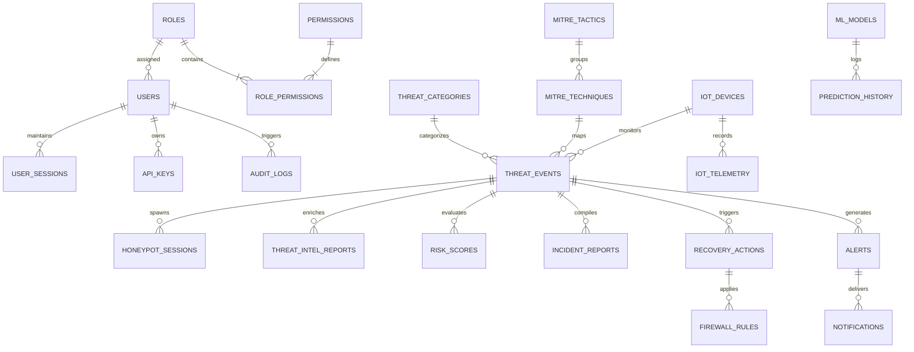
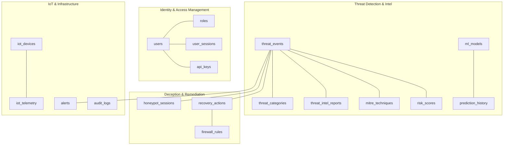
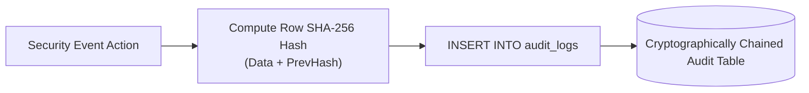

# Database Design Document (DDD)

## RakshaSphere
### AI-Powered Autonomous Cyber Defense & Self-Healing Network Platform

> **Document Identifier**: `DDD-RAKSHASPHERE-2026-V1.0`  
> **Target RDBMS**: `MySQL 8.0 Enterprise / Community Edition`  
> **ORM Engine**: `Hibernate 6.x / Spring Data JPA`  
> **Classification**: `Official Enterprise Database Specification`

---

## 📑 Table of Contents

1. [Executive Summary](#1-executive-summary)
2. [Database Architecture](#2-database-architecture)
3. [Architectural ER Diagrams](#3-architectural-er-diagrams)
   - [Master Entity-Relationship Diagram](#31-master-entity-relationship-diagram)
   - [Logical Database Schema Diagram](#32-logical-database-schema-diagram)
   - [Entity Relationship Network Diagram](#33-entity-relationship-network-diagram)
4. [Database Naming Conventions](#4-database-naming-conventions)
5. [Complete Entity Overview](#5-complete-entity-overview)
6. [Entity Relationship Matrix](#6-entity-relationship-matrix)
7. [Data Dictionary & Table Specifications](#7-data-dictionary--table-specifications)
8. [Indexing & Search Optimization Strategy](#8-indexing--search-optimization-strategy)
9. [Normalization & Analytics Denormalization Strategy](#9-normalization--analytics-denormalization-strategy)
10. [Transaction Strategy & ACID Compliance](#10-transaction-strategy--acid-compliance)
11. [Database Security, Cryptography & Access Control](#11-database-security-cryptography--access-control)
12. [Audit Logging & Non-Repudiation Architecture](#12-audit-logging--non-repudiation-architecture)
13. [Data Lifecycle & Retention Policies](#13-data-lifecycle--retention-policies)
14. [Backup & Disaster Recovery Strategy](#14-backup--disaster-recovery-strategy)
15. [Performance Tuning & High Throughput Strategy](#15-performance-tuning--high-throughput-strategy)
16. [ORM & JPA Mapping Strategy](#16-orm--jpa-mapping-strategy)
17. [Future Database Expansion Roadmap](#17-future-database-expansion-roadmap)
18. [Production SQL Query Library](#18-production-sql-query-library)
19. [Database Repository Folder Structure](#19-database-repository-folder-structure)
20. [Database Risks & Mitigation Matrix](#20-database-risks--mitigation-matrix)

---

## 1. 🎯 Executive Summary

The **RakshaSphere Database Architecture** provides persistent, transactional, relational, and audit-compliant storage for the platform's autonomous threat detection, deception orchestration, risk scoring, and self-healing operations.

Targeting **MySQL 8.0** with **InnoDB engine**, the schema is engineered to balance transactional integrity (ACID compliance) for security audit trails with high-speed read/write performance required for real-time SOC alerting.

### Core Database Objectives
- **ACID Compliance**: Enforced across all user authentications, risk scoring events, and self-healing mitigation actions.
- **Sub-10ms Read Latency**: Index-optimized queries for real-time WebSocket dashboard streaming.
- **Cryptographic Non-Repudiation**: Immutable audit logging powered by row-level SHA-256 hash chaining.
- **Scalable Lifecycle Management**: Partitioned storage schedules for high-volume threat events and IoT telemetry metrics.

---

## 2. 🏗️ Database Architecture

### 2.1 Logical Architecture
The database is structured into four functional schema domains:
1. **Identity & Access Management (IAM)**: Users, roles, permissions, sessions, API keys.
2. **Threat Detection & Intelligence (TDI)**: Threat events, ML prediction logs, MITRE ATT&CK taxonomy, external threat intel caches.
3. **Deception & Autonomous Remediation (DAR)**: Honeypot sessions, captured attacker payloads, firewall rules, self-healing recovery actions.
4. **IoT & System Infrastructure (ISI)**: IoT device registry, telemetry metrics, audit logs, system configurations, dashboard widgets.

### 2.2 Physical Architecture & Storage Engine
- **RDBMS Engine**: MySQL 8.0 InnoDB (Default Row Format: `DYNAMIC`).
- **Character Set**: `utf8mb4` (Full Unicode support including multi-byte security symbols).
- **Collation**: `utf8mb4_0900_ai_ci` (Accent-insensitive, case-insensitive sorting).
- **Storage Strategy**: Primary data tables reside on high-speed NVMe storage. High-volume log tables (`system_logs`, `captured_packets`) utilize Range Partitioning by Month.

---

## 3. 📊 Architectural ER Diagrams

### 3.1 Master Entity-Relationship Diagram



---

### 3.2 Logical Database Schema Diagram



---

## 4. 🔤 Database Naming Conventions

To ensure consistency across backend Java JPA entities and database migrations, the following strict naming standards apply:

| Database Element | Naming Standard | Example |
| :--- | :--- | :--- |
| **Tables** | Lowercase, plural, snake_case | `users`, `security_alerts`, `firewall_rules` |
| **Columns** | Lowercase, singular, snake_case | `id`, `source_ip`, `created_at`, `risk_score` |
| **Primary Keys** | `id` or `{entity}_id` | `id` (BIGINT AUTO_INCREMENT or VARCHAR UUID) |
| **Foreign Keys** | `{singular_target_table}_id` | `user_id`, `threat_event_id`, `mitre_technique_id` |
| **Indexes** | `idx_{table}_{column(s)}` | `idx_threat_events_source_ip`, `idx_users_email` |
| **Unique Constraints** | `uk_{table}_{column}` | `uk_users_username`, `uk_api_keys_hash` |
| **Check Constraints** | `chk_{table}_{rule}` | `chk_risk_scores_value` |

---

## 5. 📦 Complete Entity Overview

RakshaSphere comprises twenty-six (26) core database entities across its functional domains:

1. `users`: System user account identities and BCrypt credential hashes.
2. `roles`: Security roles (`ROLE_ADMIN`, `ROLE_SOC_ANALYST`, `ROLE_USER`).
3. `permissions`: Granular functional capabilities (`ALERT_READ`, `RULE_WRITE`).
4. `role_permissions`: Join table mapping roles to permissions.
5. `user_sessions`: Active JWT user login session states and refresh tokens.
6. `api_keys`: Hashed access tokens for external programmatic integrations.
7. `threat_categories`: Classification labels (DDoS, SYN Scan, Brute Force, Zero-Day).
8. `threat_events`: Master ledger of detected network intrusions and anomalies.
9. `attack_sessions`: Grouped sequence of related threat events from a single attacker source.
10. `honeypot_sessions`: Log of attacker interactions within decoy containers.
11. `captured_packets`: Network packet payloads associated with forensic incidents.
12. `threat_intel_reports`: Cached reputation metrics from AbuseIPDB and VirusTotal.
13. `mitre_tactics`: Enterprise MITRE ATT&CK Tactics taxonomy (`TA0001` - `TA0040`).
14. `mitre_techniques`: Enterprise MITRE ATT&CK Techniques (`T1110`, `T1046`).
15. `risk_scores`: Calculated numerical risk values ($0.00 - 100.00$) and weighting metrics.
16. `incident_reports`: Summarized incident dossiers for executive exporting.
17. `recovery_actions`: Execution record of self-healing containment actions.
18. `firewall_rules`: Active eBPF XDP and `iptables` drop rules enforced by system.
19. `iot_devices`: Inventory registry of edge gateways and IoT nodes.
20. `iot_telemetry`: High-frequency metric logs from IoT sensors.
21. `alerts`: Security alert notifications generated for SOC analysts.
22. `notifications`: Delivery tracking for email/WebSocket analyst alerts.
23. `audit_logs`: Immutable cryptographically chained audit history.
24. `system_logs`: Operational application logs and container runtime outputs.
25. `system_configuration`: Dynamic platform parameters and threshold settings.
26. `ml_models`: Version registry of deployed Scikit-learn/TensorFlow model binaries.
27. `prediction_history`: Log of raw feature vectors and AI inference outputs.
28. `dashboard_widgets`: User preference configurations for SOC UI widgets.

---

## 6. 🔗 Entity Relationship Matrix

| Primary Entity | Foreign Entity | Relationship Type | Cardinality | Business Rules |
| :--- | :--- | :--- | :--- | :--- |
| `roles` | `users` | One-to-Many | $1 : N$ | One role can be assigned to multiple users. |
| `users` | `user_sessions` | One-to-Many | $1 : N$ | A user can maintain multiple active sessions. |
| `threat_events` | `honeypot_sessions`| One-to-Many | $1 : N$ | A threat event can spawn one or more decoy trap sessions. |
| `threat_events` | `risk_scores` | One-to-One | $1 : 1$ | Every threat event produces exactly one dynamic risk score record. |
| `mitre_tactics` | `mitre_techniques`| One-to-Many | $1 : N$ | A tactic contains multiple techniques. |
| `threat_events` | `recovery_actions` | One-to-Many | $1 : N$ | A severe threat event triggers one or more self-healing recovery actions. |
| `recovery_actions`| `firewall_rules` | One-to-One | $1 : 1$ | A recovery action applies exactly one network firewall drop rule. |
| `iot_devices` | `iot_telemetry` | One-to-Many | $1 : N$ | An IoT device generates continuous telemetry metric rows. |

---

## 7. 📖 Data Dictionary & Table Specifications

Exhaustive schema design specifications for core operational database tables:

### 7.1 Table: `users`
- **Purpose**: Stores user identities, hashed credentials, and role assignments.
- **Expected Volume**: $< 1,000$ rows | **Retention**: Permanent until deleted.

| Column Name | Data Type | Nullable | Default | Constraints & Description |
| :--- | :--- | :--- | :--- | :--- |
| `id` | `BIGINT` | No | `AUTO_INCREMENT`| Primary Key |
| `username` | `VARCHAR(50)` | No | *None* | Unique login handle (`uk_users_username`) |
| `email` | `VARCHAR(100)` | No | *None* | Unique user email address (`uk_users_email`) |
| `password_hash` | `VARCHAR(255)` | No | *None* | BCrypt password hash (Cost Factor 12) |
| `role_id` | `BIGINT` | No | *None* | Foreign Key references `roles(id)` |
| `status` | `VARCHAR(20)` | No | `'ACTIVE'` | Status (`ACTIVE`, `SUSPENDED`, `LOCKED`) |
| `created_at` | `TIMESTAMP` | No | `CURRENT_TIMESTAMP`| Account creation record |

---

### 7.2 Table: `threat_events`
- **Purpose**: Master transactional ledger of all detected network intrusions.
- **Expected Volume**: $1,000,000+$ rows/month | **Retention**: 90 Days.

| Column Name | Data Type | Nullable | Default | Constraints & Description |
| :--- | :--- | :--- | :--- | :--- |
| `id` | `VARCHAR(64)` | No | *None* | Primary Key (UUID v4 string) |
| `source_ip` | `VARCHAR(45)` | No | *None* | Attacker IPv4/IPv6 address (`idx_te_src_ip`) |
| `destination_ip` | `VARCHAR(45)` | No | *None* | Target internal network IP |
| `source_port` | `INT` | No | `0` | Origin network port number |
| `destination_port`| `INT` | No | `0` | Target service port number |
| `protocol` | `VARCHAR(10)` | No | `'TCP'` | Protocol (`TCP`, `UDP`, `ICMP`) |
| `category_id` | `BIGINT` | No | *None* | Foreign Key references `threat_categories(id)` |
| `mitre_technique_id`| `VARCHAR(20)`| Yes | `NULL` | Foreign Key references `mitre_techniques(id)` |
| `confidence` | `DECIMAL(5,4)` | No | `0.0000` | ML prediction confidence ($0.0000 - 1.0000$) |
| `is_zero_day` | `BOOLEAN` | No | `FALSE` | Autoencoder MSE anomaly flag |
| `status` | `VARCHAR(20)` | No | `'DETECTED'` | Status (`DETECTED`, `TRAPPED`, `CONTAINED`) |
| `created_at` | `TIMESTAMP` | No | `CURRENT_TIMESTAMP`| Ingestion timestamp (`idx_te_created_at`) |

---

### 7.3 Table: `risk_scores`
- **Purpose**: Dynamic risk score calculations associated with threat events.
- **Expected Volume**: $1,000,000+$ rows | **Retention**: 90 Days.

| Column Name | Data Type | Nullable | Default | Constraints & Description |
| :--- | :--- | :--- | :--- | :--- |
| `id` | `BIGINT` | No | `AUTO_INCREMENT`| Primary Key |
| `threat_event_id` | `VARCHAR(64)` | No | *None* | Foreign Key references `threat_events(id)` |
| `threat_severity` | `DECIMAL(4,2)`| No | `0.00` | Base threat severity score ($1.00 - 10.00$) |
| `asset_weight` | `INT` | No | `1` | Asset criticality weight multiplier ($1 - 5$) |
| `mitigation_factor`| `DECIMAL(4,2)`| No | `1.00` | Defense mitigation factor ($1.00 - 3.00$) |
| `calculated_risk` | `DECIMAL(5,2)`| No | `0.00` | Final score ($0.00 - 100.00$) (`chk_risk_val`) |
| `created_at` | `TIMESTAMP` | No | `CURRENT_TIMESTAMP`| Calculation timestamp |

---

### 7.4 Table: `recovery_actions`
- **Purpose**: Log of autonomous self-healing containment actions executed by platform.
- **Expected Volume**: $500,000+$ rows | **Retention**: 1 Year.

| Column Name | Data Type | Nullable | Default | Constraints & Description |
| :--- | :--- | :--- | :--- | :--- |
| `id` | `BIGINT` | No | `AUTO_INCREMENT`| Primary Key |
| `threat_event_id` | `VARCHAR(64)` | No | *None* | Foreign Key references `threat_events(id)` |
| `action_type` | `VARCHAR(50)` | No | *None* | Type (`EBPF_DROP`, `IPTABLES_BLOCK`, `SOCKET_KILL`)|
| `target_ip` | `VARCHAR(45)` | No | *None* | Enforced block target IP |
| `status` | `VARCHAR(20)` | No | `'ENFORCED'` | Status (`ENFORCED`, `REVERTED`, `EXPIRED`) |
| `execution_time_ms`| `INT` | No | `0` | Autonomous reaction time in ms |
| `created_at` | `TIMESTAMP` | No | `CURRENT_TIMESTAMP`| Execution record timestamp |

---

### 7.5 Table: `audit_logs`
- **Purpose**: Cryptographically chained immutable audit records of high-priority actions.
- **Expected Volume**: $2,000,000+$ rows | **Retention**: 7 Years (Compliance requirement).

| Column Name | Data Type | Nullable | Default | Constraints & Description |
| :--- | :--- | :--- | :--- | :--- |
| `id` | `BIGINT` | No | `AUTO_INCREMENT`| Primary Key |
| `action` | `VARCHAR(100)`| No | *None* | Executed system action descriptor |
| `executed_by` | `VARCHAR(50)` | No | *None* | User handle or `'SYSTEM_AUTONOMOUS'` |
| `ip_address` | `VARCHAR(45)` | Yes | `NULL` | Operator origin IP address |
| `prev_hash` | `VARCHAR(64)` | No | *None* | SHA-256 hash of previous row |
| `row_hash` | `VARCHAR(64)` | No | *None* | SHA-256 hash of current row data |
| `timestamp` | `TIMESTAMP` | No | `CURRENT_TIMESTAMP`| Timestamp |

---

## 8. ⚡ Indexing & Search Optimization Strategy

To ensure sub-second SOC dashboard query response times, explicit secondary and composite indexes are defined across high-frequency lookup columns:

```sql
-- Secondary Indexes for Threat Event Filter Lookups
CREATE INDEX idx_threat_events_source_ip ON threat_events(source_ip);
CREATE INDEX idx_threat_events_status ON threat_events(status);
CREATE INDEX idx_threat_events_created_at ON threat_events(created_at DESC);

-- Composite Index for SOC Dashboard Real-Time Feeds
CREATE INDEX idx_threat_events_status_created ON threat_events(status, created_at DESC);

-- Index for Audit Log Hash Verification Traversal
CREATE INDEX idx_audit_logs_timestamp ON audit_logs(timestamp DESC);
```

---

## 9. 📐 Normalization & Analytics Denormalization Strategy

- **Third Normal Form (3NF)**: Enforced across all transactional domains (IAM, Honeypot Sessions, Recovery Actions) to eliminate data redundancy and insertion anomalies.
- **Selective Denormalization for Reporting**: The `incident_reports` table stores pre-aggregated JSON summaries of attack vectors, asset impacts, and risk scores to prevent executing expensive multi-table JOIN queries during dashboard export rendering.

---

## 10. 🔄 Transaction Strategy & ACID Compliance

- **Storage Engine**: MySQL **InnoDB** with `innodb_flush_log_at_trx_commit = 1` to guarantee full ACID compliance upon transaction commit.
- **Isolation Level**: Default `READ COMMITTED` to prevent dirty reads while maximizing concurrent read performance during high-throughput packet ingestion.
- **Transactional Boundaries**: Enforced via Spring Framework `@Transactional(isolation = Isolation.READ_COMMITTED, rollbackFor = Exception.class)`.

---

## 11. 🔒 Database Security, Cryptography & Access Control

> [!CAUTION]
> Direct database access by application developers in production is strictly prohibited. All queries must execute via authenticated application services.

1. **At-Rest Data Encryption**: Sensitive fields (API keys, external secret credentials) encrypted using **AES-256-GCM**.
2. **Password Hashing**: User credentials hashed using **BCrypt** (Cost Factor 12).
3. **Database User Privileges**:
   - `raksha_app_user`: Granted `SELECT`, `INSERT`, `UPDATE`, `DELETE` on operational tables.
   - `raksha_migration_user`: Granted `CREATE`, `ALTER`, `DROP` for Flyway migrations only.

---

## 12. 📝 Audit Logging & Non-Repudiation Architecture



Audit record integrity formula:
$$\text{Hash}_n = \text{SHA256}(\text{Action}_n \parallel \text{User}_n \parallel \text{Timestamp}_n \parallel \text{Hash}_{n-1})$$

---

## 13. 🧹 Data Lifecycle & Retention Policies

| Table Category | Tables Included | Retention Period | Archival / Cleanup Strategy |
| :--- | :--- | :--- | :--- |
| **High-Volume Telemetry** | `iot_telemetry`, `prediction_history` | 30 Days | Monthly Range Partition Drop |
| **Operational Alerts** | `threat_events`, `risk_scores` | 90 Days | Archived to S3 / Cold Storage |
| **Deception Telemetry** | `honeypot_sessions`, `captured_packets`| 180 Days | Compressed and archived |
| **Compliance Audit** | `audit_logs`, `recovery_actions` | 7 Years | Permanent compliance store |

---

## 14. 💾 Backup & Disaster Recovery Strategy

- **Daily Full Backup**: Automated `mysqldump` / MySQL Enterprise Backup executed at 02:00 UTC.
- **Point-in-Time Recovery (PITR)**: MySQL Binary Logging (`log_bin`) enabled with a 7-day retention period.
- **Disaster Recovery Target**: Recovery Time Objective (**RTO**) $< 1 \text{ hour}$; Recovery Point Objective (**RPO**) $< 5 \text{ minutes}$.

---

## 15. ⚡ Performance Tuning & High Throughput Strategy

1. **Connection Pooling**: HikariCP configured with 20 active connections and a minimum idle pool of 5.
2. **Query Caching**: External threat intel lookups cached in Redis with a 24-hour TTL to reduce database query load.
3. **Write Optimization**: High-frequency IoT telemetry inserts processed via JDBC batch statements (`rewriteBatchedStatements=true`).

---

## 16. ☕ ORM & JPA Mapping Strategy

Managed via **Hibernate 6.x** and **Spring Data JPA**:
- **Fetch Types**: Explicitly configured as `FetchType.LAZY` on all `@ManyToOne` and `@OneToMany` entity associations to avoid N+1 query performance traps.
- **Cascade Rules**: Restricted to `CascadeType.PERSIST` and `CascadeType.MERGE`. Dangerous `CascadeType.REMOVE` is explicitly disallowed on audit and threat tables.

---

## 17. 🔮 Future Database Expansion Roadmap

1. **Redis Enterprise Cluster**: Caching session states and real-time threat counts.
2. **TimescaleDB / InfluxDB**: Migration of high-frequency time-series IoT telemetry (`iot_telemetry`) to a dedicated time-series database.
3. **Elasticsearch / OpenSearch**: Indexing forensic honeypot logs and packet captures for full-text search.

---

## 18. 💻 Production SQL Query Library

### Query 1: Fetch Top 10 High-Risk Threat Sources (SOC Dashboard)
```sql
SELECT 
    te.source_ip, 
    tc.category_name, 
    rs.calculated_risk, 
    te.status, 
    te.created_at
FROM threat_events te
JOIN threat_categories tc ON te.category_id = tc.id
JOIN risk_scores rs ON te.id = rs.threat_event_id
WHERE rs.calculated_risk >= 75.00
ORDER BY rs.calculated_risk DESC, te.created_at DESC
LIMIT 10;
```

### Query 2: Cryptographic Audit Trail Hash Verification
```sql
SELECT 
    id, 
    action, 
    executed_by, 
    prev_hash, 
    row_hash, 
    timestamp
FROM audit_logs
ORDER BY id ASC;
```

---

## 19. 📁 Database Repository Folder Structure

```
database/
├── schema/
│   ├── 01_init_tables.sql       # Initial table creation scripts
│   ├── 02_init_indexes.sql      # Secondary index creation
│   └── 03_init_constraints.sql  # Foreign keys and check constraints
├── migrations/                  # Flyway incremental migration scripts
│   ├── V1__init_schema.sql
│   └── V2__add_iot_tables.sql
├── seed/                        # Development seed datasets
│   └── dev_seed_data.sql
├── backups/                     # Backup automation scripts
│   └── backup_cron.sh
├── scripts/                     # Maintenance and cleanup utilities
│   └── partition_cleanup.sql
└── documentation/               # Schema documentation & ER diagrams
    └── er_diagram.png
```

---

## 20. ⚠️ Database Risks & Mitigation Matrix

| Identified Risk | Severity | Impact | Architectural Mitigation Strategy |
| :--- | :--- | :--- | :--- |
| **Unbounded Table Growth** | High | Disk space exhaustion | Implement MySQL Range Partitioning by Month and 90-day drop schedules. |
| **Long-Running Analytics Locks** | Medium | Transactional blocking | Enforce `READ COMMITTED` isolation level and execute reporting queries on read-replicas. |
| **Audit Hash Tampering** | Critical | Loss of compliance | Calculate SHA-256 hash chains in application layer prior to DB insert. |
