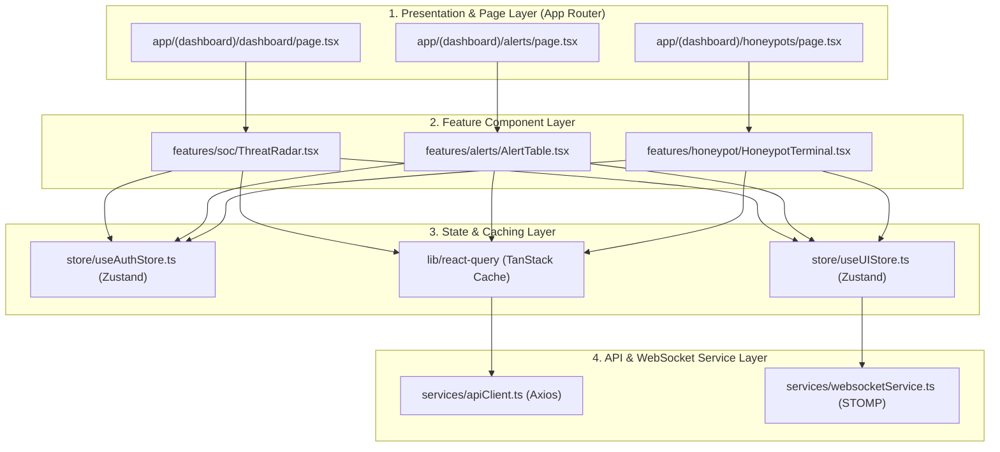
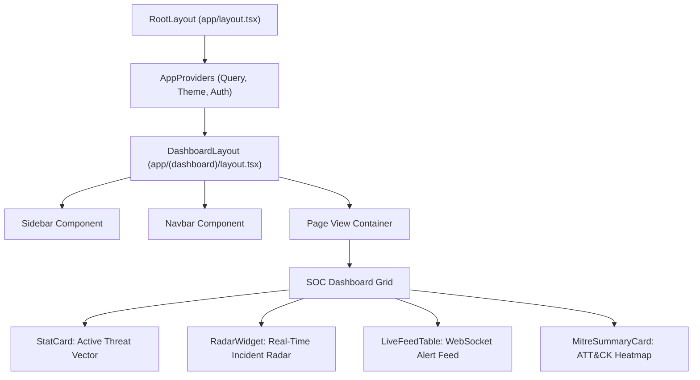
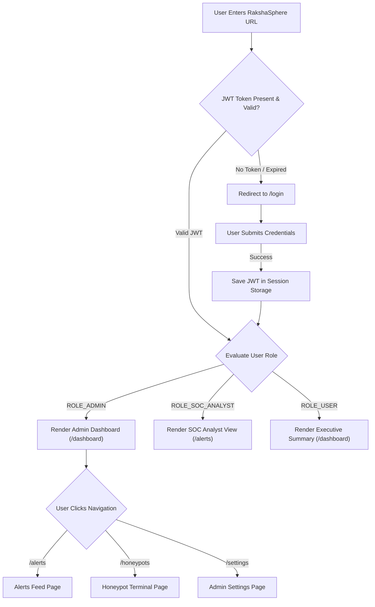
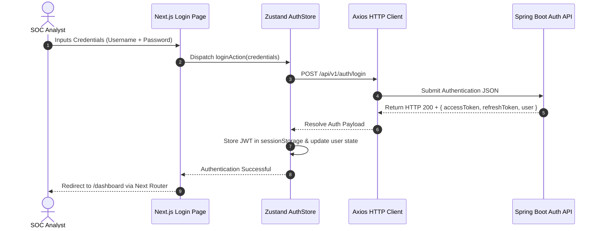
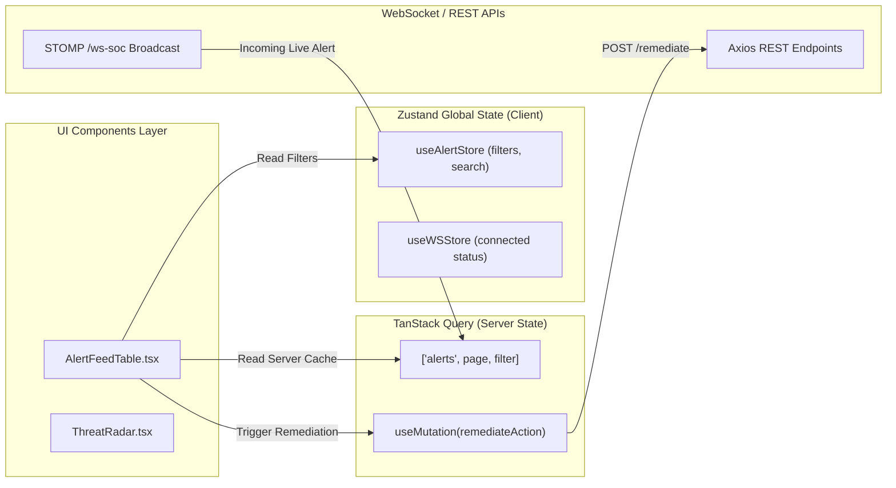
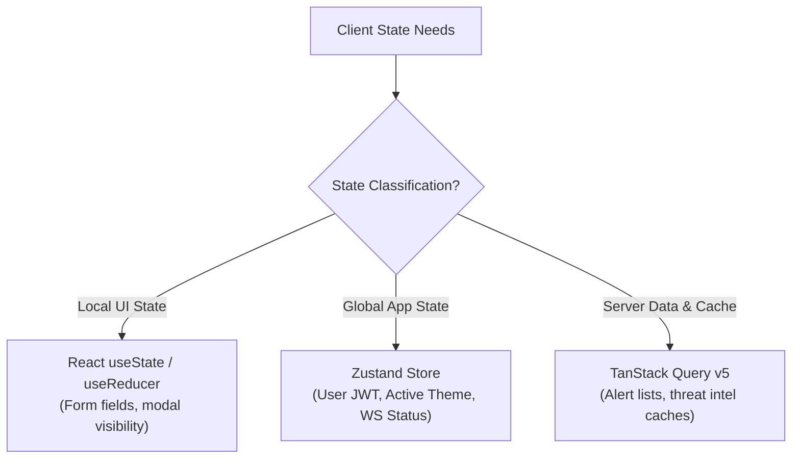

# Frontend Architecture Specification

## RakshaSphere
### AI-Powered Autonomous Cyber Defense & Self-Healing Network Platform

> **Document Identifier**: `FRONTEND-ARCH-RAKSHASPHERE-2026-V1.0`  
> **Framework**: `Next.js 16 (App Router) & React 19`  
> **Styling System**: `Tailwind CSS v4 & shadcn/ui`  
> **Classification**: `Official Enterprise Frontend Architectural Blueprint`

---

## 📑 Table of Contents

1. [Executive Summary](#1-executive-summary)
2. [Frontend Architecture & Multi-Layer Taxonomy](#2-frontend-architecture--multi-layer-taxonomy)
3. [Architectural Diagrams Library](#3-architectural-diagrams-library)
   - [High-Level Frontend Layering](#31-high-level-frontend-layering)
   - [Component Hierarchy Tree](#32-component-hierarchy-tree)
   - [Router & Page Navigation Flow](#33-router--page-navigation-flow)
   - [Authentication & JWT State Sequence](#34-authentication--jwt-state-sequence)
   - [State Management Dataflow](#35-state-management-dataflow)
4. [Folder Structure & Architectural Mapping](#4-folder-structure--architectural-mapping)
5. [Next.js App Router & Layout Architecture](#5-nextjs-app-router--layout-architecture)
6. [Component Architecture & Design System](#6-component-architecture--design-system)
7. [State Management Architecture](#7-state-management-architecture)
8. [API Service Layer & Data Fetching](#8-api-service-layer--data-fetching)
9. [Authentication, Security & RBAC UI](#9-authentication-security--rbac-ui)
10. [SOC Dashboard & Visual Analytics Design](#10-soc-dashboard--visual-analytics-design)
11. [Form Architecture & Zod Validation](#11-form-architecture--zod-validation)
12. [Theme System & Styling Foundations](#12-theme-system--styling-foundations)
13. [Responsive Layouts & Breakpoint Grid](#13-responsive-layouts--breakpoint-grid)
14. [Accessibility (WCAG 2.1 AA) & Keyboard Controls](#14-accessibility-wcag-21-aa--keyboard-controls)
15. [Frontend Performance, Caching & Streaming](#15-frontend-performance-caching--streaming)
16. [Error Handling, Resilience & Fallback UI](#16-error-handling-resilience--fallback-ui)
17. [Code Standards & Convention Guidelines](#17-code-standards--convention-guidelines)
18. [Frontend Quality Assurance & Testing Strategy](#18-frontend-quality-assurance--testing-strategy)
19. [Future Frontend Roadmap](#19-future-frontend-roadmap)

---

## 1. 🎯 Executive Summary

The **RakshaSphere Frontend Architecture** provides a high-performance, resilient, accessible, and responsive user interface for security analysts, network engineers, and system administrators.

Built on **Next.js 16 (App Router)** and **React 19**, the architecture prioritizes **Sub-Second Initial Loads**, **Sub-500ms Real-Time WebSocket Telemetry Updates**, and **Strict Zero-Trust RBAC Render Boundaries**.

### Primary Architecture Goals
- **High-Frequency Telemetry Rendering**: Efficiently stream live threat feeds and active honeypot keystrokes using WebSockets (STOMP/SockJS) without triggering layout thrashing or React re-render bottlenecks.
- **Micro-Modular Component Hierarchy**: Follow an **Atomic / Feature-Driven Component Pattern** using **shadcn/ui** and **Tailwind CSS v4**.
- **Type-Safe State Orchestration**: Seamlessly divide application state between **Zustand** (Global UI/Session State) and **TanStack Query v5** (Server Caching & Synchronization).

---

## 2. 🏗️ Frontend Architecture & Multi-Layer Taxonomy

The frontend application is structured into five distinct operational layers:

```
+-----------------------------------------------------------------------+
| 1. PRESENTATION LAYER (React 19 Server/Client Components / shadcn/ui)  |
+-----------------------------------------------------------------------+
                                   | Component Props / Action Callbacks
+-----------------------------------------------------------------------+
| 2. FEATURE / BUSINESS LAYER (SOC Radar, MitreHeatmap, HoneypotConsole)|
+-----------------------------------------------------------------------+
                                   | Custom Hooks / Selectors
+-----------------------------------------------------------------------+
| 3. STATE LAYER (Zustand Global Store / TanStack Query Server Cache)   |
+-----------------------------------------------------------------------+
                                   | Service Client Calls
+-----------------------------------------------------------------------+
| 4. API & TRANSPORT LAYER (Axios / STOMP WebSocket / JWT Interceptors) |
+-----------------------------------------------------------------------+
                                   | Native Web APIs
+-----------------------------------------------------------------------+
| 5. UTILITY & INFRASTRUCTURE LAYER (Zod Specs, Local Storage, Theme)   |
+-----------------------------------------------------------------------+
```

---

## 3. 📊 Architectural Diagrams Library

### 3.1 High-Level Frontend Layering



---

### 3.2 Component Hierarchy Tree



---

### 3.3 Router & Page Navigation Flow



---

### 3.4 Authentication & JWT State Sequence



---

### 3.5 State Management Dataflow



---

## 4. 📁 Folder Structure & Architectural Mapping

```
frontend/
├── app/                         # Next.js App Router Structure
│   ├── (auth)/                  # Authentication Route Group
│   │   ├── login/page.tsx       # User Login Screen
│   │   └── layout.tsx           # Minimal Auth Layout
│   ├── (dashboard)/             # Protected Application Route Group
│   │   ├── dashboard/page.tsx   # Executive SOC Radar & Main Overview
│   │   ├── alerts/page.tsx      # Triage Table & Incident Feed
│   │   ├── honeypots/page.tsx   # Live Decoy Session Terminal
│   │   ├── mitre/page.tsx       # MITRE ATT&CK Interactive Matrix
│   │   ├── settings/page.tsx    # User & Rule Management
│   │   └── layout.tsx           # Primary Dashboard Shell (Navbar + Sidebar)
│   ├── api/                     # Next.js Internal Route Handlers
│   ├── error.tsx                # Global Error Boundary Page
│   ├── loading.tsx              # Application Suspense Loading Skeleton
│   ├── not-found.tsx            # 404 Route Not Found View
│   └── layout.tsx               # Root Application Layout & Providers
├── components/                  # Design System & Atomic UI Components
│   ├── ui/                      # Primitive shadcn/ui components (Button, Dialog)
│   └── shared/                  # Reusable domain components (DataTable, Modal)
├── features/                    # Feature-Driven Business Components
│   ├── alerts/                  # Alert feed, filters, detail drawers
│   ├── honeypot/                # Honeypot terminals, command logs
│   ├── mitre/                   # Interactive TTP heatmaps
│   └── soc/                     # Threat radar charts, executive widgets
├── hooks/                       # Custom React Hooks (useWebSocket, useAuth)
├── lib/                         # External Library Clients (Axios, STOMP)
├── services/                    # API Service Wrappers & Endpoint Clients
├── store/                       # Zustand Global State Stores
├── types/                       # TypeScript Domain Interfaces & API DTOs
└── utils/                       # Pure Utility Functions & Date Formatters
```

---

## 5. 🚀 Next.js App Router & Layout Architecture

### 1. Root Layout (`app/layout.tsx`)
Enforces dark theme defaults, loads custom typography (Inter / JetBrains Mono for terminals), and wraps the application in global providers (`QueryClientProvider`, `ThemeProvider`, `Toaster`).

### 2. Dashboard Shell Layout (`app/(dashboard)/layout.tsx`)
Persistent layout component maintaining the fixed sidebar navigation, top header bar, connection health indicator, and breadcrumb bar. Layout state preserves component mount states during sub-route navigation.

---

## 6. 🧩 Component Architecture & Design System

RakshaSphere implements an **Atomic Design Hierarchy**:

| Component Tier | Purpose & Technical Scope | Example Implementation |
| :--- | :--- | :--- |
| **Primitives (`ui/`)** | Unstyled, fully accessible base components via `shadcn/ui`. | `Button.tsx`, `Badge.tsx`, `Dialog.tsx` |
| **Shared (`components/`)** | Reusable domain-agnostic UI blocks with styling extensions. | `DataTable.tsx`, `ConfirmModal.tsx` |
| **Feature (`features/`)** | Business-logic-aware widgets consuming state and API hooks. | `ThreatRadar.tsx`, `HoneypotTerminal.tsx` |
| **Page (`app/`)** | Server/Client page components binding layouts to feature grids. | `app/(dashboard)/alerts/page.tsx` |

---

## 7. ⚡ State Management Architecture



### 1. Zustand Global Stores (`store/`)
- `useAuthStore`: Manages authenticated user details, JWT access tokens, and session expiration timestamps.
- `useUIStore`: Manages sidebar collapse states, active modal instances, and theme toggles.
- `useWebSocketStore`: Manages STOMP client connection status and live channel subscriptions.

### 2. TanStack Query Server State (`lib/react-query`)
- Handles background refetching, query invalidation, structural sharing, and optimistic UI updates for threat alerts and configuration changes.

---

## 8. 🌐 API Service Layer & Data Fetching

The API layer uses a centralized Axios instance configured with JWT request interceptors and RFC-7807 error response transformers:

```typescript
// Conceptual Axios Client Configuration Pattern
import axios from 'axios';

export const apiClient = axios.create({
  baseURL: process.env.NEXT_PUBLIC_API_URL || '/api/v1',
  headers: { 'Content-Type': 'application/json' },
  timeout: 10000,
});

apiClient.interceptors.request.use((config) => {
  const token = sessionStorage.getItem('access_token');
  if (token) config.headers.Authorization = `Bearer ${token}`;
  return config;
});
```

---

## 9. 🔒 Authentication, Security & RBAC UI

### 1. RBAC Component Guard Pattern
Protected UI elements (e.g., "Manual Unblock" action buttons) are conditionally rendered using an explicit `<PermissionGuard>` component:

```tsx
// Conceptual Permission Guard Usage
<PermissionGuard requiredRole="ROLE_ADMIN">
  <Button variant="destructive" onClick={handleUnblockIP}>
    Revert eBPF Block
  </Button>
</PermissionGuard>
```

### 2. Security Hardening Measures
- **XSS Mitigation**: Strict HTML escaping on all raw honeypot keystroke streams.
- **Token Handling**: Access tokens stored in `sessionStorage` (never `localStorage`) to prevent persistent token theft via XSS.

---

## 10. 🖥️ SOC Dashboard & Visual Analytics Design

The Executive Dashboard (`app/(dashboard)/dashboard/page.tsx`) features a responsive grid of high-density cyber defense widgets:

1. **Threat Radar SVG Widget**: Custom canvas/SVG component rendering directional attack vectors based on incoming alert geo-telemetry.
2. **Real-Time Alert Feed**: High-performance virtualized table component (`@tanstack/react-table`) capable of handling 50+ incoming WebSocket alerts per second without frame drops.
3. **MITRE ATT&CK Heatmap**: Color-coded grid mapping active enterprise threat frequencies across MITRE Tactics (`TA0001` - `TA0040`).

---

## 11. 📋 Form Architecture & Zod Validation

All user input forms (Login, Rule Configuration, User Onboarding) are built using **React Hook Form** paired with **Zod** schema validation.

```typescript
// Conceptual Zod Schema Specification
import { z } from 'zod';

export const RemediationSchema = z.object({
  targetIp: z.string().ip({ version: 'v4', message: 'Valid IPv4 required' }),
  action: z.enum(['EBPF_DROP', 'IPTABLES_BLOCK', 'REVERT_BLOCK']),
  reason: z.string().min(10, 'Reason must be at least 10 characters'),
});
```

---

## 12. 🎨 Theme System & Styling Foundations

Designed using **Tailwind CSS v4** featuring a custom dark-mode-first cyber defense color palette:

| Token Name | Hex Color | Usage Scope |
| :--- | :--- | :--- |
| `--background` | `#090D16` | Main application background (Deep Cyber Charcoal) |
| `--card-bg` | `#111827` | Dashboard card & widget containers |
| `--accent-green` | `#10B981` | Normal status / Autonomous Self-Healing Active |
| `--accent-amber` | `#F59E0B` | Medium risk threats / Trapped in Honeypot |
| `--accent-red` | `#EF4444` | High risk / eBPF Containment Executed |

---

## 13. 📐 Responsive Layouts & Breakpoint Grid

The layout enforces strict responsive grid behavior across standard device viewports:

| Breakpoint Target | Viewport Width | Layout Adjustment |
| :--- | :--- | :--- |
| **Mobile (`sm`)** | $< 640\text{px}$ | Collapsed drawer navigation; single-column widget layout. |
| **Tablet (`md`)** | $640\text{px} - 1024\text{px}$| Icons-only sidebar; 2-column dashboard grid. |
| **Desktop (`lg`)** | $1024\text{px} - 1280\text{px}$| Full expandable sidebar; 3-column dashboard grid. |
| **Ultra-Wide (`xl`)** | $> 1280\text{px}$ | 4-column high-density SOC command center grid. |

---

## 14. ♿ Accessibility (WCAG 2.1 AA) & Keyboard Controls

- **Keyboard Navigation**: Full tab index accessibility across all interactive data tables, dropdowns, and modal dialogs.
- **ARIA Attributes**: Standardized `aria-live="polite"` regions for WebSocket alert feeds to ensure screen readers announce high-priority security incidents.

---

## 15. ⚡ Frontend Performance, Caching & Streaming

- **Next.js Dynamic Imports**: Heavy visual components (Leaflet maps, Recharts graphs) are loaded dynamically using `next/dynamic` with skeleton loading fallbacks.
- **React 19 Server Components (RSC)**: Static dashboard shell layouts rendered on the server to reduce client-side JavaScript bundle sizes.

---

## 16. 🚨 Error Handling, Resilience & Fallback UI

1. **React Error Boundaries**: Component sub-trees are wrapped in custom Error Boundaries to prevent a single widget failure from crashing the entire SOC dashboard.
2. **Offline Fallback Banner**: Displays a persistent connection status banner when WebSocket connections are disrupted.

---

## 17. 📏 Code Standards & Convention Guidelines

- **Component Naming**: PascalCase (`ThreatRadar.tsx`).
- **Custom Hooks**: camelCase starting with `use` (`useWebSocket.ts`).
- **Type Interfaces**: PascalCase prefixed with `I` or ending in `DTO` (`AlertDTO.ts`).

---

## 18. 🧪 Frontend Quality Assurance & Testing Strategy

- **Unit Testing**: Vitest & React Testing Library testing individual component render logic.
- **End-to-End (E2E) Testing**: Playwright test suites validating login flows, alert filtering, and manual self-healing override triggers.

---

## 19. 🔮 Future Frontend Roadmap

- **Desktop App Package**: Packaging the Next.js frontend into an Electron desktop application.
- **Multi-Monitor SOC Console Support**: Multi-window pop-out support for dedicated threat radar monitors.
