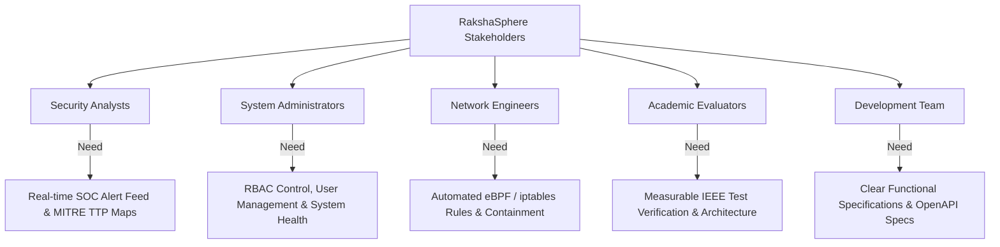
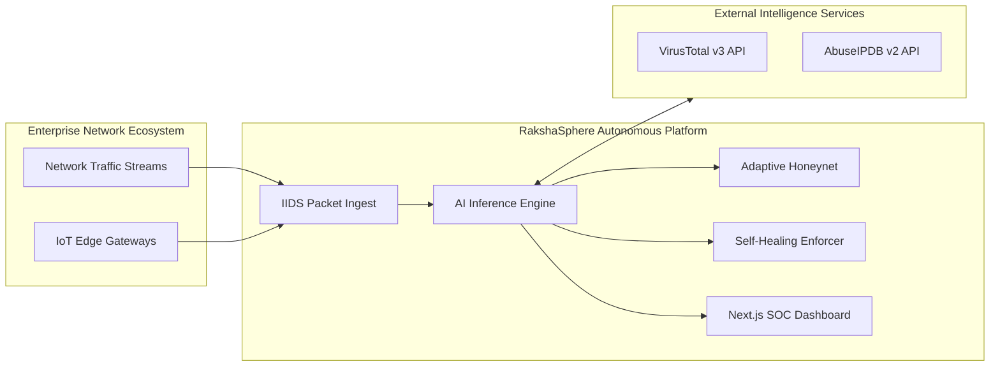
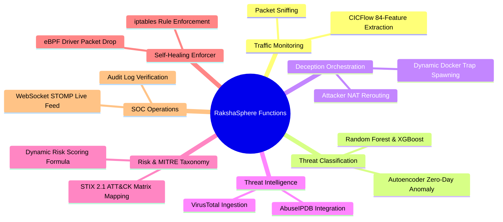
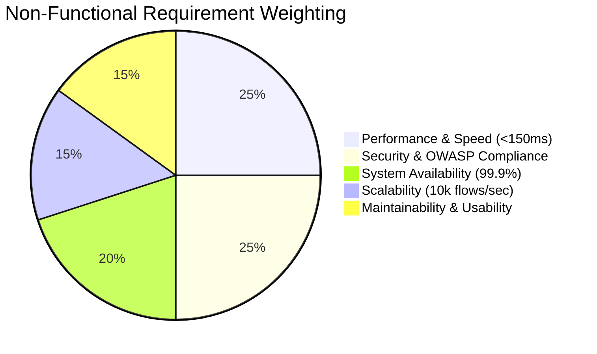
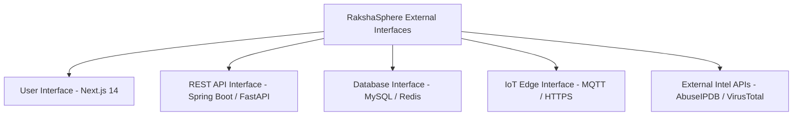
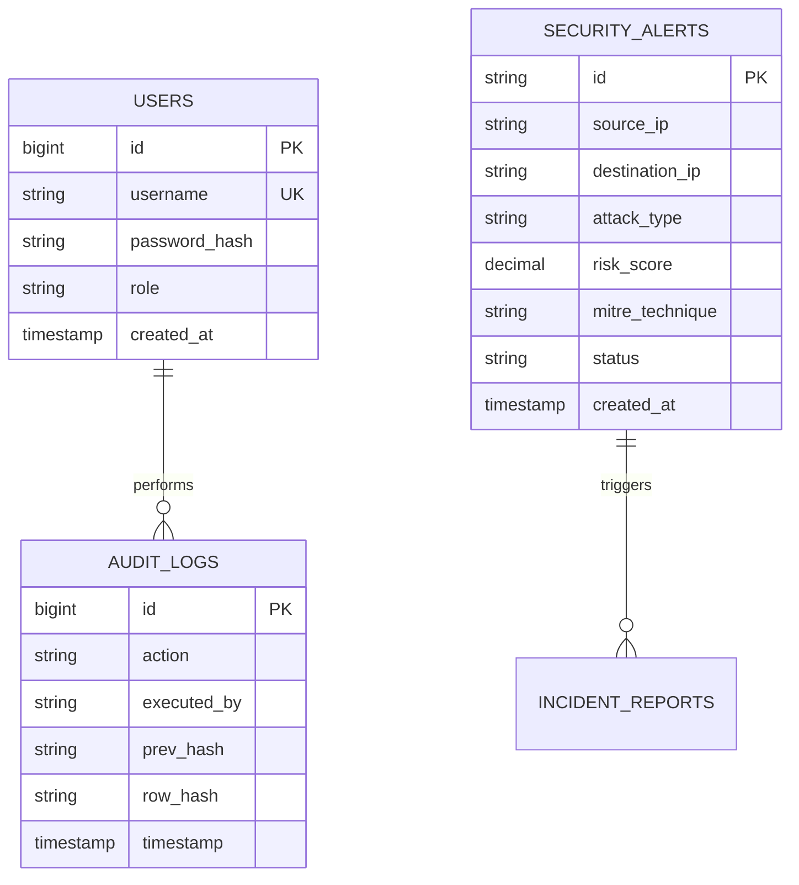

# Software Requirements Specification (SRS)

## RakshaSphere
### AI-Powered Autonomous Cyber Defense & Self-Healing Network Platform

> **Standard**: IEEE Std 29148-2018 / IEEE Std 830-1998 Compliant  
> **Document Identifier**: `SRS-RAKSHASPHERE-2026-V1.0`  
> **Status**: `Approved Baseline`  
> **Classification**: `Official Technical Specification`

---

## 📑 Document Control

### 1. Document Version History
| Version | Date | Description of Changes | Author(s) | Approved By |
| :--- | :--- | :--- | :--- | :--- |
| `0.1.0` | 2026-01-15 | Initial Requirements Draft & Scope Definition | RakshaSphere Core Team | Jigisha Naidu |
| `0.5.0` | 2026-04-10 | Added AI Engine & Self-Healing Functional Specs | Fardeen Akmal, Sushil Nirmal | Suvajit Ghosh |
| `1.0.0` | 2026-08-02 | Finalized IEEE 29148 Compliant SRS Baseline | RakshaSphere Engineering Team | Academic Board |

### 2. Authors & Engineering Roles
| Name | Academic & Professional Role | Primary SRS Focus Area |
| :--- | :--- | :--- |
| **Jigisha Naidu** | B.E. CSE *(IoT, Cyber Security incl. Blockchain)* | AI Model Requirements, Feature Extraction & Risk Scoring |
| **Fardeen Akmal** | B.E. CSE *(IoT, Cyber Security incl. Blockchain)* | Core Backend Specs, Database Schema & Self-Healing Engine |
| **Sushil Nirmal** | B.E. CSE *(IoT, Cyber Security incl. Blockchain)* | Adaptive Honeypot Subsystem & IoT Edge Daemon Specs |
| **Suvajit Ghosh** | B.E. CSE *(IoT, Cyber Security incl. Blockchain)* | Next.js SOC Dashboard, User Interface & Reporting Requirements |

---

## 1. 📌 Introduction

### 1.1 Purpose
This Software Requirements Specification (SRS) document defines the complete functional, non-functional, security, data, and interface requirements for **RakshaSphere** (Version 1.0). Designed under **IEEE Std 29148-2018** guidelines, this specification serves as the binding technical baseline for developers, testers, systems architects, and academic evaluators.

### 1.2 Scope
RakshaSphere is an integrated software platform providing end-to-end autonomous cyber defense. The system's operational boundary encompasses:
- Real-time network packet capture and flow feature extraction (Scapy / CICFlowMeter).
- Machine learning intrusion detection and zero-day anomaly classification (Python / TensorFlow / Scikit-learn).
- Dynamic deception trap instantiation (Docker Honeypots).
- Global threat intelligence enrichment (AbuseIPDB, VirusTotal, MITRE ATT&CK STIX 2.1).
- Dynamic asset risk score computation.
- Closed-loop autonomous self-healing via eBPF/XDP driver drops and `iptables` rules.
- Centralized command and control via a Web-based Security Operations Center (SOC) dashboard (Next.js 14).

### 1.3 Objectives
- **Automated Detection**: Classify multi-stage attack vectors within sub-10ms inference windows.
- **Autonomous Remediation**: Enforce network containment rules in under 150ms upon high-risk validation.
- **Deception Orchestration**: Transparently divert suspicious probing into isolated honeypots without alerting adversaries.
- **Alert Fatigue Reduction**: Aggregate raw events into contextual incidents mapped directly to MITRE ATT&CK TTPs.

### 1.4 Business Need
Modern Enterprise and IoT infrastructure suffer from critical operational vulnerabilities:
1. **High Mean Time to Detect (MTTD) & Respond (MTTR)** when relying on manual operator intervention.
2. **Uncorrelated Alert Storms** generated by conventional signature-based IDS tools.
3. **Lack of Dynamic Deception** to analyze novel adversary techniques in isolated environments.

### 1.5 Project Vision
RakshaSphere transforms enterprise network defense from a passive, reactive posture into a self-defending, resilient ecosystem capable of mitigating threats at machine speed.

---

## 2. 📖 Definitions, Acronyms & Abbreviations

### 2.1 Acronyms & Abbreviations
| Acronym | Full Expansion |
| :--- | :--- |
| **APT** | Advanced Persistent Threat |
| **CIC** | Canadian Institute for Cybersecurity |
| **eBPF** | Extended Berkeley Packet Filter |
| **IEEE** | Institute of Electrical and Electronics Engineers |
| **IIDS** | Intelligent Intrusion Detection System |
| **IOC** | Indicator of Compromise |
| **JWT** | JSON Web Token |
| **MITRE** | Massachusetts Institute of Technology Research Establishment |
| **MSE** | Mean Squared Error |
| **NAT** | Network Address Translation |
| **NFR** | Non-Functional Requirement |
| **RBAC** | Role-Based Access Control |
| **SIEM** | Security Information and Event Management |
| **SOC** | Security Operations Center |
| **STIX** | Structured Threat Information Expression |
| **TTP** | Tactics, Techniques, and Procedures |
| **XDP** | eXpress Data Path |

### 2.2 Glossary
- **Reconstruction MSE**: The squared difference between an autoencoder's input vector and its reconstructed output vector; elevated values indicate uncatalogued zero-day anomalies.
- **Self-Healing Network**: The automated execution of network isolation, socket teardown, or rule injection without human intervention.
- **Honeypot Trap**: A decoy compute instance designed to mimic vulnerable services (SSH, HTTP, Telnet) to capture attacker behavior.

---

## 3. 👥 Stakeholder Analysis



---

## 4. 🌐 Product Perspective

RakshaSphere operates at the intersection of Network Perimeter Defense, AI Inference Engines, and Security Orchestration. It functions as an autonomous protective layer sitting adjacent to enterprise core switches and edge gateways.



---

## 5. ⚙️ Product Functions

RakshaSphere provides twelve (12) high-level product function groups:



---

## 6. 👤 User Classes & Characteristics

| User Class | Technical Expertise | System Privileges | Primary Responsibilities |
| :--- | :--- | :--- | :--- |
| **System Administrator** | Expert | `ROLE_ADMIN` (Full System Access) | User onboarding, system configuration, global rule definition, override controls. |
| **Security Analyst** | Advanced | `ROLE_SOC_ANALYST` (Read/Write Alerts) | Alert triage, honeypot session inspection, incident report generation. |
| **Executive Viewer** | Basic-Intermediate | `ROLE_USER` (Read-Only) | Executive risk summary monitoring and high-level analytics viewing. |
| **Core Developer** | Expert | System Maintainer | Maintaining backend services, tuning AI models, updating signatures. |

---

## 7. 🖥️ Operating Environment & Specifications

### 7.1 Development & Hardware Requirements
- **Server Platform**: Ubuntu 22.04 LTS (x86_64 architecture).
- **Minimum Hardware**: 4 CPU Cores, 8 GB RAM, 20 GB SSD.
- **Recommended Hardware**: 8 CPU Cores, 16 GB RAM, 50 GB NVMe SSD.
- **Network Interface**: Promiscuous mode enabled network interface card (NIC) supporting `libpcap`.

### 7.2 Software & Browser Dependencies
- **JDK**: OpenJDK 21 LTS
- **Node.js**: Node 18.18+ / Node 20.x
- **Python**: Python 3.11+
- **Container Runtime**: Docker Engine 25.0+ & Docker Compose v2.24+
- **Supported Browsers**: Google Chrome (v120+), Mozilla Firefox (v121+), Microsoft Edge (v120+), Apple Safari (v17+).

---

## 8. 📋 Functional Requirements

Requirements are categorized with unique identifiers (`FR-XXX`), priority levels (**HIGH**, **MEDIUM**, **LOW**), explicit dependencies, and testable acceptance criteria.

### 8.1 Authentication & Authorization (`FR-AUTH`)

#### FR-001: User Authentication via Signed JWT
- **Description**: The system shall authenticate users via a REST endpoint using username and password credentials, returning a signed RSA-256 JSON Web Token (JWT) valid for 15 minutes.
- **Priority**: HIGH
- **Dependencies**: None
- **Acceptance Criteria**: Passing valid credentials returns HTTP 200 with JWT access token. Invalid credentials return HTTP 401 Unauthorized.

#### FR-002: Role-Based Access Control (RBAC) Enforcement
- **Description**: The backend shall enforce authorization checks on all protected API endpoints based on user roles (`ROLE_ADMIN`, `ROLE_SOC_ANALYST`, `ROLE_USER`).
- **Priority**: HIGH
- **Dependencies**: FR-001
- **Acceptance Criteria**: A request to `/api/v1/admin/users` by a user with `ROLE_SOC_ANALYST` must return HTTP 403 Forbidden.

---

### 8.2 Traffic Monitoring & Ingestion (`FR-INGEST`)

#### FR-003: Real-Time Network Packet Capture
- **Description**: The system shall capture raw IPv4/IPv6 network packet streams from configured network interfaces using Scapy / libpcap sockets.
- **Priority**: HIGH
- **Dependencies**: None
- **Acceptance Criteria**: Promiscuous socket captures incoming TCP, UDP, and ICMP frames without dropping packets up to 1,000 flows/sec.

#### FR-004: Flow Feature Extraction via CICFlowMeter
- **Description**: The ingestion module shall aggregate raw packet flows into structured 84-feature statistical vectors (including Flow Duration, IAT, Packet Length Mean) using CICFlowMeter logic.
- **Priority**: HIGH
- **Dependencies**: FR-003
- **Acceptance Criteria**: Generated output must match the 84-element float array schema required by the AI Inference Engine.

---

### 8.3 Artificial Intelligence & Threat Detection (`FR-AI`)

#### FR-005: Multi-Model Ensemble Inference
- **Description**: The AI Engine shall pass 84-feature flow vectors through Random Forest and XGBoost models to classify known threat types (DDoS, SYN Scan, Brute Force).
- **Priority**: HIGH
- **Dependencies**: FR-004
- **Acceptance Criteria**: Inference must return a classification label and confidence score ($0.0 - 1.0$) within 10 milliseconds per flow.

#### FR-006: Deep Autoencoder Zero-Day Anomaly Detection
- **Description**: The AI Engine shall evaluate input vectors through an 84-64-32-8-32-64-84 Deep Autoencoder model and calculate reconstruction Mean Squared Error (MSE).
- **Priority**: HIGH
- **Dependencies**: FR-004
- **Acceptance Criteria**: Inputs yielding an MSE value exceeding the configured baseline threshold ($\text{MSE} > 0.045$) shall be flagged with `is_anomaly = true`.

---

### 8.4 Adaptive Honeypot Subsystem (`FR-DECEPTION`)

#### FR-007: Dynamic Honeypot Container Spawning
- **Description**: Upon receiving suspicious reconnaissance alerts below high-confidence blocking thresholds, the backend shall spin up isolated decoy Docker containers (SSH, HTTP, Telnet).
- **Priority**: MEDIUM
- **Dependencies**: FR-005
- **Acceptance Criteria**: Decoy container must instantiate and reach `RUNNING` status within 2.5 seconds of trigger call.

#### FR-008: Attacker NAT Diversion
- **Description**: The platform shall automatically apply host `iptables` PREROUTING rules to redirect malicious IP traffic to the decoy container port without resetting the TCP connection.
- **Priority**: HIGH
- **Dependencies**: FR-007
- **Acceptance Criteria**: Attacker connection on port 22 is transparently routed to decoy container port 2222.

---

### 8.5 Threat Intelligence & MITRE ATT&CK (`FR-INTEL`)

#### FR-009: External Threat Intelligence Aggregation
- **Description**: The system shall query AbuseIPDB and VirusTotal APIs for external malicious IP reputation scores and domain maliciousness ratings.
- **Priority**: MEDIUM
- **Dependencies**: FR-005
- **Acceptance Criteria**: Returned abuse confidence score and country code are cached in Redis with a 24-hour Time-to-Live (TTL).

#### FR-010: MITRE ATT&CK TTP Taxonomy Mapping
- **Description**: The backend shall correlate detected threat types with official STIX 2.1 MITRE ATT&CK Matrix TTP identifiers (e.g., T1110 for Brute Force).
- **Priority**: HIGH
- **Dependencies**: FR-005
- **Acceptance Criteria**: Generated alert JSON includes valid MITRE Tactic (`TA0001`) and Technique (`T1110`) fields.

---

### 8.6 Dynamic Risk Scoring (`FR-RISK`)

#### FR-011: Algorithmic Dynamic Risk Calculation
- **Description**: The backend shall compute a normalized dynamic Risk Score ($0 - 100$) for every incident using the mathematical formula:
  $$\text{Risk Score} = \min \left( 100, \, \left[ \frac{\text{Severity} \times \text{Confidence} \times \text{Asset Weight}}{\text{Mitigation Factor}} \right] \times 10 \right)$$
- **Priority**: HIGH
- **Dependencies**: FR-005, FR-009
- **Acceptance Criteria**: Computed risk score is correctly stored as a DECIMAL(5,2) value in the MySQL database.

---

### 8.7 Autonomous Self-Healing Engine (`FR-HEAL`)

#### FR-012: eBPF / XDP Driver-Level Packet Drop
- **Description**: For validated threats with Risk Scores $\ge 75$, the self-healing engine shall inject low-level eBPF XDP filter rules to drop attacker frames at the network interface driver layer.
- **Priority**: HIGH
- **Dependencies**: FR-011
- **Acceptance Criteria**: Malicious IP traffic is dropped at the NIC driver before reaching kernel socket buffers within 150ms of alert trigger.

#### FR-013: Active Socket & Session Termination
- **Description**: The self-healing engine shall issue TCP RST packets or `ss -k` kill commands to instantly tear down established malicious TCP connections.
- **Priority**: HIGH
- **Dependencies**: FR-011
- **Acceptance Criteria**: Active TCP sessions associated with blocked IPs are closed within 50 milliseconds.

---

### 8.8 SOC Operations & Visualization (`FR-SOC`)

#### FR-014: Real-Time WebSocket Telemetry Stream
- **Description**: The system shall broadcast live security alerts, honeypot telemetry, and self-healing action logs to connected SOC clients over WebSockets using STOMP over SockJS.
- **Priority**: HIGH
- **Dependencies**: FR-011, FR-012
- **Acceptance Criteria**: Alerts appear on connected Next.js dashboard UI in sub-second latency (< 500ms).

#### FR-015: Manual Self-Healing Override Console
- **Description**: The SOC dashboard shall provide authorized administrators with an explicit interface to manually unblock IPs or revert applied `iptables` / eBPF rules.
- **Priority**: HIGH
- **Dependencies**: FR-002, FR-012
- **Acceptance Criteria**: Executing an unblock action removes the host firewall rule and logs an audit entry.

---

### 8.9 Audit Trail & Cryptographic Integrity (`FR-AUDIT`)

#### FR-016: Cryptographic Hash Chained Audit Log
- **Description**: Every system configuration change, authentication event, and self-healing action must be recorded in an immutable MySQL audit log table where each record contains the SHA-256 hash of the previous record.
- **Priority**: HIGH
- **Dependencies**: None
- **Acceptance Criteria**: Any manual tampering with historical database rows causes audit verification checks to flag a hash mismatch.

---

## 9. ⚡ Non-Functional Requirements (NFRs)



| ID | NFR Category | Requirement Specification | Measurement / Verification Method |
| :--- | :--- | :--- | :--- |
| **NFR-001** | **Performance** | Threat inference latency must not exceed 10ms per 84-feature flow vector. | Measured via FastAPI benchmark timer metrics. |
| **NFR-002** | **Performance** | End-to-end self-healing containment execution must complete in < 150ms. | Execution timer logs from packet capture to eBPF drop. |
| **NFR-003** | **Availability** | Platform core services must achieve 99.9% uptime during operational monitoring. | Measured via Docker container health check probes over 30 days. |
| **NFR-004** | **Reliability** | System must gracefully degrade using circuit breakers if threat intel APIs time out (>2s). | Verified via Chaos Engineering synthetic API drop tests. |
| **NFR-005** | **Scalability** | Ingestion pipeline must handle sustained traffic up to 10,000 flows/second without frame loss. | Verified using `tcpreplay` on CIC-IDS2017 PCAP datasets. |
| **NFR-006** | **Security** | All web communications must be encrypted using TLS 1.3; API tokens must use RSA-256 JWTs. | Verified via OWASP ZAP automated security scan. |
| **NFR-007** | **Security** | User passwords must be hashed using BCrypt with a minimum cost factor of 12. | Inspection of database password hash representations. |
| **NFR-008** | **Maintainability**| Frontend and Backend codebases must maintain >80% unit test coverage. | Verified via SonarQube / Jacoco code coverage reports. |
| **NFR-009** | **Portability** | Complete application stack must deploy on any OS supporting Docker Engine v25+ and Docker Compose v2.24+. | Verified across Ubuntu 22.04 LTS, macOS Sonoma, and Windows 11 WSL2. |
| **NFR-010** | **Usability** | Dashboard UI must load fully within < 1.5 seconds on standard broadband connections. | Verified via Google Lighthouse Performance Audits. |

---

## 10. 🔌 External Interface Requirements



### 10.1 User Interface Requirements
- Dark-themed Responsive Web Interface supporting $1920 \times 1080$ and $1366 \times 768$ screen resolutions.
- Real-time SVG-based threat radar chart, heatmaps, and dynamic alert timelines.

### 10.2 Application Programming Interfaces (APIs)
- **Spring Boot REST API**: Endpoint prefix `/api/v1`, OpenAPI 3.0 / Swagger documented.
- **FastAPI AI Engine API**: Internal endpoint `/predict`, accepting JSON arrays.
- **STOMP WebSocket Interface**: WebSockets endpoint `/ws-soc`, topic subscription `/topic/alerts`.

---

## 11. 🗄️ Data Requirements & ER Model



### 11.1 Data Integrity & Validation Rules
- All IP addresses stored as valid IPv4/IPv6 string formats.
- Risk scores constrained within range $[0.00, 100.00]$.
- Cryptographic hash chaining enforced on `AUDIT_LOGS` table inserts.

---

## 12. 🤖 AI & Machine Learning Requirements

1. **Training Dataset**: Baseline models trained on CIC-IDS2017 and UNSW-NB15 standardized intrusion datasets.
2. **Model Accuracy Thresholds**:
   - Random Forest / XGBoost: Combined Accuracy $\ge 99.0\%$, Precision $\ge 98.5\%$, Recall $\ge 98.0\%$.
   - Deep Autoencoder: Zero-Day Anomaly Detection Rate $\ge 95.0\%$ with False Positive Rate $< 1.5\%$.
3. **Model Versioning**: Trained binary models (`.pkl`, `.h5`) version-controlled using Joblib metadata headers.

---

## 13. 📟 IoT Edge Requirements

1. **Daemon Footprint**: Python edge daemon executable operating within $< 25 \text{ MB}$ RAM and $< 2\%$ CPU utilization on ARM64 single-board computers (Raspberry Pi 4).
2. **Device Registration**: IoT devices register securely with central backend via HMAC-SHA256 authenticated REST endpoints.
3. **Heartbeat Monitoring**: Edge nodes send telemetry heartbeats every 10 seconds; failure to ping for 3 consecutive intervals triggers an offline device status alert.

---

## 14. 📊 Reporting Requirements

RakshaSphere provides exportable security and compliance reports:
- **Executive Security Summary**: PDF report summarizing monthly attack trends, top threat origin IPs, and self-healing action counts.
- **Detailed Forensic Incident Report**: JSON / CSV export containing raw PCAP timestamps, CICFlow feature vectors, honeypot keystrokes, and assigned MITRE TTPs.

---

## 15. ⚠️ Constraints, Assumptions & Risks

### 15.1 Technical & Operational Constraints
- **Hardware Limitations**: Ingestion performance capped at network interface adapter throughput (1 Gbps testing environment).
- **Kernel Permissions**: eBPF driver loading and `iptables` rule modification require Linux `CAP_NET_ADMIN` privileges.

### 15.2 Key Assumptions
- Network interfaces operate in promiscuous mode to capture raw subnet traffic.
- Target host OS is Linux-based (Ubuntu 22.04 LTS) for eBPF / `iptables` execution.

### 15.3 Risk & Mitigation Matrix

| Risk ID | Identified Risk | Risk Level | Mitigation Strategy |
| :--- | :--- | :--- | :--- |
| **RSK-001** | High traffic volumes drop packets before feature extraction. | HIGH | Utilize asynchronous multi-threaded flow buffers in CICFlowMeter. |
| **RSK-002** | External Threat Intel APIs rate-limit or fail requests. | MEDIUM | Cache lookups in Redis (24h TTL) and wrap calls in Resilience4j circuit breakers. |
| **RSK-003** | False positive alert triggers automated block on legitimate user IP. | HIGH | Implement Administrator White-listing tables and manual SOC override buttons. |

---

## 16. 🎭 Use Case Analysis

### Use Case Diagram

```mermaid
usecaseDiagram
    actor Administrator as "System Administrator"
    actor Analyst as "SOC Security Analyst"

    package RakshaSphere_System {
        usecase UC1 as "UC-001: Authenticate User"
        usecase UC2 as "UC-002: Monitor Real-Time SOC Dashboard"
        usecase UC3 as "UC-003: Inspect Honeypot Session"
        usecase UC4 as "UC-004: Execute Manual Self-Healing Override"
        usecase UC5 as "UC-005: Generate Incident Forensic Report"
        usecase UC6 as "UC-006: Manage System Users & RBAC"
    }

    Administrator --> UC1
    Administrator --> UC4
    Administrator --> UC6

    Analyst --> UC1
    Analyst --> UC2
    Analyst --> UC3
    Analyst --> UC5
```

### Detailed Use Case Specifications

#### Use Case UC-001: Authenticate User
- **Primary Actor**: All Users (Administrator, Analyst, Viewer).
- **Preconditions**: User possesses valid credentials and system login page is accessible.
- **Main Success Scenario**:
  1. User navigates to `/login` on Next.js dashboard.
  2. User enters username and password, then submits form.
  3. Backend verifies credentials against BCrypt hashes in MySQL.
  4. Backend issues signed JWT access token.
  5. UI stores token and redirects user to `/dashboard`.
- **Alternate Flow**:
  - *3a. Invalid Credentials*: System displays error message "Invalid username or password" (HTTP 401).

#### Use Case UC-004: Execute Manual Self-Healing Override
- **Primary Actor**: System Administrator.
- **Preconditions**: Administrator is authenticated with `ROLE_ADMIN` and an active IP block exists.
- **Main Success Scenario**:
  1. Administrator views blocked IP entry on SOC Dashboard.
  2. Administrator clicks "Unblock & Revert Rule".
  3. Frontend sends `POST /api/v1/self-healing/remediate` request with target IP.
  4. Backend instructs Self-Healing Engine to delete `iptables` / eBPF drop entry.
  5. System appends cryptographic audit record to MySQL `AUDIT_LOGS`.
  6. Dashboard updates IP status to `UNBLOCKED`.

---

## 17. 🔍 Requirements Traceability Matrix (RTM)

| Requirement ID | Requirement Summary | Architectural Module | Verification Method |
| :--- | :--- | :--- | :--- |
| **FR-001** | JWT Authentication | Backend Core (`Spring Security`) | Unit / Integration Test |
| **FR-003** | Real-Time PCAP Capture | Network Ingestion (`Scapy`) | Functional Test |
| **FR-005** | ML Threat Classification | AI Engine (`FastAPI / Scikit-Learn`) | Model Accuracy Benchmark |
| **FR-006** | Autoencoder Zero-Day Anomaly | AI Engine (`TensorFlow Autoencoder`) | Anomaly MSE Test |
| **FR-007** | Dynamic Honeypot Spawning | Deception Subsystem (`Docker Socket API`) | Integration Test |
| **FR-011** | Dynamic Risk Scoring | Backend Core (`RiskEngine.java`) | Mathematical Unit Test |
| **FR-012** | eBPF Driver Packet Drop | Self-Healing Engine (`eBPF/XDP`) | System Containment Test |
| **FR-014** | WebSocket Telemetry Stream | SOC Frontend (`Next.js / STOMP`) | End-to-End Test |
| **FR-016** | Hash-Chained Audit Trail | Database Subsystem (`MySQL AuditLog`) | Integrity Verification Test |

---

## 18. 🎯 System Acceptance Criteria

The RakshaSphere platform shall be deemed accepted and ready for production deployment upon satisfying the following empirical conditions:

1. **Detection Accuracy**: $\ge 99.0\%$ classification accuracy on benchmark CIC-IDS2017 test flows.
2. **Containment Speed**: Sub-150ms end-to-end response time from packet ingress to eBPF driver drop enforcement.
3. **Deception Functionality**: Successful redirection of port probing traffic into isolated Docker honeypot containers without session failure.
4. **Dashboard Responsiveness**: Real-time STOMP WebSocket alert rendering on Next.js UI with sub-second (< 500ms) latency.
5. **Security Compliance**: Zero Critical or High vulnerabilities identified during OWASP ZAP automated security scanning.
6. **Traceability**: 100% pass rate across all functional test cases mapped in the Requirements Traceability Matrix.

---

## 19. 📚 Appendix & Standards References

- **IEEE Std 29148-2018**: *ISO/IEC/IEEE International Standard - Systems and software engineering — Life cycle processes — Requirements engineering*.
- **IEEE Std 830-1998**: *IEEE Recommended Practice for Software Requirements Specifications*.
- **OWASP Top 10:2021**: *The Ten Most Critical Web Application Security Risks*.
- **MITRE ATT&CK Framework v14.1**: *Adversary Tactics, Techniques, and Procedures (TTP) Knowledge Base*.
- **CIC-IDS2017 Dataset**: *Canadian Institute for Cybersecurity Intrusion Detection Benchmark Dataset*.
