# System Design Document (SDD)

## RakshaSphere
### AI-Powered Autonomous Cyber Defense & Self-Healing Network Platform

> **Document Identifier**: `SDD-RAKSHASPHERE-2026-V1.0`  
> **Classification**: `Official High-Level & Low-Level Design Specification`  
> **Target Audience**: `Software Architects, Core Engineering Team, DevOps Engineers, Academic Evaluators`

---

## 📑 Table of Contents

1. [Executive Summary](#1-executive-summary)
2. [Design Goals & Constraints](#2-design-goals--constraints)
3. [High-Level Design (HLD)](#3-high-level-design-hld)
   - [System Context Diagram](#31-system-context-diagram)
   - [High-Level System Architecture](#32-high-level-system-architecture)
   - [C4 Container Diagram](#33-c4-container-diagram)
   - [System Component Diagram](#34-system-component-diagram)
   - [Package Structure Diagram](#35-package-structure-diagram)
   - [Deployment Architecture Diagram](#36-deployment-architecture-diagram)
4. [Low-Level Design (LLD) - Subsystem Modules](#4-low-level-design-lld---subsystem-modules)
   - [1. Frontend Presentation Module](#1-frontend-presentation-module)
   - [2. Backend Core Orchestrator](#2-backend-core-orchestrator)
   - [3. Artificial Intelligence Engine](#3-artificial-intelligence-engine)
   - [4. Database Subsystem](#4-database-subsystem)
   - [5. Threat Intelligence Subsystem](#5-threat-intelligence-subsystem)
   - [6. Adaptive Honeypot Subsystem](#6-adaptive-honeypot-subsystem)
   - [7. Autonomous Self-Healing Engine](#7-autonomous-self-healing-engine)
   - [8. IoT Edge Agent Daemon](#8-iot-edge-agent-daemon)
5. [Frontend Design Specification](#5-frontend-design-specification)
6. [Backend Core Design Specification](#6-backend-core-design-specification)
7. [AI Engine Architecture & Model Pipeline](#7-ai-engine-architecture--model-pipeline)
8. [Adaptive Deception & Honeypot Subsystem Design](#8-adaptive-deception--honeypot-subsystem-design)
9. [Threat Intelligence & MITRE Correlation Design](#9-threat-intelligence--mitre-correlation-design)
10. [Autonomous Self-Healing Network Design](#10-autonomous-self-healing-network-design)
11. [SOC Operations Dashboard Design](#11-soc-operations-dashboard-design)
12. [IoT Edge & Mesh Communication Design](#12-iot-edge--mesh-communication-design)
13. [Database Design & Logical ER Schema](#13-database-design--logical-er-schema)
14. [Request & Execution Flow (Sequence Diagrams)](#14-request--execution-flow-sequence-diagrams)
15. [Authentication & Authorization Design](#15-authentication--authorization-design)
16. [Data Flow Architecture (DFD Level 1 & 2)](#16-data-flow-architecture-dfd-level-1--2)
17. [Error Handling & Resilience Strategy](#17-error-handling--resilience-strategy)
18. [Logging, Audit & Telemetry Strategy](#18-logging-audit--telemetry-strategy)
19. [Performance, Caching & Concurrency Strategy](#19-performance-caching--concurrency-strategy)
20. [Security Design & Hardening Standards](#20-security-design--hardening-standards)
21. [Deployment & CI/CD Pipeline Design](#21-deployment--cicd-pipeline-design)
22. [Design Patterns & Architectural Taxonomy](#22-design-patterns--architectural-taxonomy)
23. [Scalability & Capacity Planning](#23-scalability--capacity-planning)
24. [Unified UML Diagrams Library](#24-unified-uml-diagrams-library)
25. [Repository Folder Responsibility Matrix](#25-repository-folder-responsibility-matrix)
26. [Technical Decisions & Trade-off Analysis](#26-technical-decisions--trade-off-analysis)
27. [Future Architectural Roadmap](#27-future-architectural-roadmap)

---

## 1. 🎯 Executive Summary

**RakshaSphere** is an enterprise-grade autonomous cyber defense platform engineered to solve critical operational bottlenecks in Security Operations Centers (SOCs). By combining low-latency packet flow analysis, machine learning threat classification, dynamic honeypot traps, threat intelligence aggregation (AbuseIPDB, VirusTotal, MITRE ATT&CK), automated risk scoring, and autonomous network remediation (eBPF/iptables), RakshaSphere delivers a **closed-loop security architecture** capable of detecting and containing threats within milliseconds.

This document presents both the **High-Level Design (HLD)** and **Low-Level Design (LLD)** specifications required for full system implementation by a four-member engineering team.

---

## 2. 🛡️ Design Goals & Constraints

| Goal | Engineering Specification | Design Mechanism |
| :--- | :--- | :--- |
| **Scalability** | Support up to 10,000 flows/sec and multi-container scale-out | Asynchronous worker threads, Redis caching, stateless REST API nodes. |
| **Performance** | Inference latency $< 10\text{ms}$; Self-healing containment $< 150\text{ms}$ | eBPF XDP driver drops, optimized NumPy vector math, HikariCP pool. |
| **Security** | Zero Trust Architecture & OWASP Top 10 compliance | OAuth2/JWT authentication, RBAC, TLS 1.3, AES-256 GCM, immutable hash audit chains. |
| **Maintainability** | Clean Code & Domain-Driven Design (DDD) | Decoupled 6-tier layering, strict Java 21 / TypeScript type checking. |
| **Extensibility** | Modular plugin interfaces | Strategy & Factory patterns for honeypot types and threat intel feeds. |
| **Reliability** | 99.9% availability & fault tolerance | Resilience4j circuit breakers, automated Docker container restarts. |
| **Availability** | Continuous live telemetry streaming | Dual-node failover support and WebSockets fallback via SockJS. |

---

## 3. 🏗️ High-Level Design (HLD)

### 3.1 System Context Diagram

```mermaid
graph TB
    actor Analyst as "SOC Security Analyst"
    actor Admin as "System Administrator"

    subgraph Platform_Boundary ["RakshaSphere System Boundary"]
        SystemCore["RakshaSphere Autonomous Engine\n(Next.js / Spring Boot 3 / Python AI)"]
    end

    ExtNetwork["Target Enterprise Subnet / IoT Devices"]
    ExtIntel["External Threat Intel APIs\n(AbuseIPDB / VirusTotal)"]
    Attacker["External Adversary / Botnet"]

    Attacker -->|Intrusion / Probe Traffic| ExtNetwork
    ExtNetwork -->|Raw Packets / Flow Vectors| SystemCore
    SystemCore -->|eBPF Drop / NAT Diversion| ExtNetwork
    SystemCore <-->|Fetch Reputation & Hashes| ExtIntel
    Analyst -->|Monitor & Triage Alerts| SystemCore
    Admin -->|System RBAC & Override Rules| SystemCore
```

---

### 3.2 High-Level System Architecture

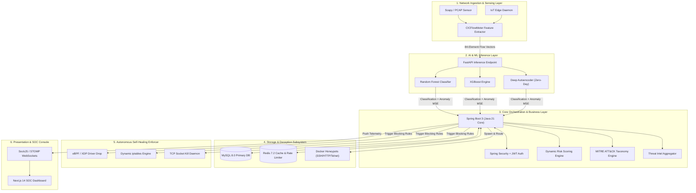

---

### 3.3 C4 Container Diagram

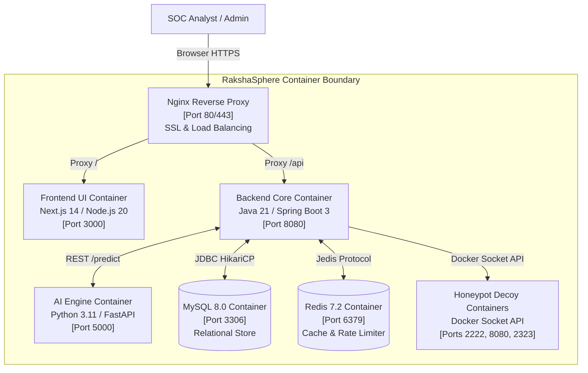

---

### 3.4 System Component Diagram

```mermaid
component
    package "Network Sensor" {
        [Packet Sniffer] --> [Flow Aggregator]
    }

    package "AI Microservice" {
        [Feature Normalizer] --> [ML Model Classifier]
    }

    package "Backend Orchestrator" {
        [Security Event Bus] --> [Risk Calculation Engine]
        [Security Event Bus] --> [MITRE Taxonomy Mapper]
        [Security Event Bus] --> [Self-Healing Controller]
    }

    package "Persistence Layer" {
        database "MySQL Storage"
        database "Redis Cache"
    }

    package "Deception Engine" {
        [Container Manager] --> [Decoy Traps]
    }

    package "SOC Presentation" {
        [Dashboard UI]
    }

    [Flow Aggregator] ..> [Feature Normalizer] : HTTP REST
    [ML Model Classifier] ..> [Security Event Bus] : JSON Payload
    [Self-Healing Controller] ..> [MySQL Storage] : JPA Write
    [Self-Healing Controller] ..> [Decoy Traps] : Docker Socket
    [Security Event Bus] ..> [Dashboard UI] : WebSockets (STOMP)
```

---

### 3.5 Package Structure Diagram

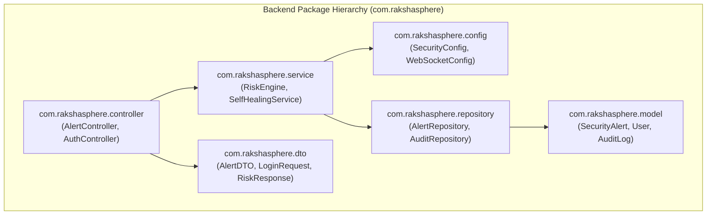

---

### 3.6 Deployment Architecture Diagram

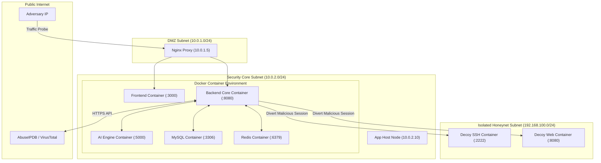

---

## 4. ⚙️ Low-Level Design (LLD) - Subsystem Modules

Detailed module specifications follow a standardized enterprise template detailing **Purpose**, **Responsibilities**, **Internal Components**, **Inputs**, **Outputs**, **Dependencies**, **Error Handling**, and **Future Expansion**.

### 1. Frontend Presentation Module
- **Purpose**: Provides a responsive single-page web console for security analysts and administrators.
- **Responsibilities**: Renders real-time WebSocket alert feeds, threat heatmaps, honeypot streams, user management interfaces, and manual self-healing override controls.
- **Internal Components**:
  - `AlertFeed`: Renders STOMP WebSocket security alerts.
  - `MitreMatrix`: Interactive SVG visualization of MITRE ATT&CK TTPs.
  - `HoneypotTerminal`: Web console streaming honeypot keystrokes.
  - `AuthContext`: React context managing JWT tokens and session expiration.
- **Inputs**: STOMP WebSocket frames, user interactions, REST JSON payloads.
- **Outputs**: Formatted React UI views, REST API HTTP requests.
- **Dependencies**: React 18, Next.js 14, Tailwind CSS, Lucide React, Recharts, SockJS-client, StompJS.
- **Error Handling**: Graceful fallback UI states on WebSocket disconnect; auto-reconnect with exponential backoff.
- **Future Expansion**: Progressive Web App (PWA) support with native push notifications.

---

### 2. Backend Core Orchestrator
- **Purpose**: Acts as the central domain orchestrator and business logic execution engine.
- **Responsibilities**: Manages session state, calculates dynamic risk scores, routes events, enforces security policies, queries threat intelligence APIs, and manages Docker honeypot lifecycles.
- **Internal Components**:
  - `SecurityEventBus`: Spring `@EventListener` internal application event bus.
  - `RiskScoringEngine`: Implementation of dynamic risk scoring mathematical logic.
  - `MitreMapperService`: Taxonomy translator mapping alert signatures to STIX 2.1 ATT&CK IDs.
  - `SelfHealingService`: Invokes local OS eBPF/iptables system sub-routines.
- **Inputs**: AI prediction JSON payloads, HTTP REST requests, Threat Intel API responses.
- **Outputs**: MySQL entity persistence, STOMP WebSocket broadcasts, Docker API calls, OS execution commands.
- **Dependencies**: Java 21 LTS, Spring Boot 3.2, Spring Security, Hibernate ORM, Nimbus JOSE JWT, Resilience4j.
- **Error Handling**: Custom `@ControllerAdvice` global exception handling returning standardized `ProblemDetail` RFC-7807 responses.
- **Future Expansion**: Migration to Apache Kafka for multi-node event streaming.

---

### 3. Artificial Intelligence Engine
- **Purpose**: Real-time feature processing, intrusion classification, and zero-day anomaly evaluation.
- **Responsibilities**: Normalizes incoming 84-element flow arrays, executes machine learning model predictions, computes autoencoder reconstruction loss, and outputs classification metadata.
- **Internal Components**:
  - `FeatureScaler`: Normalizes raw flow metrics using saved MinMaxScaler pipelines.
  - `RandomForestClassifier`: Supervised model evaluating signature attacks.
  - `XGBoostEngine`: Multi-class gradient boosted decision tree classifier.
  - `AutoencoderDetector`: Neural network calculating reconstruction MSE loss.
- **Inputs**: JSON payload containing raw float array of 84 flow features.
- **Outputs**: JSON object `{ "attack_type": "DDoS", "confidence": 0.98, "is_anomaly": false, "reconstruction_mse": 0.012 }`.
- **Dependencies**: Python 3.11, FastAPI, Scikit-learn, TensorFlow 2.15, NumPy, Joblib.
- **Error Handling**: Pydantic input schema validation returning HTTP 422 on malformed flow vectors.
- **Future Expansion**: NVIDIA TensorRT GPU acceleration for 10Gbps+ pipe monitoring.

---

### 4. Database Subsystem
- **Purpose**: Relational persistence for application data, threat telemetry, asset inventories, and audit logs.
- **Responsibilities**: Stores relational entity data, enforces foreign key integrity, caches rate limits and threat intelligence in Redis.
- **Internal Components**:
  - `users`: User identity and RBAC records.
  - `security_alerts`: Master repository of detected intrusions.
  - `audit_logs`: Append-only cryptographically chained action log.
- **Inputs**: JPA SQL queries and Redis Jedis commands.
- **Outputs**: Query result sets, index lookups, cache validation booleans.
- **Dependencies**: MySQL 8.0 Server, Redis 7.2 Server, HikariCP Connection Pool.
- **Error Handling**: Transactional rollbacks on SQL failure via `@Transactional`.
- **Future Expansion**: Automated monthly table partitioning for historical logs.

---

### 5. Threat Intelligence Subsystem
- **Purpose**: Aggregates external threat context from global intelligence databases.
- **Responsibilities**: Queries AbuseIPDB and VirusTotal APIs, normalizes reputation scores, and caches results.
- **Internal Components**:
  - `AbuseIPDBClient`: Asynchronous WebClient wrapper for AbuseIPDB API v2.
  - `VirusTotalClient`: Hash and domain lookup client for VirusTotal API v3.
  - `StixTaxonomyParser`: Local JSON taxonomy loader for MITRE ATT&CK.
- **Inputs**: Source IP addresses, domain names, file hashes.
- **Outputs**: Enriched threat objects containing confidence percentage, country code, and STIX TTP mappings.
- **Dependencies**: Spring WebClient, Jackson JSON parser, Redis Cache.
- **Error Handling**: Circuit breaker protection via Resilience4j returning cached or default fallback reputation.
- **Future Expansion**: Ingestion of custom STIX/TAXII 2.1 feeds.

---

### 6. Adaptive Honeypot Subsystem
- **Purpose**: Manages dynamic deception environments to isolate and analyze attackers.
- **Responsibilities**: Instantiates low/medium-interaction Docker honeypots (SSH, HTTP, Telnet) and manages host NAT routing rules.
- **Internal Components**:
  - `TrapManager`: Docker Socket Java API client (`docker-java`).
  - `NatRedirector`: Manages host `iptables` PREROUTING NAT modification.
  - `ForensicLogger`: Streams container stdout/stderr logs to database.
- **Inputs**: Trigger signal from Backend Core specifying target IP and protocol.
- **Outputs**: Active trap containers, captured keystrokes, downloaded payload binaries.
- **Dependencies**: Docker Engine API, Linux `iptables`.
- **Error Handling**: Automated container teardown if container resource usage exceeds 512MB RAM.
- **Future Expansion**: QEMU/KVM high-interaction virtual machine honeypots.

---

### 7. Autonomous Self-Healing Engine
- **Purpose**: Executes automated network containment for validated high-risk threats.
- **Responsibilities**: Applies eBPF/XDP driver-level packet drops, updates `iptables` drop chains, and terminates active malicious TCP sockets.
- **Internal Components**:
  - `EbpfLoader`: Loads compiled C bytecodes into Linux kernel XDP hooks.
  - `IptablesController`: Appends dynamic drop rules to host firewall chains.
  - `SocketKiller`: Issues TCP RST packets to close active sockets.
- **Inputs**: Automated remediation command (Target IP, Action Type).
- **Outputs**: Applied kernel filters, killed TCP sessions, updated host firewall rules.
- **Dependencies**: Linux eBPF/XDP, `iptables`, `tcpkill`.
- **Error Handling**: Automatic rollback of firewall rules if host network connectivity is degraded.
- **Future Expansion**: eBPF-based stateful micro-segmentation.

---

### 8. IoT Edge Agent Daemon
- **Purpose**: Lightweight security daemon executing on resource-constrained edge gateways.
- **Responsibilities**: Sniffs local network interfaces, monitors socket states, posts telemetry to central backend, enforces local host drops.
- **Internal Components**:
  - `PacketSniffer`: Scapy socket filter.
  - `HeartbeatSender`: Telemetry ping module.
  - `LocalEnforcer`: Local host `iptables` rule applier.
- **Inputs**: Network interface traffic (`eth0`), central backend containment calls.
- **Outputs**: HTTPS telemetry payloads, local firewall drop rules.
- **Dependencies**: Python 3.11, Scapy, Requests.
- **Error Handling**: Buffers telemetry locally up to 10MB if central server is unreachable.
- **Future Expansion**: Compilation into native Rust binary for ARM Cortex-M microcontrollers.

---

## 5. 💻 Frontend Design Specification

Built on **Next.js 14** utilizing the App Router architecture, TypeScript, and Tailwind CSS.

### 1. Application Layout & Routing
- `/login`: User authentication view with JWT credential validation.
- `/dashboard`: Real-time executive overview, SVG threat radar, and live alert feed.
- `/alerts`: Triage table for filtering and inspecting historical security alerts.
- `/honeypots`: Live forensic view streaming keystrokes from active deception traps.
- `/mitre`: Interactive MITRE ATT&CK TTP heatmap viewer.
- `/settings`: User management and system configuration panel.

### 2. State Management & WebSockets
- **Global Auth State**: Managed via React Context (`AuthContext`) storing the signed JWT token in `sessionStorage`.
- **Live Event Stream**: Custom React Hook (`useWebSocket`) initializing a SockJS connection to `/ws-soc` and subscribing to `/topic/alerts`.

---

## 6. ⚙️ Backend Core Design Specification

Built on **Java 21 LTS** and **Spring Boot 3.2**.

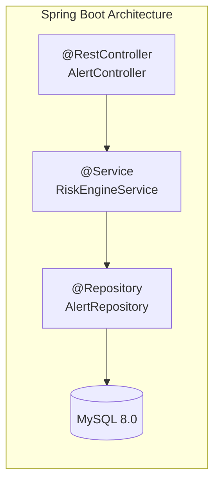

### 1. Controller Layer (`com.rakshasphere.controller`)
Exposes RESTful JSON endpoints protected by Spring Security filters. Returns standardized HTTP responses wrapped in `ResponseEntity<T>`.

### 2. Service Layer (`com.rakshasphere.service`)
Contains core business logic, transactional boundaries (`@Transactional`), risk scoring algorithms, and external API client integrations.

### 3. Repository Layer (`com.rakshasphere.repository`)
Spring Data JPA interfaces extending `JpaRepository<T, ID>`, utilizing optimized JPQL and native SQL queries.

---

## 7. 🧠 AI Engine Architecture & Model Pipeline

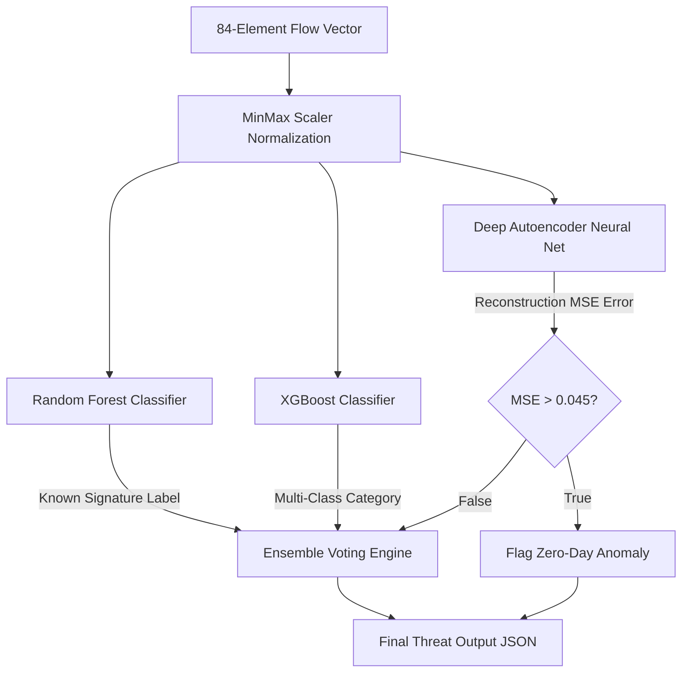

1. **Random Forest & XGBoost**: Trained on CIC-IDS2017 intrusion dataset to classify signature attacks (DDoS, SYN Scan, Brute Force).
2. **Deep Autoencoder**: Architecture `84 -> 64 -> 32 -> 8 -> 32 -> 64 -> 84`. Calculates reconstruction error. Elevated MSE ($\text{MSE} > 0.045$) flags zero-day anomalies.

---

## 8. 🍯 Adaptive Deception & Honeypot Subsystem Design

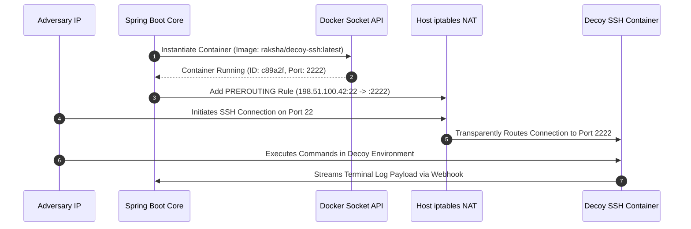

---

## 9. 🌐 Threat Intelligence & MITRE Correlation Design

Incoming attack signatures are mapped to official STIX 2.1 MITRE ATT&CK Matrix identifiers:

| Attack Signature | MITRE Tactic | MITRE Technique ID | Technique Name |
| :--- | :--- | :--- | :--- |
| `SSH_BRUTE_FORCE` | Initial Access (`TA0001`) | `T1110` | Brute Force |
| `PORT_SCAN_SYN` | Discovery (`TA0007`) | `T1046` | Network Service Discovery |
| `HTTP_SQL_INJECTION`| Credential Access (`TA0006`) | `T1190` | Exploit Public-Facing Application |
| `DDOS_SYN_FLOOD` | Impact (`TA0040`) | `T1498` | Network Denial of Service |

---

## 10. 🔄 Autonomous Self-Healing Network Design

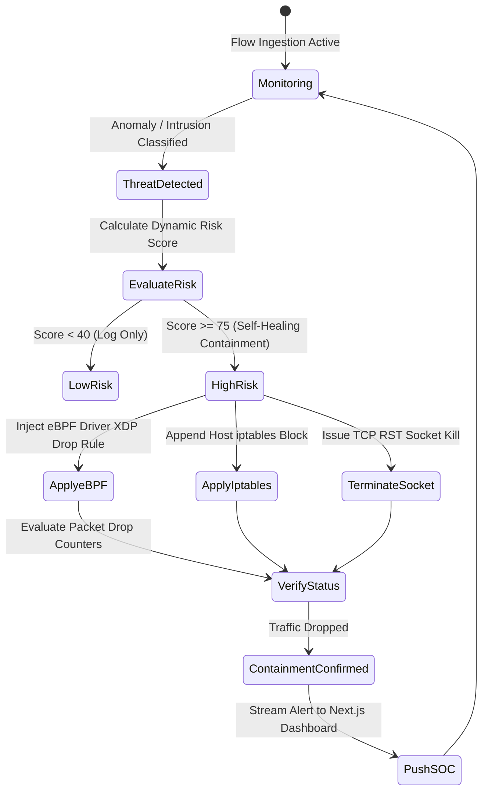

---

## 11. 🖥️ SOC Operations Dashboard Design

The Next.js dashboard features four primary operational widgets:
1. **Live Threat Radar**: SVG radar chart visualizing attack origin vectors and real-time event frequency.
2. **Threat Feed Console**: Real-time STOMP WebSocket alert feed displaying IP, attack type, risk score, and containment status.
3. **MITRE ATT&CK Heatmap**: Interactive grid showing enterprise tactical coverage.
4. **Self-Healing Audit Console**: Historical log of automated eBPF and `iptables` containment actions with manual override controls.

---

## 12. 📟 IoT Edge & Mesh Communication Design

- **Broker**: Mosquitto MQTT Broker listening on TLS port 8883.
- **Topics**:
  - Telemetry: `rakshasphere/iot/{device_id}/telemetry`
  - Heartbeat: `rakshasphere/iot/{device_id}/heartbeat`
  - Control Commands: `rakshasphere/iot/{device_id}/containment`
- **Device Health**: Devices ping heartbeat every 10 seconds; 3 missed pings mark device `OFFLINE`.

---

## 13. 🗄️ Database Design & Logical ER Schema

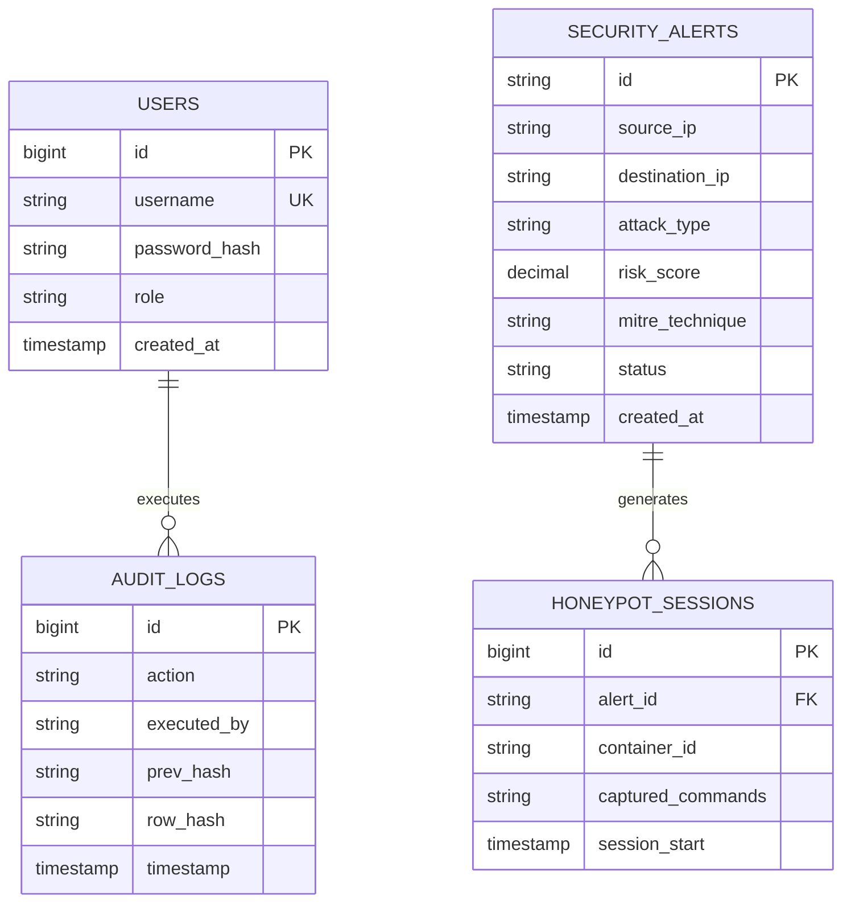

---

## 14. 🔄 Request & Execution Flow (Sequence Diagrams)

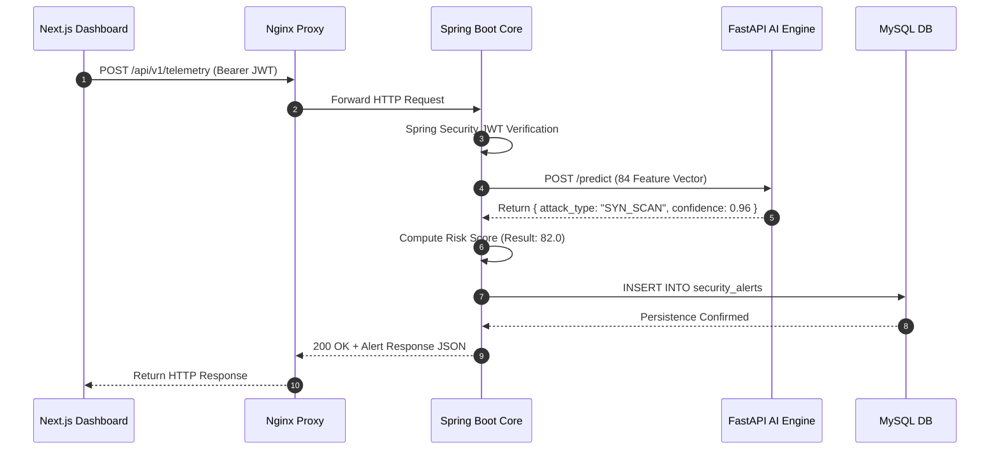

---

## 15. 🔑 Authentication & Authorization Design

- **Mechanism**: Stateless JWT (JSON Web Tokens) signed via RSA-256 private key.
- **Expiration**: Access Token valid for 15 minutes; Refresh Token valid for 7 days.
- **Roles**:
  - `ROLE_ADMIN`: Full administrative and manual rule override access.
  - `ROLE_SOC_ANALYST`: Alert triage, honeypot inspection, report generation.
  - `ROLE_USER`: Read-only executive dashboard monitoring.

---

## 16. 📊 Data Flow Architecture (DFD Level 1 & 2)

```mermaid
flowchart TD
    ExtPackets(("Raw Network Packets"))
    Proc1["1.0 Capture & Extract Flow Features"]
    Proc2["2.0 ML Threat Inference"]
    Proc3["3.0 Threat Intel & Risk Synthesis"]
    Proc4["4.0 Self-Healing Execution"]
    Proc5["5.0 SOC Dashboard Render"]

    StoreAlerts[[(D1) Security Alerts DB]]
    StoreAudit[[(D2) Audit Trail DB]]
    StoreIntel[[(D3) Threat Intel Cache]]

    ExtPackets --> Proc1
    Proc1 -->|84 Feature Vector| Proc2
    Proc2 -->|Threat Classification| Proc3
    Proc3 <-->|Query Cache| StoreIntel
    Proc3 -->|Risk Score + MITRE ID| Proc4
    Proc3 -->|Save Alert Record| StoreAlerts
    Proc4 -->|Inject eBPF / iptables| ExtPackets
    Proc4 -->|Write Audit Log| StoreAudit
    StoreAlerts -->|Stream STOMP WebSockets| Proc5
```

---

## 17. 🚨 Error Handling & Resilience Strategy

- **Backend (Spring Boot)**: Global `@ControllerAdvice` handling exceptions and returning standardized RFC-7807 `ProblemDetail` JSON objects.
- **AI Engine (FastAPI)**: Pydantic schemas validating input arrays; invalid payloads return HTTP 422 Unprocessable Entity.
- **External API Calls**: Wrapped in Resilience4j Circuit Breakers with 2-second fallback timeouts to prevent backend thread starvation.

---

## 18. 📝 Logging, Audit & Telemetry Strategy

1. **Application Logs**: Logged via SLF4J / Logback in structured JSON format (`application.json`).
2. **Security & Audit Logs**: High-priority security actions are written to `AUDIT_LOGS` table with SHA-256 cryptographic hash chaining ($\text{Hash}_n = \text{SHA256}(\text{Data}_n \parallel \text{Hash}_{n-1})$).

---

## 19. ⚡ Performance, Caching & Concurrency Strategy

- **Java 21 Virtual Threads (Project Loom)**: Handles thousands of concurrent HTTP and WebSocket connections with minimal OS thread overhead.
- **Redis Caching**: Caches external Threat Intelligence lookups (24h TTL) and tracks API rate limits (100 req/min per IP).
- **HikariCP Connection Pool**: Configured with 20 active connections and 30-second idle timeouts for high-throughput database I/O.

---

## 20. 🔒 Security Design & Hardening Standards

- **TLS 1.3 Encryption**: Enforced for all web traffic via Nginx reverse proxy.
- **Password Hardening**: User passwords hashed using BCrypt (Cost Factor 12).
- **API Protection**: Token-Bucket Rate Limiting via Redis (`100 req/min`).
- **Container Hardening**: Honeypot containers run with `read_only` root filesystems, `cap_drop: ALL`, and non-root users.

---

## 21. 🐳 Deployment & CI/CD Pipeline Design

### Docker Compose Stack Architecture
- `nginx-proxy`: Port 80/443 (Reverse Proxy & TLS).
- `raksha-frontend`: Port 3000 (Next.js Application).
- `raksha-backend`: Port 8080 (Spring Boot Core).
- `raksha-ai-engine`: Port 5000 (FastAPI AI Inference).
- `raksha-mysql`: Port 3306 (MySQL 8.0 Database).
- `raksha-redis`: Port 6379 (Redis Cache).

### CI/CD Pipeline (GitHub Actions)
`Git Push -> Lint & Build -> Unit Tests (JUnit/pytest) -> Build Docker Images -> Push to Registry -> Deploy Stack`

---

## 22. 🧩 Design Patterns & Architectural Taxonomy

| Design Pattern | Implementation Location | Architectural Purpose |
| :--- | :--- | :--- |
| **Model-View-Controller (MVC)** | Spring Boot Backend Core | Separates REST data controllers from business logic and entities. |
| **Repository Pattern** | Spring Data JPA Repositories | Abstract database access behind clean Java interfaces. |
| **Dependency Injection (DI)** | Spring `@Autowired` / Inversion of Control | Enables loose coupling and easy unit test mocking. |
| **Factory Pattern** | `HoneypotTrapFactory.java` | Instantiates specific decoy container types dynamically. |
| **Strategy Pattern** | `SelfHealingStrategy.java` | Selects eBPF, iptables, or socket kill mitigation algorithm based on risk score. |
| **Observer Pattern** | Spring `ApplicationEventPublisher` | Propagates security events to WebSockets and audit logging services. |
| **Singleton Pattern** | Spring Beans / FastAPI Model Instances | Ensures single shared instance of ML models and connection pools. |

---

## 23. 📈 Scalability & Capacity Planning

- **Horizontal Scale-Out**: Additional FastAPI AI nodes can be added behind Nginx load balancers to process higher packet flow rates.
- **Database Scaling**: Read-heavy alert query workloads can be offloaded to MySQL read-replica instances.

---

## 24. 📊 Unified UML Diagrams Library

### 1. Class Diagram (Core Backend Domain)

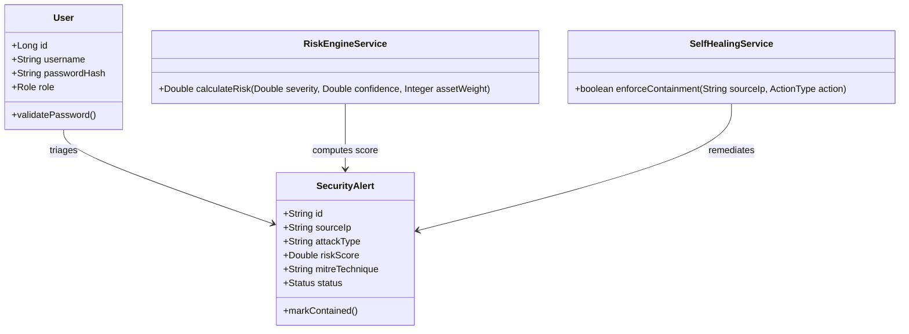

---

### 2. State Diagram (Threat Alert Lifecycle)

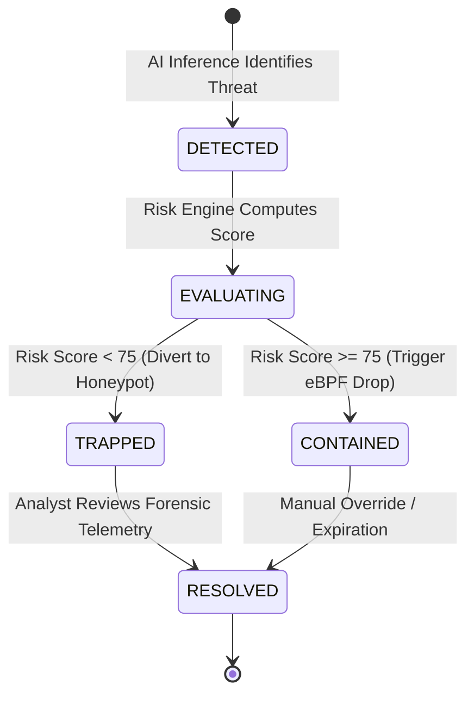

---

### 3. Activity Diagram (Self-Healing Decision Logic)

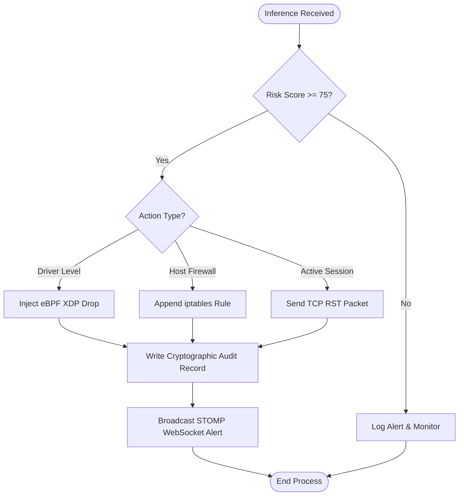

---

## 25. 📁 Repository Folder Responsibility Matrix

| Folder | Engineering Scope & Content Purpose |
| :--- | :--- |
| **`frontend/`** | Next.js 14 Web Application containing App Router pages, Tailwind CSS styles, React hooks, and WebSocket client wrappers. |
| **`backend/`** | Java 21 / Spring Boot 3 microservice source code, including security filters, REST controllers, JPA entities, risk services, and Docker API integrations. |
| **`database/`** | Relational SQL initialization scripts (`init.sql`) and Flyway migrations defining schemas, indexes, and seed datasets. |
| **`ai-engine/`** | Python machine learning service containing FastAPI server (`inference_server.py`), pre-trained binaries (`.pkl`, `.h5`), and model training scripts. |
| **`iot-agent/`** | Lightweight edge security daemon intended for execution on edge nodes to sniff packet headers and enforce local network containment commands. |
| **`docker/`** | Production and development Docker Compose deployment files (`docker-compose.yml`), Nginx reverse proxy configs, and environment templates (`.env.example`). |
| **`docs/`** | Complete master documentation set, including System Architecture (`architecture.md`), SRS (`srs.md`), and System Design (`system-design.md`). |

---

## 26. ⚖️ Technical Decisions & Trade-off Analysis

1. **Spring Boot 3 vs. Express.js**: Spring Boot chosen for enterprise thread safety, native Spring Security RBAC, and Java 21 Virtual Threads.
2. **Next.js 14 vs. Vite React SPA**: Next.js chosen for hybrid Server-Side Rendering (SSR) performance combined with client-side WebSocket hydration.
3. **Python FastAPI vs. Flask**: FastAPI chosen for sub-millisecond async serialization performance (3x faster than Flask).
4. **MySQL 8.0 vs. MongoDB**: MySQL chosen for strict ACID compliance and relational foreign-key integrity required for audit trails and security alerts.

---

## 27. 🔮 Future Architectural Roadmap

1. **Kubernetes Native Operator**: Development of Custom Resource Definitions (CRDs) for deploying RakshaSphere sensors as native K8s DaemonSets.
2. **Enterprise SIEM / SOAR Connectors**: Automated API webhooks for Splunk, Elastic SIEM, and Palo Alto Cortex XSOAR.
3. **Federated Learning Network**: Privacy-preserving collaborative ML model training across distributed enterprise nodes.
4. **Hardware Acceleration**: DPDK (Data Plane Development Kit) integration for 40Gbps+ packet processing.
