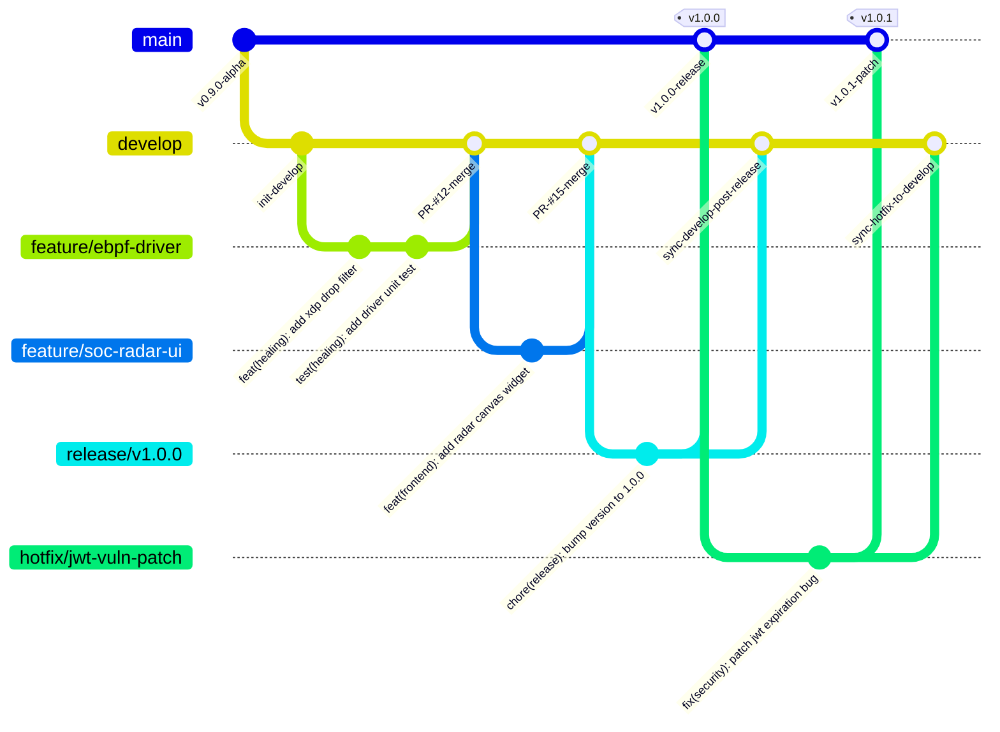
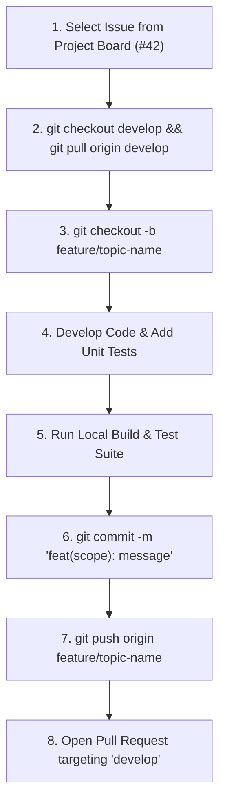
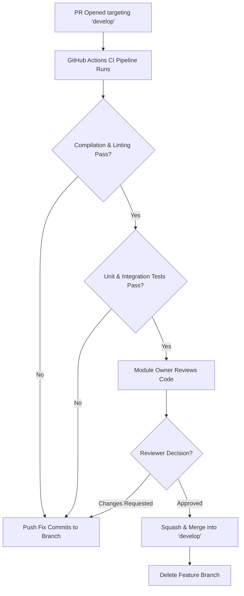
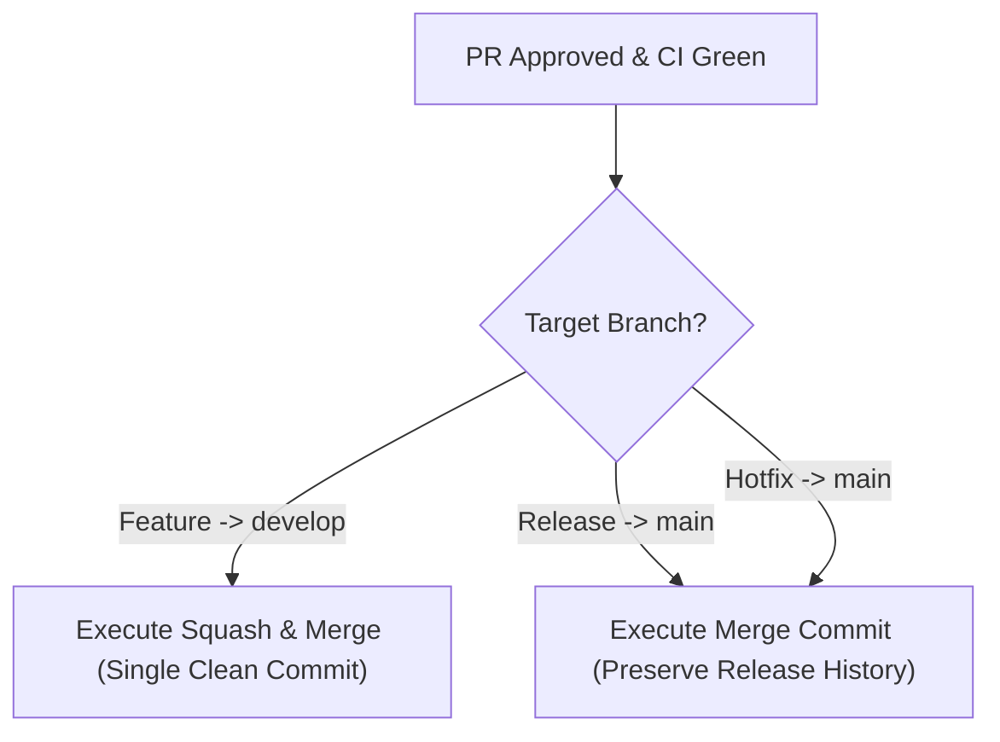
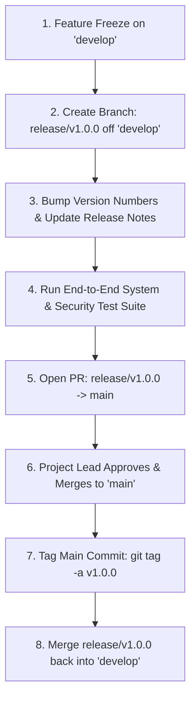
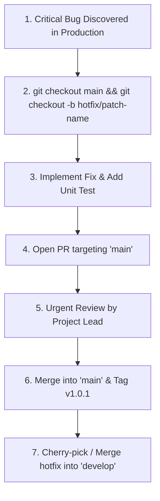

# Master Git Branching Strategy & SCM Workflow Specification

## RakshaSphere
### AI-Powered Autonomous Cyber Defense & Self-Healing Network Platform

> **Document Identifier**: `GIT-STRATEGY-RAKSHASPHERE-2026-V1.0`  
> **Source Control System**: `Git 2.40+ / GitHub Enterprise`  
> **Workflow Model**: `Hybrid GitFlow & GitHub Flow (Optimized for 4-Member Capstone Team)`  
> **Versioning Model**: `Semantic Versioning 2.0.0 (SemVer)`  
> **Classification**: `Official Software Configuration Management & Branching Blueprint`

---

## 📑 Table of Contents

1. [Executive Summary](#1-executive-summary)
2. [Branching Philosophy & SCM Principles](#2-branching-philosophy--scm-principles)
3. [Repository Branch Structure](#3-repository-branch-structure)
4. [Mermaid Git Architecture Graph](#4-mermaid-git-architecture-graph)
5. [Standardized Branch Naming Taxonomy](#5-standardized-branch-naming-taxonomy)
6. [End-to-End Development Workflows](#6-end-to-end-development-workflows)
   - [Feature Development Workflow](#61-feature-development-workflow)
   - [Pull Request (PR) Lifecycle Workflow](#62-pull-request-pr-lifecycle-workflow)
   - [Merge Strategy Decision Flow](#63-merge-strategy-decision-flow)
   - [Weekly Release Flow](#64-weekly-release-flow)
   - [Emergency Hotfix Workflow](#65-emergency-hotfix-workflow)
7. [Git Operations & Conflict Resolution Manual](#7-git-operations--conflict-resolution-manual)
8. [Conventional Commit Message Specification](#8-conventional-commit-message-specification)
9. [Pull Request (PR) Governance & Review Standards](#9-pull-request-pr-governance--review-standards)
10. [Merge Strategy Specification: Squash & Merge](#10-merge-strategy-specification-squash--merge)
11. [Release Management & Semantic Versioning (SemVer)](#11-release-management--semantic-versioning-semver)
12. [GitHub Branch Protection Rules & Policy](#12-github-branch-protection-rules--policy)
13. [Code Ownership & Review Responsibility Matrix](#13-code-ownership--review-responsibility-matrix)
14. [Daily & Weekly Developer Operations Routines](#14-daily--weekly-developer-operations-routines)
15. [GitHub Actions CI/CD Pipeline Integration](#15-github-actions-cicd-pipeline-integration)
16. [Essential Git Command Reference Library](#16-essential-git-command-reference-library)
17. [Risk Assessment & SCM Mitigation Matrix](#17-risk-assessment--scm-mitigation-matrix)
18. [MVP Scope vs. Future SCM Automation Roadmap](#18-mvp-scope-vs-future-scm-automation-roadmap)

---

## 1. 🎯 Executive Summary

The **RakshaSphere Git Branching Strategy & Source Code Management (SCM) Specification** defines the rules, workflows, branch hierarchies, commit conventions, and release procedures governing the project repository.

Designed for a four-member engineering team, this workflow balances enterprise-grade software configuration management (inspired by **GitHub Flow**, **GitFlow**, **Microsoft Engineering System**, **Google Engineering Practices**, and **Semantic Versioning 2.0.0**) with clean, streamlined developer ergonomics.

---

## 2. 🛡️ Branching Philosophy & SCM Principles

A structured Git workflow is essential to maintaining high software quality across a multi-component platform:

- **Isolated Feature Development**: No developer works directly on shared integration branches. All changes occur in short-lived topic branches (`feature/*`, `bugfix/*`).
- **Protected Master State**: The `main` branch always represents stable, deployable production code. The `develop` branch represents active, integrated development code.
- **Traceable History**: Every change in `main` is traceable back to a specific Pull Request, linked GitHub Issue, and verified CI test run.
- **Automated Verification**: GitHub Actions enforces linting, compilation, unit testing, and container security scans before any code can be merged into `develop` or `main`.

---

## 3. 🌿 Repository Branch Structure

RakshaSphere maintains six explicit branch categories:

| Branch Category | Lifespan | Protection Level | Purpose & Target Integration |
| :--- | :--- | :--- | :--- |
| **`main`** | Permanent | **Strictly Protected** | Production release state. Only updated via verified Release or Hotfix PRs. |
| **`develop`** | Permanent | **Protected** | Primary integration branch. All feature and bugfix PRs merge into `develop`. |
| **`feature/*`** | Temporary | Unprotected | Topic branches for new feature development. Merges into `develop`. |
| **`bugfix/*`** | Temporary | Unprotected | Non-urgent defect fixes found during development. Merges into `develop`. |
| **`hotfix/*`** | Temporary | Unprotected | Urgent production hotfixes created off `main`. Merges into `main` and `develop`. |
| **`release/*`** | Temporary | Protected | Version stabilization branches (`release/v1.0.0`). Merges into `main` and `develop`. |
| **`docs/*`** | Temporary | Unprotected | Pure documentation updates under `docs/`. Merges into `develop`. |
| **`research/*`**| Temporary | Unprotected | Architectural experiments or prototyping. Discarded or merged via feature branch. |

---

## 4. 📊 Mermaid Git Architecture Graph



---

## 5. 🏷️ Standardized Branch Naming Taxonomy

Branch names MUST follow the structured format: `category/short-descriptive-title`

| Component Domain | Example Branch Name | Owner / Primary User |
| :--- | :--- | :--- |
| **Core Backend** | `feature/jwt-rsa256-auth` | Fardeen Akmal |
| **Self-Healing** | `feature/ebpf-packet-drop` | Fardeen Akmal |
| **Database** | `feature/audit-hash-chaining` | Fardeen Akmal |
| **Frontend UI** | `feature/soc-alert-feed` | Jigisha Naidu |
| **Frontend Design**| `feature/dark-cyber-theme` | Jigisha Naidu |
| **AI Engine** | `feature/random-forest-model` | Sushil Nirmal |
| **Honeypot** | `feature/cowrie-ssh-trap` | Sushil Nirmal |
| **IoT Agent** | `feature/mqtt-telemetry-ingest` | Suvajit Ghosh |
| **DevOps / CI** | `feature/docker-compose-stack` | Suvajit Ghosh |
| **Bug Fix** | `bugfix/socket-timeout-handling` | Any Team Member |
| **Emergency Hotfix**| `hotfix/cve-2026-auth-bypass` | Project Lead |
| **Documentation** | `docs/api-specification-update` | Any Team Member |

---

## 6. 🔄 End-to-End Development Workflows

### 6.1 Feature Development Workflow



---

### 6.2 Pull Request (PR) Lifecycle Workflow



---

### 6.3 Merge Strategy Decision Flow



---

### 6.4 Weekly Release Flow



---

### 6.5 Emergency Hotfix Workflow



---

## 7. 🛠️ Git Operations & Conflict Resolution Manual

### 7.1 Rebase vs. Merge Policy
- **Feature Branches**: Developers SHOULD rebase their feature branch onto `develop` locally prior to pushing (`git pull --rebase origin develop`) to resolve conflicts locally and maintain a linear history.
- **Shared Integration Branches**: NEVER rebase `main` or `develop`.

### 7.2 Conflict Resolution Step-by-Step
```bash
# 1. Fetch latest changes from remote
git fetch origin

# 2. Checkout feature branch and rebase onto latest develop
git checkout feature/soc-alert-feed
git rebase origin/develop

# 3. If conflicts occur, Git pauses. Inspect conflict files:
git status

# 4. Open conflicted files, resolve markers (<<<<<<<, =======, >>>>>>>), save files.
# 5. Stage resolved files:
git add <resolved-file>

# 6. Continue rebase:
git rebase --continue

# 7. Force push updated branch to remote (safely using --force-with-lease):
git push --force-with-lease origin feature/soc-alert-feed
```

---

## 8. 📝 Conventional Commit Message Specification

All commits must follow Conventional Commits: `type(scope): description`

```
feat(backend): implement eBPF driver packet drop service
fix(ai-engine): resolve NaN feature scaling error during inference
docs(api): update OpenAPI spec for self-healing REST endpoints
test(honeypot): add JUnit 5 test for SSH decoy keystroke capture
ci(github): add Trivy container vulnerability scanner step
```

---

## 9. 📥 Pull Request (PR) Governance & Review Standards

### PR Requirements
1. **Title**: Concise title following conventional commit format (`feat(ui): add live threat map`).
2. **Linked Issue**: Must state `Closes #XX` or `Fixes #XX`.
3. **Description**: Clear summary of what was changed and why.
4. **Screenshots**: Required for all UI modifications in Next.js.
5. **Approval**: Minimum 1 approval from the designated **Module Owner**.

---

## 10. 🔀 Merge Strategy Specification: Squash & Merge

- **Feature to Develop (`feature/*` $\rightarrow$ `develop`)**: **Squash & Merge**. Combines all intermediate topic commits into a single, clean, atomic commit on `develop`.
- **Release to Main (`release/*` $\rightarrow$ `main`)**: **Merge Commit** (`--no-ff`). Preserves the explicit release boundary and tag history.

---

## 11. 🏷️ Release Management & Semantic Versioning (SemVer)

RakshaSphere follows **Semantic Versioning 2.0.0** (`MAJOR.MINOR.PATCH`):

$$\text{Version Format}: \quad \mathbf{v\,X.Y.Z} \quad \longrightarrow \quad \mathbf{v\,\text{MAJOR}.\text{MINOR}.\text{PATCH}}$$

- **MAJOR (`X`)**: Incompatible API changes or major architectural overhauls (e.g., `v1.0.0` to `v2.0.0`).
- **MINOR (`Y`)**: Backward-compatible new features (e.g., adding Honeypot module: `v1.1.0`).
- **PATCH (`Z`)**: Backward-compatible bug fixes or security patches (e.g., `v1.1.1`).

---

## 12. 🔒 GitHub Branch Protection Rules & Policy

The following branch protection settings MUST be enforced on GitHub:

```
[Branch Protection Settings: main & develop]
  [X] Require a pull request before merging
      [X] Require 1 approval
      [X] Dismiss stale pull request approvals when new commits are pushed
  [X] Require status checks to pass before merging
      [X] Require branches to be up to date before merging
      - Status Check: "backend-build-and-test"
      - Status Check: "frontend-lint-and-build"
      - Status Check: "ai-engine-pytest"
  [X] Restrict who can push to matching branches (Project Lead only)
  [ ] Allow force pushes (DISABLED)
  [ ] Allow deletions (DISABLED)
```

---

## 13. 👥 Code Ownership & Review Responsibility Matrix

Code ownership is specified via `.github/CODEOWNERS`:

```
# CODEOWNERS Configuration
/backend/                 @fardeenakmal
/database/                @fardeenakmal
/frontend/                @jigishanaidu
/ai-engine/               @sushilnirmal
/honeypot/                @sushilnirmal
/iot-agent/               @suvajitghosh
/docker/                  @suvajitghosh
/.github/workflows/       @suvajitghosh @fardeenakmal
/docs/                    @fardeenakmal
```

---

## 14. ☀️ Daily & Weekly Developer Operations Routines

### Daily Developer Routine
1. **Morning**: Pull latest `develop` branch (`git checkout develop && git pull origin develop`).
2. **Work**: Develop feature in branch `feature/my-task`. Rebase onto `develop` before opening PR.
3. **Evening**: Push feature branch and verify GitHub Actions CI status.

### Weekly Release Routine
1. **Monday**: Milestone planning & issue assignment.
2. **Thursday 18:00**: Feature freeze on `develop`. Cut `release/v1.x.0` branch.
3. **Friday 12:00**: Execute final QA scans, merge release to `main`, and create Git Release Tag.

---

## 15. 🤖 GitHub Actions CI/CD Pipeline Integration

Every Pull Request automatically triggers the `.github/workflows/ci.yml` pipeline:

```yaml
# Conceptual CI Workflow Trigger
name: Continuous Integration

on:
  pull_request:
    branches: [ develop, main ]

jobs:
  verify:
    runs-on: ubuntu-latest
    steps:
      - uses: actions/checkout@v4
      - name: Verify Conventional Commit Titles
        uses: amannn/action-semantic-pull-request@v5
```

---

## 16. 📚 Essential Git Command Reference Library

| Operation | Git Command | Purpose |
| :--- | :--- | :--- |
| **Clone Repo** | `git clone https://github.com/RakshaSphere/RakshaSphere.git` | Downloads repository locally. |
| **Create Branch** | `git checkout -b feature/my-feature` | Creates and switches to a new feature branch. |
| **Check Status** | `git status` | Displays untracked, modified, and staged files. |
| **Fetch & Rebase**| `git fetch origin && git rebase origin/develop` | Re-applies feature commits onto latest `develop`. |
| **Stage & Commit**| `git add . && git commit -m "feat(scope): description"` | Stages and commits changes using Conventional Commits. |
| **Safe Push** | `git push --force-with-lease origin feature/my-feature` | Pushes updated rebased branch safely. |
| **Stash Changes** | `git stash` / `git stash pop` | Temporarily shelves local uncommitted work. |
| **Create Tag** | `git tag -a v1.0.0 -m "Release v1.0.0"` | Creates an annotated release tag on `main`. |

---

## 17. ⚠️ Risk Assessment & SCM Mitigation Matrix

| Risk Domain | Identified Git Risk | Impact | Architectural Mitigation Strategy |
| :--- | :--- | :--- | :--- |
| **Accidental Main Push** | Developer pushes untested code directly to `main`. | Critical | Enforce GitHub Branch Protection rules blocking direct pushes to `main` & `develop`. |
| **Merge Conflicts** | Long-lived feature branches cause massive merge conflicts. | Medium | Enforce short-lived feature branches ($< 3\text{ days}$) and mandate daily rebasing onto `develop`. |
| **Force Push Overwrite**| Developer executes `git push --force` overwriting colleague's commits. | High | Disable force pushing in GitHub branch protection; mandate `--force-with-lease` when rebasing personal branches. |

---

## 18. 🔮 MVP Scope vs. Future SCM Automation Roadmap

| SCM Capability | Minimum Viable Product (MVP) | Future Enterprise SCM Scope |
| :--- | :--- | :--- |
| **Branching Strategy** | Hybrid GitFlow / GitHub Flow for 4-member team. | Trunk-Based Development with feature flag toggles. |
| **Merge Policy** | Manual PR reviews & GitHub web UI Squash & Merge. | Automated Merge Bots (Mergify / Bors-NG). |
| **Release Tagging** | Manual Git annotated tags (`v1.0.0`). | Automated Semantic Release tool (`semantic-release`) parsing commits. |
| **Changelog Generation**| Manually authored release notes in GitHub Releases. | Automated CHANGELOG.md generation via conventional commits. |
