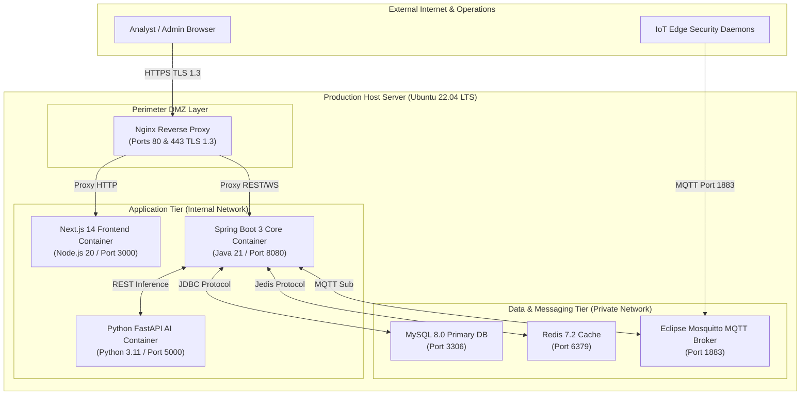
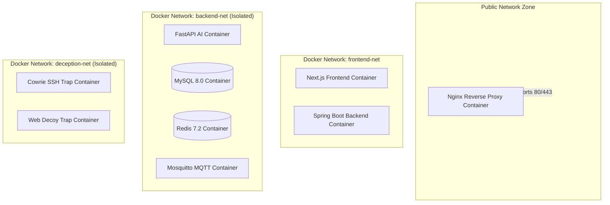
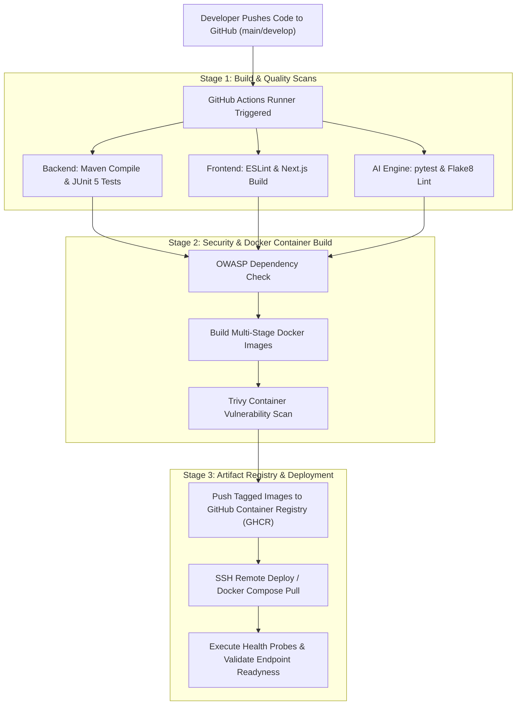
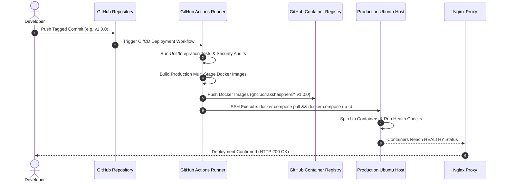
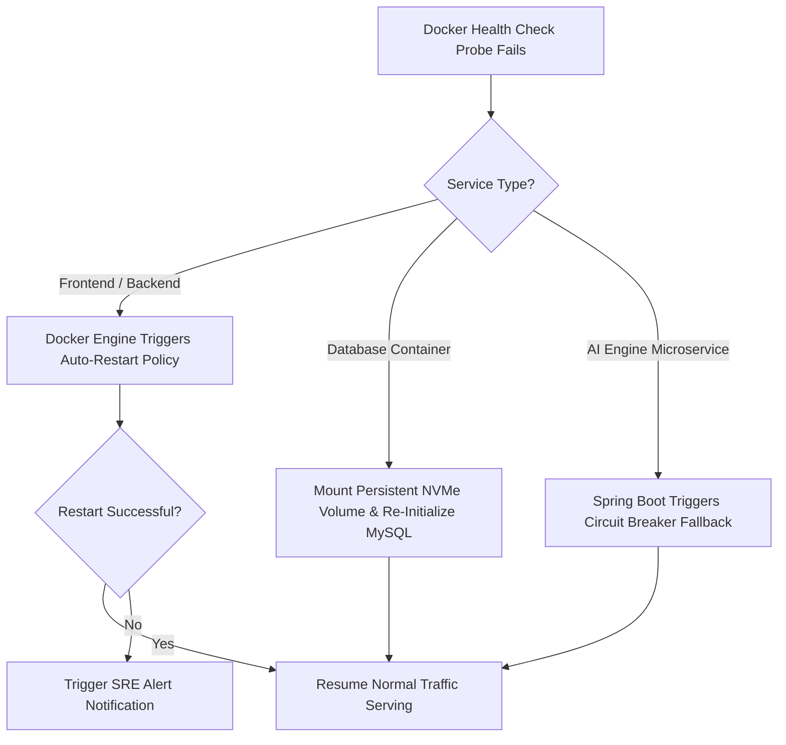

# Production Deployment Architecture & DevOps Runbook

## RakshaSphere
### AI-Powered Autonomous Cyber Defense & Self-Healing Network Platform

> **Document Identifier**: `DEPLOY-ARCH-RAKSHASPHERE-2026-V1.0`  
> **Orchestration Tool**: `Docker Compose v2.24+ & Nginx 1.25`  
> **CI/CD Platform**: `GitHub Actions`  
> **Standards Alignment**: `Google SRE Handbook, AWS Well-Architected Framework, Docker Compose Spec`  
> **Classification**: `Official Production Deployment & Infrastructure Manual`

---

## 📑 Table of Contents

1. [Executive Summary](#1-executive-summary)
2. [Deployment Environments Overview](#2-deployment-environments-overview)
3. [Architectural Diagrams Library](#3-architectural-diagrams-library)
   - [High-Level Production Deployment Architecture](#31-high-level-production-deployment-architecture)
   - [Container Topology & Micro-Network Isolation](#32-container-topology--micro-network-isolation)
   - [End-to-End CI/CD Pipeline Workflow](#33-end-to-end-cicd-pipeline-workflow)
   - [Deployment Workflow & Promotion Sequence](#34-deployment-workflow--promotion-sequence)
   - [Disaster Recovery & Failure Failover Flow](#35-disaster-recovery--failure-failover-flow)
4. [Infrastructure Component Specifications](#4-infrastructure-component-specifications)
5. [Docker Container Architecture](#5-docker-container-architecture)
6. [Multi-Container Docker Compose Stack Design](#6-multi-container-docker-compose-stack-design)
7. [Environment Configuration & Secrets Management](#7-environment-configuration--secrets-management)
8. [Nginx Reverse Proxy & Traffic Routing](#8-nginx-reverse-proxy--traffic-routing)
9. [Database Persistence & Migration Deployment](#9-database-persistence--migration-deployment)
10. [AI Engine Microservice Deployment](#10-ai-engine-microservice-deployment)
11. [MQTT Broker Message Infrastructure Deployment](#11-mqtt-broker-message-infrastructure-deployment)
12. [GitHub Actions CI/CD Automation](#12-github-actions-cicd-automation)
13. [Monitoring, Health Probes & Observability](#13-monitoring-health-probes--observability)
14. [Structured Logging & Aggregation Architecture](#14-structured-logging--aggregation-architecture)
15. [Backup & Disaster Recovery Strategy](#15-backup--disaster-recovery-strategy)
16. [Container & Network Security Hardening](#16-container--network-security-hardening)
17. [Scaling & Capacity Planning Strategy](#17-scaling--capacity-planning-strategy)
18. [Disaster Recovery Runbooks](#18-disaster-recovery-runbooks)
19. [Docker & Deployment Repository Structure](#19-docker--deployment-repository-structure)
20. [Deployment Testing & Validation Manual](#20-deployment-testing--validation-manual)
21. [Risk Assessment & Mitigation Matrix](#21-risk-assessment--mitigation-matrix)
22. [MVP Scope vs. Future Enterprise Roadmap](#22-mvp-scope-vs-future-enterprise-roadmap)

---

## 1. 🎯 Executive Summary

The **RakshaSphere Deployment Architecture** provides a deterministic, containerized, and secure operational environment for deploying the entire platform across development, testing, and production infrastructure.

Leveraging **Docker**, **Docker Compose v2**, **Nginx**, and **GitHub Actions**, the architecture orchestrates six containerized microservices: Next.js Frontend, Spring Boot Backend Core, Python FastAPI AI Engine, MySQL Database, Eclipse Mosquitto MQTT Broker, and an Nginx Reverse Proxy.

```
Nginx Proxy (TLS 1.3) ➔ Frontend (:3000) & Backend (:8080) ➔ AI Engine (:5000) & MySQL (:3306) & Mosquitto (:1883)
```

### Primary Deployment Goals
- **Zero-Downtime Environment Uniformity**: Ensure identical container runtime environments across Development (Docker Compose), Testing (GitHub Actions Testcontainers), and Production.
- **Micro-Network Isolation**: Restrict inter-container communications using isolated Docker bridge networks (`frontend-net`, `backend-net`, `deception-net`).
- **Automated Verification & Self-Healing**: Enforce strict Docker health checks (`HEALTHCHECK`) and automated container restart policies (`restart: unless-stopped`).

---

## 2. 🌐 Deployment Environments Overview

RakshaSphere standardizes three distinct environment profiles:

| Environment | Purpose | Infrastructure Stack | Configuration Profile |
| :--- | :--- | :--- | :--- |
| **Development** | Active developer iteration & hot-reloading. | Docker Compose (`docker-compose.dev.yml`), H2/MySQL, Mock AI. | `SPRING_PROFILES_ACTIVE=dev` |
| **Testing** | CI/CD automated unit, integration, and security scans. | GitHub Actions Runners (`ubuntu-latest`), Testcontainers MySQL. | `SPRING_PROFILES_ACTIVE=test` |
| **Production** | Live enterprise autonomous defense execution. | Docker Compose (`docker-compose.yml`), Nginx TLS 1.3 Proxy, MySQL 8.0, Redis. | `SPRING_PROFILES_ACTIVE=prod` |

---

## 3. 📊 Architectural Diagrams Library

### 3.1 High-Level Production Deployment Architecture



---

### 3.2 Container Topology & Micro-Network Isolation



---

### 3.3 End-to-End CI/CD Pipeline Workflow



---

### 3.4 Deployment Workflow & Promotion Sequence



---

### 3.5 Disaster Recovery & Failure Failover Flow



---

## 4. 🧱 Infrastructure Component Specifications

RakshaSphere requires the following infrastructure specifications for a production deployment:

### 4.1 Production Hardware Target (Single-Node MVP Host)
- **Operating System**: Ubuntu 22.04 LTS (x86_64 architecture).
- **CPU**: 4 Cores minimum (8 Cores recommended for high-throughput PCAP sniffing).
- **Memory**: 8 GB RAM minimum (16 GB RAM recommended).
- **Disk**: 50 GB NVMe Storage (High-speed I/O for MySQL and Docker logs).
- **Network Interface**: Promiscuous mode enabled NIC (`eth0`).

### 4.2 Software Runtimes
- **Docker Engine**: Version `25.0+`
- **Docker Compose**: Plugin Version `v2.24+`
- **Nginx**: Version `1.25.x`

---

## 5. 🐳 Docker Container Architecture

All application services run as isolated, unprivileged Docker containers defined via multi-stage Dockerfiles:

```
+-------------------+--------------------+--------------------+--------------------+
| raksha-frontend   | raksha-backend     | raksha-ai-engine   | raksha-mysql       |
| Node.js 20 Alpine | OpenJDK 21 Temurin | Python 3.11 Slim   | MySQL 8.0 Debian   |
| Unprivileged User | Unprivileged User  | Unprivileged User  | MySQL System User  |
+-------------------+--------------------+--------------------+--------------------+
```

### Multi-Stage Build Strategy
1. **Build Stage**: Compiles source code (Maven compile, Next.js build, Python pip install) using full SDK images.
2. **Production Stage**: Copies compiled binaries into minimal, hardened runtime images (`alpine`, `slim`), reducing image sizes by up to 80% and eliminating build-tool attack surfaces.

---

## 6. 📦 Multi-Container Docker Compose Stack Design

The production stack is declared in `docker/docker-compose.yml`:

| Service Name | Container Name | Base Image | Port Mappings | Dependent Services | Restart Policy |
| :--- | :--- | :--- | :--- | :--- | :--- |
| **`nginx`** | `raksha-nginx` | `nginx:1.25-alpine` | `80:80`, `443:443` | `frontend`, `backend` | `unless-stopped` |
| **`frontend`** | `raksha-frontend` | `node:20-alpine` | `3000:3000` (Internal) | `backend` | `unless-stopped` |
| **`backend`** | `raksha-backend` | `eclipse-temurin:21` | `8080:8080` (Internal) | `mysql`, `redis` | `unless-stopped` |
| **`ai-engine`** | `raksha-ai-engine` | `python:3.11-slim` | `5000:5000` (Internal) | *None* | `unless-stopped` |
| **`mysql`** | `raksha-mysql` | `mysql:8.0` | `3306:3306` (Internal) | *None* | `unless-stopped` |
| **`redis`** | `raksha-redis` | `redis:7.2-alpine` | `6379:6379` (Internal) | *None* | `unless-stopped` |
| **`mosquitto`** | `raksha-mosquitto` | `eclipse-mosquitto` | `1883:1883` | *None* | `unless-stopped` |

---

## 7. 🔑 Environment Configuration & Secrets Management

> [!CAUTION]
> Production environment variables containing database passwords, JWT secrets, and external API keys MUST NEVER be committed to Git.

### 1. Environment Variable Template (`docker/.env.example`)
```env
# Production Environment Profile
SPRING_PROFILES_ACTIVE=prod
NODE_ENV=production

# Database Credentials
MYSQL_ROOT_PASSWORD=ChangeThisProductionPassword123!
MYSQL_DATABASE=rakshasphere
MYSQL_USER=raksha_app
MYSQL_PASSWORD=SecureAppPassword456!

# JWT Authentication Secrets
JWT_RSA_PRIVATE_KEY_PATH=/etc/raksha/keys/rsa_private.pem
JWT_RSA_PUBLIC_KEY_PATH=/etc/raksha/keys/rsa_public.pem

# External Threat Intelligence API Keys
ABUSEIPDB_API_KEY=your_abuseipdb_api_key_here
VIRUSTOTAL_API_KEY=your_virustotal_api_key_here
```

---

## 8. 🌐 Nginx Reverse Proxy & Traffic Routing

Nginx acts as the perimeter gateway terminating TLS 1.3 and routing requests:

```nginx
# Conceptual Nginx Configuration Snippet (docker/nginx/nginx.conf)
server {
    listen 80;
    server_name soc.rakshasphere.io;
    return 301 https://$host$request_uri; # Force HTTPS
}

server {
    listen 443 ssl http2;
    server_name soc.rakshasphere.io;

    ssl_certificate /etc/nginx/ssl/live/soc.rakshasphere.io/fullchain.pem;
    ssl_certificate_key /etc/nginx/ssl/live/soc.rakshasphere.io/privkey.pem;
    ssl_protocols TLSv1.3;

    # Frontend Route
    location / {
        proxy_pass http://frontend:3000;
        proxy_set_header Host $host;
    }

    # REST API Route
    location /api/v1/ {
        proxy_pass http://backend:8080/api/v1/;
        proxy_set_header Host $host;
    }

    # WebSockets STOMP Route
    location /ws-soc/ {
        proxy_pass http://backend:8080/ws-soc/;
        proxy_http_version 1.1;
        proxy_set_header Upgrade $http_upgrade;
        proxy_set_header Connection "Upgrade";
    }
}
```

---

## 9. 🗄️ Database Persistence & Migration Deployment

- **Persistent Volume**: Database data stored on host NVMe via Docker Volume (`mysql_data:/var/lib/mysql`).
- **Automated Schema Migrations**: Flyway executes migration scripts (`database/migrations/V1__init_schema.sql`) automatically during Spring Boot backend startup.

---

## 10. 🧠 AI Engine Microservice Deployment

- **Runtime**: FastAPI hosted via `uvicorn` ASGI server with 4 worker processes (`uvicorn api.inference_server:app --host 0.0.0.0 --port 5000 --workers 4`).
- **Model Storage**: Binary model artifacts (`.pkl`, `.h5`) mounted as read-only volumes (`./ai-engine/models:/app/models:ro`).

---

## 11. 📡 MQTT Broker Message Infrastructure Deployment

- **Broker**: Eclipse Mosquitto listening on port 1883.
- **Persistence**: Mosquitto persistence enabled saving state to Docker volume (`mosquitto_data:/mosquitto/data`).

---

## 12. 🤖 GitHub Actions CI/CD Automation

```yaml
# Conceptual GitHub Actions Workflow (.github/workflows/production-cd.yml)
name: RakshaSphere Production CI/CD

on:
  push:
    branches: [ main ]

jobs:
  build-and-test:
    runs-on: ubuntu-latest
    steps:
      - uses: actions/checkout@v4
      - name: Set up JDK 21
        uses: actions/setup-java@v4
        with:
          java-version: '21'
          distribution: 'temurin'
      - name: Test Backend with Maven
        run: cd backend && ./mvnw test
      - name: Build and Test Frontend
        run: cd frontend && npm ci && npm run build

  deploy-production:
    needs: build-and-test
    runs-on: ubuntu-latest
    steps:
      - name: Deploy to Host via SSH
        uses: appleboy/ssh-action@v1.0.0
        with:
          host: ${{ secrets.PROD_HOST_IP }}
          username: ${{ secrets.PROD_SSH_USER }}
          key: ${{ secrets.PROD_SSH_PRIVATE_KEY }}
          script: |
            cd /opt/RakshaSphere
            git pull origin main
            docker compose -f docker/docker-compose.yml up -d --build
```

---

## 13. 📊 Monitoring, Health Probes & Observability

Every production container implements explicit health checks:

```yaml
# Conceptual Docker Compose Health Check Pattern
backend:
  image: rakshasphere/backend:latest
  healthcheck:
    test: ["CMD", "curl", "-f", "http://localhost:8080/actuator/health"]
    interval: 30s
    timeout: 10s
    retries: 3
    start_period: 40s
```

---

## 14. 📝 Structured Logging & Aggregation Architecture

- **Logging Driver**: Standardized Docker JSON file logging driver (`json-file`) with log rotation settings:
  ```yaml
  logging:
    driver: "json-file"
    options:
      max-size: "10m"
      max-file: "5"
  ```

---

## 15. 💾 Backup & Disaster Recovery Strategy

- **Daily Database Backup Cron**:
  ```bash
  0 2 * * * docker exec raksha-mysql mysqldump -u root -p"$MYSQL_ROOT_PASSWORD" rakshasphere | gzip > /opt/backups/db_$(date +\%F).sql.gz
  ```
- **RTO / RPO Targets**: RTO $< 1 \text{ Hour}$; RPO $< 5 \text{ Minutes}$.

---

## 16. 🔒 Container & Network Security Hardening

1. **Unprivileged Users**: All custom Dockerfiles execute under non-root users (`USER node`, `USER temurin`, `USER appuser`).
2. **Capability Dropping**: Container Linux kernel capabilities dropped where possible (`cap_drop: [ALL]`).
3. **No Unused Exposed Ports**: Only Nginx (Ports 80/443) and Mosquitto (Port 1883) bind to public host network interfaces.

---

## 17. 📈 Scaling & Capacity Planning Strategy

- **Vertical Scaling**: Single-node server specs can scale up to 32 CPU Cores / 64 GB RAM.
- **Horizontal Scaling (Future)**: Migration from single-node Docker Compose to multi-node Kubernetes (K8s) cluster using Helm charts.

---

## 18. 🚨 Disaster Recovery Runbooks

### Runbook 1: Re-Deploy Corrupted Backend Container
```bash
# Force pull fresh image and restart backend service without downtime
docker compose -f docker/docker-compose.yml pull backend
docker compose -f docker/docker-compose.yml up -d --no-deps --build backend
```

---

## 19. 📁 Docker & Deployment Repository Structure

```
docker/
├── docker-compose.yml          # Master production stack compose manifest
├── docker-compose.dev.yml      # Development environment override compose
├── .env.example                # Environment variable configuration template
├── nginx/
│   ├── nginx.conf              # Master Nginx configuration
│   └── conf.d/                 # Virtual host definitions
├── scripts/
│   ├── backup_db.sh            # Automated MySQL backup script
│   └── restore_db.sh           # Database restoration script
└── certs/                      # Development TLS certificate templates
```

---

## 20. 🧪 Deployment Testing & Validation Manual

1. **Stack Up Verification**: Execute `docker compose ps` to verify all 6 containers show `Up (healthy)`.
2. **Endpoint Smoke Test**: `curl -k https://localhost/api/v1/actuator/health` must return `{"status":"UP"}`.

---

## 21. ⚠️ Risk Assessment & Mitigation Matrix

| Risk Domain | Identified Risk | Impact | Architectural Mitigation Strategy |
| :--- | :--- | :--- | :--- |
| **Disk Exhaustion** | Unbounded Docker log files fill host SSD. | High | Enforce Docker `json-file` log rotation (`max-size: 10m`, `max-file: 5`). |
| **Database Corruption**| Abrupt power failure corrupts MySQL InnoDB tables. | Critical | Daily automated `mysqldump` backups stored on external backup storage. |
| **Secrets Leakage** | API keys committed to public Git repository. | Critical | Enforce pre-commit hooks (`gitleaks`) and GitHub Actions secret scanning. |

---

## 22. 🔮 MVP Scope vs. Future Enterprise Roadmap

| Infrastructure Component | Minimum Viable Product (MVP) | Future Enterprise Deployment |
| :--- | :--- | :--- |
| **Orchestration** | Single-node Docker Compose v2 stack. | Multi-node Kubernetes (K8s) cluster managed via Helm. |
| **Cloud Hosting** | Bare-metal / Virtual Private Server (Ubuntu 22.04). | AWS EKS / Azure AKS managed Kubernetes cloud infrastructure. |
| **Infrastructure as Code**| Shell scripts & Docker Compose configs. | HashiCorp Terraform & Ansible automated provisioning. |
| **Observability** | Docker Healthchecks & Spring Boot Actuator. | Prometheus + Grafana dashboard stack with Jaeger distributed tracing. |
