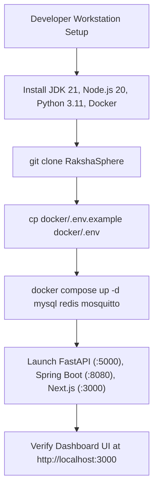
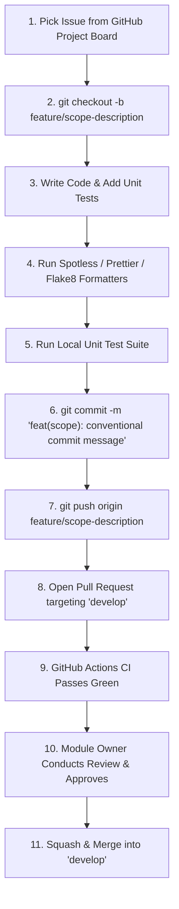
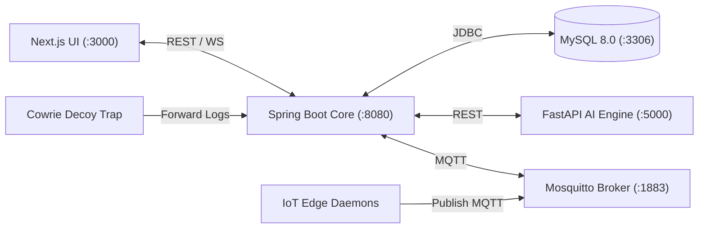
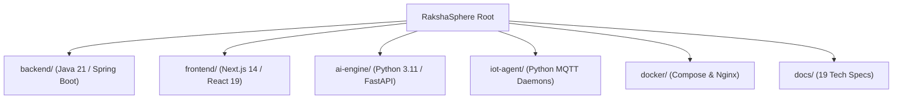
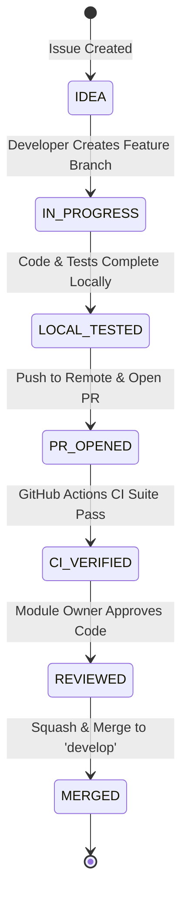

# Master Developer Onboarding & Engineering Handbook

## RakshaSphere
### AI-Powered Autonomous Cyber Defense & Self-Healing Network Platform

> **Document Identifier**: `DEV-GUIDE-RAKSHASPHERE-2026-V1.0`  
> **Engineering Standards**: `Google Engineering Practices, Microsoft Engineering Guide, Vercel & Docker Docs`  
> **Onboarding Target**: `1-Day Developer Productivity Verification Checklist`  
> **Classification**: `Official Technical Onboarding & Engineering Handbook`

---

## 📑 Table of Contents

1. [Executive Summary](#1-executive-summary)
2. [Project & Architecture Overview](#2-project--architecture-overview)
3. [1-Day Developer Onboarding Checklist](#3-1-day-developer-onboarding-checklist)
4. [Development Environment Setup](#4-development-environment-setup)
5. [Repository Clonation & Multi-Service Local Setup](#5-repository-clonation--multi-service-local-setup)
6. [Top-Level Directory Structure](#6-top-level-directory-structure)
7. [Architectural Diagrams Library](#7-architectural-diagrams-library)
   - [Environment Provisioning Flowchart](#71-environment-provisioning-flowchart)
   - [End-to-End Developer Workflow](#72-end-to-end-developer-workflow)
   - [Subsystem Runtime Inter-Module Interaction](#73-subsystem-runtime-inter-module-interaction)
   - [Repository Directory Tree Diagram](#74-repository-directory-tree-diagram)
   - [Feature Lifecycle State Machine](#75-feature-lifecycle-state-machine)
8. [Module Ownership & Team Responsibilities](#8-module-ownership--team-responsibilities)
9. [Language-Specific Coding Standards](#9-language-specific-coding-standards)
   - [9.1 Java 21 / Spring Boot 3 Guidelines](#91-java-21--spring-boot-3-guidelines)
   - [9.2 Python 3.11 / FastAPI Guidelines](#92-python-311--fastapi-guidelines)
   - [9.3 TypeScript / Next.js 14 Guidelines](#93-typescript--nextjs-14-guidelines)
10. [Git Branching & Conventional Commit Standards](#10-git-branching--conventional-commit-standards)
11. [Pull Request (PR) & Code Review Protocols](#11-pull-request-pr--code-review-protocols)
12. [Local Service Startup & Orchestration Sequence](#12-local-service-startup--orchestration-sequence)
13. [Environment Configuration & Secrets Hygiene](#13-environment-configuration--secrets-hygiene)
14. [Subsystem Development Workflows](#14-subsystem-development-workflows)
    - [14.1 REST & WebSocket API Development](#141-rest--websocket-api-development)
    - [14.2 Database Migration & Schema Workflow](#142-database-migration--schema-workflow)
    - [14.3 AI Engine & Model Training Workflow](#143-ai-engine--model-training-workflow)
    - [14.4 IoT Edge Simulation & MQTT Messaging](#144-iot-edge-simulation--mqtt-messaging)
    - [14.5 Docker & Local Infrastructure Operations](#145-docker--local-infrastructure-operations)
15. [Automated Testing & QA Workflow](#15-automated-testing--qa-workflow)
16. [Comprehensive Troubleshooting & Debugging Guide](#16-comprehensive-troubleshooting--debugging-guide)
17. [Structured Logging Architecture](#17-structured-logging-architecture)
18. [Documentation Maintenance Standards](#18-documentation-maintenance-standards)
19. [Code Review Checklist & Common Anti-Patterns](#19-code-review-checklist--common-anti-patterns)
20. [Developer Quality Pre-Flight Checklists](#20-developer-quality-pre-flight-checklists)
21. [Frequently Asked Questions (FAQ)](#21-frequently-asked-questions-faq)
22. [Official Engineering Reference Links](#22-official-engineering-reference-links)
23. [Future Developer Experience Roadmap](#23-future-developer-experience-roadmap)

---

## 1. 🎯 Executive Summary

The **RakshaSphere Developer Onboarding & Engineering Handbook** provides a single authoritative guide for developers setting up their workstation, understanding the multi-component platform architecture, following engineering standards, and contributing code.

By following this guide, a new developer will achieve **1-Day Onboarding Productivity**: setting up local runtimes (Java 21, Node.js 20, Python 3.11, Docker), launching the local microservice stack via Docker Compose, running unit test suites, and submitting their first verified Pull Request within 8 hours.

---

## 2. 🏗️ Project & Architecture Overview

RakshaSphere is composed of six interconnected microservices orchestrated via Docker Compose:

```
[Next.js 14 UI] ➔ [Nginx Proxy] ➔ [Spring Boot Core] ➔ [FastAPI AI] & [MySQL 8.0] & [Mosquitto MQTT]
```

- **Frontend (`frontend/`)**: Next.js 14 App Router, React 19, TypeScript 5, Tailwind CSS, shadcn/ui, Zustand, STOMP WebSockets.
- **Backend (`backend/`)**: Java 21 LTS (Virtual Threads), Spring Boot 3.2, Spring Security 6 (RSA-256 JWT), Hibernate JPA, Flyway.
- **AI Engine (`ai-engine/`)**: Python 3.11, FastAPI, Scikit-learn (Random Forest + XGBoost), TensorFlow (Deep Autoencoder).
- **Honeypot (`honeypot/`)**: Cowrie SSH/Telnet decoy traps, HTTP traps, host NAT redirection.
- **IoT Agent (`iot-agent/`)**: Dockerized Python edge daemons publishing metrics via Eclipse Mosquitto MQTT.
- **Infrastructure (`docker/`)**: Docker Compose v2, Nginx TLS 1.3 Reverse Proxy, MySQL 8.0, Redis 7.2.

---

## 3. ⏱️ 1-Day Developer Onboarding Checklist

Complete these tasks during your first day:

- [ ] **Hour 1**: Request access to the GitHub repository (`RakshaSphere/RakshaSphere`) and team chat channels.
- [ ] **Hour 2**: Install system prerequisites (Git, JDK 21, Node.js 20, Python 3.11, Docker Desktop / Engine).
- [ ] **Hour 3**: Clone repository and configure local `.env` files from templates (`.env.example`).
- [ ] **Hour 4**: Spin up local infrastructure: `docker compose -f docker/docker-compose.yml up -d`.
- [ ] **Hour 5**: Run backend unit tests (`./mvnw test`) and frontend tests (`npm run test`).
- [ ] **Hour 6**: Access SOC Dashboard at `http://localhost:3000` and log in with default dev credentials (`admin` / `AdminPass123!`).
- [ ] **Hour 7**: Pick a `good first issue` from the GitHub Project Board.
- [ ] **Hour 8**: Create feature branch `feature/onboarding-check`, commit changes using Conventional Commits, and submit a PR!

---

## 4. 💻 Development Environment Setup

### Required System Tooling
- **Git**: `2.40+`
- **Java Development Kit (JDK)**: `OpenJDK 21 (Temurin)`
- **Node.js & npm**: `Node.js 20 LTS` & `npm 10+`
- **Python**: `Python 3.11.x` & `pip`
- **Container Runtime**: `Docker Engine 25.0+` & `Docker Compose v2.24+`

### Recommended VS Code Extensions
- **Java Extension Pack** (`vscjava.vscode-java-pack`)
- **Python Extension** (`ms-python.python`)
- **ESLint & Prettier** (`dbaeumer.vscode-eslint`, `esbenp.prettier-vscode`)
- **Tailwind CSS IntelliSense** (`bradlc.vscode-tailwindcss`)
- **Docker Extension** (`ms-azuretools.vscode-docker`)
- **GitLens** (`eamodio.gitlens`)

---

## 5. 🚀 Repository Clonation & Multi-Service Local Setup

```bash
# 1. Clone the repository
git clone https://github.com/RakshaSphere/RakshaSphere.git
cd RakshaSphere

# 2. Setup Environment Variable Configuration
cp docker/.env.example docker/.env

# 3. Spin Up Data Infrastructure Services (MySQL, Redis, Mosquitto)
docker compose -f docker/docker-compose.yml up -d mysql redis mosquitto

# 4. Install & Run Spring Boot Backend (Terminal 1)
cd backend
./mvnw clean install
./mvnw spring-boot:run

# 5. Install & Run Python FastAPI AI Engine (Terminal 2)
cd ../ai-engine
python3 -m venv venv
source venv/bin/activate
pip install -r requirements.txt
uvicorn api.inference_server:app --reload --port 5000

# 6. Install & Run Next.js Frontend (Terminal 3)
cd ../frontend
npm ci
npm run dev

# Access Web App: http://localhost:3000
```

---

## 6. 📁 Top-Level Directory Structure

```
RakshaSphere/
├── backend/            # Java 21 Spring Boot 3 Core Backend Service
├── frontend/           # Next.js 14 App Router UI Web Application
├── ai-engine/          # Python 3.11 FastAPI Machine Learning Server
├── iot-agent/          # Dockerized Python Virtual Edge Daemon Simulation
├── honeypot/           # Cowrie SSH Decoy & Deception Trap Configurations
├── docker/             # Docker Compose manifests, Nginx configs & environment files
├── database/           # MySQL Flyway migration SQL scripts & ER schema docs
├── docs/               # 19 Enterprise Architecture & Engineering Specification Documents
├── .github/            # GitHub Actions CI/CD workflows & Issue templates
├── README.md           # Master open-source repository overview
├── CONTRIBUTING.md     # Code of conduct & contribution guide
└── LICENSE             # MIT Open Source License
```

---

## 7. 📊 Architectural Diagrams Library

### 7.1 Environment Provisioning Flowchart



---

### 7.2 End-to-End Developer Workflow



---

### 7.3 Subsystem Runtime Inter-Module Interaction



---

### 7.4 Repository Directory Tree Diagram



---

### 7.5 Feature Lifecycle State Machine



---

## 8. 👥 Module Ownership & Team Responsibilities

| Subsystem Module | Lead Owner | Primary Responsibilities |
| :--- | :--- | :--- |
| **Backend Core** | **Fardeen Akmal** | Spring Boot Controllers, Security Filters, Self-Healing eBPF, Database Schemas. |
| **Frontend UI** | **Jigisha Naidu** | Next.js App Router, shadcn/ui components, Zustand state, STOMP WebSockets. |
| **AI & Cybersecurity** | **Sushil Nirmal** | Python FastAPI Engine, ML training scripts, Honeypot Cowrie decoy configuration. |
| **IoT & Infrastructure**| **Suvajit Ghosh** | IoT edge daemons, MQTT Mosquitto broker, Docker Compose, CI/CD pipeline workflows. |

---

## 9. 📏 Language-Specific Coding Standards

### 9.1 Java 21 / Spring Boot 3 Guidelines
- Format code via Maven spotless plugin: `./mvnw spotless:apply`.
- Use Java 21 **Records** for DTO classes.
- Handle exceptions using centralized `@RestControllerAdvice` returning RFC-7807 problem details JSON.

### 9.2 Python 3.11 / FastAPI Guidelines
- Format code via `black` and lint via `flake8`.
- Enforce explicit type hints on all function signatures (`def predict(vector: list[float]) -> dict:`).

### 9.3 TypeScript / Next.js 14 Guidelines
- Format code via Prettier (`npm run format`) and lint via ESLint (`npm run lint`).
- Enforce strict typing (`"strict": true` in `tsconfig.json`). Never use `any`.

---

## 10. 🌿 Git Branching & Conventional Commit Standards

- **Branch Naming**: `category/short-title` (`feature/ebpf-packet-drop`, `bugfix/jwt-expiration`).
- **Commit Format**: `type(scope): description` (`feat(backend): add dynamic risk score calculation`).

---

## 11. 📥 Pull Request (PR) & Code Review Protocols

- **PR Target**: All feature PRs target the `develop` branch.
- **Code Review Requirement**: Minimum 1 approval from designated Module Owner before merging.
- **Merge Strategy**: **Squash & Merge** into `develop`.

---

## 12. 🔄 Local Service Startup & Orchestration Sequence

Start local services in exact sequence to satisfy runtime dependencies:

```
1. Docker Infra (MySQL :3306, Redis :6379, Mosquitto :1883)
   ↓
2. Python FastAPI AI Engine (:5000)
   ↓
3. Java 21 Spring Boot Backend Core (:8080)
   ↓
4. Next.js Frontend Web UI (:3000)
```

---

## 13. 🔑 Environment Configuration & Secrets Hygiene

- Environment configuration is managed via `.env` files.
- **Rule**: NEVER commit credentials or API keys to Git. Keep `.env` files listed in `.gitignore`.

---

## 14. 🛠️ Subsystem Development Workflows

### 14.1 REST & WebSocket API Development
- Contract-first API design. Update OpenAPI specs in [docs/api-reference.md](file:///home/fardeen/RakshaSphere/docs/api-reference.md) when introducing endpoints.

### 14.2 Database Migration & Schema Workflow
- Database migrations managed via Flyway (`database/migrations/V1__init_schema.sql`).

### 14.3 AI Engine & Model Training Workflow
- Model artifacts trained on CIC-IDS2017 dataset and saved as binary files (`.pkl`, `.h5`) under `ai-engine/models/`.

### 14.4 IoT Edge Simulation & MQTT Messaging
- Software edge nodes run Python script `agent.py` publishing metric JSON payloads to Mosquitto MQTT broker.

### 14.5 Docker & Local Infrastructure Operations
- Rebuild containers cleanly: `docker compose -f docker/docker-compose.yml up -d --build`.

---

## 15. 🧪 Automated Testing & QA Workflow

- **Backend Tests**: `./mvnw clean test`
- **Frontend Tests**: `npm run test`
- **AI Engine Tests**: `pytest`

---

## 16. 🛠️ Comprehensive Troubleshooting & Debugging Guide

| Problem Symptom | Root Cause | Solution Procedure |
| :--- | :--- | :--- |
| **MySQL Connection Denied** | Container DB password mismatch. | Verify `MYSQL_PASSWORD` in `docker/.env` matches `application-dev.yml`. |
| **FastAPI Port 5000 Occupied**| Previous Python process orphaned. | Execute `lsof -i :5000` and `kill -9 <PID>`, then restart uvicorn. |
| **Next.js Hydration Mismatch** | LocalStorage/Date rendering discrepancy. | Wrap browser-specific state in `useEffect` hook. |
| **MQTT Broker Refusing Auth** | Mosquitto ACL permissions error. | Verify device username and HMAC password match Mosquitto config. |

---

## 17. 📝 Structured Logging Architecture

All services output structured JSON logs formatted with timestamp, log level, subsystem, and trace ID.

---

## 18. 📚 Documentation Maintenance Standards

When modifying codebase features or APIs, update the corresponding technical specification under [`docs/`](file:///home/fardeen/RakshaSphere/docs) in the same Pull Request.

---

## 19. 🔍 Code Review Checklist & Common Anti-Patterns

- [ ] Zero hardcoded passwords or API keys.
- [ ] Unit test added for new business logic.
- [ ] No unhandled HTTP 500 exceptions.

---

## 20. 📋 Developer Quality Pre-Flight Checklists

Verify locally before pushing branch:
```bash
cd backend && ./mvnw test
cd ../frontend && npm run lint && npm run test
cd ../ai-engine && pytest
```

---

## 21. ❓ Frequently Asked Questions (FAQ)

- **Q: Can I push directly to `develop` or `main`?**  
  *A: No. All changes require a Pull Request approved by a Module Owner.*
- **Q: How do I run database migrations locally?**  
  *A: Flyway executes automatically when the Spring Boot backend starts up.*

---

## 22. 🔗 Official Engineering Reference Links

- [Spring Boot 3 Documentation](https://docs.spring.io/spring-boot/docs/current/reference/html/)
- [Next.js 14 App Router Guide](https://nextjs.org/docs)
- [FastAPI Framework Documentation](https://fastapi.tiangolo.com/)
- [Docker Compose Specification](https://docs.docker.com/compose/)

---

## 23. 🔮 Future Developer Experience Roadmap

- **VS Code Dev Containers (`.devcontainer`)**: One-click cloud workstation configuration.
- **Automated Mock Data Seeding**: CLI command to instantly populate 10,000 synthetic test security alerts.
