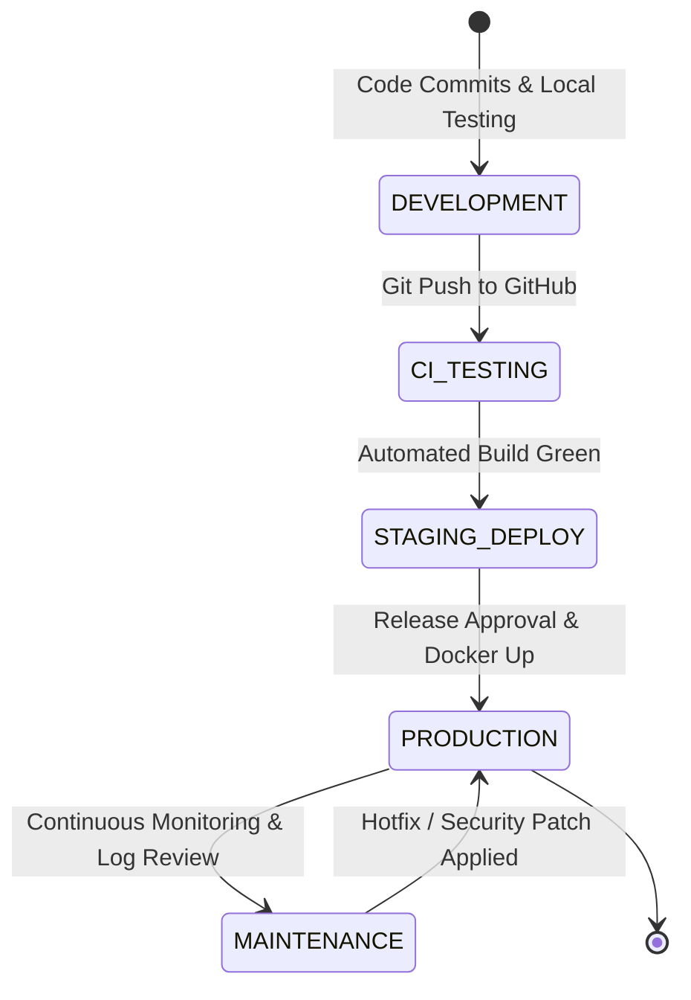
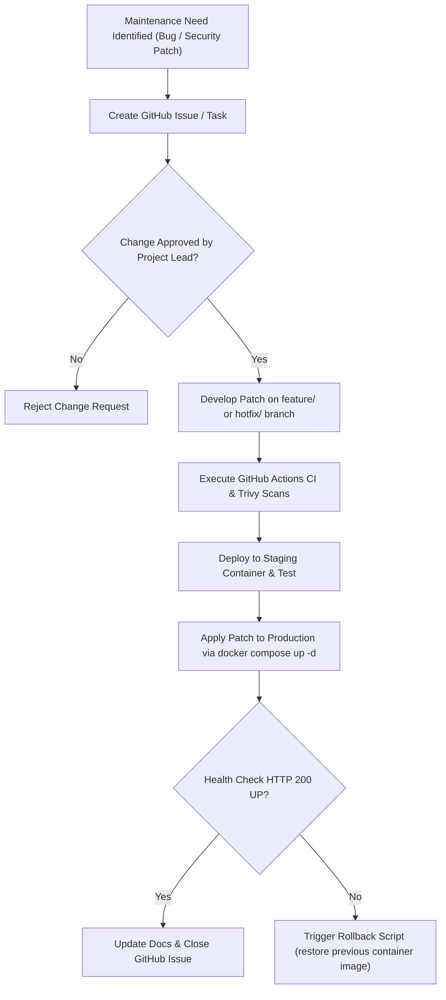
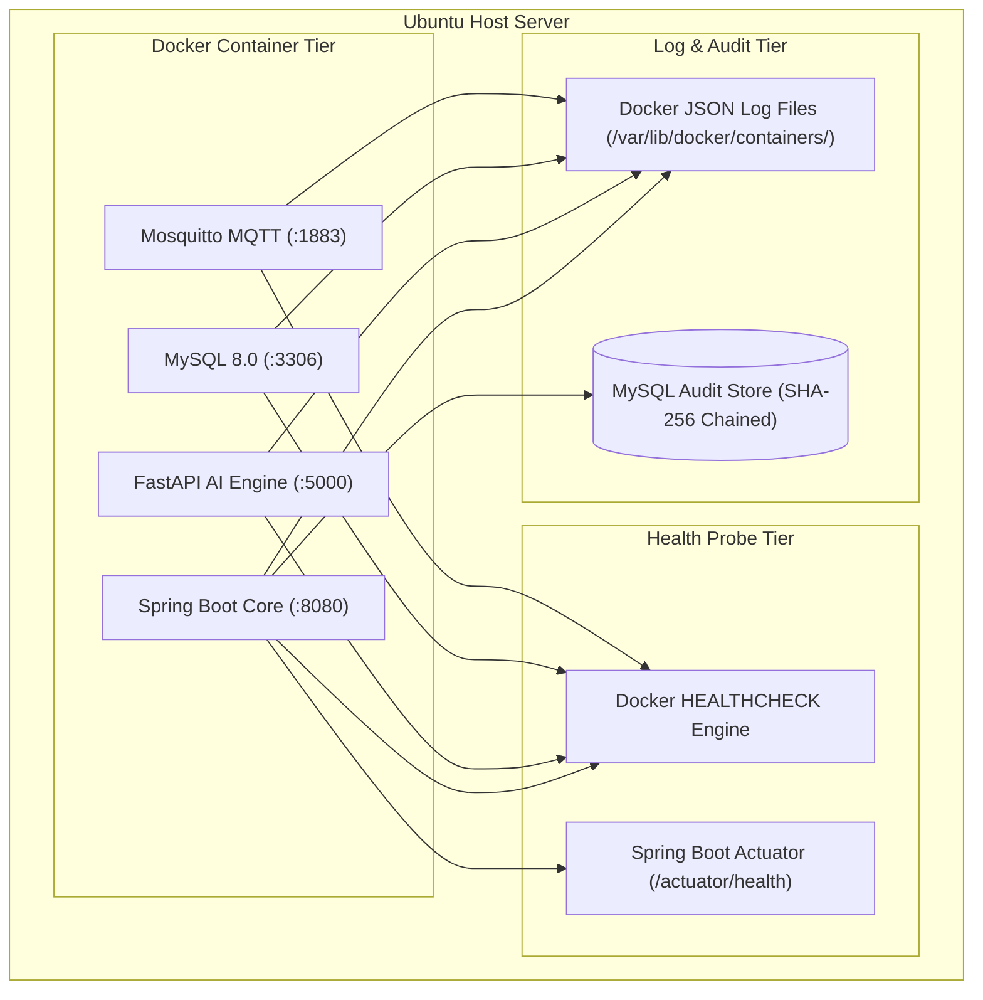
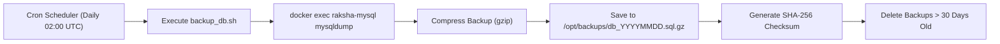
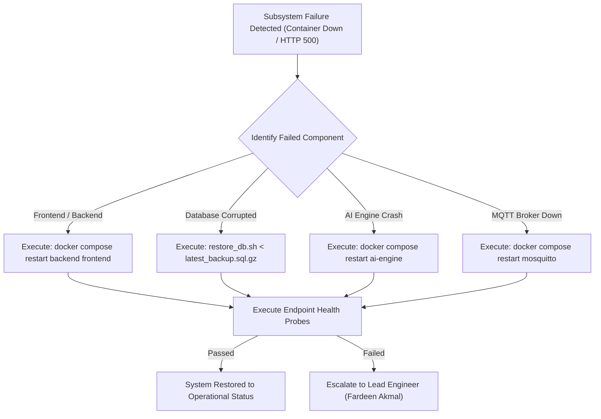
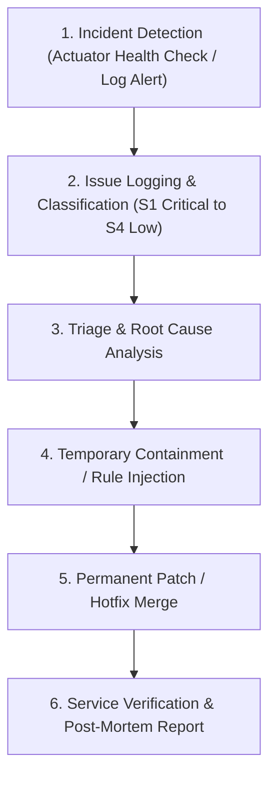

# Master System Maintenance & Site Reliability Engineering (SRE) Handbook

## RakshaSphere
### AI-Powered Autonomous Cyber Defense & Self-Healing Network Platform

> **Document Identifier**: `OPS-MAINT-RAKSHASPHERE-2026-V1.0`  
> **SRE & Operations Standards**: `Google SRE Handbook, ITIL v4, AWS Well-Architected Framework, NIST CSF`  
> **Target Environment**: `Docker Compose v2.24+ Single-Node Production Deployment`  
> **Classification**: `Official System Operations, Reliability & Disaster Recovery Manual`

---

## 📑 Table of Contents

1. [Executive Summary](#1-executive-summary)
2. [System Lifecycle & Operational Model](#2-system-lifecycle--operational-model)
3. [Software Maintenance Taxonomy](#3-software-maintenance-taxonomy)
4. [Architectural Diagrams Library](#4-architectural-diagrams-library)
   - [System Lifecycle State Diagram](#41-system-lifecycle-state-diagram)
   - [Maintenance & Change Control Flowchart](#42-maintenance--change-control-flowchart)
   - [Monitoring & Observability Architecture](#43-monitoring--observability-architecture)
   - [Automated Backup & Archive Dataflow](#44-automated-backup--archive-dataflow)
   - [Disaster Recovery & Failure Failover Flow](#45-disaster-recovery--failure-failover-flow)
   - [ITIL Incident Management Lifecycle](#46-itil-incident-management-lifecycle)
5. [Operational Roles & Subsystem Ownership Matrix](#5-operational-roles--subsystem-ownership-matrix)
6. [Operational Cadence & Routines](#6-operational-cadence--routines)
   - [6.1 Daily Operational Checklist](#61-daily-operational-checklist)
   - [6.2 Weekly Operational Checklist](#62-weekly-operational-checklist)
   - [6.3 Monthly Operational Checklist](#63-monthly-operational-checklist)
7. [Comprehensive Operations Schedule Table](#7-comprehensive-operations-schedule-table)
8. [Monitoring, Telemetry & Health Probe Strategy](#8-monitoring-telemetry--health-probe-strategy)
9. [Logging Architecture & Log Retention Policy](#9-logging-architecture--log-retention-policy)
10. [Backup, Storage & Disaster Recovery Strategy](#10-backup-storage--disaster-recovery-strategy)
11. [Subsystem Incident Recovery Procedures](#11-subsystem-incident-recovery-procedures)
12. [System Update, Patching & Rollback Strategy](#12-system-update-patching--rollback-strategy)
13. [Performance Tuning & Capacity Optimization](#13-performance-tuning--capacity-optimization)
14. [Security Maintenance & Secrets Hygiene](#14-security-maintenance--secrets-hygiene)
15. [ITIL Incident & Emergency Response Management](#15-itil-incident--emergency-response-management)
16. [Change Management & Approval Governance](#16-change-management--approval-governance)
17. [Resource Capacity Planning & Scaling Limits](#17-resource-capacity-planning--scaling-limits)
18. [Maintenance Subsystem Directory Structure](#18-maintenance-subsystem-directory-structure)
19. [Operational Execution Checklists](#19-operational-execution-checklists)
20. [Quantitative Operational Risk Assessment Matrix](#20-quantitative-operational-risk-assessment-matrix)
21. [MVP Operations Scope vs. Future SRE Roadmap](#21-mvp-operations-scope-vs-future-sre-roadmap)

---

## 1. 🎯 Executive Summary

The **RakshaSphere System Maintenance & SRE Handbook** establishes the operational runbooks, daily routines, monitoring strategies, logging policies, backup schedules, and disaster recovery procedures required to maintain platform reliability, availability, performance, and security.

Governed by **Google SRE principles**, **ITIL v4 Service Management**, and the **AWS Well-Architected Framework**, this document ensures that the four-member engineering team can operate and recover the platform during its operational lifecycle.

---

## 2. 🔄 System Lifecycle & Operational Model

The operational lifecycle consists of five distinct phases:

```
Development ➔ Integration Testing ➔ Production Operations ➔ Maintenance & Patching ➔ Retirement (Future)
```

1. **Development**: Feature branch engineering, unit testing, local Docker Compose execution.
2. **Integration Testing**: GitHub Actions automated CI execution, Testcontainers verification, security scanning.
3. **Production Operations**: Live multi-container execution on Ubuntu 22.04 LTS host via Docker Compose.
4. **Maintenance & Patching**: Daily monitoring, weekly backups, dependency security updates, log rotation.
5. **Retirement / Migration**: Systematic data export and node decommission (future enterprise phase).

---

## 3. 🛠️ Software Maintenance Taxonomy

RakshaSphere categorizes operational maintenance into four standard types:

| Maintenance Type | Operational Focus | Examples in RakshaSphere | Responsible Lead |
| :--- | :--- | :--- | :--- |
| **Corrective** | Fixing bugs & emergency failures. | Patching memory leak in Spring Boot REST controller; fixing broken MQTT reconnection logic. | Fardeen Akmal |
| **Adaptive** | Adjusting to environment changes. | Updating Docker base image to JDK 21.0.2; modifying Nginx rules for TLS 1.3 updates. | Suvajit Ghosh |
| **Preventive** | Proactive maintenance to prevent failure.| Clearing Docker build caches (`docker system prune`); rotating log files before disk full. | Suvajit Ghosh |
| **Perfective** | Optimizing performance & usability. | Tuning MySQL InnoDB buffer pool size; refactoring Next.js component renders for speed. | Jigisha Naidu |

---

## 4. 📊 Architectural Diagrams Library

### 4.1 System Lifecycle State Diagram



---

### 4.2 Maintenance & Change Control Flowchart



---

### 4.3 Monitoring & Observability Architecture



---

### 4.4 Automated Backup & Archive Dataflow



---

### 4.5 Disaster Recovery & Failure Failover Flow



---

### 4.6 ITIL Incident Management Lifecycle



---

## 5. 👥 Operational Roles & Subsystem Ownership Matrix

| Subsystem Component | Operations Lead | Daily Operational Responsibilities |
| :--- | :--- | :--- |
| **Spring Boot Core & DB** | **Fardeen Akmal** | Monitor Actuator health endpoints, inspect audit log chains, verify database queries. |
| **Next.js Frontend UI** | **Jigisha Naidu** | Monitor web bundle performance, inspect console hydration errors, verify WebSocket links. |
| **AI Engine & Honeypot** | **Sushil Nirmal** | Verify FastAPI response latency ($< 10\text{ms}$), check Cowrie honeypot log capture files. |
| **IoT & Infrastructure**| **Suvajit Ghosh** | Monitor Docker container statuses, verify Mosquitto MQTT broker traffic, execute backups. |

---

## 6. 📅 Operational Cadence & Routines

### 6.1 Daily Operational Checklist
- [ ] Inspect container health statuses (`docker compose ps`). All 6 containers must show `Up (healthy)`.
- [ ] Verify backend health probe: `curl -f http://localhost:8080/actuator/health` returns `{"status":"UP"}`.
- [ ] Review Logback error logs (`backend.json`) for unhandled HTTP 500 exceptions.
- [ ] Inspect disk utilization on host NVMe storage (`df -h`). Ensure disk usage is $< 80\%$.

### 6.2 Weekly Operational Checklist
- [ ] Verify daily database backup files exist under `/opt/backups/` and check SHA-256 checksums.
- [ ] Execute test database restoration on a local sandbox container to confirm backup integrity.
- [ ] Check Dependabot pull requests on GitHub for high-severity dependency CVE security updates.
- [ ] Clear unreferenced Docker image layers and build caches: `docker system prune -f`.

### 6.3 Monthly Operational Checklist
- [ ] Conduct end-to-end disaster recovery failover drill.
- [ ] Perform database index optimization: `OPTIMIZE TABLE security_alerts, cti_reports;`.
- [ ] Audit user privilege access levels in `USERS` table.
- [ ] Review system capacity trends (CPU, RAM, NVMe growth rates).

---

## 7. 📊 Comprehensive Operations Schedule Table

| Task Description | Recurrence Cadence | Execution Command / Script | Owner | Target SLA |
| :--- | :--- | :--- | :--- | :--- |
| **Container Status Check** | Daily (08:00 UTC) | `docker compose ps` | Suvajit Ghosh | $100\%$ Healthy |
| **Actuator Health Verification**| Daily (08:30 UTC) | `curl -f http://localhost:8080/actuator/health` | Fardeen Akmal | HTTP 200 OK |
| **Database Backup** | Daily (02:00 UTC) | `/opt/RakshaSphere/docker/scripts/backup_db.sh` | Suvajit Ghosh | Zero Data Loss |
| **Backup Recovery Testing**| Weekly (Sunday) | `/opt/RakshaSphere/docker/scripts/test_restore.sh` | Suvajit Ghosh | $< 15\text{ Mins}$ RTO |
| **Docker System Cleanup** | Weekly (Saturday) | `docker system prune -af --volumes` | Suvajit Ghosh | $> 5\text{GB}$ Freed |
| **Security CVE Scanning** | Weekly (Monday) | GitHub Actions Trivy & Dependabot Scans | Sushil Nirmal | Zero Critical |
| **Database Optimization** | Monthly (1st Day) | `mysqlcheck -o -u root -p rakshasphere` | Fardeen Akmal | $< 2\text{s}$ Queries |

---

## 8. 📊 Monitoring, Telemetry & Health Probe Strategy

- **Spring Boot Actuator**: Health endpoint exposed at `/actuator/health` returning sub-component checks (MySQL database connection pool, Redis connectivity, free disk space).
- **Docker Engine Healthchecks**: Every container executes a native health check (e.g., MySQL executes `mysqladmin ping`).

---

## 9. 📝 Logging Architecture & Log Retention Policy

All microservices write structured JSON logs via Docker `json-file` driver:

```yaml
# Docker Log Rotation Settings (docker-compose.yml)
logging:
  driver: "json-file"
  options:
    max-size: "10m"
    max-file: "5"
```

### Log Retention Policy
- **Application Runtime Logs**: 14 Days (Rotated automatically by Docker).
- **Security & Audit Logs (`AUDIT_LOGS` table)**: 365 Days (Retained indefinitely with SHA-256 cryptographic hash chaining).

---

## 10. 💾 Backup, Storage & Disaster Recovery Strategy

### Recovery Time Objective (RTO) & Recovery Point Objective (RPO)
- **RTO (Target Restoration Time)**: $< 1 \text{ Hour}$.
- **RPO (Maximum Data Loss Window)**: $< 24 \text{ Hours}$ (Daily backup cadence).

### Backup Execution Script (`docker/scripts/backup_db.sh`)
```bash
#!/bin/bash
# Backup Script for RakshaSphere Production Database
BACKUP_DIR="/opt/backups"
TIMESTAMP=$(date +%Y%m%d_%H%M%S)
BACKUP_FILE="${BACKUP_DIR}/raksha_db_${TIMESTAMP}.sql.gz"

mkdir -p ${BACKUP_DIR}
docker exec raksha-mysql mysqldump -u root -p"${MYSQL_ROOT_PASSWORD}" rakshasphere | gzip > ${BACKUP_FILE}
sha256sum ${BACKUP_FILE} > ${BACKUP_FILE}.sha256

# Retention: Delete backups older than 30 days
find ${BACKUP_DIR} -type f -name "raksha_db_*.sql.gz*" -mtime +30 -delete
```

---

## 11. 🚨 Subsystem Incident Recovery Procedures

### Procedure 1: Database Corruption Recovery
1. Stop backend service to prevent partial writes: `docker compose stop backend`.
2. Locate latest valid backup: `ls -t /opt/backups/raksha_db_*.sql.gz | head -n 1`.
3. Restore database: `zcat /opt/backups/raksha_db_20260802.sql.gz | docker exec -i raksha-mysql mysql -u root -p"${MYSQL_ROOT_PASSWORD}" rakshasphere`.
4. Restart backend service: `docker compose start backend`.

---

## 12. 🔄 System Update, Patching & Rollback Strategy

1. **Pull Latest Tagged Docker Image**: `docker compose pull`.
2. **Apply Update with Zero-Downtime Re-creation**: `docker compose up -d --no-deps --build backend`.
3. **Automated Rollback**: If health checks fail, pull previous image tag: `docker compose up -d --build backend:v1.0.0`.

---

## 13. ⚡ Performance Tuning & Capacity Optimization

- **MySQL Buffer Pool**: Configured in `my.cnf` to use 50% of available RAM (`innodb_buffer_pool_size = 2G`).
- **JVM Memory Limits**: Spring Boot backend configured with explicit heap boundaries (`-Xms512m -Xmx2048m`).

---

## 14. 🔒 Security Maintenance & Secrets Hygiene

- **Monthly Secret Audit**: Inspect `.env` files to ensure no default developer credentials remain in production.
- **Dependency Patching**: Apply Spring Boot and Next.js minor patch updates within 7 days of security release.

---

## 15. 🚨 ITIL Incident & Emergency Response Management

Incidents are classified into four severity tiers:
- **S1 Critical**: System down, database unreadable, or active zero-day attack ($< 15\text{ Mins}$ triage SLA).
- **S2 High**: Major subsystem failure (e.g., Honeypot down) with workaround ($< 1\text{ Hour}$ triage SLA).
- **S3 Medium**: Non-critical component degradation ($< 24\text{ Hours}$ SLA).
- **S4 Low**: Cosmetic glitch ($< 7\text{ Days}$ SLA).

---

## 16. 📋 Change Management & Approval Governance

All production configuration changes (modifying firewall rules, updating environment variables, or schema migrations) require:
1. Submission of a GitHub Issue detailing proposed changes.
2. Review and approval by **Project Lead (Fardeen Akmal)**.
3. Execution during scheduled maintenance windows (Sundays 02:00–04:00 UTC).

---

## 17. 📈 Resource Capacity Planning & Scaling Limits

### Single-Node Infrastructure Limits (MVP Host)
- **Max Concurrent Users**: 100 Analysts.
- **Max Network Packet Ingestion Rate**: $10,000$ flow vectors/sec.
- **Max Registered IoT Edge Daemons**: 500 Virtual Daemons.

---

## 18. 📁 Maintenance Subsystem Directory Structure

```
docker/
├── scripts/
│   ├── backup_db.sh          # Daily MySQL backup cron script
│   ├── restore_db.sh         # Database disaster recovery script
│   └── health_check.sh       # Comprehensive host health validation script
├── nginx/
│   └── nginx.conf            # Nginx proxy configuration
└── docker-compose.yml        # Multi-container orchestration manifest
```

---

## 19. 📋 Operational Execution Checklists

### Pre-Deployment Checklist
- [ ] Database backup executed and verified.
- [ ] All unit and integration tests passing in CI.
- [ ] Production `.env` secrets updated and verified.

### Post-Deployment Checklist
- [ ] Execute `docker compose ps` to verify all 6 containers display `Up (healthy)`.
- [ ] Verify `http://localhost:8080/actuator/health` returns `HTTP 200 OK`.
- [ ] Confirm Next.js UI loads at `http://localhost:3000`.

---

## 20. ⚠️ Quantitative Operational Risk Assessment Matrix

| Risk Category | Identified Operational Threat | Likelihood | Impact | Operational Mitigation Strategy |
| :--- | :--- | :--- | :--- | :--- |
| **Disk Exhaustion** | Unchecked log growth fills host NVMe storage. | High | Critical | Enforce Docker JSON log rotation (`10m`, `5 files`) and weekly `docker system prune`. |
| **Database Corruption**| Abrupt host power loss corrupts InnoDB tables. | Low | Critical | Automated daily `mysqldump` backups with SHA-256 checksum validation. |
| **Container Crash Loop**| Memory leak causes Spring Boot Out-Of-Memory (OOM). | Medium | High | Set JVM `-Xmx2048m` limits and Docker `restart: unless-stopped` policies. |

---

## 21. 🔮 MVP Operations Scope vs. Future SRE Roadmap

| Operational Capability | Minimum Viable Product (MVP) | Future Enterprise SRE Roadmap |
| :--- | :--- | :--- |
| **Orchestration Ops** | Single-node Docker Compose v2 management. | Multi-node Kubernetes (K8s) Cluster operations via Helm. |
| **Monitoring & Telemetry**| Spring Boot Actuator & Docker native health probes. | Prometheus metrics scraping & Grafana dashboard visualizer. |
| **Log Management** | Local Docker JSON file log driver with rotation. | Centralized ELK Stack (Elasticsearch, Logstash, Kibana) or Vector. |
| **Disaster Recovery** | Daily shell-scripted `mysqldump` backups. | Continuous automated WAL archiving & multi-region database replication. |
