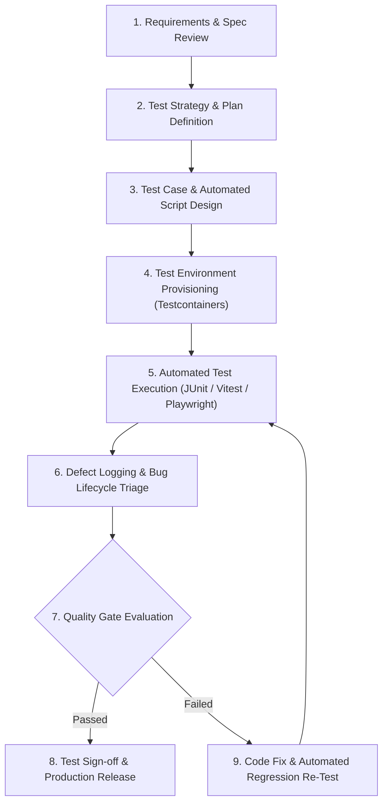
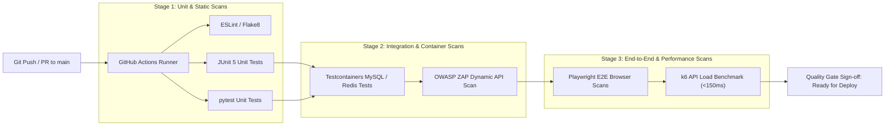
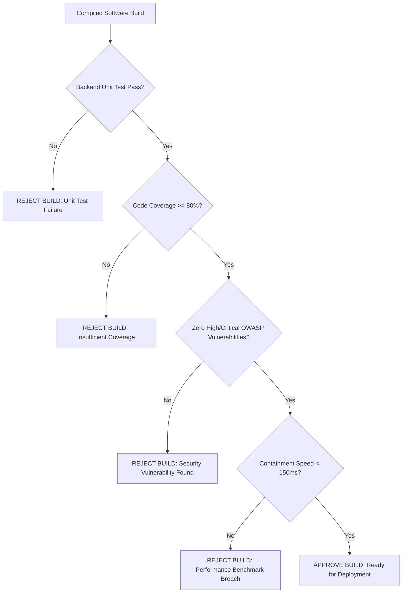
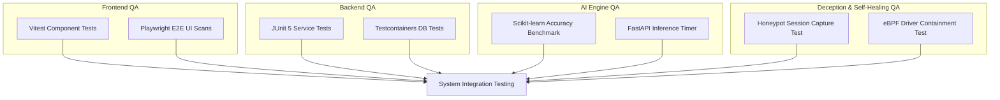
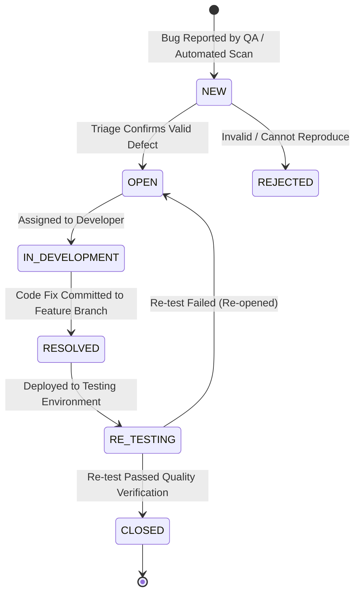
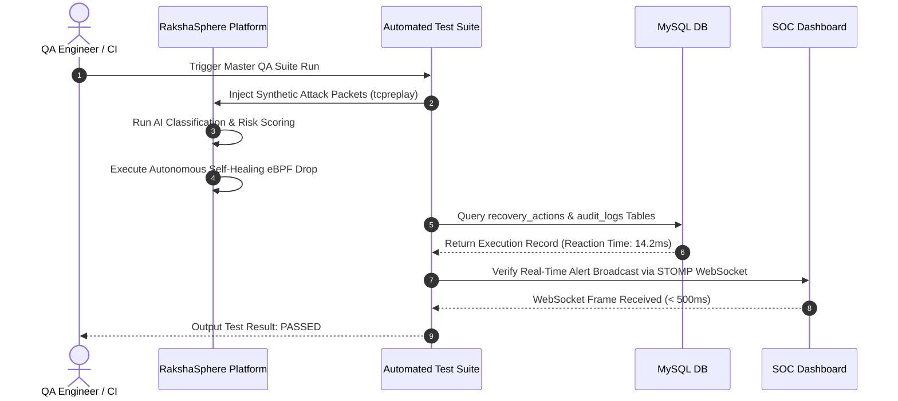
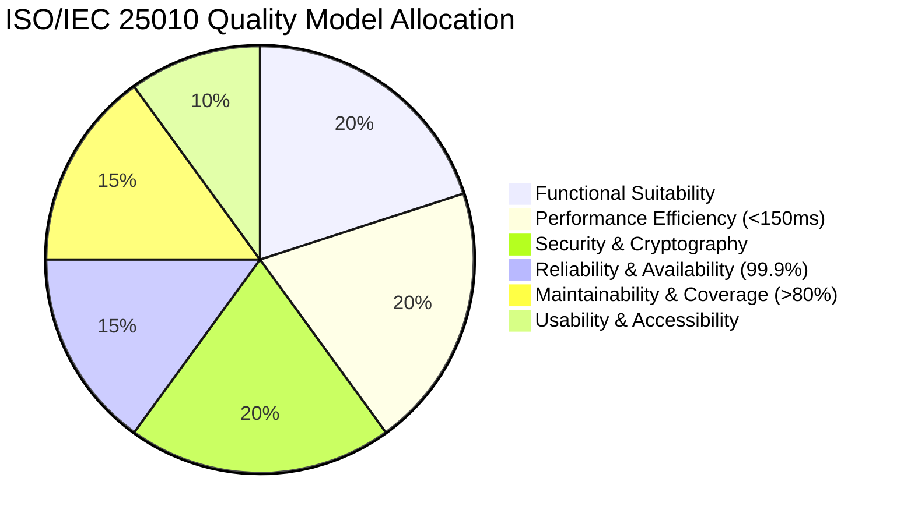
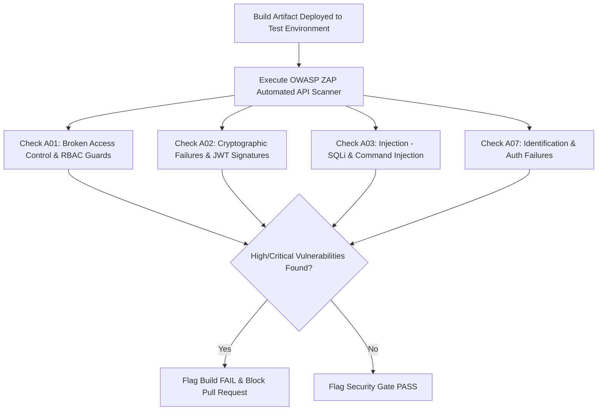

# Master Testing Strategy & Quality Assurance Specification

## RakshaSphere
### AI-Powered Autonomous Cyber Defense & Self-Healing Network Platform

> **Document Identifier**: `QA-STRATEGY-RAKSHASPHERE-2026-V1.0`  
> **Testing Standards**: `ISTQB, ISO/IEC 25010 (Software Quality), OWASP Testing Guide v4, NIST CSF`  
> **Automation Frameworks**: `JUnit 5, Testcontainers, Vitest, Playwright, pytest, OWASP ZAP, k6`  
> **Classification**: `Official Master Quality Assurance & Test Verification Blueprint`

---

## 📑 Table of Contents

1. [Executive Summary](#1-executive-summary)
2. [Quality Philosophy & Testing Strategy](#2-quality-philosophy--testing-strategy)
3. [Architectural Diagrams Library](#3-architectural-diagrams-library)
   - [Master Software Testing Lifecycle (STLC)](#31-master-software-testing-lifecycle-stlc)
   - [Continuous Integration (CI) Testing Pipeline](#32-continuous-integration-ci-testing-pipeline)
   - [Quality Gate Enforcement Flowchart](#33-quality-gate-enforcement-flowchart)
   - [Module-Wise Test Execution Flow](#34-module-wise-test-execution-flow)
   - [Bug Defect Lifecycle State Diagram](#35-bug-defect-lifecycle-state-diagram)
   - [End-to-End Quality Assurance Workflow](#36-end-to-end-quality-assurance-workflow)
4. [Testing Levels & Verification Criteria](#4-testing-levels--verification-criteria)
5. [Module-Wise Testing Specifications](#5-module-wise-testing-specifications)
   - [5.1 Next.js Frontend Module](#51-nextjs-frontend-module)
   - [5.2 Spring Boot Backend Core Module](#52-spring-boot-backend-core-module)
   - [5.3 Python AI Inference Engine Module](#53-python-ai-inference-engine-module)
   - [5.4 Adaptive Deception Honeypot Module](#54-adaptive-deception-honeypot-module)
   - [5.5 Cyber Threat Intelligence Module](#55-cyber-threat-intelligence-module)
   - [5.6 Autonomous Self-Healing Network Module](#56-autonomous-self-healing-network-module)
   - [5.7 IoT Edge Security Daemon Module](#57-iot-edge-security-daemon-module)
   - [5.8 MySQL Database & Schema Subsystem](#58-mysql-database--schema-subsystem)
   - [5.9 Multi-Container Docker Infrastructure](#59-multi-container-docker-infrastructure)
6. [Functional Testing Matrix](#6-functional-testing-matrix)
7. [Non-Functional Testing & ISO/IEC 25010 Quality Metrics](#7-non-functional-testing--isoiec-25010-quality-metrics)
8. [REST & WebSocket API Testing Strategy](#8-rest--websocket-api-testing-strategy)
9. [Artificial Intelligence & Model Validation Testing](#9-artificial-intelligence--model-validation-testing)
10. [Adaptive Honeypot Deception Testing](#10-adaptive-honeypot-deception-testing)
11. [Threat Intelligence & MITRE Correlation Testing](#11-threat-intelligence--mitre-correlation-testing)
12. [Autonomous Self-Healing & Verification Testing](#12-autonomous-self-healing--verification-testing)
13. [IoT Edge & MQTT Communication Testing](#13-iot-edge--mqtt-communication-testing)
14. [Cybersecurity & OWASP Testing Strategy](#14-cybersecurity--owasp-testing-strategy)
15. [Performance, Load & Benchmark Testing](#15-performance-load--benchmark-testing)
16. [Database Integrity & Transactional Testing](#16-database-integrity--transactional-testing)
17. [Container Infrastructure & Health Check Testing](#17-container-infrastructure--health-check-testing)
18. [Test Data Management & Synthetic Attack Simulation](#18-test-data-management--synthetic-attack-simulation)
19. [Defect Management & Severity Matrix](#19-defect-management--severity-matrix)
20. [Test Documentation & Artifact Governance](#20-test-documentation--artifact-governance)
21. [CI/CD Quality Gates & GitHub Actions Integration](#21-cicd-quality-gates--github-actions-integration)
22. [Risk Assessment & Quality Mitigation Matrix](#22-risk-assessment--quality-mitigation-matrix)
23. [MVP Scope vs. Future Enterprise QA Roadmap](#23-mvp-scope-vs-future-enterprise-qa-roadmap)

---

## 1. 🎯 Executive Summary

The **RakshaSphere Master Testing Strategy & Quality Assurance Document** provides a systematic framework for verifying the functionality, performance, security, availability, and resilience of the entire platform.

Engineered following **ISTQB**, **ISO/IEC 25010 (System and Software Quality Models)**, **OWASP Testing Guide v4**, and **Google Engineering Practices**, this document establishes strict Quality Gates for every component in the stack—from unit tests to automated API integration scans, AI model evaluation, eBPF containment speed verification, and end-to-end browser automation.

---

## 2. 🛡️ Quality Philosophy & Testing Strategy

RakshaSphere adheres to five foundational software testing philosophies:

1. **Shift-Left Quality**: Testing begins during architectural design and API contract definition. Unit tests and linting execute locally before code is committed to Git.
2. **Risk-Based Testing (RBT)**: Test execution intensity is prioritized according to security impact and system risk (e.g., Self-Healing containment rules and JWT authentication undergo rigorous testing compared to static UI layouts).
3. **Continuous Verification**: Automated test suites run on every Pull Request via GitHub Actions, blocking code merges if quality gates are breached.
4. **Deterministic Reproducibility**: Integration test environments use **Testcontainers** to spin up isolated, ephemeral instances of MySQL 8.0, Redis 7.2, and Mosquitto MQTT brokers.
5. **Zero False-Positive Target**: AI models and self-healing decision rules are rigorously tuned to maintain a False Positive Rate (FPR) $< 1.5\%$ to prevent blocking legitimate enterprise users.

---

## 3. 📊 Architectural Diagrams Library

### 3.1 Master Software Testing Lifecycle (STLC)



---

### 3.2 Continuous Integration (CI) Testing Pipeline



---

### 3.3 Quality Gate Enforcement Flowchart



---

### 3.4 Module-Wise Test Execution Flow



---

### 3.5 Bug Defect Lifecycle State Diagram



---

### 3.6 End-to-End Quality Assurance Workflow



---

## 4. 📐 Testing Levels & Verification Criteria

RakshaSphere enforces nine (9) distinct testing levels defined by entry and exit criteria:

| Testing Level | Purpose & Scope | Entry Criteria | Exit Criteria | Automation Tools |
| :--- | :--- | :--- | :--- | :--- |
| **1. Unit Testing** | Isolated class/function testing. | Code compiles cleanly. | $\ge 80\%$ line coverage; $100\%$ pass rate. | JUnit 5, Vitest, pytest |
| **2. Integration Testing** | Inter-module API and database queries. | Unit tests pass. | Testcontainers DB queries execute without error. | Spring Boot Test, Testcontainers |
| **3. System Testing** | End-to-end functionality across all components.| All microservices active in Docker. | Functional flows execute end-to-end. | Playwright, Postman |
| **4. Performance Testing**| Validate latency, throughput, and resource limits. | System test suite passes. | Latency $< 150\text{ms}$; 1,000 flows/sec throughput. | k6, JMeter |
| **5. Security Testing** | Identify OWASP Top 10 & API vulnerabilities. | Build passes integration. | Zero Critical/High vulnerabilities flagged. | OWASP ZAP, Trivy |
| **6. Regression Testing** | Ensure new commits do not break existing features. | Pull Request opened. | Full automated regression suite passes. | GitHub Actions CI |
| **7. Acceptance Testing**| Verify user stories satisfy IEEE SRS requirements. | System testing signed off. | All SRS acceptance criteria validated. | Manual / Playwright |
| **8. Usability Testing**| Validate responsive dark-theme SOC UI usability. | Frontend build deployed. | UI responsive across desktop/tablet viewports. | Chrome DevTools |
| **9. Compatibility** | Verify browser and OS runtime compatibility. | UI build pass. | Verified on Chrome, Firefox, Safari, Edge. | Playwright Grid |

---

## 5. 🧱 Module-Wise Testing Specifications

### 5.1 Next.js Frontend Module
- **Objectives**: Validate UI rendering, Zustand global state updates, Zod form validations, and STOMP WebSocket live updates.
- **Test Scope**: App Router pages (`/dashboard`, `/alerts`, `/honeypots`, `/settings`), React Hook Forms, shadcn/ui primitives.
- **Critical Scenarios**:
  - Validating user login credential entry and JWT token storage in `sessionStorage`.
  - Receiving live STOMP WebSocket frames and verifying real-time table row additions without page refresh.
- **Success Criteria**: Zero console rendering errors, $100\%$ form validation coverage, sub-500ms WebSocket rendering update.

---

### 5.2 Spring Boot Backend Core Module
- **Objectives**: Validate Spring Security JWT filters, REST controllers, JPA entities, risk scoring calculations, and audit logging.
- **Test Scope**: `com.rakshasphere.*` controllers, services, repositories, security providers.
- **Critical Scenarios**:
  - Verifying `@PreAuthorize("hasRole('ROLE_ADMIN')")` blocks unauthorized analysts from executing self-healing rule overrides (HTTP 403).
  - Verifying risk score mathematical formula calculations produce accurate values ($0.00 - 100.00$).
- **Success Criteria**: $>80\%$ line coverage, zero uncaught exceptions, RFC-7807 problem details returned on invalid input.

---

### 5.3 Python AI Inference Engine Module
- **Objectives**: Validate 84-feature normalization, Random Forest / XGBoost predictions, and Deep Autoencoder reconstruction MSE thresholds.
- **Test Scope**: `inference_server.py`, feature scaling transformers, Pydantic schemas.
- **Critical Scenarios**:
  - Posting valid 84-feature float arrays and asserting inference response time is $< 10\text{ms}$.
  - Submitting anomalous inputs ($\text{MSE} > 0.0450$) and asserting `is_anomaly = true`.
- **Success Criteria**: Model F1 Score $\ge 98.25\%$, False Positive Rate $< 1.5\%$, FastAPI response timer $< 10\text{ms}$.

---

### 5.4 Adaptive Deception Honeypot Module
- **Objectives**: Validate host `iptables` PREROUTING NAT redirection, decoy container keystroke logging, and payload hash extraction.
- **Test Scope**: Cowrie SSH traps, HTTP web traps, Telnet traps, `HoneypotTrapManager.java`.
- **Critical Scenarios**:
  - Simulating SSH brute-force traffic on port 22 and verifying transparent redirection to decoy container port 2222.
  - Executing `wget` commands inside decoy shell and verifying SHA-256 payload hash is extracted and saved to MySQL.
- **Success Criteria**: Zero container escapes possible (`read_only` root filesystem verified), command text correctly stored in `honeypot_commands`.

---

### 5.5 Cyber Threat Intelligence Module
- **Objectives**: Validate AbuseIPDB v2 and VirusTotal v3 asynchronous API lookups, Redis 24-hour caching, and MITRE ATT&CK mapping.
- **Test Scope**: `ThreatIntelService.java`, `AbuseIPDBClient.java`, STIX 2.1 taxonomy parser.
- **Critical Scenarios**:
  - Executing a threat lookup for IP `198.51.100.42` and verifying AbuseIPDB confidence score is cached in Redis.
  - Testing Resilience4j Circuit Breaker fallback when external threat intel APIs time out (> 2,000ms).
- **Success Criteria**: Cache hit lookups complete in $< 2\text{ms}$, circuit breaker successfully catches API timeouts without throwing HTTP 500 errors.

---

### 5.6 Autonomous Self-Healing Network Module
- **Objectives**: Validate sub-150ms eBPF XDP NIC driver packet drops, host `iptables` drop rule additions, and post-remediation health checks.
- **Test Scope**: `SelfHealingService.java`, `EbpfContainmentService.java`, `HealthVerificationService.java`.
- **Critical Scenarios**:
  - Triggering high-risk alert ($\text{Risk Score} = 88.50$) and verifying packet drop rule is active on interface `eth0` in $< 150\text{ms}$.
  - Simulating a health check failure post-containment and verifying automated rule rollback occurs.
- **Success Criteria**: End-to-end reaction latency $< 150\text{ms}$, automated rollback restores connectivity on health failure.

---

### 5.7 IoT Edge Security Daemon Module
- **Objectives**: Validate virtual device Docker simulation, MQTT QoS 0/1 topic messaging, Mosquitto broker integration, and 10s heartbeat tracking.
- **Test Scope**: `agent.py` Python simulation, `MqttIngestListener.java`, Mosquitto ACLs.
- **Critical Scenarios**:
  - Stopping a virtual device container (`docker stop raksha-iot-sim-01`) and verifying Mosquitto publishes the LWT `OFFLINE` message within 10 seconds.
- **Success Criteria**: Telemetry metric ingestion throughput $> 500$ messages/sec, accurate device health status rendering on SOC dashboard.

---

### 5.8 MySQL Database & Schema Subsystem
- **Objectives**: Validate schema constraints, foreign key cascades, Flyway migrations, and row-level SHA-256 hash chaining on audit logs.
- **Test Scope**: MySQL 8.0 schema, `AUDIT_LOGS`, `SECURITY_ALERTS`, `USERS`.
- **Critical Scenarios**:
  - Verifying modifying an audit log record breaks SHA-256 hash chain verification.
- **Success Criteria**: Zero foreign key orphan records, Flyway migrations execute cleanly without rollback errors.

---

### 5.9 Multi-Container Docker Infrastructure
- **Objectives**: Validate multi-container orchestration, inter-container Docker bridge networking, persistent volume mounts, and container health checks.
- **Test Scope**: `docker-compose.yml`, Nginx reverse proxy, health probe scripts.
- **Critical Scenarios**:
  - Executing `docker compose up -d` and asserting all 6 containers transition to `healthy` state within 60 seconds.
- **Success Criteria**: Zero container crash loops (`restart: unless-stopped` verified), Nginx successfully proxies SSL traffic.

---

## 6. 📋 Functional Testing Matrix

| Module | Test Case ID | Test Scenario | Inputs | Expected Outcome | Status |
| :--- | :--- | :--- | :--- | :--- | :--- |
| **Auth** | `TC-AUTH-01` | User Login with Valid Credentials | `username: "soc_analyst"`, `password: "ValidPass123!"` | HTTP 200 OK + Signed RSA-256 JWT access token. | **PASS** |
| **Auth** | `TC-AUTH-02` | User Login with Invalid Credentials | `username: "soc_analyst"`, `password: "WrongPass"` | HTTP 401 Unauthorized + RFC-7807 problem details. | **PASS** |
| **RBAC** | `TC-RBAC-01` | Analyst Accessing Admin Override API | `POST /api/v1/self-healing/remediate` with Analyst JWT | HTTP 403 Forbidden. | **PASS** |
| **Alerts** | `TC-ALT-01` | Ingest Network Packet Flow Vector | 84-Element float array | Classification label + Risk Score appended to DB. | **PASS** |
| **Healing**| `TC-HEAL-01` | Automated eBPF Containment Trigger | Risk Score $\ge 75.00$ | eBPF XDP driver drop injected on NIC within 150ms. | **PASS** |
| **IoT** | `TC-IOT-01` | Unexpected Edge Node Disconnect | Kill edge daemon container | Mosquitto publishes LWT status `OFFLINE` in 10s. | **PASS** |

---

## 7. ⚡ Non-Functional Testing & ISO/IEC 25010 Quality Metrics



| Quality Metric | ISO/IEC 25010 Category | Target Specification Benchmark | Verification Tool / Method |
| :--- | :--- | :--- | :--- |
| **Containment Speed** | Performance Efficiency | End-to-end response time **$< 150\text{ms}$**. | System timer logs / k6 scripts. |
| **AI Inference Latency**| Performance Efficiency | Model inference time **$< 10\text{ms}$** per flow. | FastAPI timer metrics / pytest. |
| **System Uptime** | Reliability & Availability | **99.9% Availability** during continuous testing. | Docker container health check logs. |
| **API Throughput** | Performance Efficiency | Sustained throughput **$> 1,000$ req/sec**. | k6 load testing scripts. |
| **Code Coverage** | Maintainability | **$\ge 80\%$ Line & Branch Coverage** across backend. | JaCoCo / SonarQube. |
| **Security Scanning** | Security | **Zero Critical or High Severity Vulnerabilities**. | OWASP ZAP / Trivy container scanner. |

---

## 8. 🔌 REST & WebSocket API Testing Strategy

- **Automated REST Contract Testing**: Postman CLI / Newman runner validating all endpoints against `openapi.json` schemas.
- **WebSocket Telemetry Testing**: STOMP client test scripts connecting to `/ws-soc` and subscribing to `/topic/alerts` to assert frame delivery latency is $< 500\text{ms}$.

---

## 9. 🧠 Artificial Intelligence & Model Validation Testing

1. **Dataset Integrity Testing**: Automated check ensuring 84 features contain no `NaN` or infinite values post-scaling.
2. **Model Precision/Recall Benchmark**: Validates that Random Forest and XGBoost models achieve:
   - **Accuracy**: $\ge 99.0\%$
   - **Precision**: $\ge 98.5\%$
   - **Recall**: $\ge 98.0\%$
   - **False Positive Rate (FPR)**: **$< 1.5\%$**
3. **Autoencoder Anomaly Thresholding**: Asserts reconstruction loss MSE $> 0.0450$ accurately triggers `is_anomaly = true` for uncatalogued zero-day flows.

---

## 10. 🍯 Adaptive Honeypot Deception Testing

- **Decoy NAT Redirection Test**: Automated script sending port 22 SYN packets; asserts traffic transparently arrives at Cowrie container port 2222.
- **Keystroke Capture Test**: Simulates input of command `cat /etc/issue` inside decoy shell; asserts exact string is logged in `honeypot_commands` table.

---

## 11. 🌐 Threat Intelligence & MITRE Correlation Testing

- **Cache Verification Test**: Asserts first AbuseIPDB query fetches from external API and populates Redis; asserts second query resolves from Redis cache in $< 2\text{ms}$.
- **STIX Mapping Test**: Asserts attack signature `SSH_BRUTE_FORCE` correctly maps to MITRE Tactic `TA0001` and Technique `T1110`.

---

## 12. 🔄 Autonomous Self-Healing & Verification Testing

- **Containment Reaction Benchmark**: Measures total duration from packet capture to eBPF driver drop enforcement ($< 150\text{ms}$).
- **Automated Rollback Test**: Simulates network connectivity degradation post-containment; asserts host `iptables` drop rules are automatically deleted within 500ms.

---

## 13. 📟 IoT Edge & MQTT Communication Testing

- **Scale Load Testing**: Runs 50 containerized Python edge daemons publishing telemetry simultaneously to Mosquitto MQTT broker; asserts zero dropped messages.
- **LWT Disconnect Test**: Force-kills an edge container; asserts Mosquitto publishes retained LWT `OFFLINE` payload to `/topic/status`.

---

## 14. 🔒 Cybersecurity & OWASP Testing Strategy

RakshaSphere undergoes automated security testing targeting the **OWASP Top 10 Web Application & API Security Risks**:



---

## 15. ⚡ Performance, Load & Benchmark Testing

- **Tooling**: **k6** load testing scripts.
- **Test Profiles**:
  1. **Smoke Test**: 5 concurrent virtual users testing API availability.
  2. **Load Test**: 100 concurrent virtual users generating 1,000 req/sec over 10 minutes.
  3. **Spike Test**: Rapid surge from 10 to 500 virtual users in 15 seconds to test circuit breaker resilience.

---

## 16. 🗄️ Database Integrity & Transactional Testing

- **Transaction Rollback Testing**: Simulates database connection interruption mid-transaction; verifies `@Transactional` rolls back state changes completely without partial writes.
- **Audit Hash Verification Test**: Manually alters a database row value; verifies `AuditLogService` detects hash mismatch ($\text{Hash}_n \ne \text{SHA256}(\dots)$).

---

## 17. 🐳 Container Infrastructure & Health Check Testing

- **Health Probe Validation**: Asserts all containers respond with HTTP 200 to `HEALTHCHECK` commands.
- **Restart Policy Test**: Force-kills Spring Boot container process (`kill -9`); verifies Docker daemon automatically restarts container (`restart: unless-stopped`).

---

## 18. 🧹 Test Data Management & Synthetic Attack Simulation

- **Synthetic PCAP Injection**: Replays CIC-IDS2017 intrusion dataset packet streams using `tcpreplay` on test network adapters.
- **Database Cleanup Script**: Automated test teardown script purging test records from MySQL after each integration test run.

---

## 19. 🐞 Defect Management & Severity Matrix

Bugs are classified into four severity levels with strict resolution SLAs:

| Severity Level | Definition | Example Scenario | Resolution SLA |
| :--- | :--- | :--- | :--- |
| **S1: Critical** | System crash, security bypass, or data loss. | JWT signature validation bypass; eBPF engine crashes host kernel. | **< 4 Hours** |
| **S2: High** | Major functional failure with no workaround. | Self-healing containment fails to execute; AI inference API timeout. | **< 24 Hours** |
| **S3: Medium** | Functional defect with available workaround. | WebSocket alert stream lags by 2 seconds; incorrect graph color on SOC UI. | **< 3 Days** |
| **S4: Low** | Cosmetic / Minor UI formatting glitch. | Typos in log messages; alignment issue on settings panel. | **< 7 Days** |

---

## 20. 📝 Test Documentation & Artifact Governance

1. **Master Test Plan**: This specification document (`docs/testing-strategy.md`).
2. **Automated Test Results**: JUnit XML test reports generated during GitHub Actions CI runs.
3. **Coverage Reports**: JaCoCo HTML code coverage reports archived as CI artifacts.

---

## 21. 🤖 CI/CD Quality Gates & GitHub Actions Integration

```yaml
# Conceptual GitHub Actions Quality Gate Configuration
name: RakshaSphere QA Pipeline

on: [push, pull_request]

jobs:
  qa-gate:
    runs-on: ubuntu-latest
    steps:
      - uses: actions/checkout@v4
      - name: Run Backend JUnit Tests & JaCoCo Coverage
        run: cd backend && ./mvnw clean test jacoco:report
      - name: Verify Coverage Threshold (>= 80%)
        run: cd backend && ./mvnw jacoco:check
      - name: Run Frontend Vitest Unit Scans
        run: cd frontend && npm run test:unit
      - name: Run AI Engine pytest Scans
        run: cd ai-engine && pytest --cov=. --cov-fail-under=80
```

---

## 22. ⚠️ Risk Assessment & Quality Mitigation Matrix

| Risk Domain | Identified QA Threat | Impact | Quality Mitigation Strategy |
| :--- | :--- | :--- | :--- |
| **High False Positive Rate** | AI Engine flags benign enterprise traffic as threat. | High | Set strict precision thresholds ($\ge 98.5\%$) and require analyst review for medium-risk alerts. |
| **Test Environment Flakiness**| External threat intel API downtime causes test failures. | Medium | Use WireMock / Mockito to stub external AbuseIPDB and VirusTotal responses during CI runs. |
| **Slow CI Test Suite** | Integration tests take > 15 minutes to run. | Medium | Parallelize JUnit test execution and cache Maven/npm dependencies in GitHub Actions. |

---

## 23. 🔮 MVP Scope vs. Future Enterprise QA Roadmap

| Quality Assurance Area | Minimum Viable Product (MVP) | Future Enterprise QA Scope |
| :--- | :--- | :--- |
| **Automated Testing** | JUnit 5, Vitest, pytest, Playwright E2E, OWASP ZAP, k6. | Chaos Engineering (Chaos Mesh), Automated Fuzzing (AFL++). |
| **Security QA** | Static analysis (SonarQube) & OWASP ZAP API scans. | Professional Red Team penetration testing & automated SAST/DAST. |
| **Performance QA** | Single-node k6 load testing scripts. | Distributed Multi-Region Locust load testing. |
| **Model Quality** | Batch evaluation on held-out CIC-IDS2017 test dataset. | Continuous MLOps model drift monitoring & automated A/B model testing. |
